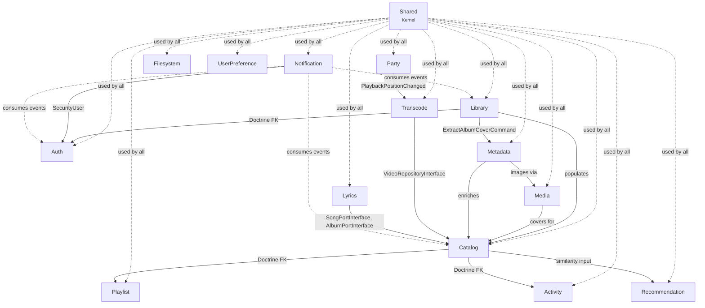
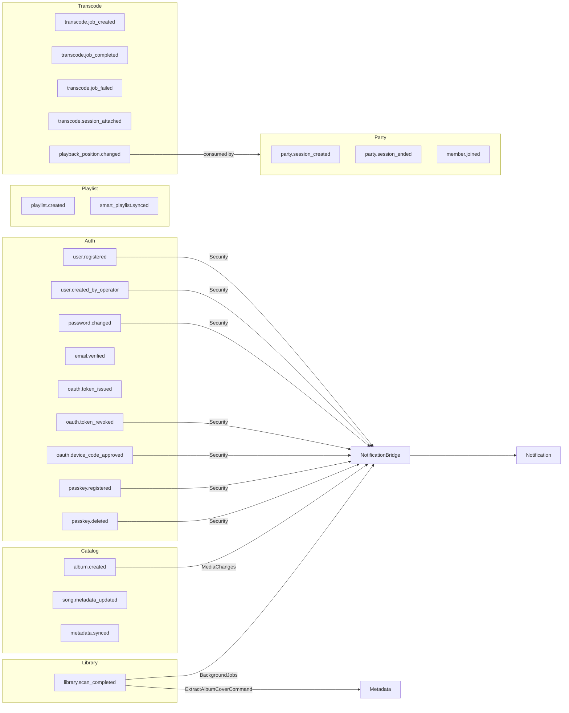
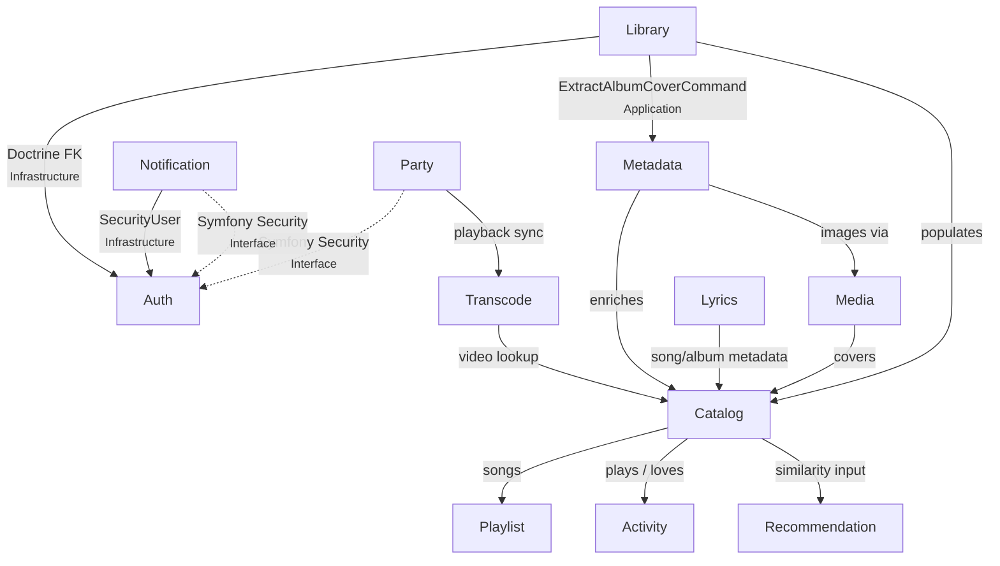
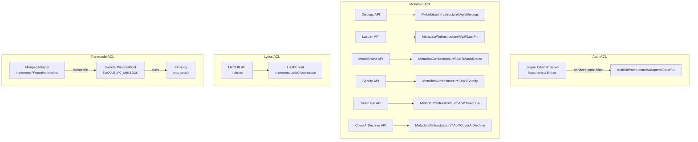

<!-- Generated by /documentation-maintainer on 2026-05-10 -->
<!-- Do not edit the generated sections above the hand-written notes line -->

# Bounded Context Map

This document describes all bounded contexts in Bander, their relationships, communication patterns, and shared infrastructure.

## Context Overview

---

## Context Catalog

### Auth

| Attribute | Detail |
|-----------|--------|
| **Responsibility** | User identity, OAuth 2.0 authorization server, authentication mechanisms (password, passkey, TOTP), DPoP token binding |
| **Namespace** | `App\Auth` |
| **Aggregates** | `User` |
| **Repositories** | `UserRepositoryInterface` |
| **Ports** | `UserPortInterface`, `PasswordHasherInterface`, `JwtGeneratorInterface`, `TotpVerifierInterface`, `DpopJtiCacheInterface`, `PasskeyVerifierInterface`, `PasswordResetTokenRepositoryInterface` |
| **Events** | `UserRegistered`, `UserCreatedByOperator`, `EmailVerified`, `PasswordChanged`, `TokenIssued`, `TokenRevoked`, `DeviceCodeApproved`, `PasskeyRegistered`, `PasskeyDeleted` |
| **Tech** | League OAuth2 Server (anti-corruption layer), WebAuthn (web-auth/webauthn-lib), OTPHP (TOTP), Redis (DPoP JTI cache, cached access tokens) |

### Catalog

| Attribute | Detail |
|-----------|--------|
| **Responsibility** | Core media catalog: artists, albums, songs, movies, videos, genres. The central read-model for the media library. |
| **Namespace** | `App\Catalog` |
| **Aggregates** | `Song`, `Album`, `Artist`, `Genre`, `Movie`, `Video` |
| **Repositories** | `SongRepositoryInterface` (Searchable), `AlbumRepositoryInterface`, `ArtistRepositoryInterface`, `GenreRepositoryInterface`, `MovieRepositoryInterface`, `VideoRepositoryInterface` |
| **Ports** | `SongPortInterface`, `AlbumPortInterface`, `ArtistPortInterface`, `GenrePortInterface`, `MoviePortInterface` |
| **Events** | `AlbumCreated`, `SongMetadataUpdated`, `MetadataSynced` |
| **Tech** | PGroonga full-text search (via `SongRepository`), Doctrine ORM |

### Library

| Attribute | Detail |
|-----------|--------|
| **Responsibility** | Media library definition and file-system scanning. Owns the concept of a "library" (a watched directory on disk) and orchestrates scans that discover media files and feed them into Catalog and Metadata. |
| **Namespace** | `App\Library` |
| **Aggregates** | `Library` |
| **Repositories** | `LibraryRepositoryInterface` |
| **Ports** | `LibraryPortInterface`, `DirectoryScannerPortInterface`, `CoverArtExtractorPortInterface`, `LibraryMembershipQueryPort` |
| **Events** | `LibraryScanCompleted` |
| **Value Objects** | `LibraryPath`, `LibrarySlug`, `LibraryType` |
| **Tech** | File-system scanning, Swoole task transport for async scans |

### Media

| Attribute | Detail |
|-----------|--------|
| **Responsibility** | Media file storage, streaming, and image handling. Provides the abstraction layer for reading/writing media files and serving audio streams and images. |
| **Namespace** | `App\Media` |
| **Aggregates** | `Image` |
| **Repositories** | `ImageRepositoryInterface` |
| **Ports** | `StreamPortInterface`, `StoragePortInterface`, `ImagePortInterface` |
| **Events** | None |
| **Tech** | Flysystem for file storage, BlurHash image hashing, image conversion |

### Metadata

| Attribute | Detail |
|-----------|--------|
| **Responsibility** | External metadata enrichment. Reads embedded tags from audio files, matches them against external APIs (Discogs, Last.fm, MusicBrainz, Spotify, TasteDive), and synchronizes results back to Catalog. |
| **Namespace** | `App\Metadata` |
| **Aggregates** | None -- operates on Catalog aggregates via commands |
| **Ports** | None -- downstream consumer, not a service provider |
| **Events** | None -- consumes events from Library, does not publish its own |
| **Value Objects** | `ExtractedMetadata`, `CoverArt`, `MatchQuality`, `MetadataMatch` |
| **Tech** | HTTP clients for Discogs, Last.fm, MusicBrainz, Spotify, TasteDive. Custom ID3/Vorbis/FLAC parsers. Matching strategies with validators. |

### Playlist

| Attribute | Detail |
|-----------|--------|
| **Responsibility** | User playlist management. Supports both manual playlists (add/remove/reorder songs) and smart playlists (auto-synced based on criteria). |
| **Namespace** | `App\Playlist` |
| **Aggregates** | `Playlist` |
| **Repositories** | `PlaylistRepositoryInterface` |
| **Ports** | `PlaylistPortInterface` |
| **Events** | `PlaylistCreated`, `SmartPlaylistSynced` |
| **Value Objects** | `PlaylistSong` |

### Recommendation

| Attribute | Detail |
|-----------|--------|
| **Responsibility** | Music recommendation engine. Computes recommendations using collaborative filtering, content similarity, genre similarity, and database relation analysis. |
| **Namespace** | `App\Recommendation` |
| **Aggregates** | `Recommendation` |
| **Repositories** | `RecommendationRepositoryInterface` |
| **Ports** | None -- consumed via controller directly |
| **Events** | None |
| **Domain Services** | `CollaborativeFilteringCalculator`, `ContentSimilarityCalculator`, `DatabaseRelationCalculator`, `GenreSimilarityCalculator` |
| **Value Objects** | `RecommendationType` |

### Activity

| Attribute | Detail |
|-----------|--------|
| **Responsibility** | User activity tracking. Records play events and love/favorite toggles on songs. Feeds data into Recommendation. |
| **Namespace** | `App\Activity` |
| **Aggregates** | `MediaActivity` |
| **Repositories** | `MediaActivityRepositoryInterface` |
| **Ports** | `ActivityPortInterface` |
| **Events** | None |

### Notification

| Attribute | Detail |
|-----------|--------|
| **Responsibility** | Multi-channel notification delivery. Receives domain events from any context via the `NotificationBridgeSubscriber`, resolves them to notification categories, and dispatches through email, push (Web Push/VAPID), or webhooks (Slack, Discord). Manages per-user notification preferences. |
| **Namespace** | `App\Notification` |
| **Aggregates** | `Notification`, `NotificationPreference` |
| **Repositories** | `NotificationRepositoryInterface`, `NotificationPreferenceRepositoryInterface` |
| **Ports** | None -- consumes events; does not expose ports |
| **Events** | `NotificationEvent` |
| **Value Objects** | `NotificationCategory`, `NotificationChannel` |
| **Tech** | Web Push (VAPID), HMAC-signed webhooks, Redis Pub/Sub for SSE delivery, Discord and Slack webhook adapters |

### Transcode

| Attribute | Detail |
|-----------|--------|
| **Responsibility** | On-demand media transcoding. Manages transcode jobs and sessions, generates HLS v6 and DASH manifests, encodes segments via FFmpeg, and serves adaptive bitrate streams with quality tiers and audio profiles. |
| **Namespace** | `App\Transcode` |
| **Aggregates** | `TranscodeJob`, `TranscodeSession` |
| **Repositories** | `TranscodeJobRepositoryInterface`, `TranscodeSessionRepositoryInterface` |
| **Ports** | `TranscodeJobPortInterface`, `TranscodeSessionPortInterface`, `TranscodeStreamingPortInterface`, `SegmentCachePortInterface`, `TranscodeStoragePortInterface`, `FFmpegPortInterface` |
| **Events** | `TranscodeJobCreated`, `TranscodeJobCompleted`, `TranscodeJobFailed`, `TranscodeSessionAttached`, `PlaybackPositionChanged` |
| **Value Objects** | `AudioProfile`, `LoudnessStandard`, `QualityTier`, `SessionPriority`, `SessionState`, `TranscodeStatus`, `VideoProbeResult` |
| **Domain Services** | `AudioProcessingRules`, `QualityLadder` |
| **Tech** | FFmpeg (isolated in Swoole CPU process pool), HLS fMP4 segment writer, DASH manifest generator, in-memory segment cache |

### Party

| Attribute | Detail |
|-----------|--------|
| **Responsibility** | Synchronized watch-party playback. Manages party sessions with hosts and members, coordinates playback actions via WebSocket with wall-clock synchronization and jitter compensation. |
| **Namespace** | `App\Party` |
| **Aggregates** | `SyncedPartySession`, `PartyMember` |
| **Repositories** | `SyncedPartySessionRepositoryInterface`, `PartyMemberRepositoryInterface` |
| **Ports** | `PartySessionPortInterface`, `PartyMemberPortInterface` |
| **Events** | `PartySessionCreated`, `PartySessionEnded`, `MemberJoined` |
| **Value Objects** | `MemberRole`, `PlaybackAction`, `PlaybackState` |
| **Tech** | WebSocket (Swoole), Redis Pub/Sub for event broadcasting, `PlaybackSynchronizer` for wall-clock sync |

### UserPreference

| Attribute | Detail |
|-----------|--------|
| **Responsibility** | Per-user UI and playback preferences. Manages accent color, sidebar configuration, audio/layout/player preferences (versioned with history and rollback), EQ device profiles, and theme mood. |
| **Namespace** | `App\UserPreference` |
| **Aggregates** | `SidebarConfig` |
| **Repositories** | Doctrine repository per preference entity |
| **Ports** | `AccentColorPortInterface`, `SidebarConfigPortInterface`, `AudioPreferencesPortInterface`, `LayoutPreferencesPortInterface`, `PlayerPreferencesPortInterface`, `EqDeviceProfilePortInterface`, `ThemeMoodPortInterface` |
| **Events** | None |
| **Value Objects** | `SidebarItem`, `SidebarItemType` |

### Filesystem

| Attribute | Detail |
|-----------|--------|
| **Responsibility** | Low-level file operations: MIME type detection and inotify-based file watching. A utility context without the full four-layer structure. |
| **Namespace** | `App\Filesystem` |
| **Aggregates** | None |
| **Ports** | `MimeDetectorPortInterface` |
| **Events** | None |
| **Tech** | inotify file watcher, custom MIME detection |

### Lyrics

| Attribute | Detail |
|-----------|--------|
| **Responsibility** | Song lyrics storage and retrieval. Integrates with LRCLIB API to fetch plain and synced/timed lyrics (LRC format). Supports multiple sources (embedded tags, LRCLIB, Musixmatch, Genius). |
| **Namespace** | `App\Lyrics` |
| **Aggregates** | `Lyrics` (state object) |
| **Repositories** | `LyricsRepositoryInterface` |
| **Ports** | `LyricsPortInterface`, `LrclibClientInterface` |
| **Commands** | `FetchLyricsCommand`, `BulkFetchLyricsCommand` |
| **Events** | None |
| **Tech** | LRCLIB API (anti-corruption layer via `LrclibClient`), Symfony HttpClient |

---

## Shared Kernel (`src/Shared/`)

The Shared kernel provides cross-cutting primitives used by every context. Importing from Shared is always allowed. Importing from another bounded context requires justification.

### Domain Layer

| Component | Purpose |
|-----------|---------|
| `Uuid` | UUID v7 primary keys (internal identity) |
| `PublicId` | Nanoid-based 21-char external identifiers |
| `Email` | Typed email value object |
| `Cursor`, `CursorDirection`, `CursorPage` | Cursor-based pagination types |
| `SearchOptions`, `SearchResult` | Search abstractions for PGroonga |
| `JobStatus` | Async job status enum |
| `AbstractDomainEvent` | Base class for all domain events |
| `DomainEventInterface` | Event contract (`occurredAt()`, `eventName()`) |
| `Searchable` | Interface for repositories supporting full-text search |

### Application Layer

| Component | Purpose |
|-----------|---------|
| `CancellableJobInterface` | Contract for jobs that support cancellation |
| `JobCancelledException` | Signal for cancelled jobs |

### Infrastructure Layer

| Component | Purpose |
|-----------|---------|
| `Doctrine/` | Custom types (`UuidType`, `PublicIdType`, `CitextType`, `JobStatusType`), `GeneratePublicIdListener`, `PgroongaSearchTrait` |
| `Messenger/` | `JobIdStamp`, `JobMonitoringMiddleware`, `JobMonitorService`, `ResultStamp` variants, `PublicIdNormalizer`, `UuidNormalizer`, `SwooleTaskWithRedisFallbackSender` |
| `Swoole/` | `Async::sleep()` (coroutine-aware), `ProcessPool`, `WebSocketConnectionRegistry`, `WebSocketPusher` |
| `Cache/` | `CacheTags` for Redis tag-aware invalidation |
| `Redis/` | `RedisClientFactory` |
| `Sse/` | `RedisPubSubConnection` for Server-Sent Events |
| `Security/` | `SseQueryTokenAuthenticator`, `WsQueryTokenAuthenticator` |
| `Logging/` | `BoundedContextProcessor`, `CorrelationIdProcessor` |
| `Health/` | `HealthCheckService`, `HealthCheckResult` |
| `Event/` | `NotificationBridgeSubscriber` (forwards domain events to Notification context) |
| `Pagination/` | `CursorPaginator`, `CursorCodec`, `CursorResult` |

### Interface Layer

| Component | Purpose |
|-----------|---------|
| `Controller/` | Shared controllers (SPA, health, SSE, WebSocket, job monitor, metrics, config) |
| `DTO/` | `ApiError`, `OAuthError`, `ValidationError`, `PaginatedResponse`, `CursorPaginatedResponse` |
| `Resource/` | `AbstractResource` -- base for API response transformation |
| `Console/` | `HealthCheckCommand`, `ConfigValidateCommand` |
| Traits | `ApiResponsesTrait`, `TranslatorTrait` |

---

## Event Flow Map

Domain events are the primary integration mechanism between contexts. The `NotificationBridgeSubscriber` in Shared intercepts all domain events and forwards those with a notification category mapping to the Notification context via Messenger.

### Events Published by Context

Unconnected events (no consumer): `email.verified`, `oauth.token_issued`, `song.metadata_updated`, `metadata.synced`, all Party events, all Playlist events, `transcode.job_created`, `transcode.job_completed`, `transcode.job_failed`, `transcode.session_attached`.

### Event Notification Categories

The `EventCategoryResolver` maps events to categories that determine how and whether users are notified:

| Category | Events |
|----------|--------|
| **Security** | `UserRegistered`, `PasswordChanged`, `PasskeyRegistered`, `PasskeyDeleted`, `TokenRevoked`, `DeviceCodeApproved` |
| **BackgroundJobs** | `LibraryScanCompleted` |
| **MediaChanges** | `AlbumCreated` |

---

## Upstream / Downstream Relationships

### Library -> Auth (Infrastructure layer)

- **What:** `UserLibraryEntity` references `Auth\Infrastructure\Doctrine\Entity\UserEntity` via Doctrine `ManyToOne` relation
- **Why:** The `user_libraries` join table needs a foreign key to the users table. Data-level dependency only, not domain-level.

### Library -> Metadata (Application layer)

- **What:** `ScanLibraryHandler` dispatches `Metadata\Application\Command\ExtractAlbumCoverCommand` via Messenger for each newly created album
- **Why:** After a library scan discovers new albums, cover art extraction is delegated to the Metadata context. Coupling is through an async command DTO, keeping it loose.

### Library -> Catalog (Application layer)

- **What:** `MusicScanner` and `CoverArtExtractor` use Catalog port interfaces (`AlbumPortInterface`, `ArtistPortInterface`, etc.)
- **Why:** Library scans discover media files and create/populate Catalog entities. Tight coupling that could benefit from a more event-driven approach.

### Lyrics -> Catalog (Application + Infrastructure layer)

- **What:** `FetchLyricsHandler` and `LyricsService` use `SongPortInterface` (song title, duration, artist name) and `AlbumPortInterface` (album title) for LRCLIB signature lookup
- **Why:** LRCLIB requires track name, artist name, album name, and duration to find matching lyrics. These are resolved from Catalog's song and album models.

### Notification -> Auth (Infrastructure layer)

- **What:** `Notification\Security\NotificationVoter` uses `Auth\Infrastructure\Security\SecurityUser` for authorization decisions
- **Why:** Notification endpoints need to verify the authenticated user owns the resources being accessed.

### Metadata -> Catalog, Media (Application layer)

- **What:** Metadata enrichers use Catalog ports to update domain models and Media ports for image storage
- **Why:** After external API enrichment, results must be written back to the catalog and cover art stored.

### Party -> Transcode (Application layer)

- **What:** Playback handlers reference `PlaybackPositionChanged` domain event
- **Why:** Party sessions need to know about playback position changes for synchronized playback.

### Transcode -> Catalog (Infrastructure layer)

- **What:** `TranscodeSessionSubscriber` uses `VideoRepositoryInterface`
- **Why:** Transcode sessions need to look up video metadata from the catalog.

### All Contexts -> Shared (Shared kernel)

- **What:** `Uuid`, `PublicId`, `Email`, `AbstractDomainEvent`, `DomainEventInterface`, `Searchable`, `Cursor*`, `SearchOptions`, `SearchResult`, `JobStatus`
- **Why:** These are the agreed-upon primitives of the system. Every context uses UUID v7 for identity, PublicId for external-facing IDs, and the same pagination/search abstractions.

### Implicit: Party, Notification -> Auth (via Symfony Security)

- **What:** Controllers use Symfony's `Security` to resolve the current user, which returns `Auth\Infrastructure\Security\SecurityUser`
- **Why:** These contexts create resources owned by authenticated users. The dependency is in the Interface layer only.

---

## Anti-Corruption Layers

### OAuth 2.0 Server (Auth Context)

The League OAuth2 Server library defines its own repository interfaces. These are mapped to internal implementations via aliases in `config/services.yaml`. The adapter layer translates between League's data structures and Bander's domain models, preventing the external library's concepts from leaking into the domain layer.

### External API Adapters (Metadata Context)

The Metadata context wraps six external services behind internal adapters. Each adapter translates external API responses into domain-level DTOs before they enter the matching pipeline.

| External Service | Location |
|-----------------|----------|
| Discogs | `Metadata\Infrastructure\Api\Discogs\` |
| Last.fm | `Metadata\Infrastructure\Api\LastFm\` |
| MusicBrainz | `Metadata\Infrastructure\Api\MusicBrainz\` |
| Spotify | `Metadata\Infrastructure\Api\Spotify\` |
| TasteDive | `Metadata\Infrastructure\Api\TasteDive\` |
| CoverArtArchive | `Metadata\Infrastructure\Api\CoverArtArchive\` |

### LRCLIB API (Lyrics Context)

The LRCLIB lyrics database API is isolated behind `LrclibClientInterface`. The `LrclibClient` adapter uses Symfony HttpClient to communicate with LRCLIB endpoints (`/api/get`, `/api/get-cached`, `/api/search`, `/api/get/{id}`). Cached-first strategy: tries `/api/get-cached` for predictable latency, falls back to `/api/get` (queries external sources) on 404. No authentication required.

### FFmpeg (Transcode Context)

FFmpeg is isolated behind `FFmpegPortInterface`. Process execution runs inside the Swoole CPU process pool to avoid blocking the main event loop. `proc_open()` calls never touch Swoole workers.

---

## Communication Patterns

```mermaid
graph TD
    subgraph "Pattern 1: Domain Event"
        E1["Publisher Context"] -->|"EventDispatcher::dispatch()"| E2["NotificationBridgeSubscriber"]
        E2 -->|"Messenger"| E3["Notification Context"]
    end

    subgraph "Pattern 2: Messenger Command"
        M1["Publisher Context"] -->|"MessageBus::dispatch()"| M2["Handler in another context"]
    end

    subgraph "Pattern 3: Port Interface"
        P1["Controller"] -->|"injects Port"| P2["Infrastructure Implementation"]
    end

    subgraph "Pattern 4: WebSocket / SSE"
        W1["Swoole WS Server"] -->|"WebSocketPusher<br/>Redis Pub/Sub"| W2["Connected Clients"]
    end
```

### Pattern 1: Domain Event (Synchronous)

- **Publisher:** Any context dispatches via `EventDispatcherInterface::dispatch()`
- **Consumer:** `NotificationBridgeSubscriber` catches all events and routes to Notification if mapped
- **Use when:** Broadcasting that something happened in the domain

### Pattern 2: Messenger Command (Asynchronous)

- **Publisher:** Any context dispatches via `MessageBusInterface::dispatch()`
- **Consumer:** Handler in another context with `#[AsMessageHandler]`
- **Use when:** Requesting another context to perform an action (e.g., Library asking Metadata to extract covers)

### Pattern 3: Port Interface (Synchronous, In-Process)

- **Consumer:** Controller injects `Application/Port/<PortInterface>`
- **Provider:** Infrastructure service implements the port interface
- **Use when:** The Interface layer needs to invoke Application/Domain logic without depending on infrastructure

### Pattern 4: WebSocket / SSE (Real-Time)

- **Server:** `Swoole\WebSocket\Server` managed by Shared infrastructure
- **Push:** `WebSocketPusher` and `RedisPubSubConnection` in Shared
- **Consumers:** Party (real-time playback sync), Notification (SSE delivery), Transcode (progress events)
- **Use when:** Pushing real-time updates to connected clients

---

## Context Maturity Notes

| Context | Layer Completeness | Aggregate Pattern | Notes |
|---------|-------------------|------------------|-------|
| Auth | Full 4-layer + features | State object | Most mature. Complex OAuth ACL. 9 domain events. |
| Catalog | Full 4-layer | State objects | Core domain. PGroonga search on `SongRepository`. 6 aggregates. |
| Library | Full 4-layer | No state object | Orchestrates scanning pipeline. Heaviest cross-context coupling. |
| Media | Full 4-layer | No state object | Storage/streaming abstraction. |
| Metadata | Partial | No aggregates | Operates on Catalog data. No Port layer. 6 external APIs. |
| Playlist | Full 4-layer | No state object | Manual + smart playlists. |
| Recommendation | Full 4-layer | Old positional-arg pattern | Has CQRS queries. Candidate for state-object migration. |
| Activity | Full 4-layer | No state object | Simple record/play model. |
| Notification | Full 4-layer | No state object | Event-driven consumer. Multi-channel delivery. |
| Transcode | Full 4-layer | State objects | Heaviest infrastructure. Swoole process pool for FFmpeg. 6 ports. |
| Party | Full 4-layer | State objects | WebSocket-driven. Real-time sync. 9 CQRS handlers. |
| UserPreference | Full 4-layer | State object | Simple CRUD context. No CQRS handlers. |
| Filesystem | Partial (no 4-layer) | None | Utility: MIME detection + file watcher. |
| Lyrics | Full 4-layer | State object | LRCLIB integration with cached-first strategy. REST API + console command. Anti-corruption layer for LRCLIB. |

---

<!-- Everything below this line is hand-written. Edit freely. -->

## Notes
