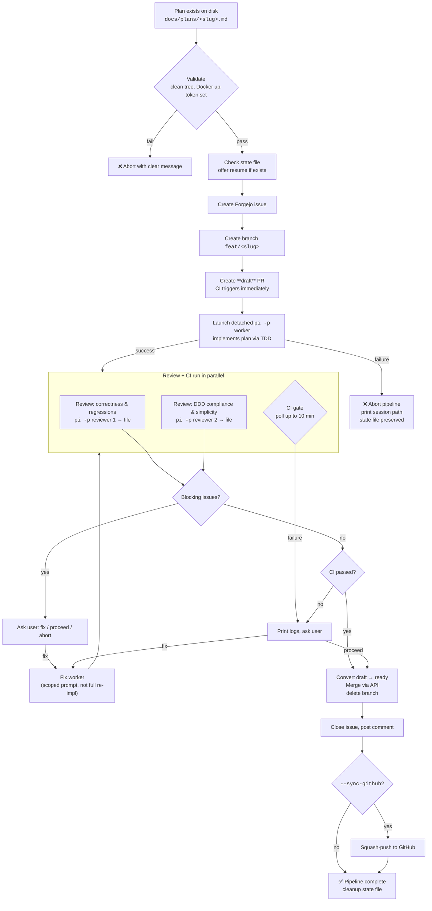

# Feature Pipeline

End-to-end feature delivery: plan → issue → branch → implement → draft PR → review + CI (parallel) → merge → close.

## Overview

The `/feature-pipeline` skill automates the full lifecycle of shipping a feature. An orchestrator pi session handles bookending work (creating the issue, spawning workers, merging, closing), while all implementation runs in a **detached `pi` process** to avoid exhausting the orchestrator's context window.



## Usage

```
/feature-pipeline <plan-path> [--skip-review] [--no-ci-gate] [--sync-github] [--dry-run]
```

| Flag | Effect |
|------|--------|
| `--skip-review` | Skip parallel review step |
| `--no-ci-gate` | Merge without waiting for CI to pass. CI still runs; the gate is just not enforced. |
| `--sync-github` | Offer to squash-push to GitHub after merge |
| `--dry-run` | Print each step without executing |

The `<plan-path>` points to a plan artifact — typically from `docs/plans/`, created by `/02-plan` or written manually.

## Prerequisites

- Clean working tree on `master`
- `FORGEJO_TOKEN` set in `~/.zshrc`
- `pi` CLI in PATH
- Docker Compose services running (the worker runs tests inside the container — `make start` if not up)

## Resume support

The pipeline writes `.context/feature-pipeline-state.json` after each step. If the orchestrator session is lost (context limit, crash, terminal closed), a new `/feature-pipeline` invocation with the same plan path detects the state file and offers to resume from the last completed step.

```json
{
  "plan": "docs/plans/foo.md",
  "plan_hash": "<sha256>",
  "issue": 42,
  "branch": "feat/foo",
  "worker_exit": 0,
  "review_status": "passed",
  "pr": 15,
  "ci_status": "passed",
  "current_step": 7
}
```

If the plan file has changed since the state was written (hash mismatch), the pipeline warns and asks whether to start fresh.

## Pipeline stages

### 1. Validate inputs

Checks: plan file exists, working tree is clean, current branch is `master`, Forgejo token is available, **Docker app container is running**, branch name doesn't collide with an existing branch (auto-appends `-2`, `-3` if it does). Writes initial state file.

### 2. Create Forgejo issue

Posts the full plan content as an issue body. The issue becomes the single source of truth for the feature — the plan, discussion, and closure all live there.

### 3. Create feature branch

Creates `feat/<slug>` from `master` and pushes to origin.

### 4. Create draft PR

Creates a **draft** PR immediately so CI starts running. This is critical for performance — CI and review run in parallel rather than serially. The PR title is prefixed with `WIP:` until the merge step.

### 5. Implement (detached worker)

Launches a separate `pi -p` process with a self-contained prompt. The worker runs inside the repo and picks up `.claude/` rules and skills automatically. The worker:
- Reads the plan
- Implements all units following RED → GREEN → REFACTOR
- Runs `/dddlint` after modifying files in a bounded context
- Runs the full PHPUnit suite
- Commits with `feat: <slug> (refs #<issue>)`
- Pushes to origin

The worker session is saved to `.context/feature-pipeline-sessions/<branch>/` for post-mortem. If the worker exits non-zero, the pipeline **aborts** — no PR conversion, no merge. The state file is preserved for resume.

### 6. Review (parallel with CI, unless `--skip-review`)

Launches two detached `pi -p` reviewer processes with output saved to files:
1. **Correctness + regressions + test quality** → `reviews/correctness.md`
2. **DDD compliance + simplicity** → `reviews/ddd-compliance.md`

Reviewers classify findings as **BLOCKING** or **ADVISORY**. Advisory findings are reported but don't block. Blocking findings pause the pipeline: fix / proceed / abort.

Fix workers use a **separate scoped prompt** — they receive only the specific findings to fix, not the full plan. This prevents re-implementing unrelated code.

### 7. CI gate (unless `--no-ci-gate`)

CI was triggered when the draft PR was created. The pipeline checks once first (it may already be done), then polls every 30 seconds up to 10 minutes. On failure: prints failed job logs and asks whether to fix, proceed, or abort. Fix workers use the same scoped fix prompt.

`--no-ci-gate` does not prevent CI from running — it just removes the gate. The PR still triggers CI; the pipeline just doesn't wait for it.

### 8. Convert draft → ready and merge

Removes the `WIP:` prefix, converts the draft to a ready PR, then merges via Forgejo API. Creates a **merge commit** by default (consistent with existing project history). Falls back to local `git merge --no-ff` if the API merge fails. Deletes the feature branch from both local and origin.

### 9. Close issue

Posts a comment (`Implemented in PR #<n>. Merged to master.`) and closes the issue.

### 10. Report

Prints a summary with issue number, PR number, merge commit, CI status, and review status.

### 11. Optional GitHub sync (if `--sync-github`)

Offers to run the `/sync-github` flow: squash the current tree into a single commit and force-push to `github/master`.

### 12. Cleanup

Removes `.context/feature-pipeline-state.json` on success. On failure or abort, the state file is left in place for resume.

## Error handling

The pipeline is conservative — it stops and asks rather than auto-recovering:

| Failure | Behavior |
|---------|----------|
| Worker exits non-zero | Abort. Print session path. State file preserved for resume. |
| Review finds blockers | Pause. Ask user to fix / proceed / abort. |
| CI fails | Pause. Print logs. Ask user to fix / proceed / abort. |
| Merge conflict | Abort. Print instructions for manual resolution. State file preserved. |
| API errors | Print full response. No silent retries. |
| Orchestrator crash | State file on disk. Re-run `/feature-pipeline` with same plan path to resume. |

## Context management

The orchestrator only does bookending — it never sees the implementation transcript. Implementation and review run in detached `pi` processes; the orchestrator reads only exit codes and saved output files.

```
Orchestrator context:  validate → issue → branch → draft PR → [spawn worker] → read review files → CI poll → merge → close
                                   ~15 tool calls total                                              low context cost
```

## File layout

```
docs/plans/<slug>.md                                        # Plan artifact (input)
.context/feature-pipeline-state.json                        # Pipeline state (resume support)
.context/feature-pipeline-sessions/<branch>/                # Worker session logs
.context/feature-pipeline-sessions/<branch>/reviews/        # Review output files
.claude/skills/feature-pipeline/SKILL.md                    # Skill definition
```

## Related skills

| Skill | Role in pipeline |
|-------|-----------------|
| `/forgejo` | Issue/PR/CI operations (used internally) |
| `/test-fix` | Worker may invoke for fixing test failures |
| `/dddlint` | Worker runs after modifying domain files in a bounded context |
| `/sync-github` | Optional post-merge squash-push to GitHub (`--sync-github`) |
