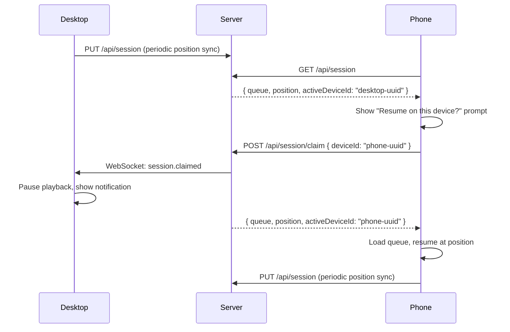

# Settings & Session Completeness

## Summary

Ship complete settings infrastructure and cross-device experience before onboarding other users. Three feature streams: (1) passkey list, delete, and naming; (2) server-synced user preferences with conflict resolution and versioning; (3) cross-device listening sessions with real-time transfer. Foundational work fixes the Axios response envelope issue and extracts WebAuthn utilities.

---

## Problem Frame

Pre-onboarding completeness gap: users can register passkeys but can't manage them, all preferences are localStorage-bound and lost on device switch, and each device maintains an independent queue with no session continuity. These are hard blockers for a multi-user, multi-device media server.

---

## Requirements

- R1. Authenticated users can view all their registered passkeys (name, creation date, last used date)
- R2. Users can delete a passkey with a confirmation step; last passkey deletion allowed with strong warning
- R3. Users can name passkeys during registration
- R4. Credential IDs and internal passkey data are never exposed to the frontend
- R5. All preference settings (EQ, player, layout) sync to server — server is source of truth
- R6. Settings load from server on page visit; local changes save immediately via background PUT
- R7. First-time users get current local state pushed to server (existing localStorage data preserved)
- R8. No UX change — storage layer swap, UI works identically
- R9. Preference conflicts between devices are detected and resolvable
- R10. Preference history is maintained; users can undo to previous versions
- R11. Users can see what's playing on other devices and transfer active sessions
- R12. Only one device actively plays at a time per user; other devices are notified to pause
- R13. Users can always start a fresh session regardless of other active sessions
- R14. Users can name and manage their devices
- R15. Axios customInstance preserves response status and headers for API consumers

**Origin actors:** A1 (Authenticated user — manages passkeys, preferences, sessions)

**Origin flows:** F1 (Passkey list/delete), F2 (Preference sync), F3 (Cross-device session transfer)

**Origin acceptance examples:** AE1 (Register passkey → appears in list), AE2 (Delete passkey → disappears), AE3 (Set LUFS -16 on device A → sees -16 on device B), AE4 (Start album on desktop → resume on phone at same position), AE5 (Transfer session → original device pauses), AE6 (Network interruption → session recoverable from server)

---

## Scope Boundaries

- Adding new auth methods (password, OAuth providers)
- Per-device preference profiles
- Migration of existing localStorage data via dedicated UI (basic push-on-first-load is in scope per R7)
- Session history (past listening sessions beyond the current one)

**Scope promotions from origin deferrals:** The following items were deferred in the origin document but promoted to in-scope per confirmed user direction — passkey naming during registration (R3), preference conflict resolution (R9), preference versioning/undo (R10), device naming/management (R14), customInstance fix (R15), WebAuthn utility extraction (U2).

### Deferred to Follow-Up Work

- Passkey last-used tracking reliability audit (verify `PasskeyAuthenticator` calls `markUsed()` — included in U3 if gap confirmed)
- Advanced preference merge strategies (three-way merge, field-level conflict resolution)
- Bulk preference export/import
- Session sharing between users (Party feature territory)

---

## Context & Research

### Relevant Code and Patterns

- `src/UserPreference/` — AccentColor (repository+port, no aggregate) and SidebarConfig (full aggregate) patterns
- `src/Auth/Domain/Model/Passkey/` — Passkey aggregate with State object, `forUser()` on repository
- `src/Auth/Interface/Controller/Passkey/PasskeyController.php` — existing registration and delete endpoints
- `src/Shared/Infrastructure/Swoole/WebSocketConnectionRegistry.php` — Swoole Table-based connection tracking with rooms
- `src/Shared/Infrastructure/Swoole/WebSocketPusher.php` — push to user, push to single FD, broadcast to room
- `src/Party/` — existing WebSocket integration pattern (CQRS commands dispatched from `WebSocketController`)
- `ui/web/src/features/settings/` — current settings feature (components, hooks, utils)
- `ui/web/orval.config.ts` — API client generation from OpenAPI spec
- `ui/web/src/shared/api-client/` — generated hooks + `axios-instance.ts` (customInstance with DPoP)

### Institutional Learnings

- Auth review (`docs/reviews/auth-review-2026-05-10.md`): customInstance strips Axios envelope — `response.status` and `response.headers` are `undefined` at runtime. All new API work is blocked on this fix.
- Settings review (`docs/reviews/settings-review-2026-05-10.md`): WebAuthn utilities recently extracted (commit `a50a8197`) but may need verification. Passkey registration omits `name` field. EQ/audio settings are purely client-side with no backend sync — the exact gap this plan addresses.
- `customInstance` response nesting: `postPasskeyOptions` returns `{ data: { data: { challengeKey, options } } }` — double-nested data from Axios + backend wrapper. Consumers must account for this.

### External References

- WebAuthn API: `navigator.credentials.create()` throws `DOMException` with `name: 'NotAllowedError'` on user cancel — must handle gracefully
- Zustand persist middleware: acts as offline cache when `name` config is provided

---

## Key Technical Decisions

- **Preference types use lightweight repository+port pattern (no aggregate/State objects):** Audio, Player, and Layout preferences store UI state with no domain invariants to enforce. Following the AccentColor pattern (Doctrine entity + repository interface + port adapter) avoids the overhead of full aggregate roots while maintaining DDD layer boundaries.

- **ListeningSession uses full aggregate with State object:** The single-active-device invariant (R12) is a real domain rule that the aggregate enforces. Domain events (SessionClaimed, SessionUpdated) trigger WebSocket notifications.

- **New `Session` bounded context:** Cross-device sessions are a distinct domain from user preferences and party management. Keeps the context map clean — `Session` depends on `Shared` (WebSocket) and `UserPreference` is independent.

- **Device identity: client-generated UUID + user-facing label:** The UUID in sessionStorage provides stable identity for session ownership. The user-facing label (device name) is a separate editable field stored server-side. This separates machine identity from human identity.

- **Optimistic concurrency for preferences:** Every preference row carries a version integer. PUT requests send the version they read; server rejects with 409 if version mismatch. Frontend presents conflict resolution options (keep mine, keep theirs).

- **Preference history as separate table:** A `preference_history` table stores snapshots (user_id, preference_type, version, payload, created_at). On every successful PUT, a history row is inserted in the same transaction. Undo restores a previous version by copying its payload to the active row.

- **Queue serialized as full JSONB:** Track objects (publicId, title, artistName, albumName, duration) stored directly in the session row. Avoids N+1 queries on session load. Acceptable payload size for typical queues (< 200 tracks).

- **Fix customInstance before all frontend work:** The envelope stripping issue blocks all API consumer code from accessing status/headers. Must be resolved before preference sync and session management UI work begins.

- **Backend validates preference JSONB shape via Request DTOs:** Each preference endpoint has a typed Request DTO with Symfony validation constraints (e.g., bands must be array of 10 numbers in -12..+12 range). Prevents invalid data from reaching storage.

- **First-time sync pushes current Zustand state:** For existing users, this IS their localStorage data. For brand-new users, this is the hardcoded defaults. No dedicated migration UI needed.

- **Frontend checks session ownership on WebSocket reconnect:** After reconnect, fetches `GET /api/session` and compares active device ID. If ownership changed, pauses playback and shows notification.

---

## Open Questions

### Resolved During Planning

- **First-time sync meaning (origin R4 vs. Deferred):** "Current local defaults" means whatever Zustand currently holds — for existing users this is their accumulated localStorage data, for new users this is hardcoded defaults. The "Deferred" migration item referred to a dedicated migration UI, not this basic behavior.
- **Last passkey deletion:** Allowed per origin R5. Frontend shows strong warning when deleting the last passkey. No backend enforcement — user may have other auth methods.
- **Debounce strategy for preference PUTs:** 500ms debounce, full JSONB payload on every PUT. Consistent across all three preference groups.

### Deferred to Implementation

- **Exact customInstance fix approach:** Whether to preserve the full Axios response, attach status/headers to unwrapped data, or add a configuration option. Depends on auditing all existing consumers for breaking changes.
- **Preference history retention limit:** How many versions to keep per preference group. Affects storage growth. Suggest starting with 20 and making configurable.
- **Session position sync interval:** How frequently PUT /api/session fires during playback. Needs tuning between freshness and server load.

---

## High-Level Technical Design

> *This illustrates the intended approach and is directional guidance for review, not implementation specification. The implementing agent should treat it as context, not code to reproduce.*

### Preference Sync Flow

```
[App Load]
    |
    v
[For each preference group: GET /api/user/{group}-preferences]
    |
    +--> [200 + version] --> [Overwrite Zustand stores with server data, store version]
    |
    +--> [404] --> [PUT current Zustand state to server, store version=1]
    |
    +--> [Network error] --> [Keep localStorage values, retry on next load]

[Any store mutation]
    |
    v
[Zustand store updates instantly (optimistic)]
    |
    v
[Debounced 500ms: PUT /api/user/{group}-preferences with version]
    |
    +--> [200] --> [Update local version, done]
    +--> [409 Conflict] --> [Show conflict resolution: keep mine / keep theirs]
    +--> [Network error] --> [Silent, keep local, Zustand persist is fallback]
```

### Cross-Device Session Flow



---

## Implementation Units

### U1. Fix customInstance Axios Response Envelope

**Goal:** Ensure all API consumers can access response status, headers, and data after customInstance processing.

**Requirements:** R15

**Dependencies:** None

**Files:**
- Modify: `ui/web/src/shared/api-client/axios-instance.ts`
- Modify: all existing API consumers that reference `response.status`, `response.headers`, or nested `data.data`
- Test: `ui/web/src/shared/api-client/__tests__/axios-instance.test.ts`

**Approach:**
Audit all consumers of `customInstance` to understand expected response shapes. Fix the interceptor to preserve status/headers while maintaining the convenience unwrapping. The double-nesting issue (`{ data: { data: { ... } } }`) must be resolved so new endpoints don't need `as any` casts.

**Patterns to follow:**
- Existing `axios-instance.ts` interceptor structure

**Test scenarios:**
- Happy path: successful API call returns accessible status, headers, and data fields
- Happy path: existing consumers (passkey registration, auth flows) still function correctly
- Error path: error responses propagate status code and message
- Edge case: 204 No Content responses handled without error

**Verification:**
- All existing frontend features (login, passkey registration, sidebar config) work without regression
- New API calls can access `response.status` and `response.headers` without undefined values

---

### U2. WebAuthn Utility Extraction and Testing

**Goal:** Verify and complete extraction of WebAuthn utilities to shared module with proper types and tests.

**Requirements:** R1, R3

**Dependencies:** None

**Files:**
- Verify: `ui/web/src/features/settings/utils/webauthn-utils.ts`
- Test: `ui/web/src/features/settings/__tests__/webauthn-utils.test.ts`

**Approach:**
Recent commits (`a50a8197`, `dabdb185`) extracted WebAuthn utilities and added tests. Verify completeness: ensure `base64ToArrayBuffer`, `publicKeyCredentialToJSON`, `arrayBufferToBase64` are exported, typed, and tested. If already complete, mark as done.

**Patterns to follow:**
- Existing utility module conventions in `features/settings/utils/`

**Test scenarios:**
- Happy path: base64 ↔ ArrayBuffer conversion roundtrips correctly
- Happy path: publicKeyCredential serialization produces valid JSON
- Edge case: empty ArrayBuffer, empty string inputs
- Edge case: Unicode and special characters in base64

**Verification:**
- All three utility functions exported and tested
- PasskeyManagement component imports from shared module (not inline)

---

### U3. Backend Passkey List Endpoint

**Goal:** Add GET endpoint returning user's passkeys with public metadata only. Verify and fix `markUsed()` call in authenticator.

**Requirements:** R1, R2, R4

**Dependencies:** None

**Files:**
- Modify: `src/Auth/Interface/Controller/Passkey/PasskeyController.php`
- Verify: `src/Auth/Infrastructure/Security/PasskeyAuthenticator.php` (or similar — check if `markUsed()` is called during login)
- Test: `tests/Unit/Auth/Interface/Controller/Passkey/PasskeyControllerTest.php`

**Approach:**
Add `GET /api/auth/passkey` endpoint to `PasskeyController`. Reuse existing `PasskeyRepositoryInterface::forUser()`. Response includes `publicId`, `name`, `createdAt`, `lastUsedAt` — never `credentialId` or `data`. Follow existing controller pattern (OpenAPI attributes, `ApiResponsesTrait`, user resolution). Verify `PasskeyAuthenticator` calls `markUsed()` on successful authentication; if not, add the call to make `lastUsedAt` reliable.

**Patterns to follow:**
- `src/Auth/Interface/Controller/Passkey/PasskeyController.php` existing endpoints
- `src/UserPreference/Interface/Controller/AccentColorController.php` for GET response pattern

**Test scenarios:**
- Happy path: returns list of passkeys with publicId, name, createdAt, lastUsedAt
- Happy path: user with no passkeys returns empty array
- Error path: unauthenticated request returns 401
- Integration: response never includes credentialId or data fields
- Edge case: passkeys ordered by createdAt descending

**Verification:**
- `GET /api/auth/passkey` returns correct metadata for authenticated user
- `credentialId` and `data` fields absent from response
- `lastUsedAt` is updated on passkey login (if authenticator gap confirmed and fixed)

---

### U4. Frontend Passkey Management (List, Delete, Naming)

**Goal:** Full passkey management UI — list, delete with confirmation, name during registration.

**Requirements:** R1, R2, R3, R4

**Dependencies:** U1, U2, U3

**Files:**
- Modify: `ui/web/src/features/settings/components/PasskeyManagement.tsx`
- Create: `ui/web/src/features/settings/hooks/use-passkey-list.ts`
- Modify: `ui/web/src/features/settings/hooks/use-passkey-registration.ts`
- Test: `ui/web/src/features/settings/__tests__/PasskeyManagement.test.tsx`
- Test: `ui/web/src/features/settings/__tests__/use-passkey-list.test.ts`

**Approach:**
Update PasskeyManagement to fetch passkey list on mount via new hook using TanStack Query. Render list with name, created date, last used date, and delete button per row. Delete triggers confirmation dialog — stronger warning text when deleting the last passkey. After registration or deletion, invalidate the query to refetch list. Add name input to registration flow (pass `name` field to backend). Handle `NotAllowedError` from WebAuthn ceremony as user cancel, not error.

**Patterns to follow:**
- `use-passkey-registration.ts` existing hook structure
- TanStack Query patterns from other feature hooks
- Existing `ApiResponsesTrait`-based confirmation dialog patterns

**Test scenarios:**
- Happy path: list displays passkeys with name, dates, delete button
- Happy path: delete with confirmation removes passkey from list
- Happy path: register with name → new passkey appears in list with that name
- Edge case: empty state shows helpful message + register button
- Edge case: last passkey deletion shows strong warning
- Error path: delete API failure shows error message, list unchanged
- Error path: user cancels WebAuthn ceremony → no error shown
- Integration: registration completion triggers list refetch

**Verification:**
- Passkey list loads and displays correctly
- Delete flow works with confirmation dialog
- Registration includes name input and result appears in list
- Empty state renders when no passkeys
- User cancel of WebAuthn ceremony shows no error

---

### U5. Backend Preference Infrastructure

**Goal:** Create Doctrine entities, repositories, migrations, and port interfaces for all three preference types.

**Requirements:** R5, R6, R7

**Dependencies:** None

**Files:**
- Create: `src/UserPreference/Infrastructure/Doctrine/Entity/AudioPreferencesEntity.php`
- Create: `src/UserPreference/Infrastructure/Doctrine/Entity/PlayerPreferencesEntity.php`
- Create: `src/UserPreference/Infrastructure/Doctrine/Entity/LayoutPreferencesEntity.php`
- Create: `src/UserPreference/Domain/Repository/AudioPreferencesRepositoryInterface.php`
- Create: `src/UserPreference/Domain/Repository/PlayerPreferencesRepositoryInterface.php`
- Create: `src/UserPreference/Domain/Repository/LayoutPreferencesRepositoryInterface.php`
- Create: `src/UserPreference/Infrastructure/Doctrine/Repository/AudioPreferencesDoctrineRepository.php`
- Create: `src/UserPreference/Infrastructure/Doctrine/Repository/PlayerPreferencesDoctrineRepository.php`
- Create: `src/UserPreference/Infrastructure/Doctrine/Repository/LayoutPreferencesDoctrineRepository.php`
- Create: `src/UserPreference/Application/Port/AudioPreferencesPortInterface.php`
- Create: `src/UserPreference/Application/Port/PlayerPreferencesPortInterface.php`
- Create: `src/UserPreference/Application/Port/LayoutPreferencesPortInterface.php`
- Create: `src/UserPreference/Infrastructure/AudioPreferencesAdapter.php`
- Create: `src/UserPreference/Infrastructure/PlayerPreferencesAdapter.php`
- Create: `src/UserPreference/Infrastructure/LayoutPreferencesAdapter.php`
- Create: migration for three preference tables + preference_history table
- Modify: `config/services.yaml` (wire new repositories and ports)
- Test: `tests/Unit/UserPreference/Infrastructure/AudioPreferencesAdapterTest.php`
- Test: `tests/Unit/UserPreference/Infrastructure/PlayerPreferencesAdapterTest.php`
- Test: `tests/Unit/UserPreference/Infrastructure/LayoutPreferencesAdapterTest.php`

**Approach:**
All three preference types follow the AccentColor pattern: Doctrine entity with UUID PK, user_id (unique constraint), JSONB payload column, version integer, timestamps. Repository interface + Doctrine implementation with `findByUserId()`, `save()`. Port interface + adapter wrapping repository with default-fallback behavior. Migration creates three tables + `preference_history` table (user_id, preference_type, version, payload JSONB, created_at). Wire all services in `config/services.yaml`.

**Patterns to follow:**
- `src/UserPreference/Infrastructure/AccentColorAdapter.php`
- `src/UserPreference/Domain/Repository/` existing repository interfaces
- `src/UserPreference/Infrastructure/Doctrine/Entity/` existing entities

**Test scenarios:**
- Happy path: save and retrieve preferences for a user
- Happy path: save creates history snapshot in same transaction
- Edge case: first save for user creates new record with version 1
- Edge case: subsequent saves increment version and create history entry
- Error path: unique constraint violation on duplicate user_id handled gracefully
- Integration: history table records are consistent with current preference state

**Verification:**
- All three preference types can be saved and retrieved by user ID
- Version increments on each save
- History snapshots created atomically with preference updates
- Services wired correctly in container

---

### U6. Backend Preference Endpoints

**Goal:** REST GET/PUT endpoints for all three preference groups with validation, conflict detection, history, and undo.

**Requirements:** R5, R6, R7, R9, R10

**Dependencies:** U5

**Files:**
- Create: `src/UserPreference/Interface/Controller/AudioPreferencesController.php`
- Create: `src/UserPreference/Interface/Controller/PlayerPreferencesController.php`
- Create: `src/UserPreference/Interface/Controller/LayoutPreferencesController.php`
- Create: `src/UserPreference/Interface/Request/SaveAudioPreferencesRequest.php`
- Create: `src/UserPreference/Interface/Request/SavePlayerPreferencesRequest.php`
- Create: `src/UserPreference/Interface/Request/SaveLayoutPreferencesRequest.php`
- Test: `tests/Unit/UserPreference/Interface/Controller/AudioPreferencesControllerTest.php`
- Test: `tests/Unit/UserPreference/Interface/Controller/PlayerPreferencesControllerTest.php`
- Test: `tests/Unit/UserPreference/Interface/Controller/LayoutPreferencesControllerTest.php`

**Approach:**
Each controller has GET (return stored preferences or 404), PUT (save with version-based optimistic concurrency — 409 on mismatch), GET /history (list versions), POST /rollback (restore a version). Request DTOs validate JSONB shape (e.g., AudioPreferences: enabled bool, bands array of 10 numbers in -12..+12, preset string, compressionEnabled bool, masterGain number, normalizationEnabled bool, targetLufs number, visualizerMode string). All endpoints get Nelmio OpenAPI annotations for orval generation.

**Patterns to follow:**
- `src/UserPreference/Interface/Controller/AccentColorController.php` GET/PUT pattern
- `src/UserPreference/Interface/Controller/SidebarConfigController.php` for more complex payload

**Test scenarios:**
- Happy path: GET returns stored preferences with version
- Happy path: PUT saves preferences and increments version
- Happy path: GET /history returns list of previous versions
- Happy path: POST /rollback restores specified version
- Edge case: GET for user with no preferences returns 404
- Edge case: PUT with stale version returns 409 Conflict with current server state
- Edge case: POST /rollback with invalid version returns 404
- Error path: PUT with invalid JSONB shape returns 422 with validation errors
- Integration: OpenAPI annotations produce correct schema in generated spec

**Verification:**
- `GET /api/user/audio-preferences` returns correct data or 404
- `PUT /api/user/audio-preferences` with valid payload saves correctly
- `PUT` with stale version returns 409
- `GET /api/user/audio-preferences/history` returns version list
- `POST /api/user/audio-preferences/rollback` restores previous version
- Same for player and layout preference endpoints
- `yarn generate` produces correct React Query hooks

---

### U7. Frontend Preference Sync Integration

**Goal:** Sync all three preference groups to server — fetch on load, debounced background PUT, offline fallback, conflict handling, undo.

**Requirements:** R5, R6, R7, R8, R9, R10

**Dependencies:** U1, U6

**Files:**
- Create: `ui/web/src/features/settings/hooks/use-preference-sync.ts`
- Create: `ui/web/src/features/settings/hooks/use-audio-preferences.ts`
- Create: `ui/web/src/features/settings/hooks/use-player-preferences.ts`
- Create: `ui/web/src/features/settings/hooks/use-layout-preferences.ts`
- Create: `ui/web/src/features/settings/components/PreferenceConflictDialog.tsx`
- Create: `ui/web/src/features/settings/components/PreferenceHistory.tsx`
- Modify: existing Zustand stores (eq-store, player-store, context-panel-store) to integrate sync hooks
- Test: `ui/web/src/features/settings/__tests__/use-preference-sync.test.ts`
- Test: `ui/web/src/features/settings/__tests__/PreferenceConflictDialog.test.tsx`

**Approach:**
On load, fetch server preferences via TanStack Query hooks (generated by orval). Populate Zustand stores with server data (overriding localStorage). Track version for optimistic concurrency. On store change, update locally (instant) then debounced PUT in background (500ms, full payload with version). On 409, show PreferenceConflictDialog with options: "Keep mine" (force PUT), "Keep theirs" (refetch and apply). Keep Zustand persist as offline fallback. PreferenceHistory component shows version list with undo button calling POST /rollback.

**Patterns to follow:**
- TanStack Query hooks generated by orval for API interaction
- Existing Zustand store patterns (eq-store, player-store, context-panel-store)
- Existing `use-sidebar-config.ts` pattern for server-side preference loading

**Test scenarios:**
- Happy path: app load fetches server preferences and populates stores
- Happy path: store change triggers debounced PUT to server
- Happy path: offline changes persist to localStorage, sync when online
- Edge case: first-time user pushes current local state to server
- Edge case: 409 conflict shows resolution dialog
- Happy path: undo restores previous preference version from history
- Error path: PUT failure falls back silently, local state preserved
- Integration: all three stores sync independently without interfering

**Verification:**
- Settings changes on device A appear on device B after page load
- Offline changes persist locally and sync on reconnect
- Conflict dialog appears when concurrent edits detected
- Undo restores previous preference values

---

### U8. Backend ListeningSession Domain Model

**Goal:** Create the ListeningSession aggregate with State object, repository, migration, and domain events in a new `Session` bounded context.

**Requirements:** R11, R12, R13

**Dependencies:** None

**Files:**
- Create: `src/Session/Domain/Model/ListeningSession/ListeningSession.php`
- Create: `src/Session/Domain/Model/ListeningSession/ListeningSessionState.php`
- Create: `src/Session/Domain/Repository/ListeningSession/ListeningSessionRepositoryInterface.php`
- Create: `src/Session/Domain/Event/SessionClaimed.php`
- Create: `src/Session/Domain/Event/SessionUpdated.php`
- Create: `src/Session/Domain/Event/SessionCreated.php`
- Create: `src/Session/Infrastructure/Doctrine/Entity/ListeningSessionEntity.php`
- Create: `src/Session/Infrastructure/Doctrine/Repository/ListeningSessionDoctrineRepository.php`
- Create: migration for listening_sessions table + devices table
- Create: `src/Session/README.md`
- Modify: `config/services.yaml` (wire new repository)
- Test: `tests/Unit/Session/Domain/Model/ListeningSessionTest.php`

**Approach:**
ListeningSession aggregate tracks: userId (UUID), activeDeviceId (UUID), queue (JSONB array of track objects), currentTrackIndex (int), position (float, seconds), playbackState (enum: playing/paused/stopped), updatedAt. Methods: `create()` (new session), `claim(deviceId)` (transfer to new device — enforces single active device), `updatePlayback()` (position/queue sync), `end()`. Domain events: SessionClaimed, SessionUpdated, SessionCreated. Migration includes a `devices` table: user_id, device_id (UUID), name (TEXT), last_seen_at, created_at — unique on (user_id, device_id).

Use `/entity-scaffold` skill for consistent DDD structure.

**Patterns to follow:**
- `src/Party/Domain/Model/SyncedPartySession/` for playback position tracking with wall-clock time
- `src/Auth/Domain/Model/Passkey/` for aggregate with State object pattern
- DDD rules in `.claude/rules/ddd-domain-models.md`

**Test scenarios:**
- Happy path: create session with queue and position
- Happy path: claim session transfers active device and fires SessionClaimed event
- Happy path: update playback modifies position and fires SessionUpdated event
- Edge case: claim from same device is a no-op
- Edge case: create new session replaces existing session
- Error path: cannot claim a non-existent session
- Integration: domain events carry correct payload (userId, deviceId, queue summary)

**Verification:**
- ListeningSession aggregate enforces single-active-device invariant
- Domain events fired on claim and update
- Repository persists and retrieves sessions correctly
- Migration runs cleanly

---

### U9. Backend Session Endpoints and WebSocket Events

**Goal:** REST endpoints for session management + WebSocket event dispatching for real-time cross-device notifications.

**Requirements:** R11, R12, R13, R14

**Dependencies:** U8

**Files:**
- Create: `src/Session/Application/Port/SessionPortInterface.php`
- Create: `src/Session/Infrastructure/SessionAdapter.php`
- Create: `src/Session/Application/Command/SyncSessionCommand.php`
- Create: `src/Session/Application/Command/ClaimSessionCommand.php`
- Create: `src/Session/Application/Command/CreateSessionCommand.php`
- Create: `src/Session/Application/CommandHandler/SyncSessionCommandHandler.php`
- Create: `src/Session/Application/CommandHandler/ClaimSessionCommandHandler.php`
- Create: `src/Session/Application/CommandHandler/CreateSessionCommandHandler.php`
- Create: `src/Session/Interface/Controller/SessionController.php`
- Create: `src/Session/Interface/Request/SyncSessionRequest.php`
- Create: `src/Session/Interface/Request/ClaimSessionRequest.php`
- Create: `src/Session/Interface/Request/RegisterDeviceRequest.php`
- Create: `src/Session/Interface/Controller/DeviceController.php`
- Modify: `config/services.yaml` (wire ports, adapters, command handlers)
- Test: `tests/Unit/Session/Interface/Controller/SessionControllerTest.php`
- Test: `tests/Unit/Session/Interface/Controller/DeviceControllerTest.php`
- Test: `tests/Unit/Session/Application/CommandHandler/ClaimSessionCommandHandlerTest.php`

**Approach:**
Session endpoints: `GET /api/session` (current session), `PUT /api/session` (sync position/queue), `POST /api/session/claim` (claim for this device), `POST /api/session/new` (start fresh). All accept `X-Device-Id` header. ClaimSessionCommandHandler loads session, calls `claim()`, dispatches SessionClaimed event. Event listener pushes WebSocket message to the previous device's user FDs via `WebSocketPusher`. Device endpoints: `GET /api/devices` (list user's devices), `PUT /api/devices/{deviceId}` (rename), `DELETE /api/devices/{deviceId}` (forget device). Register device on first session interaction (upsert name from User-Agent if no name set).

Use `/endpoint-scaffold` skill for consistent controller structure.

**Patterns to follow:**
- `src/Party/Interface/Controller/PartyWebSocketController.php` for WebSocket dispatch pattern
- `src/Shared/Infrastructure/Swoole/WebSocketPusher.php` for push-to-user
- CQRS pattern from `.claude/rules/ddd-cqrs.md`

**Test scenarios:**
- Happy path: GET returns current session with queue, position, active device info
- Happy path: PUT updates position and queue
- Happy path: POST claim transfers session and fires WebSocket event to previous device
- Happy path: POST new creates fresh session
- Edge case: GET when no session returns 404
- Edge case: claim when already owner returns current session (no WebSocket event)
- Error path: PUT without X-Device-Id header returns 422
- Integration: SessionClaimed event triggers WebSocket push to correct user
- Happy path: GET /api/devices returns list with names
- Happy path: PUT /api/devices/{id} renames device
- Happy path: DELETE /api/devices/{id} forgets device

**Verification:**
- Session CRUD works via REST
- Claiming a session sends WebSocket `session.claimed` to the displaced device
- Device management endpoints work
- `yarn generate` produces correct hooks for all session and device endpoints

---

### U10. Frontend Session Management

**Goal:** Frontend hooks and UI for cross-device session management — resume prompts, session transfer, real-time claim handling.

**Requirements:** R11, R12, R13, R14

**Dependencies:** U1, U9

**Files:**
- Create: `ui/web/src/features/session/hooks/use-session.ts`
- Create: `ui/web/src/features/session/hooks/use-device-identity.ts`
- Create: `ui/web/src/features/session/components/SessionTransferPrompt.tsx`
- Create: `ui/web/src/features/session/components/DeviceManagement.tsx`
- Create: `ui/web/src/features/session/utils/device-id.ts`
- Test: `ui/web/src/features/session/__tests__/use-session.test.ts`
- Test: `ui/web/src/features/session/__tests__/use-device-identity.test.ts`
- Test: `ui/web/src/features/session/__tests__/SessionTransferPrompt.test.tsx`

**Approach:**
`use-device-identity` hook generates/reads UUID from sessionStorage, sends as `X-Device-Id` header on session requests. `use-session` hook fetches current session on app load. If active session on another device, show `SessionTransferPrompt` with "Resume" and "New Session" options. During playback, debounced PUT to `/api/session` for position/queue sync. WebSocket listener for `session.claimed` pauses playback and shows notification. On WebSocket reconnect, fetch `GET /api/session` to verify ownership. `DeviceManagement` component for settings page: list devices, rename, forget. Device names appear in session transfer prompt ("Resume from Martin's Desktop?").

**Patterns to follow:**
- TanStack Query hooks generated by orval
- WebSocket message handling pattern from Party feature
- `ui/web/src/features/settings/` component structure

**Test scenarios:**
- Happy path: app load with active session on another device shows resume prompt
- Happy path: "Resume" claims session and loads queue + position
- Happy path: "New Session" starts fresh queue
- Happy path: position syncs to server during playback (debounced)
- Edge case: no active session → normal playback without prompt
- Edge case: WebSocket reconnect verifies session ownership
- Integration: `session.claimed` WebSocket event pauses playback and shows notification
- Happy path: device management lists devices with names
- Happy path: rename device persists to server
- Edge case: unnamed devices show generic label ("Unknown Device")
- Error path: session API failure falls back to local playback

**Verification:**
- Session transfer prompt appears when another device has active session
- Transfer works end-to-end: phone claims → desktop pauses
- Position syncs during playback
- Device management UI shows and allows editing device names
- WebSocket reconnect correctly detects lost ownership

---

## System-Wide Impact

- **Interaction graph:** Preference PUTs trigger history snapshots (same transaction). Session claims trigger WebSocket pushes to displaced devices. Domain events from Session context dispatched through shared event infrastructure.
- **Error propagation:** Preference PUT failures are silent (local state preserved). Session claim failures show error to user. WebSocket delivery failures are best-effort (reconnect check recovers).
- **State lifecycle risks:** Preference history grows unbounded without retention limit. Session state is single-row-per-user — no accumulation risk. Device table grows with new devices per user but capped by natural device count.
- **API surface parity:** All new endpoints follow existing conventions (OpenAPI attributes, `ApiResponsesTrait`, `successResponse` wrapper). Generated orval hooks maintain consistent interface for frontend.
- **Integration coverage:** Preference sync crosses Zustand stores, TanStack Query cache, and server persistence. Session management crosses WebSocket, REST, and playback state. Both require cross-layer integration tests.
- **Unchanged invariants:** Party feature (multi-user sync) is independent. Auth flows (login, registration) unchanged except passkey list addition. Existing preference endpoints (accent color, sidebar config) continue working unchanged.

---

## Risks & Dependencies

| Risk | Mitigation |
|------|------------|
| customInstance fix breaks existing API consumers | Audit all consumers before changing; add regression tests for each consumer path |
| Preference history table grows unbounded | Start with retention limit (e.g., 20 versions per group); add cleanup command |
| WebSocket event lost during device disconnect | Reconnect check via GET /api/session detects stale ownership |
| Race condition: two devices claim simultaneously | Last claim wins; previous device notified via WebSocket + reconnect check |
| Large queue payloads in session JSONB | Practical limit sufficient for typical use (~200 tracks); no enforcement needed initially |
| Migration on existing users' localStorage data | First-time sync pushes current Zustand state (includes localStorage data); no data loss |
| orval code generation gaps | Ensure Nelmio annotations are complete before running `yarn generate`; verify generated hooks |

---

## Documentation / Operational Notes

- Run `/dddlint` after modifying PHP files in UserPreference and Session contexts
- Run `/documentation-maintainer update UserPreference readme` after preference changes
- Run `/documentation-maintainer update Session readme` after creating the new context
- Run `/documentation-maintainer full sync` after all changes land
- Run `yarn generate` after backend endpoints are deployed to update API client
- Update `dev-docs/context-map.md` with new Session bounded context

---

## Sources & References

- **Origin document:** [docs/brainstorms/settings-completeness-requirements.md](docs/brainstorms/settings-completeness-requirements.md)
- Auth review: [docs/reviews/auth-review-2026-05-10.md](docs/reviews/auth-review-2026-05-10.md)
- Settings review: [docs/reviews/settings-review-2026-05-10.md](docs/reviews/settings-review-2026-05-10.md)
- Architecture: [dev-docs/architecture.md](dev-docs/architecture.md)
- Context map: [dev-docs/context-map.md](dev-docs/context-map.md)
- DDD rules: `.claude/rules/ddd-domain-models.md`, `ddd-repositories.md`, `ddd-ports.md`, `ddd-cqrs.md`
