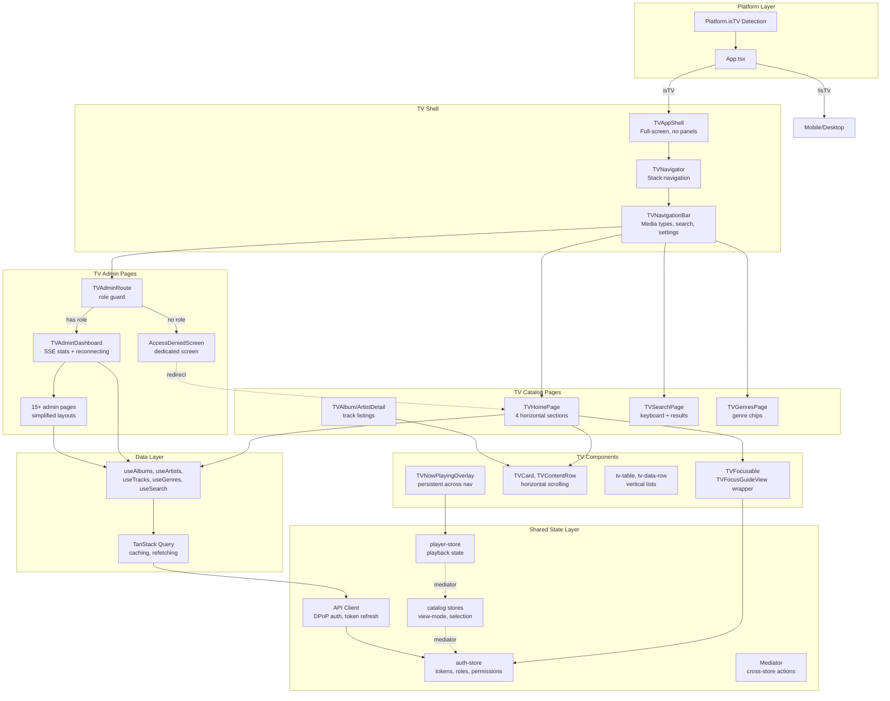

# TV-First Catalog and Admin Views for React Native

## Summary

TV-first React Native implementation for Apple TV—catalog browsing (home with four horizontal sections: featured, continue listening, recently added, discovery; albums, artists, genres, search, detail pages) and full admin panel (all 15+ web admin pages) with D-pad-optimized layouts. Builds a shared state layer (Zustand stores, data fetching hooks, API client) for future mobile/desktop reuse. Uses react-native-tvos for focus management (TVFocusGuideView, TVEventHandler), horizontal row navigation with vertical section switching, and TV-optimized design tokens (24pt+ text, 48dp+ touch targets).

**Primary target: Apple TV (tvOS).** Android TV support is deferred to follow-up work.

Origin: TV-First Catalog and Admin Views for React Native requirements document (see origin above).

---

## Problem Frame

The web app has full catalog browsing and admin functionality, but the React Native app has only basic mobile views with no TV interface. Apple TV users need a native app experience optimized for the Siri Remote (touchpad + D-pad) and 10-foot viewing distance, not an adapted mobile UI. Building TV-first with a shared state layer establishes patterns that mobile and desktop can follow, avoiding the technical debt of retrofitting TV concerns into a mobile-first architecture.

---

## Requirements

**TV Foundation**
- R1. TV app routes to dedicated TV shell when running on Apple TV (Platform.isTV || Platform.isTVOS). Android TV support deferred.
- R2. TV shell provides full-screen layout optimized for 10-foot viewing distance (no sidebar, no context panel, no mini-player bar)
- R3. TV components support D-pad navigation with explicit focus management (up/down/left/right/enter) using Siri Remote touchpad and button events

**Catalog — TV UI**
- R4. TV home screen renders four sections: featured/promoted, continue listening, recently added, discovery/recommendations
- R5. TV content rows support horizontal scrolling with D-pad left/right navigation
- R6. TV detail screens (album, artist) display full-screen with track listing and playback controls
- R7. TV search screen provides on-screen keyboard input and result display
- R8. TV genres page allows genre selection and content browsing

**Admin — TV UI**
- R9. TV admin dashboard renders server stats in TV-optimized layout (large text, simplified visuals)
- R10. TV admin pages include all web admin features: dashboard, jobs, rate limiters, diagnostics, config, users, activity, genres, metadata, recommendations, transcode, lyrics, duplicates
- R11. TV admin pages simplify complex web UI patterns (tables, multi-column layouts) for D-pad navigation while retaining full functionality
- R12. Admin route guards restrict access to users with admin role

**Shared State Layer**
- R13. Zustand stores (player, auth, catalog selection, view mode) are platform-agnostic and reusable
- R14. Data fetching hooks (useAlbums, useArtists, useTracks, useGenres) are platform-agnostic
- R15. API client (ui/shared/) provides DPoP auth, token refresh, and type-safe endpoints

**Design System**
- R16. TV uses shared color tokens from web (dark theme palette)
- R17. TV typography and spacing tokens override web defaults for 10-foot viewing distance (24px+ body text, larger gaps)
- R18. TV focus indicators provide clear visual feedback for the currently focused element

**Navigation**
- R19. TV navigation uses D-pad model (up/down between sections, left/right within sections, enter to select, back to dismiss)
- R20. TV now-playing overlay appears on top of browse content when music is playing
- R21. TV login screen uses on-screen keyboard for server URL and credentials

**Origin actors:** TV user (A1), Admin user (A2), Mobile/desktop developer (A3)
**Origin flows:** Browse and play music from TV home (F1), Admin views server status on TV (F2)
**Origin acceptance examples:** AE1 (TV home navigation), AE2 (content row focus), AE3 (now-playing overlay), AE4 (admin dashboard), AE5 (admin access denied)

---

## Scope Boundaries

### In Scope
- TV-first catalog views: home (featured, continue listening, recently added, discovery), albums, artists, genres, search, album/artist detail pages
- TV-first admin views: all 15+ web admin pages with D-pad-optimized layouts
- Shared Zustand stores, data fetching hooks, and API client (platform-agnostic)
- TV design tokens (typography, spacing, focus indicators)
- D-pad focus management using react-native-tvos
- TV login screen with on-screen keyboard
- TV now-playing overlay (persistent across navigation)
- SSE reconnection handling for admin dashboard

### Deferred for later (from origin)
- Android TV implementation (platform-specific adjustments: remote control differences, focus management variations)
- Mobile and desktop UI implementation (iPhone 13 available for mobile regression testing)
- Audio module implementation (covered in existing rn-app.md plan)
- Auth flow implementation (covered in existing rn-app.md plan)
- Server discovery and deep linking (covered in existing rn-app.md plan)
- Other media types: movies, TV shows, podcasts, concerts, ebooks
- Equalizer DSP (not feasible in RN)
- CI/CD pipeline for App Store builds
- Automated E2E tests (manual verification on Apple TV hardware)

### Deferred to Follow-Up Work
- Media type homes for movies, TV shows, podcasts, concerts, ebooks
- Equalizer page (if feasible with future RN audio enhancements)

---

## Context & Research

### Relevant Code and Patterns

**React Native app structure (`ui/rn/`):**
- Platform detection: `Platform.isTV` in App.tsx
- TV navigation placeholder: currently using MobileNavigator
- Existing shells: `MobileAppShell` (bottom tabs), `DesktopAppShell` (sidebar + context panel)
- TV card touch size defined: `tvCardMinTouch: 48` in tokens.ts
- State management: Zustand with AsyncStorage persistence
- Crypto: `ui/rn/src/shared/crypto/` with platform-aware DPoP backend

**Web app structure (`ui/web/`):**
- Admin pages: 15+ pages in `ui/web/src/features/admin/pages/` (dashboard, jobs, rate limiters, diagnostics, config, users, activity, genres, metadata, recommendations, transcode, lyrics, duplicates)
- Catalog pages: home, album/artist/song detail, search, genres in `ui/web/src/features/catalog/`
- State: Zustand stores with devtools, TanStack Query for data fetching
- API: Centralized `AXIOS_INSTANCE` with DPoP interceptors in `ui/web/src/shared/api-client/`

**Shared layer (`ui/shared/`):**
- Crypto primitives: DPoP key generation, proof creation with platform resolution
- Auth storage interface: Abstract storage layer
- Missing: shared UI components, design tokens

### Institutional Learnings

- **Media Hub Sidebar — State Management Anti-Pattern:** Duplicate state in two stores causes guaranteed desync. Establish single source of truth per data concern; use Zustand selectors to read from other stores, never copy values. (docs/solutions/reviews/2026-05-12-media-hub-sidebar.md)

- **Selector Performance:** Calling a method in a Zustand selector creates new references each time, causing re-renders. Use `useShallow` from `zustand/react/shallow` for multi-field selectors to prevent reference churn on resource-constrained TV devices. (docs/solutions/reviews/2026-05-12-media-hub-sidebar.md)

- **Cross-Context Mediator:** Stores should not directly import and mutate each other. Use typed action mediator (`shared/lib/mediator/`) for cross-context actions like `player:play`. Register handlers in per-store `*-handlers.ts` files. (docs/plans/2026-05-11-consolidated-zustand-store-plan.md)

- **Admin Panel — Role-Based Access:** Three-tier hierarchy: ROLE_SUPER_ADMIN → ROLE_ADMIN → ROLE_USER. Frontend checks `roles.includes('ROLE_ADMIN') || roles.includes('ROLE_SUPER_ADMIN')`. (docs/brainstorms/2026-05-11-admin-panel-integration-requirements.md)

- **Admin Panel — Sidebar Structure:** Grouped sections scale better than flat lists. Web groups: Overview (Dashboard), Users, Content, Operations, Monitoring, Analytics. Port this structure to TV as vertical menu. (docs/brainstorms/2026-05-11-admin-panel-integration-requirements.md)

- **DPoP Auth Bugs:** Known bugs in axios-instance: nonce extraction fails due to customInstance wrapper, token refresh replaces headers instead of only Authorization. Verify these are fixed before relying on shared client. (docs/reviews/auth-review-2026-05-10.md)

### External References

- **TV UI Design Patterns:** 24pt minimum font size for 10ft viewing, 48×48dp minimum focusable elements, clear focus indicators with parallax/shadows, horizontal rows with vertical navigation (Netflix-style). (Designing a 10ft UI - Pascal Potvin; Apple TV Human Interface Guidelines)

- **react-native-tvos APIs:** TVFocusGuideView (autoFocus, destinations, trapFocus props), TVEventHandler/useTVEventHandler for Siri Remote input, Platform.isTV detection. Focusable components use Pressable over Touchable. (react-native-tvos GitHub)

### Build and Test Hardware

- **Mac Pro 2013** - Build machine. Runs macOS Catalina (10.15.7), Xcode 12.4 maximum. React Native 0.81.5 requires Xcode 14+ for iOS 17 SDK—may need to update build machine or use remote build service.
- **Apple TV 4K** - Primary target device for TV UI testing and verification.
- **iPhone 13** - Mobile regression testing to ensure shared state layer and platform-specific routing don't break existing mobile functionality.
- **Intel Mac** - Desktop testing (macOS) to verify shared state layer works on desktop platform.
- **Windows 11** - Desktop testing (Windows) to verify shared state layer and platform-specific routing work correctly.

---

## Key Technical Decisions

- **react-native-tvos for focus management:** Use TVFocusGuideView and TVEventHandler rather than building a custom focus system. The library is already a dependency and provides proven D-pad navigation primitives for Apple TV. TVFocusGuideView handles autoFocus for hero sections, trapFocus for grids, and destinations for explicit focus routing.

- **Horizontal rows with vertical navigation:** Different sections use horizontal scrolling rows (featured, discovery) with vertical D-pad navigation between sections. This matches the Netflix-style metaphor identified in research and optimizes content discovery for TV browsing patterns.

- **Shared state layer, separate UI components:** Zustand stores, data fetching hooks, and API client are platform-agnostic. UI components are platform-specific (TV, mobile, desktop) due to fundamentally different interaction models. Stores use `useShallow` for multi-field selectors to prevent re-renders on TV.

- **Single source of truth per data concern:** Following institutional learnings, auth tokens, user role, and admin permissions live in ONE store (auth-store). Other stores read via selectors, never duplicate values. Cross-store actions dispatch through mediator, not direct imports.

- **TV shell from scratch:** No existing TV code in RN. Build TVAppShell as a new full-screen layout without sidebar/context panel/mini-player, rather than adapting existing desktop/mobile shells.

- **Admin on TV with simplified layouts:** All 15+ web admin pages are implemented but with TV-optimized layouts (tables → vertical lists, multi-column → stacked tv-data-row). Full functionality preserved. Admin navigation uses the web's grouped section structure as a vertical menu.

- **Now-playing overlay persists during navigation:** Per user decision, the overlay stays visible when navigating between screens and animates with page transitions. This allows continuous playback control from any screen.

- **SSE reconnection shows last-known data:** Per user decision, admin dashboard displays last-known data with a subtle "reconnecting..." indicator when connection is lost. Write operations are disabled until reconnected.

- **Admin access denied uses dedicated screen:** Per user decision, non-admin users see a dedicated "access denied" screen explaining the restriction before redirecting to home.

- **Empty sections don't render:** Following the default from flow analysis, sections with no content (e.g., empty "continue listening" for new users) don't render rather than showing empty states.

- **Focus restoration on back navigation:** Returning to a screen restores focus to the previously-selected item, maintaining user context.

---

## Open Questions

### Resolved During Planning

- **[Q1] What TV navigation metaphor works best?** Horizontal rows with vertical section switching (Netflix-style) identified as best practice through research. Scrolled sections, vertical lists for track listings.

- **[Q2] Focus management approach?** Use react-native-tvos's TVFocusGuideView. No custom focus system needed. API provides autoFocus, trapFocus, destinations props for all scenarios.

- **[Q3] Now-playing overlay navigation behavior?** User decided: overlay stays visible during navigation and animates with page transitions.

- **[Q4] SSE reconnection strategy?** User decided: show last-known data with "reconnecting..." indicator, disable write operations until reconnected.

- **[Q5] Admin access denied UX?** User decided: dedicated "access denied" screen before redirect (not silent redirect, not toast-only).

- **[Q6] Token refresh failure handling?** Show non-blocking banner, allow current track to finish, then redirect to login.

- **[Q7] Empty state handling?** Empty sections don't render. No placeholder content for new users.

- **[Q8] Focus restoration after navigation?** Return to previously-selected item.

- **[Q9] Server URL validation?** Client-side format check only. Cache last successful URL.

- **[Q10] Search behavior?** Auto-focus keyboard on load, real-time results with 300ms debounce, dismiss on selection.

### Deferred to Implementation

- **Exact TVFocusGuideView configuration:** Specific autoFocus and trapFocus placement depends on runtime layout behavior. Configure during implementation based on actual navigation flow.

- **Final section sizes and virtualization thresholds:** Determine during performance testing. Start with reasonable limits (e.g., 20 items per row), adjust based on actual TV device performance.

---

## Output Structure

```
ui/rn/src/features/tv/
├── components/
│   ├── TVAppShell.tsx
│   ├── TVNavigationBar.tsx
│   ├── TVFocusable.tsx
│   ├── TVCard.tsx
│   ├── TVContentRow.tsx
│   ├── TVHeroSection.tsx
│   ├── TVTrackRow.tsx
│   ├── TVSectionHeader.tsx
│   ├── TVKeyboard.tsx
│   ├── TVNowPlayingOverlay.tsx
│   ├── TVPlaybackControls.tsx
│   ├── TVAdminShell.tsx
│   ├── TVAdminRoute.tsx
│   ├── TVStatGrid.tsx
│   └── TVJobList.tsx
├── pages/
│   ├── TVHomePage.tsx
│   ├── TVAlbumDetailPage.tsx
│   ├── TVArtistDetailPage.tsx
│   ├── TVSearchPage.tsx
│   ├── TVGenresPage.tsx
│   ├── TVLoginPage.tsx
│   ├── TVAdminDashboardPage.tsx
│   ├── TVJobMonitorPage.tsx
│   ├── TVRateLimitersPage.tsx
│   ├── TVServerDiagnosticsPage.tsx
│   ├── TVConfigurationPage.tsx
│   ├── TVUsersPage.tsx
│   ├── TVActivityPage.tsx
│   ├── TVGenresPage.tsx (admin)
│   ├── TVMetadataPage.tsx
│   ├── TVRecommendationsPage.tsx
│   ├── TVTranscodePage.tsx
│   ├── TVLyricsAdminPage.tsx
│   └── TVAlbumDuplicatesPage.tsx
├── navigation/
│   ├── TVNavigator.tsx
│   └── TVRoutes.tsx
├── theme/
│   └── tv-tokens.ts
├── hooks/
│   ├── use-tv-focus.ts
│   └── use-tv-now-playing.ts
└── __tests__/
    ├── TVFocusable.test.tsx
    ├── TVNavigator.test.tsx
    ├── TVHomePage.test.tsx
    └── (other test files)

ui/shared/components/ui/
├── tv-badge.tsx
├── tv-table.tsx
├── tv-data-row.tsx
├── tv-status-card.tsx
├── tv-form-field.tsx
└── tv-select.tsx

ui/rn/src/features/catalog/
├── stores/
│   ├── view-mode-store.ts
│   └── selection-store.ts
└── hooks/
    ├── useAlbums.ts
    ├── useArtists.ts
    ├── useTracks.ts
    ├── useGenres.ts
    └── useSearch.ts

ui/rn/src/features/admin/hooks/
├── useAdminStats.ts
├── useActiveJobs.ts
├── useJobMonitor.ts
├── useRateLimiters.ts
├── useDiagnostics.ts
├── useConfiguration.ts
└── useUsers.ts
```

---

## High-Level Technical Design

> *This illustrates the intended architecture and is directional guidance for review, not implementation specification.*



**Data flow highlights:**
- Platform detection routes to TV shell when `Platform.isTV` is true
- All TV pages use TVFocusable wrapper for D-pad navigation
- Data flows through shared hooks → TanStack Query → API client (DPoP auth)
- Stores communicate via mediator, never direct imports
- Now-playing overlay persists across navigation (modal over TVNavigator)
- Admin route guard checks auth-store roles, redirects to dedicated access denied screen

---

## Implementation Units

### U1. TV Foundation — Platform Routing, Shell, and Design Tokens

**Goal:** Enable platform detection, create TV-specific app shell, and establish TV design tokens for 10-foot viewing distance.

**Requirements:** R1, R2, R16, R17

**Dependencies:** None (foundation unit)

**Files:**
- Create: `ui/rn/src/features/tv/components/TVAppShell.tsx`
- Create: `ui/rn/src/features/tv/theme/tv-tokens.ts`
- Modify: `ui/rn/src/shared/theme/tokens.ts` (export base tokens)
- Modify: `ui/rn/src/shared/theme/colors.ts` (ensure shared color tokens)
- Create: `ui/rn/src/features/tv/components/TVFocusable.tsx`
- Create: `ui/rn/src/features/tv/hooks/use-tv-focus.ts`
- Modify: `ui/rn/src/app/App.tsx` (route to TV shell when Platform.isTV)
- Test: `ui/rn/src/features/tv/__tests__/TVFocusable.test.tsx`

**Approach:**
- Platform detection via `Platform.isTV` from react-native-tvos
- TVAppShell is a full-screen `View` rendering children as entire screen (no sidebar, no context panel, no mini-player bar)
- TV tokens override base tokens: body text 24px+, headings 32px+, gaps 24-32px (vs 16px on mobile)
- TVFocusable wraps pressable components using TVFocusGuideView for D-pad focus with visual indicator (2-3px border with glow)
- use-tv-focus hook manages focus state, provides onFocus/onBlur callbacks

**Patterns to follow:**
- `ui/rn/src/features/desktop/components/DesktopAppShell.tsx` for shell structure (simplified for TV)
- `ui/rn/src/shared/theme/tokens.ts` for base token structure
- `ui/DESIGN.md` for color palette values

**Test scenarios:**
- Happy path: TVAppShell renders children as full-screen without panels
- Happy path: Platform.isTV returns true on tvOS simulator, false on iOS
- Happy path: TVFocusable renders with focus indicator when isFocused is true
- Happy path: TVFocusable calls onFocus when D-pad navigates to component
- Happy path: TV tokens provide larger spacing and typography than base tokens
- Edge case: Platform.isTV is undefined falls back to mobile shell

**Verification:**
- Tests pass: `cd ui/rn && yarn test src/features/tv/__tests__/TVFocusable.test.tsx`
- Manual: Run on tvOS simulator, verify TVAppShell renders full-screen

---

### U2. TV Navigation System

**Goal:** Build TV-specific navigation stack with D-pad navigation support, focus restoration, and routing to all TV pages.

**Requirements:** R1, R3, R19

**Dependencies:** U1 (TVAppShell, TVFocusable)

**Files:**
- Create: `ui/rn/src/features/tv/navigation/TVNavigator.tsx`
- Create: `ui/rn/src/features/tv/navigation/TVRoutes.tsx`
- Create: `ui/rn/src/features/tv/components/TVNavigationBar.tsx`
- Create: `ui/rn/src/features/tv/hooks/use-tv-focus-restoration.ts`
- Modify: `ui/rn/src/app/App.tsx` (route to TVNavigator when Platform.isTV)
- Test: `ui/rn/src/features/tv/__tests__/TVNavigator.test.tsx`

**Approach:**
- TVNavigator uses React Navigation Stack with cardStyleInterpolator for full-screen transitions
- TVNavigationBar at top of all screens with media type selector and action buttons
- Media type selector switches between catalog types (Music only in this plan)
- D-pad back button uses React Navigation's goBack()
- TVRoutes defines all route names and screen components
- use-tv-focus-restoration tracks last-focused item per screen, restores on back navigation

**Patterns to follow:**
- `ui/rn/src/app/navigation/mobile-navigator.tsx` for React Navigation Stack pattern
- `ui/web/src/features/layout/routes.tsx` for route naming conventions

**Test scenarios:**
- Happy path: TVNavigator renders initial route (TVHomePage) as first screen
- Happy path: TVNavigationBar renders with media type selector and action buttons
- Happy path: Pressing back on remote navigates to previous screen or exits app on root
- Happy path: Navigating to a route renders correct screen component
- Integration: Focus restoration returns to previously-selected item after back navigation
- Edge case: Back button on root screen exits app (tvOS menu button behavior)

**Verification:**
- Tests pass: `cd ui/rn && yarn test src/features/tv/__tests__/TVNavigator.test.tsx`
- Manual: Navigate between screens on tvOS simulator using remote, verify focus restoration

---

### U3. Shared State Layer — Platform-Agnostic Stores and Hooks

**Goal:** Ensure Zustand stores and data fetching hooks are platform-agnostic so mobile, desktop, and TV can all reuse them. Follow institutional learnings for state management patterns.

**Requirements:** R13, R14, R15

**Dependencies:** None (can run in parallel with U1-U2)

**Files:**
- Verify: `ui/rn/src/features/player/stores/player-store.ts` (ensure platform-agnostic)
- Verify: `ui/rn/src/features/auth/stores/auth-store.ts` (ensure platform-agnostic, single source of truth for roles)
- Create: `ui/rn/src/features/catalog/stores/view-mode-store.ts`
- Create: `ui/rn/src/features/catalog/stores/selection-store.ts`
- Create: `ui/rn/src/shared/lib/mediator/` (typed action mediator for cross-store communication)
- Create: `ui/rn/src/features/catalog/hooks/useAlbums.ts`
- Create: `ui/rn/src/features/catalog/hooks/useArtists.ts`
- Create: `ui/rn/src/features/catalog/hooks/useTracks.ts`
- Create: `ui/rn/src/features/catalog/hooks/useGenres.ts`
- Create: `ui/rn/src/features/catalog/hooks/useSearch.ts`
- Test: `ui/rn/src/features/catalog/__tests__/view-mode-store.test.ts`
- Test: `ui/rn/src/features/catalog/__tests__/useAlbums.test.ts`

**Approach:**
- Stores use Zustand with explicit TypeScript interfaces for state
- **Critical:** Use `useShallow` from `zustand/react/shallow` for multi-field selectors to prevent re-renders (institutional learning)
- **Critical:** Single source of truth per data concern—auth tokens, user role, admin permissions live in auth-store only; other stores read via selectors
- **Critical:** Cross-store actions dispatch through mediator (`mediator.dispatch('player:play', ...)`), never direct imports
- Data fetching hooks use axios-instance from ui/shared/api-client for DPoP auth
- Add `@tanstack/react-query` to ui/rn/package.json for caching and refetching
- Hook signatures match web: `useAlbums({ page, limit })`, `useArtists({ page, limit })`
- View modes for TV: simplified to grid/list (column and timeline modes are web-only)

**Patterns to follow:**
- `ui/web/src/features/catalog/stores/view-mode-store.ts` for store structure
- `ui/rn/src/features/player/stores/player-store.ts` for Zustand pattern
- Institutional learning: mediator pattern from docs/plans/2026-05-11-consolidated-zustand-store-plan.md

**Test scenarios:**
- Happy path: view-mode-store defaults to 'grid', toggles to 'list' and back
- Happy path: selection-store tracks selected items, clears selection
- Happy path: useAlbums fetches albums from API and returns data
- Happy path: useAlbums caches results using react-query
- Happy path: useAlbums shows loading state while fetching
- Happy path: useSearch fetches search results when query changes
- Integration: useShallow selector prevents re-render when unrelated store field changes
- Integration: mediator.dispatch triggers action in player store from catalog store

**Verification:**
- Tests pass: `cd ui/rn && yarn test src/features/catalog/__tests__`
- Manual: Verify hooks fetch data from running Baander server
- Manual: Verify no duplicate state between stores (auth tokens only in auth-store)

---

### U4. TV Catalog Components — Cards, Rows, and Hero

**Goal:** Build reusable TV-specific catalog components optimized for D-pad navigation and 10-foot viewing distance.

**Requirements:** R3, R5, R18

**Dependencies:** U1 (TVFocusable, TV tokens), U3 (data hooks)

**Files:**
- Create: `ui/rn/src/features/tv/components/TVCard.tsx`
- Create: `ui/rn/src/features/tv/components/TVContentRow.tsx`
- Create: `ui/rn/src/features/tv/components/TVHeroSection.tsx`
- Create: `ui/rn/src/features/tv/components/TVTrackRow.tsx`
- Create: `ui/rn/src/features/tv/components/TVSectionHeader.tsx`
- Create: `ui/shared/components/ui/tv-badge.tsx`
- Test: `ui/rn/src/features/tv/__tests__/TVCard.test.tsx`
- Test: `ui/rn/src/features/tv/__tests__/TVContentRow.test.tsx`

**Approach:**
- TVCard is a large pressable card (300x300px minimum) with artwork, title, subtitle
- TVCard wrapped in TVFocusable for D-pad navigation
- TVContentRow uses ScrollView horizontal for left/right navigation between cards
- TVContentRow uses TVFocusGuideView with trapFocus props to prevent focus escaping
- TVHeroSection displays featured content with extra-large artwork (600x600px) and play button, wrapped in TVFocusGuideView with autoFocus
- TVTrackRow is a horizontal list item for track listings with focus indicator
- All components use TV tokens (large text, generous spacing)
- Focus indicator is a 2-3px border with glow effect (using NativeWind or StyleSheet)

**Patterns to follow:**
- `ui/web/src/features/catalog/components/AlbumCard.tsx` for card content structure
- `ui/web/src/shared/components/dashboard-section.tsx` for section structure
- `ui/DESIGN.md` for border radius, spacing, color values

**Test scenarios:**
- Happy path: TVCard renders with artwork, title, and subtitle
- Happy path: TVCard receives focus when navigated to with D-pad
- Happy path: TVCard shows focus indicator when focused
- Happy path: TVContentRow renders horizontal list of TVCard components
- Happy path: TVContentRow scrolls horizontally with left/right D-pad
- Happy path: TVContentRow trapFocus prevents focus escaping row
- Happy path: TVHeroSection renders with large artwork and action buttons
- Happy path: TVHeroSection autoFocus receives focus on first load
- Happy path: TVTrackRow renders track number, title, duration with focus support
- Edge case: Empty row (no items) doesn't render or shows minimal placeholder
- Edge case: Row with single item still allows left/right navigation focus

**Verification:**
- Tests pass: `cd ui/rn && yarn test src/features/tv/__tests__/TVCard.test.tsx src/features/tv/__tests__/TVContentRow.test.tsx`
- Manual: Navigate cards and rows on tvOS simulator with remote

---

### U5. TV Catalog Pages — Home, Search, Genres, Detail

**Goal:** Build all TV catalog pages using TV components and data hooks, implementing the four-section home and full browsing experience with empty section handling.

**Requirements:** R4, R5, R6, R7, R8

**Dependencies:** U1 (TVAppShell), U2 (TVNavigator), U3 (data hooks), U4 (TV components)

**Files:**
- Create: `ui/rn/src/features/tv/pages/TVHomePage.tsx`
- Create: `ui/rn/src/features/tv/pages/TVAlbumDetailPage.tsx`
- Create: `ui/rn/src/features/tv/pages/TVArtistDetailPage.tsx`
- Create: `ui/rn/src/features/tv/pages/TVSearchPage.tsx`
- Create: `ui/rn/src/features/tv/pages/TVGenresPage.tsx`
- Create: `ui/rn/src/features/tv/components/TVKeyboard.tsx`
- Modify: `ui/rn/src/features/tv/navigation/TVRoutes.tsx`
- Test: `ui/rn/src/features/tv/__tests__/TVHomePage.test.tsx`

**Approach:**
- TVHomePage renders four TVContentRow sections: featured, continue listening, recently added, discovery
- Each section fetches data via corresponding hook (useAlbums, useRecentlyPlayed, etc.)
- **Empty sections don't render** (per plan decision—no empty-state placeholders)
- TVAlbumDetailPage shows large artwork at top, TVTrackRow list below for tracks
- TVArtistDetailPage shows artist image, bio, album rows, and popular tracks
- TVSearchPage uses TVKeyboard for input, auto-focuses on load, renders results in grid or list
- Search debounces at 300ms, real-time results, keyboard dismisses on selection
- TVGenresPage shows genre chips in horizontal row, selecting opens filtered content
- All pages use TVAppShell and TVNavigationBar

**Patterns to follow:**
- `ui/web/src/features/catalog/pages/HomePage.tsx` for section structure
- `ui/web/src/features/catalog/pages/AlbumDetailPage.tsx` for detail page structure
- `ui/web/src/features/catalog/pages/SearchPage.tsx` for search interaction

**Test scenarios:**
- Happy path: Covers AE1, AE2 from origin—TVHomePage renders four content sections
- Happy path: TVHomePage navigates between sections with up/down D-pad
- Happy path: TVHomePage navigates within sections with left/right D-pad
- Happy path: Tapping album card navigates to TVAlbumDetailPage
- Happy path: TVAlbumDetailPage renders album artwork and track list
- Happy path: Playing a track from detail page triggers playback
- Happy path: TVSearchPage renders keyboard and focuses input field on load
- Happy path: TVSearchPage shows results after typing query (300ms debounce)
- Happy path: TVSearchPage keyboard dismisses on result selection
- Happy path: TVGenresPage renders genre chips, selecting filters content
- Edge case: Empty "continue listening" section doesn't render (new user)
- Edge case: Search returns zero results shows "no results" message
- Edge case: Navigation back from detail page restores focus to previously-selected album

**Verification:**
- Tests pass: `cd ui/rn && yarn test src/features/tv/__tests__/TVHomePage.test.tsx`
- Manual: Browse catalog on tvOS simulator, play tracks, use search, verify empty sections don't render

---

### U6. TV Now-Playing Overlay

**Goal:** Build a full-screen now-playing overlay that appears when music is playing, shows current track info and playback controls, persists across navigation, and is dismissible with back button.

**Requirements:** R6, R20

**Dependencies:** U1 (TVAppShell, TVFocusable), U3 (player-store), U5 (catalog pages)

**Files:**
- Create: `ui/rn/src/features/tv/components/TVNowPlayingOverlay.tsx`
- Create: `ui/rn/src/features/tv/components/TVPlaybackControls.tsx`
- Create: `ui/rn/src/features/tv/hooks/use-tv-now-playing.ts`
- Modify: `ui/rn/src/features/player/stores/player-store.ts` (add TV-specific actions if needed)
- Test: `ui/rn/src/features/tv/__tests__/TVNowPlayingOverlay.test.tsx`

**Approach:**
- TVNowPlayingOverlay is a Modal that appears when isPlaying is true in player-store
- **Per user decision:** Overlay stays visible during navigation and animates with page transitions
- Overlay shows large album artwork, track title, artist name, progress bar
- Playback controls (previous, play/pause, next) are TVFocusable buttons
- D-pad back button or dedicated dismiss button closes overlay
- use-tv-now-playing hook subscribes to player-store and manages overlay visibility
- Overlay renders over TVNavigator, not individual pages

**Patterns to follow:**
- `ui/rn/src/features/mobile/components/MobileNowPlaying.tsx` for now-playing layout
- `ui/web/src/features/player/` for playback controls structure

**Test scenarios:**
- Happy path: Covers AE3 from origin—overlay appears when track starts playing
- Happy path: Overlay shows correct track info (title, artist, album)
- Happy path: Playback controls work (play/pause, skip)
- Happy path: Pressing back on remote dismisses overlay
- Happy path: Overlay dismisses when playback stops
- Integration: Overlay stays visible when navigating from home to search
- Integration: Overlay animates with page transition
- Edge case: Token refresh failure during playback shows banner, allows current track to finish
- Edge case: Playback failure (track unavailable) shows error in overlay with skip button

**Verification:**
- Tests pass: `cd ui/rn && yarn test src/features/tv/__tests__/TVNowPlayingOverlay.test.tsx`
- Manual: Play track, verify overlay appears, navigate screens, verify overlay persists, dismiss with remote

---

### U7. TV Admin Foundation — Shell, Route Guard, Simplified Components

**Goal:** Build TV-specific admin shell, route guard for admin-only access with dedicated access denied screen, and simplified UI components for TV admin layouts.

**Requirements:** R9, R11, R12

**Dependencies:** U1 (TVAppShell, TVFocusable), U2 (TVNavigator), U3 (auth-store)

**Files:**
- Create: `ui/rn/src/features/tv/components/TVAdminShell.tsx`
- Create: `ui/rn/src/features/tv/components/TVAdminRoute.tsx`
- Create: `ui/rn/src/features/tv/pages/TVAdminAccessDeniedPage.tsx`
- Create: `ui/shared/components/ui/tv-table.tsx`
- Create: `ui/shared/components/ui/tv-data-row.tsx`
- Create: `ui/shared/components/ui/tv-status-card.tsx`
- Create: `ui/shared/components/ui/tv-form-field.tsx`
- Create: `ui/shared/components/ui/tv-select.tsx`
- Test: `ui/rn/src/features/tv/__tests__/TVAdminRoute.test.tsx`

**Approach:**
- TVAdminShell wraps all admin pages with consistent layout (header, content area)
- TVAdminRoute checks auth-store for admin role (`roles.includes('ROLE_ADMIN') || roles.includes('ROLE_SUPER_ADMIN')`)
- **Per user decision:** Non-admin users see dedicated TVAdminAccessDeniedPage before redirect to home
- tv-table renders vertical list of rows (no horizontal scrolling) with D-pad navigation
- tv-data-row displays label-value pairs horizontally with large text
- tv-status-card displays single stat with large number and label
- tv-form-field and tv-select are large touch targets (48px+ height) with clear focus
- Admin navigation uses web's grouped section structure as vertical menu (Overview, Users, Content, Operations, Monitoring, Analytics)

**Patterns to follow:**
- `ui/web/src/features/admin/components/AdminShell.tsx` for shell structure
- `ui/web/src/features/admin/components/AdminRoute.tsx` for auth guard pattern
- `ui/web/src/shared/components/ui/table.tsx` for table structure (simplified for TV)

**Test scenarios:**
- Happy path: Covers AE4, AE5 from origin—TVAdminRoute redirects non-admin user to access denied page
- Happy path: TVAdminRoute renders admin page for admin user
- Happy path: TVAdminAccessDeniedPage shows explanation, then redirects to home
- Happy path: tv-table renders rows with proper spacing and focus
- Happy path: tv-status-card renders stat with large text
- Happy path: tv-form-field receives focus and handles text input
- Integration: Admin navigation menu shows grouped sections
- Edge case: Auth store has no roles defaults to access denied

**Verification:**
- Tests pass: `cd ui/rn && yarn test src/features/tv/__tests__/TVAdminRoute.test.tsx`
- Manual: Login as admin user, access admin pages on tvOS; login as regular user, verify access denied screen

---

### U8. TV Admin Dashboard — Server Stats and SSE Reconnection

**Goal:** Build TV admin dashboard with server health stats, active operations, quick actions, SSE real-time updates, and reconnection handling.

**Requirements:** R9, R11

**Dependencies:** U7 (TVAdminShell, TV components)

**Files:**
- Create: `ui/rn/src/features/tv/pages/TVAdminDashboardPage.tsx`
- Create: `ui/rn/src/features/admin/hooks/useAdminStats.ts`
- Create: `ui/rn/src/features/admin/hooks/useActiveJobs.ts`
- Create: `ui/rn/src/features/tv/components/TVStatGrid.tsx`
- Create: `ui/rn/src/features/tv/components/TVJobList.tsx`
- Create: `ui/rn/src/features/tv/hooks/use-admin-sse.ts` (SSE with reconnection handling)
- Modify: `ui/rn/src/features/tv/navigation/TVRoutes.tsx`
- Test: `ui/rn/src/features/tv/__tests__/TVAdminDashboardPage.test.tsx`

**Approach:**
- TVAdminDashboardPage uses tv-status-card for each stat (track count, user count, storage, etc.)
- Stats fetched from backend API via useAdminStats hook
- Active operations displayed in TVJobList (vertical list with progress)
- Quick actions as large buttons (scan library, clear cache, restart jobs)
- All text uses TV tokens (24px+ body)
- **Per user decision:** SSE for real-time updates; when connection lost, show last-known data with "reconnecting..." indicator
- **Per user decision:** Write operations disabled during reconnection
- SSE reconnection uses 5-second backoff, updates indicator when reconnecting

**Patterns to follow:**
- `ui/web/src/features/admin/pages/AdminDashboardPage.tsx` for stat categories
- `ui/web/src/features/admin/api/server-stats-api.ts` for API endpoints
- Institutional learning: SSE reconnection pattern from flow analysis

**Test scenarios:**
- Happy path: Covers AE4 from origin—dashboard renders stat cards with server metrics
- Happy path: Stat cards show large numbers and labels
- Happy path: Active jobs list shows running operations
- Happy path: Quick action buttons are focusable and trigger actions
- Happy path: SSE connection receives real-time updates
- Integration: SSE connection lost shows "reconnecting..." indicator
- Integration: Last-known data remains visible during reconnection
- Integration: Write operations disabled when reconnecting
- Edge case: SSE connection fails initially shows stats loaded via REST API
- Edge case: Multiple connection losses handle indicator state correctly

**Verification:**
- Tests pass: `cd ui/rn && yarn test src/features/tv/__tests__/TVAdminDashboardPage.test.tsx`
- Manual: Open admin dashboard on tvOS, verify stats display, simulate network loss, verify reconnection indicator

---

### U9. TV Admin Pages — All Remaining Admin Features

**Goal:** Implement all remaining TV admin pages (job monitor, rate limiters, diagnostics, configuration, users, activity, genres, metadata, recommendations, transcode, lyrics, duplicates) with TV-optimized layouts.

**Requirements:** R10, R11

**Dependencies:** U7 (TVAdminShell, TV components), U8 (dashboard patterns)

**Files:**
- Create: `ui/rn/src/features/tv/pages/TVJobMonitorPage.tsx`
- Create: `ui/rn/src/features/tv/pages/TVRateLimitersPage.tsx`
- Create: `ui/rn/src/features/tv/pages/TVServerDiagnosticsPage.tsx`
- Create: `ui/rn/src/features/tv/pages/TVConfigurationPage.tsx`
- Create: `ui/rn/src/features/tv/pages/TVUsersPage.tsx`
- Create: `ui/rn/src/features/tv/pages/TVActivityPage.tsx`
- Create: `ui/rn/src/features/tv/pages/TVGenresPage.tsx` (admin version)
- Create: `ui/rn/src/features/tv/pages/TVMetadataPage.tsx`
- Create: `ui/rn/src/features/tv/pages/TVRecommendationsPage.tsx`
- Create: `ui/rn/src/features/tv/pages/TVTranscodePage.tsx`
- Create: `ui/rn/src/features/tv/pages/TVLyricsAdminPage.tsx`
- Create: `ui/rn/src/features/tv/pages/TVAlbumDuplicatesPage.tsx`
- Create: `ui/rn/src/features/admin/hooks/useJobMonitor.ts`
- Create: `ui/rn/src/features/admin/hooks/useRateLimiters.ts`
- Create: `ui/rn/src/features/admin/hooks/useDiagnostics.ts`
- Create: `ui/rn/src/features/admin/hooks/useConfiguration.ts`
- Create: `ui/rn/src/features/admin/hooks/useUsers.ts`
- Modify: `ui/rn/src/features/tv/navigation/TVRoutes.tsx`
- Test: `ui/rn/src/features/tv/__tests__/TVJobMonitorPage.test.tsx`

**Approach:**
- Each page uses TVAdminShell wrapper
- Complex tables from web rendered as vertical lists with tv-table
- Multi-column layouts rendered as vertical stack of tv-data-row
- Forms use tv-form-field and tv-select with large touch targets
- Form submission: disable button with "saving..." text, show success toast, stay on page
- Pagination handled with large prev/next buttons
- Detail views (album duplicates, metadata) use horizontal scrolling for related items
- All pages follow consistent TV layout: header, main content (vertical scroll), actions at bottom
- Admin navigation menu grouped by: Overview, Users, Content, Operations, Monitoring, Analytics

**Patterns to follow:**
- Respective web admin pages in `ui/web/src/features/admin/pages/` for content structure
- `ui/web/src/features/admin/api/` for API endpoints

**Test scenarios:**
- Happy path: All admin pages render without console errors
- Happy path: Admin pages are navigable via TVNavigationBar
- Happy path: Vertical lists scroll with up/down D-pad
- Happy path: Form fields accept input via on-screen keyboard
- Happy path: Save/cancel actions work correctly
- Happy path: Form submission shows "saving..." state, disables button
- Happy path: Successful form submission shows success toast
- Integration: Non-admin users cannot access admin routes (redirect to access denied)
- Edge case: Form validation errors show inline
- Edge case: Large tables (100+ rows) handle pagination correctly

**Verification:**
- Tests pass: `cd ui/rn && yarn test src/features/tv/__tests__/TVJobMonitorPage.test.tsx`
- Manual: Navigate all admin pages on tvOS, test common operations (view list, open detail, submit form)

---

### U10. TV Login Screen

**Goal:** Build TV-specific login screen with on-screen keyboard for server URL and credentials input, including URL validation and caching.

**Requirements:** R21

**Dependencies:** U1 (TVAppShell, TVFocusable), U3 (auth-store)

**Files:**
- Create: `ui/rn/src/features/tv/pages/TVLoginPage.tsx`
- Create: `ui/rn/src/features/tv/components/TVKeyboard.tsx`
- Create: `ui/rn/src/features/auth/components/TVLoginForm.tsx`
- Modify: `ui/rn/src/features/tv/navigation/TVRoutes.tsx`
- Modify: `ui/rn/src/features/auth/stores/auth-store.ts` (ensure TV-compatible, cache last successful URL)
- Test: `ui/rn/src/features/tv/__tests__/TVLoginPage.test.tsx`

**Approach:**
- TVLoginPage is first screen when not authenticated
- TVKeyboard wraps TextInput and provides on-screen keyboard for text entry
- Login form fields: server URL, email, password (large tv-form-field inputs)
- **Server URL validation:** Client-side format check only (HTTPS pattern, basic URL validation)
- **Cache last successful URL** in AsyncStorage for quick re-entry
- Submit button is TVFocusable and triggers login via auth-store
- Successful login navigates to TVHomePage
- Failed login shows error message (invalid URL, bad credentials, server down)

**Patterns to follow:**
- `ui/web/src/features/auth/pages/LoginPage.tsx` for login flow
- `ui/rn/src/features/auth/pages/LoginPage.tsx` for auth-store interaction

**Test scenarios:**
- Happy path: TVLoginPage renders when user is not authenticated
- Happy path: TVKeyboard appears when focusing text input
- Happy path: Entering valid credentials and submitting calls login API
- Happy path: Successful login navigates to TVHomePage
- Happy path: Last successful server URL is cached and pre-filled on next login
- Edge case: Invalid server URL format shows inline error
- Edge case: Failed login shows error message (bad credentials, server unreachable)
- Edge case: Empty fields show validation errors
- Integration: Token refresh during login session handles correctly
- Integration: DPoP proof generation works with TV crypto backend

**Verification:**
- Tests pass: `cd ui/rn && yarn test src/features/tv/__tests__/TVLoginPage.test.tsx`
- Manual: Test login flow on tvOS simulator with valid and invalid credentials

---

### U11. Platform Routing Integration

**Goal:** Wire up platform detection in App.tsx to route to TV, mobile, or desktop shell based on platform, ensuring existing platforms continue working.

**Requirements:** R1

**Dependencies:** U1 (TVAppShell), U2 (TVNavigator), U10 (TVLoginPage)

**Files:**
- Modify: `ui/rn/src/app/App.tsx`
- Test: `ui/rn/src/app/__tests__/App.test.tsx`

**Approach:**
- Add Platform.isTV check in App.tsx
- Route to TVNavigator when Platform.isTV is true
- Route to existing MobileNavigator or DesktopNavigator when false
- Ensure auth guard works for all platforms (TVLoginPage for TV, existing login for mobile/desktop)
- No changes to existing mobile/desktop routing logic

**Patterns to follow:**
- Existing platform detection pattern in App.tsx (if any)
- Preserve existing mobile/desktop navigation

**Test scenarios:**
- Happy path: Platform.isTV true routes to TVNavigator
- Happy path: Platform.isTV false routes to existing navigator
- Regression: Mobile navigation still works on iOS/Android
- Regression: Desktop navigation still works on macOS/Windows
- Integration: TV login flow works end-to-end
- Integration: Mobile/desktop login flows still work

**Verification:**
- Tests pass: `cd ui/rn && yarn test src/app/__tests__/App.test.tsx`
- Manual: Test on iOS simulator, Android simulator, tvOS simulator

---

## System-Wide Impact

- **React Native app (ui/rn):** Adds significant new TV-specific code in `ui/rn/src/features/tv/`. Platform routing in App.tsx changes to route to TV shell. No changes to existing mobile/desktop code paths.
- **Web app (ui/web):** No changes. Catalog and admin pages remain unchanged. Web app continues working without regressions.
- **Shared package (ui/shared):** New TV-optimized UI components added (tv-table, tv-data-row, tv-status-card, tv-form-field, tv-select). Verify existing crypto and API client are platform-agnostic.
- **Backend API:** No changes. Existing catalog and admin endpoints used as-is.
- **State management:** New catalog stores (view-mode, selection) added. Existing stores (player, auth) verified as platform-agnostic. Mediator pattern added for cross-store communication.

**Unchanged invariants:**
- Mobile and desktop UIs continue working without changes
- Web app catalog and admin functionality unchanged
- Backend API contracts unchanged
- Auth flow (DPoP, token refresh) unchanged, just verified as platform-agnostic

---

## Risk Analysis & Mitigation

| Risk | Likelihood | Impact | Mitigation |
|------|-----------|--------|------------|
| react-native-tvos focus management doesn't work as expected on some devices | Medium | High | Build TVFocusable wrapper as abstraction layer; can swap implementation if needed; test on real Apple TV and Android TV hardware |
| TV navigation metaphor confusion (hybrid approach) | Medium | Medium | Test early on real TV hardware; focus on consistency across all screens; horizontal rows for sections, vertical lists for details |
| Admin pages too complex for D-pad navigation | Low | Medium | Simplify aggressively: vertical lists instead of tables, large touch targets, grouped navigation menu |
| Performance issues with large content rows | Medium | Medium | Use virtualization (FlatList) for rows with many items; limit section sizes to 20 items; "See more" links to full pages |
| Platform detection fails on some TV devices | Low | Low | Provide fallback to mobile UI if Platform.isTV is unreliable; manual override in settings if needed |
| DPoP auth bugs in shared axios-instance | Medium | High | Known bugs in nonce extraction and token refresh; verify these are fixed before relying on shared client for TV admin |
| State synchronization issues across stores | Low | High | Follow institutional learnings: single source of truth, use useShallow, mediator pattern for cross-store actions |
| SSE reconnection loop on poor network | Medium | Low | Implement 5-second backoff, cap reconnection attempts, show "reconnecting..." indicator, disable writes during reconnection |

---

## Phased Delivery

### Phase 1: Foundation (U1, U2, U3, U11)
Platform routing, TV shell, navigation system, shared state layer, platform-agnostic stores and hooks. Establishes the architecture all TV features build on.

### Phase 2: Catalog Components and Pages (U4, U5, U6)
TV catalog components (cards, rows, hero), catalog pages (home, search, genres, detail), now-playing overlay. Delivers end-to-end music browsing and playback on TV.

### Phase 3: Admin Foundation and Dashboard (U7, U8)
Admin shell, route guard, simplified admin components, admin dashboard with SSE. Delivers core admin functionality on TV.

### Phase 4: Remaining Admin Pages (U9, U10)
All remaining admin pages, TV login screen. Completes the full admin panel on TV.

---

## Success Criteria

- TV app launches on Apple TV, routes to dedicated TV shell
- User can browse entire music catalog using only Siri Remote (touchpad + D-pad, no touch/mouse needed)
- All four home sections (featured, continue listening, recently added, discovery) render and navigate correctly
- Empty sections don't render (no empty-state placeholders cluttering the UI)
- Admin can access all 15+ admin pages and perform common management tasks via Siri Remote
- Focus management works smoothly with react-native-tvos (TVFocusGuideView, trapFocus, autoFocus)
- Focus restoration works on back navigation (returns to previously-selected item)
- TV UI is clearly readable from 10 feet (24px+ text, high contrast, clear focus indicators)
- Now-playing overlay persists across navigation
- Admin dashboard handles SSE reconnection gracefully (shows last-known data, reconnecting indicator)
- Non-admin users see dedicated access denied screen
- Shared state layer (stores, hooks) has no TV-specific code
- **Cross-platform verified:** Mobile (iPhone 13), desktop (Intel Mac, Windows 11), and web all continue working without regressions

---

## Sources & References

- **Origin document:** [docs/brainstorms/2026-05-22-tv-first-catalog-admin-requirements.md](../../brainstorms/2026-05-22-tv-first-catalog-admin-requirements.md)
- **React Native structure:** `ui/rn/src/app/`, `ui/rn/src/features/`
- **Web admin pages:** `ui/web/src/features/admin/pages/`
- **Web catalog pages:** `ui/web/src/features/catalog/pages/`
- **Institutional learnings:** [docs/solutions/reviews/2026-05-12-media-hub-sidebar.md](../../solutions/reviews/2026-05-12-media-hub-sidebar.md), [docs/plans/2026-05-11-consolidated-zustand-store-plan.md](../2026-05-11-consolidated-zustand-store-plan.md), [docs/brainstorms/2026-05-11-admin-panel-integration-requirements.md](../../brainstorms/2026-05-11-admin-panel-integration-requirements.md)
- **External references:** Designing a 10ft UI (Pascal Potvin), Android Developers TV Navigation, Apple TV Human Interface Guidelines, react-native-tvos GitHub repository
