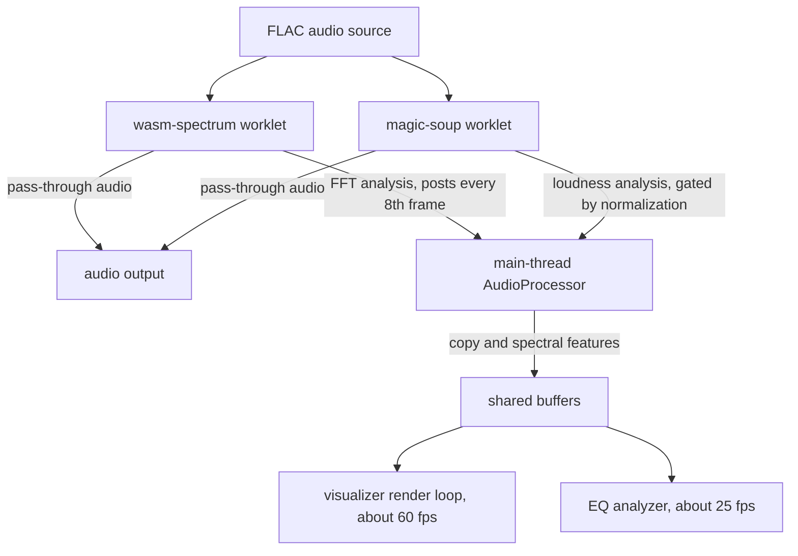
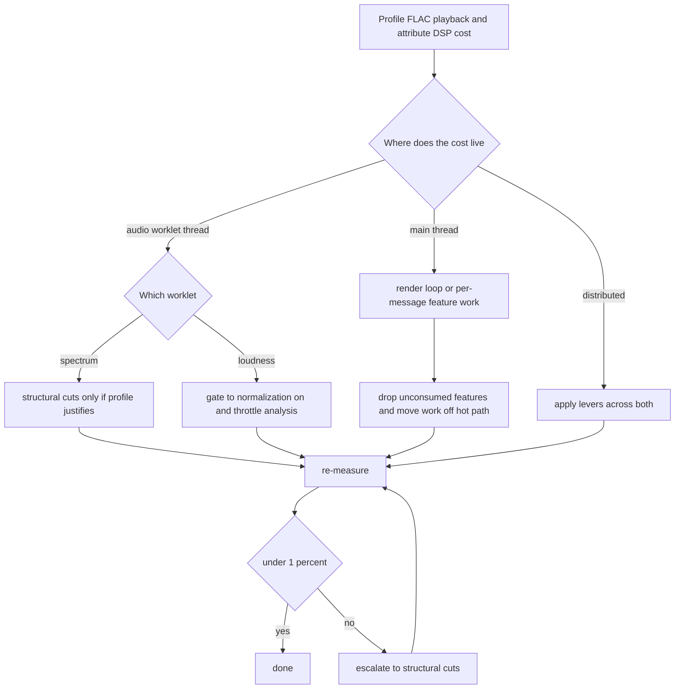

# FLAC DSP CPU Optimization - Plan

## Goal Capsule

- **Objective:** Cut client-side audio DSP usage during FLAC playback to near-idle (under 1% on a Ryzen 7 5800X) without changing playback audio quality.
- **Product authority:** Phase 1 music vertical — the listener-facing playback experience. Anchored to the `STRATEGY.md` principle "Speed is a feature."
- **Execution profile:** `code` — client-side AudioWorklet and WASM plus main-thread TypeScript. No backend change.
- **Stop conditions:** DSP under 1% sustained with audio quality preserved; or the profile proves an irreducible residue and a documented trade-off is accepted.
- **Open blockers:** The DSP cost is unmeasured (gut-feel 7–10%); the real bottleneck is unknown until profiled. The built WASM may not match the C++ source, so the live FFT size is uncertain.

---

## Product Contract

### Summary

A profile-driven reduction of client-side audio DSP cost during FLAC playback to near-idle, holding playback audio quality harmless. Profile first to attribute the cost across the audio worklets and the main thread, eliminate unconsumed and off-screen work, and apply structural cuts only where the profile justifies.

### Problem Frame

During FLAC playback, client-side audio DSP reads high — a gut-feel 7–10% on a Ryzen 7 5800X — for what the analysis path actually does. The three intuitive suspects (WASM↔V8 message copies, FFT/"ft" memory size, unused upper frequency bands) all target the spectrum worklet, but that path is already reduced (1024-sample frames, 128 bins, posted every 8th frame) and runs cheap, so those levers are largely spent. The remaining cost is more likely on the loudness worklet or the main-thread render loop, and it is currently unmeasured. Spending visualizer fidelity on an unverified bottleneck is the risk this plan avoids.

### Key Decisions

- **Profile before cutting.** The bottleneck is intuition, not measurement. The first deliverable is a trace that attributes DSP cost to the worklet thread versus the main thread before any structural change. The gut-feel targets are already-reduced or wrong-component; a blind cut likely misses.
- **Audio quality is held harmless; visualizer fidelity is the trade currency.** The spectrum and loudness analysis is verified audio pass-through, so cutting it affects display quality, not playback. The under-1% target explicitly accepts visualizer degradation.
- **Sequence cheap levers before structural ones.** Remove unconsumed and off-screen work first, then surgically fix what the profile identifies, escalating to structural cuts (FFT size, post rate, band count) only if cheaper levers undershoot.
- **Stay within the current architecture.** Optimize inside the AudioWorklet plus WASM pipeline; do not replace it.

### Requirements

**Measurement**

- R1. Attribute the current DSP cost to its sources before any structural change, separating audio-worklet-thread cost from main-thread cost and identifying whether the spectrum worklet or the loudness worklet dominates.
- R2. Record a baseline DSP measurement during FLAC playback on the target hardware so every later change carries a before/after number.

**Reduction**

- R3. Remove analysis work that has no consumer — the spectral features computed but only stored or displayed — once re-confirmed they feed nothing (recommendations, auto-EQ, analytics).
- R4. Gate the analysis path to when its output is used: the spectrum worklet does not compute when the visualizer is off-screen or stopped, and the loudness worklet's analysis pass does not run when volume normalization is off.
- R5. Apply structural cuts — FFT size, output bin count, post rate — only where the profile shows that path's compute or copy is a material share of cost, and only after R3 and R4 are exhausted.

**Quality guardrail**

- R6. Hold playback audio quality unchanged across every change in this plan; the analysis path is verified audio pass-through, and anything that risks the signal path is out of scope.

### Acceptance Examples

- AE1. **Covers R4.** Given the visualizer is off-screen or stopped, when FLAC plays, the spectrum worklet performs no FFT and posts no analysis.
- AE2. **Covers R4.** Given volume normalization is off, when FLAC plays, the loudness worklet's analysis pass does not run, while audio still passes through.
- AE3. **Covers R3, R6.** Given spectral features are confirmed unconsumed, removing their computation changes neither playback audio nor any recommendation or auto-EQ behavior.

### Success Criteria

- DSP usage during FLAC playback under 1% on a Ryzen 7 5800X, sustained, with the visualizer active.
- No audible change to playback — the signal path is untouched.
- Every accepted change carries a recorded before/after DSP measurement.
- The visualizer remains functional, even if lower-fidelity; it must not freeze or disappear.

### Scope Boundaries

Out of scope:

- Server-side transcoding DSP (FFmpeg and the Swoole CPU pool) — a separate cost center.
- Codec or audio-quality changes; the signal path, EQ filters, and loudness normalization algorithm are untouched.
- Replacing the AudioWorklet plus WASM architecture (for example, switching to a different DSP runtime).
- Mobile, TV, and non-music media — web and Electron music playback only.

Deferred (cheap win, not the CPU goal):

- The 16MB WASM initial-memory reservation is a resident-RAM concern, not a per-frame CPU cost. Reducing it is a separate, low-risk win that does not affect DSP%.

### Dependencies / Assumptions

- Verified: the spectrum and loudness analysis path is audio pass-through, not in the signal chain (`public/audio-worklets/wasm-spectrum.js`; loudness gated by the normalization flag in the EQ analyzer).
- Verified: spectral features (centroid, rolloff, flux, flatness, peak) have no consumer beyond display, so they are safe to remove or defer. Re-confirm at implementation before deletion.
- Unverified: the built `fft2048.wasm` matches the `packages/dsp/fft2048` C++ source. The live worklet feeds 1024 samples and allocates 512 magnitude bytes while the source declares `N=2048` / `HN=1024` — either the build drifted or the FFT runs on a half-stale buffer. Resolve before trusting any FFT-size lever.
- The 7–10% figure is gut-feel, not measured; R2 establishes the real number.

### Outstanding Questions

Deferred to planning:

- OQ1. Does the built `fft2048.wasm` match the C++ source, or has it drifted? Resolve during the profile and debug step — it determines whether the FFT-size lever is real and may surface a correctness bug.
- OQ2. Exact profiling method for the AudioWorklet thread (Chrome DevTools thread selection versus an in-worklet timing counter) — planning picks the cheaper reliable option.
- OQ3. How low can post rate and band count go before the visualizer is unusable — a fidelity floor to define once the profile shows whether the spectrum path matters at all.

### Sources / Research

- `STRATEGY.md` — "Speed is a feature"; WASM audio processing sits under the Phase 1 music vertical.
- `public/audio-worklets/wasm-spectrum.js`, `public/audio-worklets/magic-soup-processor.js` — the live reduced worklet config and the loudness worklet.
- `ui/web/src/features/player/services/audio-processor.ts` — main-thread data flow, shared buffers, and `computeSpectralFeatures`.
- `packages/dsp/fft2048/` — the FFT source and build flags whose declared `N=2048` is inconsistent with the live worklet's 1024-sample input.
