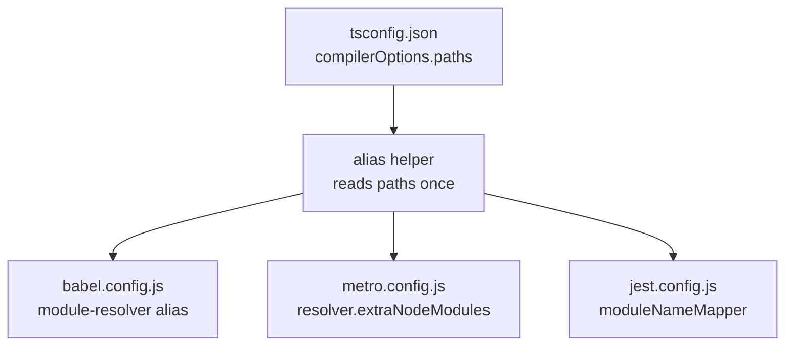

# RN TV Developer Experience - Plan

## Goal Capsule

- **Objective:** Make the TV-first (tvOS + Android TV) RN project's tooling functional and its developer loop ergonomic — repair `lint`/`test`, add TV run + cache-reset scripts with onboarding docs, remove the phantom macOS/Windows targets, consolidate the path aliases to a single source of truth, and create the missing tvOS native build target so the existing tv JS layer has a surface to run on — without gold-plating.
- **Product authority:** Martin — RN app owner. TV-first intent (tvOS + Android TV) and scope tier B + alias de-dup confirmed 2026-07-15; plan-time forks (alias mechanism, ESLint posture) confirmed at planning; tvOS-native-target scope expansion confirmed 2026-07-15 after a doc-review pass found the target had never actually been created.
- **Execution profile:** code, Standard depth, 7 units, phased (dead-config removal + tvOS native target → alias consolidation → tooling wiring → dev-loop scripts → onboarding docs).
- **Stop conditions:** `yarn lint`, `yarn typecheck`, and `yarn test` all pass; Metro bundles; the tvOS native target exists and `yarn tvos` builds and launches on the Apple TV simulator; `yarn android-tv` launches on Android TV; phantom macOS/Windows targets and the stale cocoapods cap are gone; path aliases resolve from one source; the TV README exists.
- **Tail ownership:** the implementer owns exact config contents — ESLint rule set, Jest preset options, the alias-helper shape — and the Xcode mechanics of adding the tvOS target, within the KTD constraints below.
- **Open blockers:** none.

---

## Product Contract

*Product Contract preservation:* changed. R9 (tvOS native build target) was added after the owner confirmed expanding this plan to create the target; this corrects the brainstorm's incorrect claim that the target already existed (it did not — the `ios/Baander-tvOS/` directories were empty stubs and the Xcode project is iPhone/iPad only). R1-R8 are otherwise unchanged in intent. The three questions the brainstorm deferred to planning are resolved here as KTD1 (alias mechanism), KTD5 (script shape), and the carried-forward no-Prettier Key Decision; R7's verify-or-decide is resolved as "remove the cap" (KTD4).

### Summary

Repair the TV-first RN project's tooling floor, create its missing tvOS native target, and harden its developer loop: make `yarn lint` and `yarn test` functional, add TV run + cache-reset convenience scripts with onboarding docs, remove the phantom macOS/Windows targets, consolidate the path aliases to a single source of truth, and finish the tvOS native build target so the deep tv JS layer can actually run.

### Problem Frame

The RN app targets Apple TV and Android TV, but both the tooling and the tvOS native surface are incomplete. `yarn lint` invokes ESLint with no config; `yarn test` invokes Jest with no React Native transform wiring, so the existing TV test files do not execute, and the tests depend on a library (`@testing-library/react-native`) that was never declared. The `macos` and `windows` run scripts point at native projects that do not exist. Path aliases are duplicated across TypeScript, Babel, and Metro, so any alias change is a three-file edit. And critically, the tvOS native target was never created: the `ios/Baander-tvOS/` directories are empty, the Xcode project builds only for `iphoneos`/`iphonesimulator` (`TARGETED_DEVICE_FAMILY = "1,2"`), and there is no `Baander-tvOS` scheme, so `yarn tvos` fails today despite a deep, ready `src/features/tv/` UI layer. TV development also spans two native platforms with heavy caching (Gradle, Pods, Metro, Watchman), yet there are no scripts to install pods or reset caches, and no onboarding doc.

This is worth fixing now because TV is the active target. `STRATEGY.md` parks RN generally ("not a priority until web is solid"), but the owner has committed to tvOS + Android TV, which lifts the work above speculative DX polish.

### Key Decisions

- **TV-first, not parked.** tvOS and Android TV are the target surfaces (owner-confirmed). This justifies DX investment the strategy doc's "Phase 3+" framing would otherwise defer.
- **Create the tvOS native target surgically, do not regenerate.** Finish the empty `ios/Baander-tvOS/` stubs into a real `appletvos` target that mirrors the iOS Swift AppDelegate (the RN 0.86 `RCTReactNativeFactory` pattern is platform-agnostic and react-native-tvos supports the new architecture on tvOS), rather than regenerating the iOS project from the template. Android stays a single dual-purpose APK that launches on both phones and TV via `LEANBACK_LAUNCHER`.
- **Scope tier B + alias de-dup + tvOS target.** Tooling repair plus TV dev-loop scripts plus onboarding doc plus a single alias source plus the tvOS native target. The unified `yarn tv` launcher is explicitly deferred.
- **No formatter in this round.** The lint pass is config-only; a Prettier rollout is out of scope.

### Requirements

**Tooling floor**

- R1. `yarn lint` runs ESLint 9 flat config over the `src/` tree and exits clean on the current codebase.
- R2. `yarn test` runs the Jest suite with the React Native transform wired, so existing tests under `src/**/__tests__/` (including `src/features/tv/__tests__`) execute.
- R3. The `macos` and `windows` run scripts and their `react-native-macos` / `react-native-windows` package entries are removed, since no `macos/` or `windows/` native projects exist to back them.

**TV developer loop**

- R4. A `yarn android-tv` script installs and launches the app on an Android TV device or emulator, and `yarn tvos` targets the `Baander-tvOS` scheme created in R9.
- R5. Convenience scripts cover the cache-heavy native workflow: pod install, and a cache reset spanning Metro, Watchman, Gradle, and DerivedData/Pods as appropriate per platform.
- R6. A README documents the TV run loop: Apple TV simulator setup and `yarn tvos`; Android TV emulator setup and `yarn android-tv`; Metro start; and the cache-reset workflow.
- R7. The `cocoapods < 1.15` bound in `Gemfile` is removed (the 1.15.0 bug it guarded was fixed in 1.15.2, and React Native's template no longer caps it).

**Alias consolidation**

- R8. The `@/` and `@baander/shared` aliases resolve from a single source of truth shared by TypeScript, Babel, and Metro, so an alias change is made in one place.

**tvOS native target**

- R9. The tvOS app has a real native build target — `appletvos`/`appletvossimulator`, a shared `Baander-tvOS` scheme, a tvOS Podfile target, and tvOS source files (Swift AppDelegate, Info.plist, LaunchScreen) — so `yarn tvos` builds and launches on the Apple TV simulator.

### Scope Boundaries

**Deferred for later**

- Unified `yarn tv` launcher (target picker that boots Metro plus the right native build) — Approach C stretch, not this round.
- `<uses-feature android:name="android.software.leanback" required="false">` for Play Store TV-section visibility — a distribution concern, tracked separately from DX.
- TypeScript version alignment across the monorepo (rn resolves 7.0.2 while `ui/web` and `ui/electron` are on `^6.0.3`) — observed, out of scope here.
- Regenerating the iOS project from the react-native-tvos template; this plan adds the tvOS target surgically to the existing project.

**Out of scope**

- Generating real macOS/Windows native projects; this round removes the phantom targets, it does not replace them.
- Mobile-first UI and navigation work; TV is the target surface.
- The shared-primitives styling pattern, covered by `docs/plans/2026-07-15-001-refactor-rn-styling-pattern-plan.md`.
- Migrating RN from Jest to web's Vitest; Jest is the RN standard and stays.

### Dependencies & Assumptions

- Verified baseline: React Native 0.86 via `react-native-tvos@0.86.0-2`, React 19, TypeScript 7.0.2, Yarn 4 (`nodeLinker: node-modules`). The iOS app uses a Swift AppDelegate (`ios/Baander/AppDelegate.swift`, `RCTReactNativeFactory`). Android TV launches via `LEANBACK_LAUNCHER` on a dual-purpose APK. **tvOS has no native target today** — empty `ios/Baander-tvOS/` stubs, `project.pbxproj` is iPhone/iPad only, no `Baander-tvOS` scheme.
- Assumption: the existing `__tests__` are structurally sound and will run once Jest is configured; they import `@testing-library/react-native` (not `react-test-renderer`), so U4 adds that dependency. Failures surfaced after wiring are fixed in U4, not treated as scope expansion.
- Android build env: React Native 0.86 / Android requires JDK 17 (`JAVA_HOME`) and an `android-37` symlink workaround; AGP 8.12 with compileSdk 37 emits a known warning. U5/U6 account for this.
- The `@baander/shared` workspace link (`../shared`) must keep resolving after the alias consolidation.
- tvOS toolchain: Xcode with the tvOS simulator must be available for U7/U6 verification.

### Outstanding Questions

Resolved during planning — none remain blocking. The brainstorm-deferred items landed as KTD1 (alias source), KTD4 (cocoapods cap), and KTD5 (script shape); Prettier stays out per the no-formatter Key Decision; the tvOS target approach is KTD7.

### Sources / Research

- `ui/rn/package.json:9-11` (macos/windows/tvos scripts), `:13-14` (test/lint), `:26` (`react-native` → `react-native-tvos` fork alias).
- `ui/rn/ios/Baander.xcodeproj/project.pbxproj:276,305` (`SUPPORTED_PLATFORMS = "iphoneos iphonesimulator"`), `:279,307` (`TARGETED_DEVICE_FAMILY = "1,2"`), `:381,446` (`SDKROOT = iphoneos`), zero `appletvos` occurrences — confirms no tvOS target. Only `ios/Baander.xcodeproj/xcshareddata/xcschemes/Baander.xcscheme` exists (no `Baander-tvOS.xcscheme`); `ios/Baander-tvOS/` and `ios/Baander-tvOSTests/` are empty.
- `ui/rn/ios/Podfile:8,17` — `platform :ios`, single `target 'Baander' do`; no tvOS pod target.
- `ui/rn/ios/Baander/AppDelegate.swift` — Swift, `RCTReactNativeFactory` + `RCTDefaultReactNativeFactoryDelegate` (platform-agnostic pattern to mirror for tvOS).
- `ui/rn/android/app/src/main/AndroidManifest.xml` — `LEANBACK_LAUNCHER` category plus `tv_banner` (dual-purpose APK).
- `ui/rn/src/features/tv/__tests__/*` — all six files import `@testing-library/react-native`; `@testing-library/react-native` is absent from `package.json` (`react-test-renderer` is present but unused by the tests).
- `ui/rn/node_modules/react-native/jest-preset.js` — shim that `require('@react-native/jest-preset')` and throws on `MODULE_NOT_FOUND`; `@react-native/jest-preset` is not installed.
- `ui/rn/tsconfig.json:16-20`, `ui/rn/babel.config.js:5-15`, `ui/rn/metro.config.js:11-15` — three-way alias duplication.
- `ui/rn/Gemfile:6-8` — cocoapods upper bound plus stale bug comment.
- `ui/web/package.json` and `ui/web/eslint.config.js` — the ESLint 9 flat-config + `typescript-eslint` + `eslint-plugin-react-hooks` (+ `eslint-plugin-react-refresh`, `globals`) stack; `ui/web` uses `@/*` alias and Vitest (RN diverges to Jest by design).
- `ui/electron/package.json` — `clean` script precedent.
- `STRATEGY.md:72` (TV scaffold depth), `:203` and `:218` (RN parked, not abandoned).
- CocoaPods 1.15 bug fixed in 1.15.2; RN template removed the `< 1.15` cap — [react-native#42698](https://github.com/react/react-native/issues/42698).

---

## Planning Contract

### Key Technical Decisions

- KTD1. **Path aliases: `tsconfig.json` paths as the single source.** A small helper reads `tsconfig.json` `compilerOptions.paths` and maps them to the shapes Babel's `module-resolver`, Metro's `resolver.extraNodeModules`, and Jest's `moduleNameMapper` each expect; `babel.config.js`, `metro.config.js`, and `jest.config.js` import the helper instead of hardcoding aliases. `tsconfig.json` stays authoritative because TypeScript reads it directly; Babel, Metro, and Jest are JS and can derive. Resolves R8.
- KTD2. **ESLint flat config: RN community base plus web's TS/hooks rules, minus Vite-only pieces.** Base on `@react-native/eslint-config` for RN-specific concerns and layer in `typescript-eslint` and `eslint-plugin-react-hooks` to match `ui/web`. Deliberately omit `eslint-plugin-react-refresh` (Vite-specific; RN has Fast Refresh built in) and `globals`. Resolves R1.
- KTD3. **Jest on the React Native preset, with the libraries the tests actually use.** Set `preset: 'react-native'`, which resolves through `@react-native/jest-preset` (a separate package the shim requires; must be added explicitly), with `moduleNameMapper` derived from KTD1's helper. Add `@testing-library/react-native` — the tests import it, not `react-test-renderer` (which is present but unused). RN stays on Jest rather than web's Vitest. Resolves R2.
- KTD4. **Remove the cocoapods cap.** The `< 1.15` bound guarded a `File exists @ syserr_fail2_in` bug in CocoaPods 1.15.0, fixed in 1.15.2; React Native's template no longer caps it. On RN 0.86 the bound is dead config. Resolves R7.
- KTD5. **Dev-loop scripts: small focused set, not a flag-based mega-script.** Add `pods` (`bundle exec pod install`), `clean` (clears Metro cache, Watchman, Gradle build, and iOS DerivedData/Pods), and `android-tv` (targets an Android TV device/emulator); reuse `yarn start --reset-cache` for Metro-only resets. Precedent: `ui/electron` `clean` script. Resolves R4/R5.
- KTD6. **No Prettier this round.** Carried forward from the brainstorm's no-formatter Key Decision; the lint pass is config-only.
- KTD7. **Add the tvOS target surgically, mirroring the iOS Swift AppDelegate.** Create a new `appletvos`/`appletvossimulator` app target (`TARGETED_DEVICE_FAMILY = 3`) with a Swift `AppDelegate` that reuses the `RCTReactNativeFactory` + `RCTDefaultReactNativeFactoryDelegate` pattern from `ios/Baander/AppDelegate.swift`, a tvOS `Info.plist` (no `LSRequiresIPhoneOS`; tvOS launch keys), a tvOS `LaunchScreen.storyboard`, a tvOS `Images.xcassets` (app icon + top-shelf sizes), and a shared `Baander-tvOS.xcscheme`. Add a `target 'Baander-tvOS' do` block to the Podfile with the tvOS platform and run `pod install`. Do not regenerate the project from the template. Resolves R9.

### High-Level Technical Design

The one piece of structural shape is the alias source-of-truth fan-out introduced by KTD1: one authority (`tsconfig.json`) feeding three consumers that previously each held a private copy.

Before this change the same `@/` and `@baander/shared` mappings were hand-maintained in all three consumers (plus `tsconfig.json`), so an alias edit was a four-file change with silent drift as the failure mode. After, `tsconfig.json` is the only edit site.

### Assumptions

- A representative Android TV target (emulator or physical device), the Apple TV simulator, and Xcode are available for U7/U5/U6 verification. Where a target is absent, script/target existence plus a dry invocation is the fallback signal.
- The existing `src/features/tv/__tests__` files will pass once Jest's transform and `@testing-library/react-native` are wired; any failure rooted in the test itself (not the config) is fixed in U4.
- Mixing iOS and tvOS targets in one Xcode project with `react_native_pods` may need the tvOS Podfile target to use the tvOS-specific pod path; treat as an execution-time detail within U7, not a scope change.

### Sequencing

U1 (dead-config removal) and U7 (tvOS native target) are independent and can start immediately — U7 is foundational for every tvOS verification gate despite its higher U-ID. U2 (alias consolidation) is foundational for U4's Jest `moduleNameMapper`. U3, U4, and U5 can proceed in parallel once U2 lands. U6 (README) depends on U4, U5, and U7 because it documents the test command, the run scripts, and the tvOS/Android TV run loops.

---

## Implementation Units

### U1. Remove dead config (phantom targets + stale cocoapods cap)

- **Goal:** Delete the macOS/Windows scripts and deps that point at non-existent native projects, and remove the obsolete cocoapods version cap.
- **Requirements:** R3, R7.
- **Dependencies:** none.
- **Files:** `ui/rn/package.json` (drop `macos`/`windows` scripts and `react-native-macos`/`react-native-windows` entries); `ui/rn/Gemfile` (remove the `< 1.15` cocoapods bound and its stale bug comment).
- **Approach:** Remove the two scripts and the two package entries from `package.json`, then run `yarn install` to update the lockfile. In `Gemfile`, drop the upper bound so cocoapods resolves a current 1.15.2+/1.16.x release; leave the `ruby` and lower-bound constraints in place.
- **Patterns to follow:** KTD4 (cocoapods rationale); `ui/electron/package.json` for a clean script set.
- **Test expectation:** none — pure config deletion. Verified by `yarn install` resolving cleanly and no remaining script referencing `macos`/`windows`.
- **Verification:** `yarn install` succeeds; `grep` for `run-macos`/`run-windows`/`react-native-macos`/`react-native-windows` returns nothing under `ui/rn`; `bundle exec pod install` still resolves a cocoapods version without the cap.

### U2. Consolidate path aliases to a single source

- **Goal:** Make `tsconfig.json` paths the sole source of truth for `@/` and `@baander/shared`, with Babel, Metro, and Jest deriving from it.
- **Requirements:** R8 (also enables R2's Jest resolution).
- **Dependencies:** none (foundational).
- **Files:** new alias helper (e.g. `ui/rn/scripts/paths.js` or colocated in `metro.config.js` and re-exported); `ui/rn/babel.config.js`; `ui/rn/metro.config.js`; `ui/rn/tsconfig.json` (unchanged in effect — remains the source).
- **Approach:** Per KTD1, the helper reads `tsconfig.json` `compilerOptions.paths` and emits the three consumer-specific shapes: an alias map for `babel-plugin-module-resolver`, an `extraNodeModules` map for Metro's resolver, and a `moduleNameMapper` regex map for Jest. Replace the hardcoded alias blocks in `babel.config.js` and `metro.config.js` with imports of the helper. Keep `@baander/shared`'s Metro `watchFolders` entry (it serves a different purpose — monorepo file watching — and is not an alias).
- **Execution note:** Verify by behavior, not a new unit test — the proof is that Metro bundles and TypeScript still resolve after the swap.
- **Patterns to follow:** existing `ui/rn/metro.config.js` resolver shape; KTD1.
- **Test scenarios:**
  - Happy path: a source file importing `@/app/App` and `@baander/shared` resolves under Metro dev build and under `tsc`.
  - Drift property: editing `tsconfig.json` paths alone propagates to Babel and Metro without touching their files (verify by adding a throwaway alias, bundling, then reverting).
  - Edge case: the `../shared` workspace link still resolves end-to-end after consolidation.
- **Verification:** `yarn typecheck` passes; Metro bundles the app; `@baander/shared` imports resolve at runtime.

### U3. Wire ESLint 9 flat config

- **Goal:** Make `yarn lint` run a real ESLint 9 flat config over `src/`.
- **Requirements:** R1.
- **Dependencies:** none (optionally U2 for import-resolution linting, but not required to ship).
- **Files:** new `ui/rn/eslint.config.js`; `ui/rn/package.json` (add devDependencies: `@react-native/eslint-config`, `typescript-eslint`, `eslint-plugin-react-hooks`, `@eslint/js` as needed).
- **Approach:** Per KTD2, author a flat config that applies the RN community config plus `typescript-eslint` and the react-hooks plugin, scoped to `src/**` and `index.js`. Take `ui/web/eslint.config.js` as a structural reference but deliberately omit `eslint-plugin-react-refresh` (Vite-specific; RN has Fast Refresh) and `globals` unless a rule requires them. Run `yarn lint` and resolve any real findings the config surfaces; do not silence rules globally to force a clean exit.
- **Execution note:** Prefer a clean `yarn lint` exit on the current tree over expanding the rule set aggressively — this round establishes the gate, not a strict style overhaul.
- **Patterns to follow:** `ui/web/eslint.config.js` (shape only); `@react-native/eslint-config` defaults.
- **Test expectation:** none — pure config. Verified by `yarn lint` running and exiting clean.
- **Verification:** `yarn lint` exits 0 (or reports only issues the team has explicitly chosen to leave); the config file is detected as flat config by ESLint 9.

### U4. Wire Jest with the React Native transform

- **Goal:** Make `yarn test` execute the existing test suite with RN's transform, the RN preset, and the testing library the tests actually import.
- **Requirements:** R2.
- **Dependencies:** U2 (alias helper for `moduleNameMapper`).
- **Files:** new `ui/rn/jest.config.js`; `ui/rn/package.json` (add devDependencies: `@react-native/jest-preset` at `0.86.0`, `@testing-library/react-native`).
- **Approach:** Per KTD3, create `jest.config.js` with `preset: 'react-native'` (resolves through the explicitly-installed `@react-native/jest-preset`), `moduleNameMapper` derived from U2's helper, and `testPathIgnorePatterns` excluding native/build dirs (`/node_modules/`, `/android/`, `/ios/`). Add `@testing-library/react-native` (the tests import it) and `@react-native/jest-preset` (the shim requires it).
- **Execution note:** The existing TV tests are the proof — start by running `yarn test` and triaging failures into "config gap" (fix here) versus "test bug" (fix the test).
- **Patterns to follow:** `react-native` jest-preset conventions; KTD3.
- **Test scenarios:**
  - Happy path: the existing `src/features/tv/__tests__` files (TVCard, TVFocusable, TVContentRow, TVHomePage, TVNavigator, TVAdminRoute) execute and pass under `yarn test`.
  - Transform: a `.tsx` test file runs without a syntax/transform error (proves the RN TSX transform is active).
  - Dependency resolution: a test importing from `@testing-library/react-native` and resolves (covers the missing-dep fix).
  - Alias resolution: a test imports a `@/`-aliased module and resolves (covers the U2 ↔ Jest integration).
  - Edge case: native directories (`android/`, `ios/`) are excluded from test discovery.
- **Verification:** `yarn test` runs the full `src/**/__tests__/` suite green, or green except for tests explicitly skipped with a tracked reason.

### U5. Add TV dev-loop convenience scripts

- **Goal:** Add `android-tv`, `pods`, and `clean` scripts so the two-platform native loop is one command each.
- **Requirements:** R4, R5.
- **Dependencies:** U1 (so the script set is clean of phantom targets).
- **Files:** `ui/rn/package.json` (scripts block); optionally a small `ui/rn/scripts/clean.sh` if the `clean` script is non-trivial.
- **Approach:** Per KTD5, add `pods` → `cd ios && bundle exec pod install`, `clean` → clear Metro cache, Watchman, Gradle build (`android/`), and iOS DerivedData/Pods, and `android-tv` → `react-native run-android` targeting a connected Android TV device or emulator (via `--deviceId` or device selection). Keep `tvos` and `start` as-is.
- **Execution note:** Prefer runtime smoke verification (invoke each script against a real or emulated TV target) over unit coverage. The Android build requires JDK 17 (`JAVA_HOME`) and the `android-37` symlink workaround; the script itself need not encode these, but failures should not be misread as script bugs.
- **Patterns to follow:** `ui/electron/package.json` `clean` script; existing `tvos` script for the run-script convention.
- **Test expectation:** none — scripts are verified by invocation.
- **Verification:** `yarn pods` installs pods without error (macOS); `yarn clean` runs and clears the targeted caches; `yarn android-tv` builds and launches on an Android TV emulator/device. Where no TV target is connected, verify the script is wired correctly and fails with a clear device-not-found message rather than a config error.

### U6. Write the TV onboarding README

- **Goal:** Document the TV-first run loop so a new contributor can build and launch on both TV platforms.
- **Requirements:** R6.
- **Dependencies:** U4 (documents `yarn test`), U5 (documents `android-tv`/`pods`/`clean`), U7 (documents `yarn tvos` on the new target).
- **Files:** new `ui/rn/README.md`.
- **Approach:** Cover prerequisites (Node/Yarn versions; Xcode + Apple TV simulator; Android SDK + Android TV system image, JDK 17 via `JAVA_HOME`, `android-37` symlink workaround), the run loop (`yarn start`, `yarn tvos`, `yarn android-tv`), the quality gates (`yarn lint`, `yarn typecheck`, `yarn test`), and the cache-reset workflow (`yarn clean`, `yarn pods`, `yarn start --reset-cache`). Note the dual-purpose Android APK and the leanback launcher behavior, and that the tvOS target is a separate native target from iOS. Reference `@baander/shared` as a workspace dependency.
- **Patterns to follow:** repo doc tone; `ui/DESIGN.md` and `STRATEGY.md` for voice.
- **Test expectation:** none — documentation.
- **Verification:** README accurately names every script and command added by U3–U5 and the tvOS target from U7; a contributor following it can reach a running app on the Apple TV simulator and (with a TV image installed) the Android TV emulator.

### U7. Create the tvOS native build target

- **Goal:** Finish the empty `ios/Baander-tvOS/` stubs into a real `appletvos` app target so the existing `src/features/tv/` UI layer has a native surface and `yarn tvos` builds and launches.
- **Requirements:** R9 (also makes R4's `yarn tvos` achievable).
- **Dependencies:** none strictly (native work); logically after U1 for a clean project state. Foundational for all tvOS verification gates.
- **Files:** `ui/rn/ios/Baander.xcodeproj/project.pbxproj` (new tvOS app target + build phases); `ui/rn/ios/Baander-tvOS/AppDelegate.swift`, `Info.plist`, `LaunchScreen.storyboard`, `Images.xcassets` (tvOS app icon + top-shelf sizes); `ui/rn/ios/Baander.xcodeproj/xcshareddata/xcschemes/Baander-tvOS.xcscheme`; `ui/rn/ios/Podfile` (new `target 'Baander-tvOS' do` block on the tvOS platform).
- **Approach:** Per KTD7, add a tvOS app target (`SDKROOT = appletvos`, `SUPPORTED_PLATFORMS = "appletvos appletvossimulator"`, `TARGETED_DEVICE_FAMILY = 3`). Its Swift `AppDelegate` reuses the `RCTReactNativeFactory` + `RCTDefaultReactNativeFactoryDelegate` pattern from `ios/Baander/AppDelegate.swift` (platform-agnostic on react-native-tvos 0.86). Author a tvOS `Info.plist` (drop `LSRequiresIPhoneOS`; add tvOS launch/UI keys) and a tvOS `LaunchScreen.storyboard`. Mark the new scheme shared so `react-native run-ios --scheme Baander-tvOS` resolves it. Add a `target 'Baander-tvOS' do` Podfile block using the tvOS platform and `use_react_native!`, then `pod install`.
- **Execution note:** Start by confirming the target builds an empty shell and launches on the Apple TV simulator before wiring React Native into it — isolate "target exists" from "RN runs on tvOS." Mixing iOS + tvOS in one project with `react_native_pods` may need the tvOS pod path; resolve that at the Podfile level during implementation.
- **Patterns to follow:** `ios/Baander/AppDelegate.swift` (Swift AppDelegate pattern); react-native-tvos tvOS target conventions.
- **Test scenarios:**
  - Happy path: `yarn tvos` builds the tvOS target and launches it on the Apple TV simulator, loading the JS bundle from Metro.
  - Target isolation: the tvOS target builds and installs before React Native is wired (proves the target itself is sound).
  - Pod integrity: `pod install` succeeds for the tvOS target without disturbing the iOS target.
  - Scheme visibility: `xcodebuild -list -project ios/Baander.xcodeproj` shows `Baander-tvOS` as a shared scheme.
- **Verification:** `yarn tvos` launches a running app on the Apple TV simulator; the iOS (`yarn ios`-equivalent) target still builds (no regression); `pod install` is clean for both targets.

---

## Verification Contract

| Command | Proves | Units |
|---|---|---|
| `yarn lint` | ESLint 9 flat config runs and exits clean on `src/` | U3 |
| `yarn typecheck` | `tsc --noEmit` passes after alias consolidation | U2 |
| `yarn test` | Jest RN preset runs the `src/**/__tests__/` suite green | U4 |
| `yarn start` | Metro bundles | U2 |
| `yarn tvos` | tvOS target builds and launches on the Apple TV simulator | U7 |
| `yarn android-tv` | App builds and launches on an Android TV device/emulator | U5 |
| `yarn pods` | CocoaPods installs for iOS and tvOS targets without the removed cap | U1, U7 |
| `yarn clean` | Targeted caches (Metro, Watchman, Gradle, DerivedData/Pods) clear | U5 |
| `xcodebuild -list -project ios/Baander.xcodeproj` | `Baander-tvOS` appears as a shared scheme | U7 |
| `grep -R "run-macos\|run-windows\|react-native-macos\|react-native-windows" .` | Returns nothing under `ui/rn` | U1 |

Quality gates: `lint`, `typecheck`, and `test` must all pass before the plan is done. `tvos` requires the Apple TV simulator; `android-tv` requires JDK 17 and an Android TV target. Where a target is unavailable, target existence + a clear failure message is the fallback signal, flagged in the PR.

---

## Definition of Done

- Global: `yarn lint`, `yarn typecheck`, and `yarn test` all pass; Metro bundles.
- The `macos`/`windows` scripts and their package entries, and the cocoapods `< 1.15` cap, are removed (U1).
- Path aliases resolve from `tsconfig.json` alone; Babel, Metro, and Jest derive (U2).
- `yarn lint` runs a real flat config (U3); `yarn test` runs the existing suite green with `@testing-library/react-native` and `@react-native/jest-preset` installed (U4).
- `android-tv`, `pods`, and `clean` scripts exist and invoke correctly (U5); the TV README documents the full loop including the JDK 17 / `android-37` Android prerequisites (U6).
- The tvOS native target exists, has a shared scheme, and `yarn tvos` builds and launches on the Apple TV simulator (U7).
- Cleanup: no dead config, no abandoned experimental files (e.g., a discarded alias-helper draft), no rules silenced globally just to force a clean lint exit, and no leftover empty `Baander-tvOS` stub directories once the target is real.
