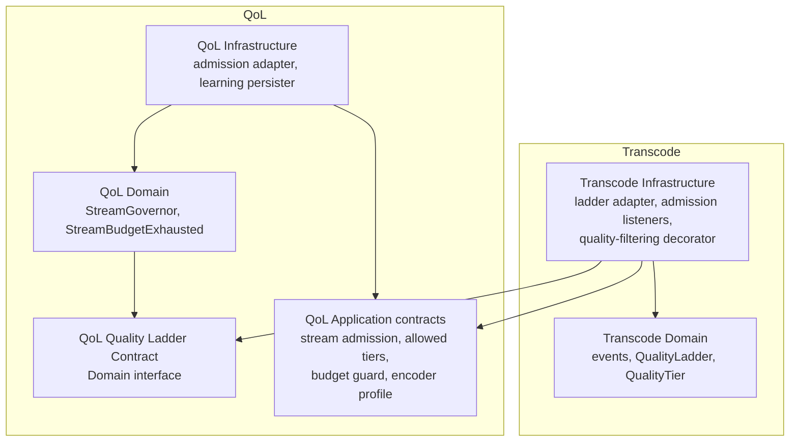
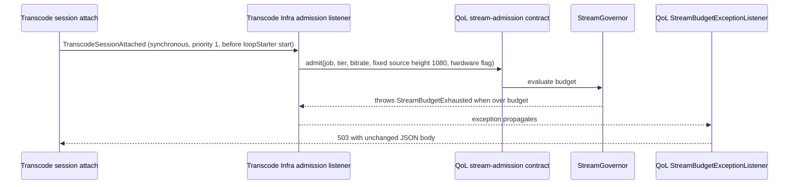
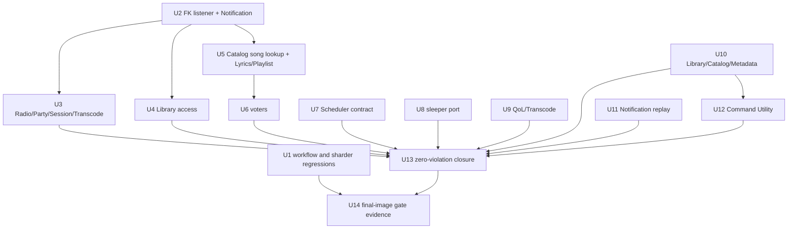

# Backend Release Gates - Plan

## Goal Capsule

- **Objective:** The backend can be published only through gates that actually hold. Deptrac reports zero active boundary violations without baseline growth, and the whole sharded PHPUnit/coverage suite passes on the final 512 MiB CI image. A recorded run also shows that one failing test stops publication.
- **Means:** Remove each violation through application ports, narrow named contract layers or class moves (KTD1–KTD9). Then run the CI step's own shell against a fresh `ci` image built from the final checkout (KTD10).
- **Authority:** `AGENTS.md` and `.agents/rules/architecture-rules.md` govern. This plan comes next, then the `ROADMAP.md` "Resume here" section. If the plan and the rules disagree, the rules win; record the conflict under Open Questions.
- **Stop conditions:** Stop and ask if a fix would require adding a baseline entry, a blanket rule, or a schema change that alters physical columns, FKs or indexes beyond the R15 migrations. Also stop if the final-image gate fails for a reason outside this plan's units.
- **Execution profile:** Backend refactor across about 13 bounded contexts. Each unit lands as its own commit with its focused tests and a recorded Deptrac count. The evidence run (U14) is last and serial.
- **Finishes and ships:** The implementer. Pushing to Forgejo is outside this plan (R12).

---

## Product Contract

### Summary

This plan drives the remaining 185 active Deptrac violations to zero, grouped by violation family so each batch ships and verifies alone. It also repairs the stale publication-workflow regression that would fail the full suite today. The plan ends with a recorded full-suite coverage run on the final 512 MiB `ci` image, plus a deliberate failing-test run that proves the step and the publication dependency fail closed.

### Problem Frame

`ROADMAP.md` names two blocking backend release gates. Deptrac still reports 185 active violations; this plan reproduced that count on 2026-10-06 against HEAD `5effd65a` (667 skipped, zero errors). The full PHPUnit suite has also never run on the image that now enforces a 512 MiB PHP limit per process. The earlier 143-shard pass used an older image without that limit, and the later pass on the final image covered only the Shared unit tests.

The gate also has a latent defect. `tests/Unit/Shared/Infrastructure/Ci/PublicationWorkflowTest.php` asserts that `build-and-push` needs seven jobs, while `.forgejo/workflows/ci.yaml` now lists eight (`registry-static-quality` landed in `ef5cd26c`). A full run at HEAD therefore fails on that assertion, not on memory.

Until both gates pass, the application release horizon in `ROADMAP.md` cannot close, and boundary debt keeps growing quietly.

### Requirements

**Deptrac boundaries**

- R1. `vendor/bin/deptrac analyse --no-cache --no-progress` reports 0 violations and 0 errors in the CI image built from the final checkout.
- R2. No unit adds a pair to `deptrac.baseline.yaml` or adds a wildcard or context-wide allowance to `deptrac.yaml`. A unit that makes a baselined pair obsolete removes that pair.
- R3. Every new cross-context allowance is a named contract layer that matches exact class names. Each one has an architecture-fixture case proving that the contract is allowed and a sibling internal class is still rejected.
- R4. Observable behaviour stays the same: HTTP status codes and bodies, user-deletion cascades, library-scoped visibility, stream-budget rejection, scheduler registration, notification replay and command names. A unit may change behaviour only where this plan names the change (R14).

**Persistence**

- R5. Converting a cross-context association to a scalar UUID leaves every physical column, FK (including `ON DELETE CASCADE`) and index unchanged. Schema comparison (`doctrine:schema:validate`, migrations diff) emits no `DROP CONSTRAINT` and no `DROP INDEX` for the affected tables.
- R15. Tables this plan touches get their known PostgreSQL defects fixed through forward migrations, as `AGENTS.md` requires:
  - `push_subscriptions.created_at` and `user_library_access.granted_at` become `timestamptz` and keep their existing instants;
  - `party_sessions.host_user_id` gets the index that user-deletion cascades need.

**Quality-gate evidence**

- R6. The publication-workflow regression matches the real `build-and-push` dependency list and covers a failing `registry-static-quality` job.
- R7. `scripts/run-phpunit-shards.php` has a regression test proving that one failing test yields a nonzero exit and a failed-shard summary, and that an all-pass run exits 0.
- R8. The whole suite (Unit, StaticAnalysisRules, Functional, Integration) passes with coverage through the CI `PHPUnit with coverage` step shell, using disposable PostgreSQL and Redis and the `ci` image built from the final checkout.
- R9. The run record includes the checkout commit, image ID, command, shard count, discovered test count, failures, and the merged report location and summary.
- R10. Adding one deliberately failing test to the same image makes that step exit nonzero while coverage artifacts are still copied out. `build-and-push` still depends on `quality-gate`, so a failed quality gate leaves publication without a satisfied dependency.

**Records**

- R11. `ROADMAP.md` records the new Deptrac count after each unit and the gate evidence after U14. Guidance that tells developers to call `Async` directly from application code is corrected.
- R12. Nothing is pushed to the Forgejo instance as part of this plan; the evidence is local.

**Deliberate behaviour changes**

- R13. The mid-stream CPU budget guard (`BudgetGuardInterface` and QoL's `BudgetGuard`) is kept and stays registered. Its contract moves to QoL. It lost its only call site when `6129ab32` replaced per-segment dispatch with long FFmpeg streams. Whether to wire it into the long-stream path is an Open Question, not part of this plan.
- R14. `app:e2e:ingest-video` keeps its name and its debugging role. It ingests a movie library synchronously without workers and prints the resulting video IDs. Its path argument becomes required instead of defaulting to a personal home directory.

### Key Decisions

- **Aim for zero in one plan, batched by violation family.** Scope confirmed at the start of this planning session. Governs R1, R2.
- **Narrow named contract layers are allowed for genuine public contracts; everything else gets a port or a move.** Governs R3.
- **Evidence is a local run of the CI step against the locked image, not a live Forgejo push.** Governs R8–R10, R12.

### Scope Boundaries

- The 667 skipped (baselined) occurrences are not drained, except for pairs a unit makes obsolete (R2).
- Browser credential/session qualification, the registry failure/load/soak/resource gates, regional deployment and S3 restore stay out. They are independent or externally blocked tracks in `ROADMAP.md`.
- Live Forgejo scheduling of job skips is not certified. `testing.md` already states that the workflow regressions do not certify a live scheduler.
- Considered and not built:
  - A forward migration that renames irregular FK names such as `_fkpush_subscriptions_user_id`. It is cosmetic, because DBAL compares FKs by definition, not name. It would become worth doing if a test or tool ever has to look FKs up by name.
  - A new local script that mirrors the CI step. A second copy would drift from `ci.yaml`. U14 runs the step's own `run:` text instead.

#### Deferred to Follow-Up Work

- Convert the baselined entity associations (Activity, Media `ImageEntity`, `PlaylistEntity`/`PlaylistCollaboratorEntity`, Recommendation) with the U2 mechanism. Note that `ImageRepository` uses `IDENTITY(alias.user)` on `PlaylistEntity` in DQL, which Deptrac cannot see.
- Move `SchedulerParameterSchema`'s OpenAPI reflection out of Scheduler Domain.
- Clean up the 52 PSR-4 autoload warnings. `ROADMAP.md` already tracks this as its own task, and no unit here touches those classes.

### Open Questions

- Deferred, non-blocking: should the mid-stream CPU budget guard be wired into the long-stream path, for example by pausing or throttling a running FFmpeg stream while CPU is over the cap? Per-segment dispatch, its old call site, no longer exists. This belongs to the long-process segmenter plan (`docs/plans/2026-07-16-001-refactor-long-process-segmenter-plan.md`) or a user decision. This plan only preserves the guard (R13).

---

## Planning Contract

### Violation inventory (2026-10-06, HEAD `5effd65a`)

| Family | Active occurrences | Unit |
|---|---|---|
| Cross-context `UserEntity` associations (Notification, Radio, Party, Session, Transcode) | 68 | U2, U3 |
| `UserLibraryAccessEntity` → `UserEntity` | 5 | U4 |
| Lyrics/Playlist → Catalog song entity and ports | 18 | U5 |
| Auth Album/Playlist voters → Catalog/Playlist model and entity | 10 | U6 |
| Scheduler schedulable interfaces used by other contexts | 12 | U7 |
| `Shared\Infrastructure\Swoole\Async` from Application/Interface | 9 | U8 |
| QoL ↔ Transcode cycle | 28 | U9 |
| Library/Catalog/Metadata leftovers (stats adapter, `DiscoveredFile`, `Album` helper) | 5 | U10 |
| Notification controller and replay dispatcher | 6 | U11 |
| Command Utility (`CreateUsersCommand`, `IngestTestVideoCommand`) | 24 | U12 |
| **Total** | **185** | |

The counts are Deptrac occurrences: one class edge can appear more than once (`use` plus usage).

### Key Technical Decisions

- KTD1. **Cross-context entity associations become scalar UUID columns, and a schema listener keeps the database FKs visible to schema comparison.** This repeats `a449fc48` (UserPreference). No migration is needed, because columns, FKs and indexes are physically unchanged. Without the listener, `SchemaTool::getSchemaFromMetadata` would drop the FK and a phantom implicit FK index, so `schema:validate` and migrations diff would emit `DROP CONSTRAINT` and `DROP INDEX`.
- KTD2. **One Shared Infrastructure listener applies FK declarations that each owning context provides.** Each context's Infrastructure contributes a tagged declaration of its tables: column, foreign table, foreign column, `onDelete` and real FK name. The existing `PreferenceOwnershipSchemaListener` folds into this mechanism. This keeps FK knowledge with the owning context while the Shared listener names no context class. Deptrac allows Infrastructure → Shared Infrastructure. The real FK names are not uniform (for example `fk_user_library_access_user`, `lyrics_song_id_fkey`), so the declaration carries the name instead of deriving it.
- KTD3. **Catalog publishes one narrow song-lookup contract for Lyrics and Playlist.** `SongPortInterface` and `AlbumPortInterface` return Catalog Domain models, so they cannot be exposed. The new contract works only in Shared Domain types and its own DTO:
  - visible song ID by public ID and scope;
  - a song's lyric signature (title, artist name, album title, duration);
  - a song-ID cursor page;
  - the visible subset of a given song-ID set under a scope. The set is passed as a single `uuid[]` parameter (`= ANY(...)`), not an expanded `IN` list, so large sets stay under PostgreSQL's 65,535 bind-parameter limit.

  Playlist's scoped song count uses that last operation and counts per playlist in Playlist Infrastructure. Native SQL against Catalog tables was rejected: it would hide the same coupling from Deptrac that the current DQL FQCN string already hides.
- KTD4. **Contract layers follow the existing exact-class recipe.** Each contract gets its own layer with a `^…$` collector carved out of the owner through a `bool` `must_not`, and a ruleset of `[]` or `['Shared Domain']`. Each consumer and implementer names it explicitly. New layers in this plan:
  - Scheduler Schedulable Contract (U7)
  - Catalog Song Lookup Contract (U5)
  - QoL Quality Ladder Contract, an exact-class interface carved out of QoL Domain, because `StreamGovernor` is a Domain service (U9)
  - QoL stream-admission, allowed-tier and budget-guard contracts under `QoL\Application\Port` (U9)
  - Library Content Stats Contract (U10)
  - Library Files Discovered Contract (U10)
  - Library Provisioning Contract (U12). This is the one exception to the ruleset rule: it is `['Shared Domain', 'Library Files Discovered Contract']`, because it returns Files Discovered contract messages.
- KTD5. **Shared Application gets a sleeper port, implemented in Shared Infrastructure by delegating to `Async`.** Moving `Async` into Application would only relabel a Swoole runtime class. This follows `TransactionPortInterface` → `DoctrineTransaction`.
- KTD6. **QoL owns the QoL/Transcode contracts, and Transcode Infrastructure adapts to them.** This direction already exists (`bbf3a807`, QoL Encoder Profile Contract). The reverse would need Transcode Domain types in contracts and would leave edges in both directions.
- KTD7. **Voters live in the context that owns their subject and depend on the Auth Identity Contract.** This follows `740ea881` (`LibraryVoter`) and the existing `NotificationVoter`.
- KTD8. **The notification replay dispatcher receives its registrations from tagged providers.** It no longer names Auth or Notification classes. Notification Infrastructure registers the bridge, and Auth Infrastructure registers the admin alert. This follows the `1349d3a0` shape.
- KTD9. **`CreateUsersCommand` moves to `src/Auth/Interface/Console/` under its existing name, `app:dev:create-users`.** `IngestTestVideoCommand` moves to Catalog Interface, because it ingests catalog videos. Library publishes a narrow provisioning contract for it (R14):
  - It takes plain name, slug and path values.
  - It finds or creates a local movie library and runs a synchronous scan.
  - It returns the discovered files as Library Files Discovered Contract messages.

  A Catalog Application service passes those messages to Catalog's own `FilesDiscoveredHandler` and resolves video IDs through Catalog's own repository. Deleting the command was rejected. It is the only worker-free way to ingest a video and get its ID for transcode debugging, which is also how a value like the hard-coded `VIDEO_ID` in `tests/e2e/transcode.spec.ts` is produced.
- KTD10. **The gate run executes the `run:` text of the CI `PHPUnit with coverage` step against a fresh `docker buildx build --target ci` image of the final checkout.** It uses the same services, environment and network aliases as `ci.yaml`. Running the step text, instead of a hand transcription, keeps the evidence tied to what CI executes. Every existing local image predates HEAD, and the `ci` target bakes in the source with `COPY .`, so none of them can serve as evidence.

### High-Level Technical Design

Dependency direction after U9. Arrows mean "depends on". Contract layers are the only cross-context edges.

Synchronous stream-budget veto after U9. The rejection path must stay the same as today.

### Sequencing

U7, U8, U10 and U11 are independent and small, so they can land first to show early progress. U12 follows U10. U9 carries the highest behavioural risk.

### Implementation Constraints

- Before each edit, run GitNexus impact analysis. It was unavailable while this plan was researched, so all caller analysis here is grep-based and the implementer must repeat it.
- Every PostgreSQL-touching unit (U2–U5) follows the postgres-remediation skill and is delegated to the postgres specialist, as `AGENTS.md` requires.
- DQL on converted scalar fields binds the `uuid` type explicitly, as `LibraryAccessRepository::revoke` already does.
- No `void`-prefixed calls. Asynchronous errors stay explicit.

---

## Implementation Units

| U-ID | Title | Key files | Depends on |
|---|---|---|---|
| U1 | Publication and sharder regressions | `tests/Unit/Shared/Infrastructure/Ci/PublicationWorkflowTest.php`, `scripts/run-phpunit-shards.php` | — |
| U2 | FK-preserving listener + Notification ownership | `src/Shared/Infrastructure/Doctrine/EventListener/`, `src/Notification/Infrastructure/Doctrine/` | — |
| U3 | Radio, Party, Session, Transcode ownership | `src/{Radio,Party,Session,Transcode}/Infrastructure/Doctrine/` | U2 |
| U4 | Library access ownership | `src/Library/Infrastructure/Doctrine/` | U2 |
| U5 | Catalog song lookup contract; Lyrics and Playlist | `src/Catalog/Application/Port/`, `src/Lyrics/`, `src/Playlist/Infrastructure/` | U2 |
| U6 | Relocate Album and Playlist voters | `src/Catalog/Infrastructure/Security/`, `src/Playlist/Infrastructure/Security/` | U5 |
| U7 | Scheduler Schedulable Contract | `deptrac.yaml` | — |
| U8 | Shared sleeper port | `src/Shared/Application/Port/`, Lyrics/Transcode callers | — |
| U9 | Break the QoL ↔ Transcode cycle | `src/QoL/`, `src/Transcode/` | — |
| U10 | Library stats, discovered files, album-cover helper | `src/Library/`, `src/Catalog/`, `src/Metadata/` | — |
| U11 | Notification category and replay registration | `src/Notification/`, `src/Shared/Infrastructure/Event/`, `src/Auth/Infrastructure/` | — |
| U12 | Command Utility cleanup | `src/Command/`, `src/Auth/Interface/Console/`, `src/Catalog/Interface/Console/`, `src/Library/Application/Port/` | U10 |
| U13 | Zero-violation closure and records | `deptrac.yaml`, `deptrac.baseline.yaml`, docs, `ROADMAP.md` | U3–U12 |
| U14 | Final-image gate and failure evidence | `ROADMAP.md` | U1, U13 |

### U1. Publication and sharder regressions

**Goal:** The publication-workflow regression matches the real workflow, and the sharder's failure propagation is proven by a test.

**Requirements:** R6, R7

**Dependencies:** none

**Files:**
- Modify: `tests/Unit/Shared/Infrastructure/Ci/PublicationWorkflowTest.php`
- Create: `tests/Unit/Shared/Infrastructure/Ci/PhpunitShardRunnerTest.php` plus small fixture test files under `tests/Fixtures/PhpunitShards/`

**Approach:**
1. Update the expected `build-and-push` needs list to the eight jobs in `ci.yaml`.
2. Add a `registry-static-quality` entry (`scripts/test-registry-static.sh`) to `qualificationCommands()` so the stub-failure case covers it.
3. The sharder test runs the real script in a child process against a temporary `phpunit.xml` that points at fixture tests outside the main suites. The script `chdir`s to the repo root, so the fixture config path must be absolute.

**Patterns to follow:** The existing stub-command cases in `PublicationWorkflowTest`.

**Test scenarios:**
- Happy path: the needs assertion equals the eight-job list in `ci.yaml`, in order.
- Error path: a stub `test-registry-static.sh` exiting 47 makes the `registry-static-quality` step shell exit 47.
- Happy path: one passing fixture test makes the sharder exit 0 and print `0 failed shards`.
- Error path: one passing and one failing fixture test make the sharder exit 1 and print a failed-shard count of 1.
- Edge case: a configuration that discovers zero tests makes the sharder exit nonzero.

**Verification:**
- `PublicationWorkflowTest` and the new sharder test pass in `scripts/test-unit-container.sh`. Fixture tests are not picked up by any `phpunit.xml.dist` suite.
- Baseline gate: run U14 steps 1–3 (the passing run only) on the U1 commit and record the R9 fields in `ROADMAP.md`. If it fails, apply the stop condition before starting U2. U14 compares its results with this baseline.

### U2. FK-preserving listener + Notification ownership

**Goal:** Notification entities store `user_id` as a scalar UUID while the database FKs stay intact and visible to schema comparison.

**Requirements:** R1, R2, R4, R5, R15

**Dependencies:** none

**Files:**
- Create: a Shared Infrastructure FK-declaration interface and listener under `src/Shared/Infrastructure/Doctrine/EventListener/`, replacing `PreferenceOwnershipSchemaListener.php`
- Create: per-context declaration providers in `src/UserPreference/Infrastructure/Doctrine/` and `src/Notification/Infrastructure/Doctrine/`
- Modify: `src/Notification/Infrastructure/Doctrine/Entity/{NotificationEntity,NotificationPreferenceEntity,PushSubscriptionEntity}.php`
- Modify: `src/Notification/Infrastructure/Doctrine/Repository/{NotificationRepository,NotificationPreferenceRepository}.php`, `src/Notification/Infrastructure/Push/PushSubscriptionRepository.php`
- Modify: `config/services.yaml` (listener tag, provider tag)
- Modify: `tests/Fixtures/Worker/worker-command-check.php` (`setUser`), plus unit tests that construct `PushSubscriptionEntity` or use `'user' =>` criteria (`tests/Unit/Notification/Infrastructure/Push/PushSubscriptionRepositoryTest.php`, `tests/Unit/Notification/Application/Handler/SendPushHandlerTest.php`)
- Modify: `tests/Integration/PreferenceOwnershipPersistenceTest.php` (now exercises the shared mechanism)
- Create: `tests/Integration/NotificationOwnershipPersistenceTest.php`

**Approach:**
1. Build the KTD2 mechanism and migrate UserPreference's seven tables onto it first, with no behaviour change. This proves the listener before any new table depends on it.
2. Convert the three Notification entities. Keep the real FK names from `migrations/Version001_InitialSchema.php`, including `_fkpush_subscriptions_user_id`.
3. Rewrite `e.user = :userId` DQL, including the bulk mark-all-read UPDATE, as `e.userId` with an explicit `uuid` binding.
4. Native push-subscription SQL already uses `user_id` and stays unchanged.
5. Add a forward migration that converts `push_subscriptions.created_at` from `timestamp(0) without time zone` to `timestamptz` (R15). PHP has no `date.timezone` set, so it defaults to UTC, and existing rows were written in UTC. Before choosing the `USING … AT TIME ZONE 'UTC'` conversion, confirm both that and the database session zone. Map the column the way other `timestamptz` columns in the repository are mapped. Update the push follow-up in `ROADMAP.md` (U13).

**Execution note:** Capture `getUpdateSchemaSql()` for the Notification tables before the change. It must be empty for them both before and after.

**Patterns to follow:** `a449fc48`, `tests/Integration/PreferenceOwnershipPersistenceTest.php`.

**Test scenarios:**
- Integration: entity metadata has a `userId` field and no `user` association on all three entities.
- Integration: the listener-generated FKs equal the catalog FKs (columns, foreign table, `ON DELETE CASCADE`).
- Integration: `getUpdateSchemaSql()` contains no `DROP CONSTRAINT` and no `DROP INDEX` for `notifications`, `notification_preferences` or `push_subscriptions`.
- Integration: `DELETE FROM users` for one owner removes only that owner's notifications, preferences and push subscriptions.
- Error path: persisting a notification for an unknown user ID raises a foreign-key violation.
- Integration: after the migration, an existing push subscription's `created_at` represents the same instant as before, and schema comparison is clean for `push_subscriptions`.
- Integration: unread count, cursor pagination, the `since` filter and mark-all-read return the same results as before for two users with interleaved rows.
- Regression: the UserPreference ownership test still passes unchanged on the shared mechanism.

**Verification:**
- Notification functional and integration suites pass: `NotificationControllerTest`, `NotificationCursorPaginationTest`, `NotificationSinceFilterTest`, `NotificationPreferenceControllerTest`, `PushSubscription*`, `PushUnsubscribeFirewallTest`, `OutboxNotificationReplayTest`.
- The worker command runner and `scripts/test-producer-runtime-container.sh` pass. The producer drill builds `notification_preferences` through `SchemaTool` and asserts that a failed registration rolls back preferences.
- Deptrac drops by 18.

### U3. Radio, Party, Session, Transcode ownership

**Goal:** Remove the remaining `UserEntity` associations outside Auth, except Library, using the U2 mechanism.

**Requirements:** R1, R2, R4, R5, R15

**Dependencies:** U2

**Files:**
- Modify: `src/Radio/Infrastructure/Doctrine/Entity/{CountrySubscriptionEntity,RadioSessionEntity,StarredStationEntity}.php` and their `*DoctrineRepository.php`
- Modify: `src/Party/Infrastructure/Doctrine/Entity/{PartyMemberEntity,SyncedPartySessionEntity}.php`, `src/Party/Infrastructure/Doctrine/Repository/{PartyMemberRepository,SyncedPartySessionRepository}.php`
- Modify: `src/Session/Infrastructure/Doctrine/Entity/{DeviceEntity,ListeningSessionEntity}.php`, `src/Session/Infrastructure/Doctrine/Repository/{DeviceDoctrineRepository,ListeningSessionDoctrineRepository}.php`
- Modify: `src/Transcode/Infrastructure/Doctrine/Entity/TranscodeSessionEntity.php`, `src/Transcode/Infrastructure/Doctrine/Repository/TranscodeSessionRepository.php`
- Create: per-context FK declaration providers in each of the four contexts
- Modify: `tests/Unit/Radio/Infrastructure/Doctrine/Repository/CountrySubscriptionDoctrineRepositoryTest.php`
- Create: `tests/Integration/{Radio,Party,Session,TranscodeSession}OwnershipPersistenceTest.php`

**Approach:**
1. Convert each association as in U2. `party_sessions.host_user_id` keeps its column name.
2. Add a forward migration creating an index on `party_sessions.host_user_id` (R15). Without it, every user deletion scans `party_sessions` for the cascade. Declare the index in the entity mapping so schema comparison stays clean.
2. `SyncedPartySessionEntity::setHostUser` currently bumps `updatedAt` on every save. The scalar setter keeps that bump so the observable `updatedAt` behaviour does not change.

**Execution note:** Radio, Party, listening-session and transcode-session repositories have no real-database tests today. Write the persistence round-trip tests against the current mapping first, then convert.

**Test scenarios:**
- Integration (per context): metadata has a scalar field, generated FKs equal catalog FKs, and the schema diff has no `DROP CONSTRAINT` or `DROP INDEX` for the context's tables.
- Integration (per context): deleting one user cascades only that user's rows.
- Integration: Radio find-by-user and find-one-by-user return the same rows for two users with interleaved data.
- Integration: Party member lookup by user and session still finds a member, and saving a party session still advances `updatedAt`.
- Integration: Session device listing stays ordered by `lastSeenAt`.
- Integration: transcode session lookup by user and by user plus job still finds the session.
- Error path: an unknown owner raises a foreign-key violation in each context.
- Integration: the `party_sessions.host_user_id` index exists after migration, the migration is a no-op on a second run, and schema comparison stays clean.

**Verification:** `DeviceControllerTest`, `DeviceRegistrationValidationTest`, `DeviceRenameValidationTest`, the Party and Radio functional suites and the new persistence tests pass. Deptrac drops by 50.

### U4. Library access ownership

**Goal:** `UserLibraryAccessEntity` stores its user as a scalar UUID while keeping the composite primary key and regrant behaviour.

**Requirements:** R1, R2, R4, R5, R15

**Dependencies:** U2

**Files:**
- Modify: `src/Library/Infrastructure/Doctrine/Entity/UserLibraryAccessEntity.php`, `src/Library/Infrastructure/Doctrine/Repository/LibraryAccessRepository.php`
- Create: Library FK declaration provider (`fk_user_library_access_user`)
- Modify: firewall tests that construct `new UserLibraryAccessEntity(UserEntity, …)`: `GenreControllerTest`, `LyricsFirewallTest`, `PlaylistReadFirewallTest`, `ImageReadFirewallTest`, `SignedDeliveryFirewallTest`, `TrackStreamFirewallTest`, `ArtistMutationFirewallTest`, `CatalogReadFirewallTest`
- Modify: `tests/Integration/LibraryAccessTransactionTest.php`, `tests/Functional/Controller/LibraryAccessTest.php`

**Approach:**
1. The composite identity becomes a scalar `userId` ID column plus the existing `library` association. Doctrine supports mixed composite IDs.
2. The DQL DELETE in `revoke` keeps its explicit `uuid` binding and detach step.
3. Add a forward migration that converts `user_library_access.granted_at` to `timestamptz` and keeps its `DEFAULT now()` (R15). The current default depends on the session `TimeZone`, so confirm the zone existing rows were written in before choosing the `USING` conversion.

**Execution note:** Run `testRevokeHydratedMembershipAllowsRegrantInTheSamePersistenceContext` before and after. Regranting in one persistence context is the behaviour most at risk with a mixed composite identity.

**Test scenarios:**
- Integration: grant, revoke, then regrant in the same persistence context succeeds and leaves exactly one row.
- Integration: a revoke that rolls back after a flush failure leaves the membership intact for an independent connection.
- Integration: deleting a user cascades their access rows, and deleting a library cascades its rows.
- Integration: the schema diff has no `DROP CONSTRAINT` or `DROP INDEX` for `user_library_access`.
- Integration: after the migration, existing grants keep their instant, and a new grant without an explicit time gets the current `timestamptz`.
- Integration: every library-scoped firewall suite still grants members and denies unrelated users.

**Verification:** The listed firewall and library access suites pass. Deptrac drops by 5.

### U5. Catalog song lookup contract; Lyrics and Playlist

**Goal:** Lyrics and Playlist reach Catalog songs only through one published contract, and their entities hold scalar song IDs.

**Requirements:** R1, R2, R3, R4, R5

**Dependencies:** U2

**Files:**
- Create: `src/Catalog/Application/Port/SongLookupContract…` interface and its DTO (exact names decided in implementation), implemented in Catalog Infrastructure
- Modify: `src/Lyrics/Application/CommandHandler/{FetchLyricsHandler,BulkFetchLyricsHandler}.php`, `src/Lyrics/Interface/Controller/LyricsController.php`
- Modify: `src/Lyrics/Infrastructure/Doctrine/Entity/LyricsEntity.php`, `src/Lyrics/Infrastructure/Doctrine/Repository/LyricsRepository.php`
- Modify: `src/Playlist/Infrastructure/Doctrine/Entity/PlaylistSongEntity.php`, `src/Playlist/Infrastructure/Doctrine/Repository/PlaylistRepository.php`
- Create: Lyrics and Playlist FK declaration providers (`lyrics_song_id_fkey`, `playlist_song_song_id_fkey`)
- Modify: `deptrac.yaml` (Catalog Song Lookup Contract layer; allowed in Lyrics Application, Interface and Infrastructure, and in Playlist Infrastructure)
- Modify: `src/Lyrics/README.md` (cross-context dependency table)
- Test: `tests/Unit/Catalog/Infrastructure/…SongLookup…Test.php`, `tests/Unit/Lyrics/Application/CommandHandler/{Fetch,BulkFetch}LyricsHandlerTest.php`, `tests/Functional/Lyrics/…`, `tests/Integration/LyricsFirewallTest.php`, `tests/Functional/Playlist/Infrastructure/Doctrine/Repository/PlaylistScopedReadRepositoryTest.php`, `tests/Integration/PlaylistReadFirewallTest.php`, `tests/Unit/Shared/Architecture/ResourceBoundaryTest.php`

**Approach:**
1. Implement the KTD3 contract in Catalog Infrastructure on top of the existing song service and repositories.
2. Lyrics handlers and the controller switch to it. `LyricsService`'s baselined pair is removed if it becomes unused.
3. Remove the `PlaylistRepository` scoped-count joins through `membership.song` and the `AlbumEntity` FQCN DQL string. The repository now loads playlist song IDs from its own table, asks the contract for the visible subset, and counts per playlist. The unrestricted and none scopes keep their current results and do not call the contract.
4. Replace the `innerJoin('ps.song')` existence filters, which the FK makes redundant, with scalar comparisons.

**Test scenarios:**
- Happy path: the lyrics controller resolves a visible song by public ID and returns its lyrics unchanged.
- Error path: a song outside the caller's library scope returns the same 404 as today.
- Happy path: fetch-lyrics builds the provider query from the contract's title, artist, album title and duration.
- Edge case: bulk fetch walks the song-ID cursor to the end and dispatches one fetch per song.
- Integration: playlist read counts include only songs visible under the scope, empty playlists report 0, and unrestricted and none scopes behave as in `PlaylistScopedReadRepositoryTest`.
- Integration: the scoped-read snapshot ignores dirty managed playlist entities.
- Integration: deleting a song cascades its lyrics and playlist entries, and the schema diff stays clean.
- Architecture fixture: Lyrics Application may use the contract interface but not another Catalog Application port.

**Verification:** The Lyrics and Playlist functional, firewall and persistence suites pass. Deptrac drops by 18.

### U6. Relocate Album and Playlist voters

**Goal:** Album and Playlist authorization voters live in their owning contexts and depend only on the Auth Identity Contract.

**Requirements:** R1, R2, R4

**Dependencies:** U5 (Playlist entity changes land first)

**Files:**
- Move: `src/Auth/Infrastructure/Security/Voter/AlbumVoter.php` → `src/Catalog/Infrastructure/Security/AlbumVoter.php`
- Move: `src/Auth/Infrastructure/Security/Voter/PlaylistVoter.php` → `src/Playlist/Infrastructure/Security/PlaylistVoter.php`
- Modify: `deptrac.yaml` (add Auth Identity Contract to the Catalog and Playlist Infrastructure rules)
- Move/modify: `tests/Unit/Auth/Infrastructure/Security/Voter/{AlbumVoterTest,PlaylistVoterTest}.php`, `VoterIsolationTest.php`

**Approach:**
1. Replace `SecurityUser` with `AuthenticatedUserIdentityInterface`.
2. Keep every supported subject: the `'album'`/`'playlist'` strings, the domain models, and the ORM entities. After the move, `AlbumEntity` and `PlaylistEntity` belong to the voter's own context, so no branch needs to go. Today only `PlaylistController` calls a voter, passing the domain `Playlist`. The policy still covers every subject it covers now (KTD7).

**Patterns to follow:** `740ea881`, `src/Notification/Infrastructure/Security/`.

**Test scenarios:**
- Happy path: the playlist owner is granted, an unrelated user is denied, and an administrator is granted.
- Happy path: an administrator is granted on an album and an ordinary user is denied.
- Edge case: both voters abstain on unrelated subjects and attributes.
- Error path: an unsupported principal is denied without a lookup.

**Verification:** The moved voter tests, `PlaylistControllerTest` and the playlist firewall test pass. Autoconfigure still tags both voters. Deptrac drops by 10.

### U7. Scheduler Schedulable Contract

**Goal:** Other contexts implement the scheduler interfaces through one named contract instead of Scheduler Domain.

**Requirements:** R1, R2, R3

**Dependencies:** none

**Files:**
- Modify: `deptrac.yaml` (layer for `SchedulableCommandInterface`, `SchedulableConsoleCommandInterface`, `SchedulerParameterSchema`; ruleset `[]`; allowed in Scheduler Domain, in Catalog, Lyrics, Media and Transcode Application, and in Transcode Interface)
- Test: `tests/Unit/Shared/Architecture/ResourceBoundaryTest.php`

**Approach:** Configuration only. No PHP or `services.yaml` change, and the `_instanceof` tags keep their FQCNs.

**Test scenarios:**
- Architecture fixture: a Catalog Application class implementing `SchedulableCommandInterface` is allowed.
- Architecture fixture: the same class using another Scheduler Domain class is rejected.

**Verification:** Deptrac drops by 12. Scheduler registry tests are unchanged and pass.

### U8. Shared sleeper port

**Goal:** Application and Interface code pause through a Shared Application port instead of Shared Infrastructure.

**Requirements:** R1, R2, R4, R11

**Dependencies:** none

**Files:**
- Create: a sleeper interface in `src/Shared/Application/Port/` and its adapter in `src/Shared/Infrastructure/Swoole/`
- Modify: `src/Lyrics/Application/CommandHandler/BulkFetchLyricsHandler.php`, `src/Transcode/Application/CommandHandler/CreateTranscodeSessionHandler.php`, `src/Transcode/Interface/Controller/{StreamManifestController,StreamSegmentController}.php`
- Modify: `config/services.yaml` (alias)
- Modify: `.agents/rules/architecture-rules.md` (line 60), `docs-book/part-2-developer-guide/shared-kernel.md` ("Async Sleep")
- Test: `tests/Unit/Lyrics/Application/CommandHandler/BulkFetchLyricsHandlerTest.php`, Transcode handler and controller tests including `StreamSegmentControllerFileStabilityTest.php`, an adapter unit test

**Approach:** Inject the port and keep the existing delays and poll intervals exactly. The adapter delegates to `Async::sleep`, so coroutine and non-coroutine behaviour do not change (KTD5).

**Test scenarios:**
- Happy path: bulk fetch asks the sleeper for the configured delay between dispatches.
- Happy path: the transcode session handler's lock-wait loop sleeps at its existing interval and stops once the lock frees.
- Edge case: the segment controller's file-stability wait still returns once the file size stops changing, and still times out as before.
- Integration: the container alias resolves the port to the `Async` adapter.

**Verification:** The affected unit tests pass. No Application or Interface class imports `Shared\Infrastructure\Swoole\Async`. Deptrac drops by 9.

### U9. Break the QoL ↔ Transcode cycle

**Goal:** QoL publishes its contracts, Transcode Infrastructure adapts to them, and the stream-budget veto keeps its current behaviour.

**Requirements:** R1, R2, R3, R4, R13

**Dependencies:** none

**Files:**
- Move: `src/Transcode/Application/Port/BudgetGuardInterface.php` → a QoL-published contract under `src/QoL/Application/Port/`, keeping `src/QoL/Infrastructure/Transcode/BudgetGuard.php` as its implementation and updating the `services.yaml` alias and the stale "injected into TranscodeSessionSubscriber" comment
- Create: the quality-ladder contract in QoL Domain (consumed by `StreamGovernor`), plus stream-admission/completion and allowed-tier contracts under `src/QoL/Application/Port/`
- Move: `src/QoL/Infrastructure/Swoole/QualityFilteringStreamingDecorator.php` → Transcode Infrastructure
- Replace: `src/QoL/Infrastructure/Swoole/{LearningEngineSubscriber,SessionBudgetSubscriber}.php` with Transcode Infrastructure listeners that call the QoL admission contract, plus a QoL Infrastructure adapter backed by `StreamGovernor` and the learning persister
- Modify: `src/Transcode/Infrastructure/Transcode/QualityLadderPort.php` (implements the QoL ladder contract), delete `Transcode\Application\Port\QualityLadderPortInterface`
- Modify: `config/services.yaml` (decorator chain, listener priorities, aliases), `deptrac.yaml` (contract layers)
- Test: `tests/Unit/QoL/Domain/Service/StreamGovernorTest.php`, new unit tests for the moved decorator and listeners, a KernelTestCase wiring test modelled on `tests/Functional/QoL/QoLWorkerStartupWiringTest.php`, `ResourceBoundaryTest.php` cases

**Approach:**
1. Move the mid-stream budget guard's contract into QoL with the same `guardDispatch(jobId)` behaviour (R13). The `StreamBudgetExhausted` reference then stays inside QoL.
2. Introduce the quality-ladder contract as a QoL Domain interface, give it its own Deptrac layer (ruleset `[]`) named by QoL Domain and Transcode Infrastructure, and switch `StreamGovernor` to it. The Application-layer encoder-profile precedent does not fit here, because Domain may not depend on Application.
3. Move the streaming decorator. It keeps its place in the chain: it decorates `TranscodeStreamingService` at priority -1, below `CachedTranscodeStreamingService`.
4. Replace the two subscribers with Transcode-side listeners. The hardware flag comes from the existing encoder-profile contract or an extension of it.
   - The admission listener reads the tier from the event and passes the fixed source height 1080, as `SessionBudgetSubscriber` does today. It performs no database access and runs synchronously at priority 1, outside any coroutine wrapper. No Transcode listener consumes `TranscodeSessionAttached` today. The veto holds because both dispatchers, `CreateTranscodeSessionHandler` and `GracefulRestartHandler`, dispatch the event before `loopStarter->start()` and release the loop lease when an exception propagates.
   - Only the completion listener loads the job and reads probe data. It keeps the `CoWrapper::go` offload when a wrapper is available. The QoL completion contract both records the sample and releases the job's stream allocation.
5. `StreamBudgetExhausted` stays in QoL Domain. `StreamBudgetExceptionListener` from `d3783a07` is unchanged.

**Execution note:** No tests cover the two subscribers or the decorator today. Write characterization tests for their current behaviour first, then move them.

**Test scenarios:**
- Characterization: over budget, `CreateTranscodeSessionHandler` throws `StreamBudgetExhausted`, never calls `loopStarter->start()`, releases the loop lease, and the HTTP response is the same 503 body with a four-decimal budget.
- Characterization: over budget, a `GracefulRestartHandler` resume is vetoed the same way and never starts the loop.
- Happy path: an attach within budget admits the session and records the tier.
- Happy path: job completion records learning data with source height, codec, tier bitrate and hardware flag.
- Edge case: a completed job with no probe data still records a sample with source height 0 and an empty codec and releases its stream, as today.
- Edge case: a job the job port cannot find logs a warning and records nothing.
- Happy path: every completion of a found job releases that job's stream allocation, so the active stream count drops by one.
- Happy path: the relocated budget guard still throws `StreamBudgetExhausted` when sampled CPU exceeds the profile's budget cap, passes when within it, and never gates while the governor is learning.
- Happy path: the streaming decorator filters the ladder to the allowed tier names and leaves the stream otherwise unchanged.
- Integration (wiring): the admission listener is registered on `TranscodeSessionAttached` at priority 1, the completion listener is registered on `TranscodeJobCompleted`, and the decorator chain order matches today's.
- Architecture fixture: Transcode Infrastructure may use the QoL contracts but not QoL Domain internals.

**Verification:**
- QoL and Transcode unit suites, the wiring test, and the existing streaming functional tests pass.
- No QoL class references a Transcode Domain, Application or Infrastructure class.
- No Transcode Application class references QoL.
- Deptrac drops by 28.

### U10. Library stats, discovered files, album-cover helper

**Goal:** Clear the remaining Library, Catalog and Metadata edges with consumer-owned or provider-published contracts.

**Requirements:** R1, R2, R3, R4

**Dependencies:** none

**Files:**
- Delete: `src/Library/Infrastructure/Doctrine/Query/CatalogContentStatsAdapter.php`, `Catalog\Application\Port\CatalogStatsQueryPortInterface`
- Modify: `src/Catalog/Infrastructure/Doctrine/Query/CatalogStatsQuery.php` (implements Library's `LibraryContentStatsInterface`)
- Move: `Library\Domain\Model\DiscoveredFile` → `Library\Application\Message\DiscoveredFile`, updating `MovieScanner`, `MusicScanner`, `ScanResult`, `ScanLibraryHandler`, `LibraryMessagePayloadCodec` and `src/Catalog/Application/CommandHandler/FilesDiscoveredHandler.php`
- Modify: `src/Metadata/Application/CommandHandler/ExtractAlbumCoverHandler.php` (the private helper takes the album ID)
- Modify: `config/services.yaml`, `deptrac.yaml` (Library Content Stats Contract, Library Files Discovered Contract), `deptrac.baseline.yaml` (prune the `FilesDiscoveredHandler → FilesDiscovered` pair)
- Test: Library stats tests, `FilesDiscoveredHandler` tests, the Library payload codec golden fixtures, `ExtractAlbumCoverHandler` tests, `ResourceBoundaryTest.php`

**Approach:** The dependency stays one-way, Catalog → Library. Moving `DiscoveredFile` must not change the wire format. Check the codec's class-name allowlist and golden fixtures.

**Test scenarios:**
- Happy path: library stats return the same counts through the direct Catalog implementation.
- Integration: a `FilesDiscovered` message with discovered files round-trips through the payload codec byte-for-byte against the existing golden fixture.
- Happy path: album cover extraction still targets the right album by ID.
- Architecture fixture: Catalog Application may use `FilesDiscovered` and `DiscoveredFile` but not another Library Application class.

**Verification:** The affected suites pass. Deptrac drops by 5. One baseline pair is removed.

### U11. Notification category and replay registration

**Goal:** The webhook controller no longer reads Notification Domain, and the Shared replay dispatcher no longer names Auth or Notification classes.

**Requirements:** R1, R2, R4

**Dependencies:** none

**Files:**
- Modify: `src/Notification/Interface/Controller/WebhookController.php`. Category validation moves into a Notification Application service.
- Modify: `src/Shared/Infrastructure/Event/NotificationReplayDispatcher.php` (consumes tagged registration providers, KTD8)
- Move: `NotificationBridgeSubscriber` → Notification Infrastructure. `AdminAlertSubscriber` → Auth Infrastructure.
- Modify: `config/services.yaml`, `deptrac.baseline.yaml` (prune the pairs these moves make obsolete)
- Test: `tests/Integration/OutboxNotificationReplayTest.php`, `tests/Unit/Shared/Infrastructure/Event/NotificationBridgeSubscriberTest.php` (moved), a KernelTestCase wiring test for the replay registrations, webhook controller tests

**Test scenarios:**
- Happy path: a webhook created with a valid category filter is accepted exactly as before.
- Error path: an invalid category filter returns the same 4xx status and body as today.
- Integration: replaying a mapped domain event from the outbox creates exactly one notification.
- Integration: replaying `UserRegistered` raises one admin alert.
- Integration (wiring): the replay dispatcher receives both registrations from the container.

**Verification:** The outbox runtime runner and the replay integration test pass. Deptrac drops by 6.

### U12. Command Utility cleanup

**Goal:** The Command Utility layer depends on nothing outside Shared Domain, and both developer commands keep working from their owning contexts.

**Requirements:** R1, R2, R3, R4, R14

**Dependencies:** U10 (Library Files Discovered Contract)

**Files:**
- Move: `src/Command/Dev/CreateUsersCommand.php` → `src/Auth/Interface/Console/CreateUsersCommand.php` (the name `app:dev:create-users` is unchanged)
- Move: `src/Command/E2E/IngestTestVideoCommand.php` → `src/Catalog/Interface/Console/IngestTestVideoCommand.php` (the name `app:e2e:ingest-video` is unchanged)
- Create: a Library provisioning port in `src/Library/Application/Port/` with its Library implementation, and a Catalog Application ingest service
- Modify: `deptrac.yaml` (Library Provisioning Contract; allowed in Catalog Application and implemented in Library), `src/Command/README.md`
- Move/modify: `tests/Unit/Command/E2E/IngestTestVideoCommandTest.php` → `tests/Unit/Catalog/Interface/Console/IngestTestVideoCommandTest.php`
- Modify: `scripts/e2e-ingest-video.php` (repair; see Approach step 5)
- Create: an integration test for the script under `tests/Integration/`
- Test: the moved create-users test, the `Dev/SetupCommand` subprocess test, unit tests for the provisioning implementation and the Catalog ingest service, `tests/Unit/Shared/Architecture/ResourceBoundaryTest.php`

**Approach:**
1. `SetupCommand` keeps calling `app:dev:create-users` as a subprocess. `docs-book/part-1-operator-guide/commands/app-dev-create-users.md` stays valid because the name is unchanged.
2. Implement the KTD9 provisioning contract. Its inputs are scalar values (name, slug, path). Building Library value objects stays inside Library, so neither Catalog nor a Library console command touches Library Domain.
3. The Catalog ingest service drives the rest of the flow. It provisions and scans through the contract, passes each discovered-files message to `FilesDiscoveredHandler`, and collects video IDs by file hash through the Catalog video repository.
4. The command takes `path` as its first, required positional argument, followed by the optional `libraryName` and `slug` arguments with their current defaults ('E2E Test Movies', 'e2e-test-movies'). Symfony Console rejects a required argument after an optional one.
5. Repair `scripts/e2e-ingest-video.php`, the older JSON-printing sibling of the command. It still imports the pre-move `App\Library\Application\CommandHandler\FilesDiscoveredHandler`, which now lives in Catalog, and it fetches handlers straight from the container. Point it at the same Catalog ingest service as the command, so the two cannot drift again. Keep its own behaviour:
   - it requires the `e2e-test-movies` library to exist and exits 1 with its current hint when it is missing;
   - it prints the same `libraryId`/`videoIds` JSON.

   Expose the ingest service to the script without making the individual handlers public. `scripts/` is outside Deptrac's `src/` paths, so this fix is about correctness, not the violation count.

**Test scenarios:**
- Happy path: `app:dev:create-users --no-interaction` dispatches the same `CreateUserCommand` messages as before.
- Integration: the fake-console setup regression still stops at a failing create-users step.
- Happy path: ingesting a directory with one video file creates the library on first run, ingests the video, and prints its video ID.
- Edge case: a second run with the same slug reuses the existing library and prints the same video ID without creating a duplicate.
- Error path: a directory with no video files returns failure with the existing "No video files were ingested" warning.
- Error path: running without a path argument fails argument validation instead of scanning a default directory.
- Happy path: `app:e2e:ingest-video /dir` binds `/dir` to `path`, and the command definition builds without a Console `LogicException`.
- Architecture fixture: Catalog Application may use the provisioning contract but not another Library Application class.
- Integration: on a migrated disposable database, `scripts/e2e-ingest-video.php` exits 1 with the "Library 'e2e-test-movies' not found" hint when the library is missing.
- Integration: once that library exists over a directory containing a video fixture, the script prints JSON with the library ID and the ingested video IDs, matching what the command reports for the same directory.

**Verification:** `scripts/e2e-ingest-video.php` runs without autoload or container errors. `bin/console list` shows both commands under their unchanged names. No class under `src/Command/` references a context class. Deptrac drops by 24.

### U13. Zero-violation closure and records

**Goal:** Confirm zero active violations, prune newly obsolete baseline pairs, and bring the records up to date.

**Requirements:** R1, R2, R11

**Dependencies:** U3–U12

**Files:**
- Modify: `deptrac.baseline.yaml` (removals only), `deptrac.yaml` (header comment)
- Modify: `ROADMAP.md` ("Current quality-gate checkpoint", the Deptrac backlog item)

**Approach:**
1. Run Deptrac once to find stale skip entries. A pair that now points at a moved or deleted class is removed, never re-keyed.
2. Run full PHPStan and `bin/console lint:container` once on the combined result.

**Test expectation:** none. This unit records and prunes. Behaviour is proven in U2–U12.

**Verification:**
- Deptrac reports `Violations 0`, `Errors 0`, and a skipped count no higher than 667.
- Full PHPStan reports zero errors.
- Container lint passes.

### U14. Final-image gate and failure evidence

**Goal:** Record a whole-suite coverage pass and a deliberate-failure run on the final 512 MiB `ci` image.

**Requirements:** R8, R9, R10, R12

**Dependencies:** U1, U13

**Files:**
- Modify: `ROADMAP.md` ("Resume here", "Current quality-gate checkpoint")

**Approach:**
1. Build the `ci` target from a clean detached `git worktree` of the final commit, not the developer checkout. The Dockerfile's `COPY .` would otherwise bake in uncommitted and git-ignored files. Record the commit, the empty `git status --porcelain`, and the `docker image inspect` ID, then remove the worktree.
2. Start disposable PostgreSQL (`baander-database:latest`) and Redis on a private network with the `database` and `redis` aliases. Create `baander_test`, then run migrations exactly as the CI steps do.
3. Execute the `PHPUnit with coverage` step's `run:` text from `ci.yaml` with the CI environment values. Record the shard count, discovered tests, failed shards and the `coverage/report.txt` summary. In the same image, run `vendor/bin/deptrac analyse --no-cache --no-progress` and record `Violations 0`, `Errors 0` and the skipped count, so R1's evidence comes from the clean final image.
4. Build a throwaway image on top of the same image that adds one failing unit test. Do this in a scratch worktree or a derived image; nothing is committed. Before rerunning, remove the passing run's test container (`docker rm -f "$CI_TEST_CONTAINER"`), empty `coverage/`, and set `CI_IMAGE` to the derived image. Then rerun the step and record its exit status, `1 failed shards` and the copied coverage artifacts.
5. Record that `build-and-push` needs `quality-gate` with no job-level `if`. Live Forgejo skip behaviour stays uncertified (see Scope Boundaries).

**Execution note:** Serialize this run. It uses shared Docker resources and takes a long time under Xdebug. Clean up containers, the network and the derived image afterwards.

**Test expectation:** none. This unit produces evidence, not code.

**Verification:**
- The passing run exits 0 with `0 failed shards`.
- The failure run exits with the sharder's status 1, not Docker's 125, and prints `1 failed shards`. Its copied `coverage/report.txt` comes from that run's container.
- `ROADMAP.md` carries every R9 field.
- The evidence commit changes only `ROADMAP.md` and is a direct child of the recorded tested commit.

---

## Verification Contract

| Gate | Command | Applies to |
|---|---|---|
| Deptrac | `make exec cmd="vendor/bin/deptrac analyse --no-cache --no-progress"`, or the CI image with the working tree streamed in | Every unit; record the count |
| Unit + StaticAnalysisRules | `bash scripts/test-unit-container.sh` | Every unit |
| Functional / Integration (targeted) | `bash scripts/test-functional-container.sh <paths>` | U2–U6, U9–U11 |
| Worker/outbox/producer runtime | `scripts/test-worker-command-container.sh`, `scripts/test-outbox-runtime-container.sh`, `scripts/test-producer-runtime-container.sh` | U2, U11 |
| PHPStan | `make phpstan` (targeted per unit, full in U13) | Every unit; full in U13 |
| Container wiring | `bin/console lint:container` | U2–U5, U8–U12 |
| OpenAPI drift | `php bin/console app:export-openapi-spec --env=test --no-debug --check` | Any unit touching controllers (U5, U8, U11) |
| Full final-image gate | CI `PHPUnit with coverage` step text on a fresh `ci` image (KTD10) | U14 |

---

## Definition of Done

- Every unit's verification holds, and its Deptrac drop is recorded in `ROADMAP.md`.
- R1–R15 hold. The baseline has only shrunk.
- `tests/Unit/Shared/Architecture/ResourceBoundaryTest.php` covers each new contract layer, with both an allowed and a rejected case.
- Full PHPStan, container lint and OpenAPI drift pass on the final checkout.
- U14's evidence is recorded with commit, image ID, command, shard count, test count, failures and coverage summary.
- No abandoned-attempt code, temporary fixtures or derived images remain.

---

## Risks & Dependencies

| Risk | Mitigation |
|---|---|
| The mixed composite ID in `UserLibraryAccessEntity` changes identity-map behaviour on regrant | U4 runs the existing hydrated-regrant test before and after |
| The QoL veto moves, or its listener stops propagating synchronously, letting over-budget streams start | U9 first characterizes that both dispatchers throw before `loopStarter->start()` and release the lease, and asserts the listener registration |
| A schema listener mismatch makes `schema:validate` or migrations diff emit destructive SQL | Every persistence test asserts no `DROP CONSTRAINT` or `DROP INDEX` for its tables (R5) |
| Moving `DiscoveredFile` changes the message wire format | U10 compares against existing golden codec fixtures |
| The full-suite run fails for reasons outside this plan, such as memory under Xdebug | This is a stop condition. Record the failure and ask before widening scope |
| GitNexus is unavailable, so caller lists are grep-based | Rerun impact analysis before each unit's edits |

---

## Sources

- `ROADMAP.md`: "Resume here", "Current quality-gate checkpoint", the Deptrac backlog item.
- Precedent commits:
  - `a449fc48`: scalar ownership plus FK listener.
  - `740ea881`: voter relocation.
  - `bbf3a807`: consumer-owned QoL contract.
  - `b5c1e6e5`: provider-published contract.
  - `1349d3a0`: Shared port implemented by a context.
  - `d3783a07`: QoL budget response.
  - `ef5cd26c`: the eighth publication dependency.
- `scripts/run-phpunit-shards.php`: shard model, coverage merge, exit mapping.
- `Dockerfile` `ci` target: the 512 MiB ini override.
- `.forgejo/workflows/ci.yaml`: the `PHPUnit with coverage` step and `build-and-push`.
- `docs-book/part-2-developer-guide/testing.md`: runner commands and the publication-gate limits.
