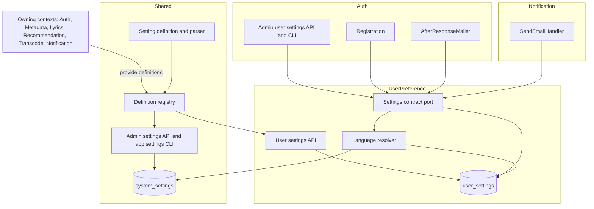
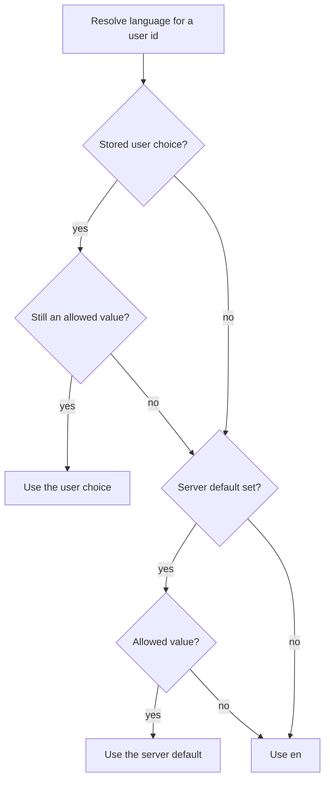
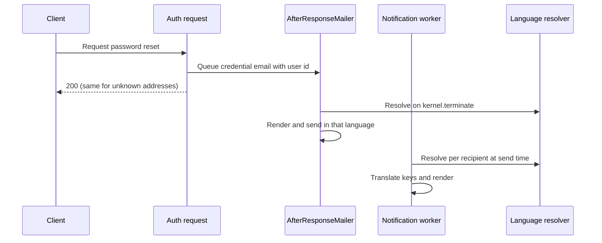
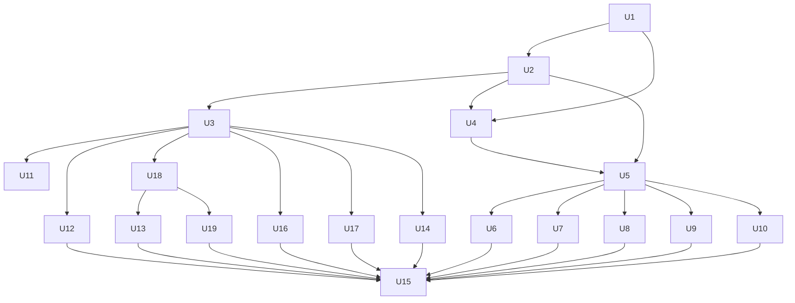

# General Settings and Email Language - Plan

## Goal Capsule

- **Objective:** Every email a user receives is in the language they chose, or in the server's default language when they have not chosen. The settings admins change on the admin settings page are validated and actually take effect.
- **Means:** One definition-driven settings mechanism serving server-wide and per-user settings (KTD1, KTD2), with the user's language as its first per-user setting (KTD4).
- **Authority:** Product Contract requirements win on behavior. Key Technical Decisions win on mechanism within those requirements. Units override neither.
- **Stop conditions:** Stop and ask if a session-settled decision proves infeasible, or if wiring an existing admin toggle would change behavior that users rely on today in a way KTD9 does not cover.
- **Execution profile:** Runs after the current release-gate plan (`docs/plans/2026-10-06-1612-refactor-backend-release-gates-plan.md`) It builds on commit `3a2e4356` (email verification delivery), which introduced `AfterResponseMailer`, `CredentialEmail`, `AuthEmailLocale` and `UserLookup`.
- **Who ships:** the executing agent through `ce-work`. Nothing is pushed without the user's request.

---

## Product Contract

### Summary

Add one settings mechanism with backend definitions, validation, an API, the existing web pages and CLI commands, used for both server-wide and per-user settings. Make the user's email language its first per-user setting, with a server-wide default an admin sets. Render every email in that language. Give the nine existing admin-page toggles backend definitions and make the backend honour each one, building the four features five of them describe but Baander does not have yet.

### Problem Frame

Settings in Baander are scattered and partly fictional. Each per-user preference type (layout, player, audio, EQ, accent colour, theme mood, sidebar) has its own model, endpoint and table, so adding one more costs about nine backend files. Server-wide settings are worse: the admin settings page offers nine toggles whose definitions exist only in `ui/web/src/features/admin/pages/AdminSettingsPage.tsx`, and nothing in the backend reads any of them. `PATCH /api/admin/settings` accepts any key and any value, and no CLI command can read or change them.

Users also cannot choose a language. The backend has English, Danish and Thai translations for authentication and notification text, but nothing sets a request or user locale. Password reset email renders in the request locale, which is always English, and notification email is translated once in the worker's English locale before the recipient is known.

### Requirements

**Settings mechanism**

- R1. Every setting, server-wide or per-user, has one backend definition: key, value type, allowed values or bounds, default, scope, who may edit it, and whether regular users may read its value.
- R2. The API and the CLI accept the same inputs and apply the same parsing and validation. A request with any invalid value is rejected with a per-key error, and nothing is written.
- R3. Admins can read server-wide settings, and super admins can change or reset them, through the admin settings page and `app:settings:*` commands. The page renders from the backend definitions.
- R4. A signed-in user can read and change their own settings through `/settings` and the API. A read returns the stored choice, the effective value, and whether that value comes from the user's choice or from a default.
- R5. Resetting a setting removes the explicit choice, so the setting follows its default again. Defaults are never stored as explicit choices.

**Language**

- R6. A user can choose English, Danish, Thai, or "server default" as their email language.
- R7. The effective language is the user's choice, then the server default set by an admin, then English. A stored value that is no longer allowed is skipped.
- R8. Registration stores the browser's language only when the browser asks for a supported language that differs from the current server default.
- R9. A super admin can change or reset a user's language from the admin panel and with a CLI command. Admins can view it. Each admin change is logged with the acting user, the target user, and the old and new values.
- R10. Password reset, email verification and notification emails render their subject, body and template text in the recipient's effective language, resolved when the email is sent.
- R11. A language can be offered only when the authentication and notification translations for it are complete, and continuous integration fails otherwise.

**Existing admin toggles**

- R12. The nine existing admin toggles get backend definitions. Until a toggle is honoured by the backend, the admin page marks it "not yet enforced".
- R13. The backend honours each toggle: `admin.can_view_users`, `admin.can_create_users`, `metadata.auto_sync`, `lyrics.auto_fetch`, `recommendations.auto_generate`, `transcode.enabled`, `transcode.max_bitrate`, `notifications.push_enabled` and `notifications.admin_alerts`.

**Features the toggles describe**

- R14. A completed library scan starts a metadata sync for that library, newly ingested tracks get a lyrics fetch, and recommendations regenerate on a schedule. Manual admin and CLI triggers keep working whatever the toggles say.
- R15. An audio track can be streamed transcoded to a requested format and bitrate, never above the server's maximum bitrate, and the web player requests that when the browser cannot play the original format.

### Key Decisions

- **Emails use the user's language setting.** Governs R6, R7, R10. (session-settled: user-directed — chosen over the request's locale, which made every reset email English: users must get email in their own language.)
- **Two fallback levels: user choice, then an admin-set server default, then English.** Governs R7. (session-settled: user-approved — chosen over a single per-user setting with a hard-coded English default: lets an operator serve a Danish or Thai household without touching each account.)
- **Existing preference types stay where they are; this plan documents their migration path only.** Governs R1. (session-settled: user-approved — chosen over converting them now: converting would roughly triple the work and touch every player and layout screen.)
- **Registration seeds the language only when it differs from the server default.** Governs R8. (session-settled: user-directed — chosen over storing any supported browser match: most browsers send an English header, and storing it would pin those users to English after an admin changes the default.)
- **Only super admins change another user's language, with a log line as the audit trail.** Governs R9. (session-settled: user-directed — chosen over letting any admin edit it, and over a stored audit mechanism: matches every other admin user change, and no audit store exists yet.)
- **Notification email resolves the language at send time.** Governs R10. (session-settled: user-approved — chosen over resolving when the notification is created: a change takes effect on the next email.)
- **Build the features the toggles describe.** Governs R13, R14, R15. (session-settled: user-directed — chosen over deferring them and leaving five toggles marked not yet enforced: every toggle does what it says when this plan ships.)
- **Define every existing admin toggle now and wire each one.** Governs R12, R13. (session-settled: user-directed — chosen over hiding the toggles until wired, and over defining only the language setting: nothing is removed, and the page stops promising behavior it does not deliver.)

### Acceptance Examples

- AE1. **Covers R7, R10.** Given the server default is `da` and Alice has no language choice, when Alice requests a password reset, then the email's subject and body are Danish.
- AE2. **Covers R7.** Given Alice's stored choice is `th` and `th` is later removed from the allowed values, when an email is sent to Alice, then it uses the server default.
- AE3. **Covers R8.** Given the server default is `en`, when a browser sends `Accept-Language: da-DK,da;q=0.9,en;q=0.5` at registration, then the user's language is stored as `da`.
- AE4. **Covers R8.** Given the server default is `en`, when a browser sends `Accept-Language: en-US,en;q=0.9`, then no language is stored and the user follows the server default.
- AE5. **Covers R8.** Given the server default is `en`, when a browser sends `Accept-Language: de-DE,en;q=0.5`, then nothing is stored, because the best supported match equals the server default.
- AE6. **Covers R7, R10.** Given Bob has no choice and a notification for Bob is queued while the server default is `en`, when an admin changes the default to `da` before the worker sends it, then the email is Danish.
- AE7. **Covers R2.** Given a super admin sends `{"settings": {"i18n.default_language": "da", "transcode.max_bitrate": 999}}`, then the response is 422 naming `transcode.max_bitrate`, and `i18n.default_language` is unchanged.

### Success Criteria

- A Danish user receives password reset, email verification and notification emails with no English text left in the subject, body or footer.
- After an admin changes the server default, the next email to a user without a choice uses the new language, including email sent by a background worker that was already running.
- Every toggle on the admin settings page changes the backend's behavior when it is switched.

### Scope Boundaries

- The web interface stays English. Translating it is a separate effort, so the control is labelled "Email language".
- In-app notification text, push notification text and webhook payloads stay English, because the interface they appear in is English.
- The existing per-type preferences keep their own models, tables and endpoints.
- React Native and Android are not touched.
- Creating a user with a language (admin create, `app:user:create`) is not added. Operator-created users follow the server default until a language is set for them.

**Considered and not built**

- Version numbers and history for scalar settings. Settings are last-write-wins. A user and an admin editing one setting at the same instant is unlikely and harmless. Reconsider if a setting gains concurrent editors with conflicting intent.
- A stored audit trail for admin setting changes. A structured log line satisfies R9. Reconsider when a general audit mechanism exists.
- Showing each user's language in the admin user list. The admin user dialog shows it, so the list needs no per-row lookup. Reconsider if admins need to filter by language.

#### Deferred to Follow-Up Work

- Moving theme mood and accent colour onto the user settings store, then the versioned layout, player and audio payloads. U15 documents the path.
- The project-wide timestamp convention plan and the admin/CLI parity plan, both already queued, own the broader timestamp and parity issues found here.

---

## Planning Contract

### Key Technical Decisions

- KTD1. **One setting definition shape for both scopes, contributed by the owning context.** A definition is a Shared Domain value object: key, value type (boolean, integer, enum or string), allowed values or bounds, default, scope (system or user), the role allowed to edit it, a user-visible flag, an enforced flag, and the presentation fields the admin page needs (label, description, group label, and a label per allowed value). A user-scope definition may instead name a system-scope fallback key; it then has no default of its own, and its default is that system setting's current value. Each context registers its definitions through a tagged provider service declared in Shared Application. One parser turns CLI strings and JSON values into typed values, so the API and the CLI cannot drift (R2).
- KTD2. **Per-user settings live in one UserPreference key-value table.** `user_settings` has `user_id` (FK to `users`, ON DELETE CASCADE), `key`, `value jsonb` and `updated_at timestamptz`, with primary key `(user_id, key)`. A row exists only for an explicit choice, and resetting deletes the row (R5). There is no version or history (see Scope Boundaries).
- KTD3. **Values used to send email are read fresh and passed explicitly.** System and user setting reads that decide an email's language use DBAL queries, never the ORM identity map, so a long-lived worker sees an admin's change. Senders pass the locale to the translator and templates explicitly and never call `setLocale()` on the shared translator.
- KTD4. **Other contexts reach user settings through a narrow `UserPreference Settings Contract` layer.** The layer holds one port and its DTOs. It resolves a user's effective language, seeds a language at registration, and reads, sets and resets a user's settings for the admin path. Its regex and `must_not` exclusion follow `Library Provisioning Contract` in `deptrac.yaml`. Dispatching UserPreference commands from Auth would copy the baselined `SeedDefaultPreferencesCommand` pattern, and a Shared port would move a UserPreference concept into the kernel.
- KTD5. **Credential emails resolve the language after the response.** `AfterResponseMailer::sendNow()` resolves the language from the user id in `CredentialEmail`, during `kernel.terminate`. A lookup inside `deliver()` would run only for existing accounts and reopen the password-reset timing difference that `AfterResponseMailer` exists to remove. `AuthEmailLocale` is removed.
- KTD6. **Notification email carries translation keys, not translated text.** `SendEmailCommand` carries the title and body keys and their parameters. `SendEmailHandler` resolves the recipient's language and translates. The payload codec changes with it. Messages queued in the old shape are rejected, as the pre-release policy allows. Carrying keys also keeps working when a user deletes the notification before the worker sends it.
- KTD7. **A system-settings write validates every key first, then writes in one transaction.** Any invalid key rejects the whole request with 422 and per-key violations, through the existing validation error shape (AE7). Unknown keys are invalid. Reset uses a DELETE endpoint and an `app:settings:reset` command.
- KTD8. **Admin user-setting endpoints and the user-setting CLI live in Auth.** They sit under `/api/admin/users/{id}/settings/{key}` beside the other admin user actions and call the contract port from KTD4. The CLI resolves an email or UUID with Auth's existing user lookup, then calls the same application path the endpoint uses. Reads need `ROLE_ADMIN` and writes `ROLE_SUPER_ADMIN`. Each write logs the actor id, target id, key, and old and new values (R9).
- KTD9. **Each toggle's backend default equals today's behavior.** The guessed defaults in `AdminSettingsPage.tsx` are discarded. Admins can list users today and cannot create them, so `admin.can_view_users` defaults to true and `admin.can_create_users` to false. Each wiring unit verifies the current behavior before fixing its default.
- KTD10. **Registration picks the highest-ranked supported language.** It ignores `*` and any entry with `q=0`, maps a regional tag such as `da-DK` to `da`, and stores the result only when it differs from the server default (R8). `Request::getPreferredLanguage()` is not used, because it returns the first supported language when nothing matches.
- KTD11. **Reads show invalid stored values differently by audience.** A user-facing read presents a stored value that is no longer allowed as unset. The admin and CLI reads show the raw value marked invalid, so an operator can see why a user gets the default.
- KTD13. **Each automatic trigger lives in the context that owns the work and reads its toggle when it fires.** Metadata reacts to `LibraryScanCompleted` through a narrow event contract layer (the `Auth Device Approval Event Contract` pattern from commit `1485ec8c`). Catalog asks Lyrics to fetch through a narrow Lyrics contract port after ingest. Recommendation registers a recurring job through the `Scheduler Schedulable Contract`. No context imports another's domain internals, and Deptrac stays at zero violations without baseline growth.
- KTD14. **Audio transcoding produces a cached rendition per track, format and bitrate.** The first request streams the rendition progressively while it is written, without byte ranges; once it is complete, later requests get full Range support, so seeking works. One encode runs per rendition at a time, and renditions share the existing transcode cache sweep. The supported formats are those the stream endpoint already documents. `transcode.max_bitrate` caps the requested bitrate, and `transcode.enabled` off means originals only.
- KTD12. **The web control is labelled "Email language" and lists languages by their native names.** The first option reads "Server default (Dansk)" and names the current default. Each user-setting read also returns the value the setting would have after a reset, so the label can name the server default even when the user has made a choice. That is how user-visible system settings reach signed-in users; they never call the admin endpoint.

### High-Level Technical Design

Definitions are contributed by each owning context and served through one registry. Two stores hold values, and one contract carries user settings across context boundaries.

Language resolution, shared by every email path (R7, KTD3):

When each email resolves its language (KTD5, KTD6):

### Implementation Constraints

- Deptrac must stay at zero violations with no baseline growth. New UserPreference controllers use `AuthenticatedUserIdentityInterface` through `Auth Identity Contract`, not the baselined `SecurityUser` import.
- New tables and the touched `system_settings` table follow the PostgreSQL rules in `.agents/skills/postgres-remediation/` and the names in `docs-book/part-2-developer-guide/database-naming.md`. That includes converting `system_settings.updated_at` to `timestamptz`.
- New migrations use the next timestamped version after the latest on the branch.
- Every new admin action has a CLI command that dispatches the same application path.
- Tests use `baander.app` addresses.

### Sequencing

U1 comes first. U2, then U4 and U5, build the two stores and the language setting. U6 to U10 can then proceed in parallel. The toggle wirings U11, U12, U14, U16 and U17 need only U2 and U3. Audio transcoding is built in U18, then gated in U13 and used by the web player in U19. U15 closes the documentation.

---

## Implementation Units

| U-ID | Title | Key files | Depends on |
|---|---|---|---|
| U1 | Setting definitions, registry and parser | `src/Shared/Domain/Model/Setting/`, `src/Shared/Application/Port/SettingDefinitionProviderInterface.php` | none |
| U2 | Validated system settings with CLI | `src/Shared/Interface/Controller/SystemSettingsController.php`, `src/Shared/Interface/Console/` | U1 |
| U3 | Admin settings page from backend definitions | `ui/web/src/features/admin/pages/AdminSettingsPage.tsx` | U2 |
| U4 | Per-user settings store and API | `src/UserPreference/`, `migrations/` | U1, U2 |
| U5 | Language setting, resolver and contract | `src/UserPreference/Application/Port/`, `deptrac.yaml` | U2, U4 |
| U6 | Email language on the settings page | `ui/web/src/features/settings/` | U5 |
| U7 | Admin and CLI language management | `src/Auth/Interface/Controller/`, `src/Auth/Interface/Console/` | U5 |
| U8 | Registration language seeding | `src/Auth/Interface/Controller/User/AuthController.php` | U5 |
| U9 | Credential emails in the user's language | `src/Auth/Infrastructure/Mail/` | U5 |
| U10 | Notification emails in the user's language | `src/Notification/` | U5 |
| U11 | Wire the user management toggles | `src/Auth/Interface/Controller/AdminUserController.php` | U3 |
| U12 | Start metadata sync after a scan | `src/Metadata/`, `src/Library/Domain/Event/LibraryScanCompleted.php`, `deptrac.yaml` | U3 |
| U13 | Gate audio transcoding with its toggles | `src/Media/Interface/Controller/StreamController.php` | U3, U18 |
| U14 | Wire the notification toggles | `src/Notification/`, `src/Shared/Infrastructure/Health/HealthAlertService.php` | U3 |
| U15 | Documentation and migration path | `docs-book/`, `src/UserPreference/README.md` | U6–U14, U16–U19 |
| U16 | Fetch lyrics for newly ingested tracks | `src/Catalog/Application/CommandHandler/FilesDiscoveredHandler.php`, `src/Lyrics/Application/Port/` | U3 |
| U17 | Generate recommendations on a schedule | `src/Recommendation/`, `deptrac.yaml` | U3 |
| U18 | On-the-fly audio transcoding | `src/Media/`, `src/Transcode/Infrastructure/FFmpeg/` | U3 |
| U19 | Web player requests transcoding when needed | `ui/web/src/features/player/` | U18 |

### U1. Setting definitions, registry and parser

- **Goal:** One definition shape and one value parser serve both scopes, with definitions supplied by the contexts that own them.
- **Requirements:** R1, R2
- **Dependencies:** none
- **Files:**
  - create `src/Shared/Domain/Model/Setting/SettingDefinition.php`, `SettingScope.php`, `SettingValueType.php`
  - create `src/Shared/Application/Port/SettingDefinitionProviderInterface.php`
  - create `src/Shared/Application/Service/SettingDefinitionRegistry.php`, `SettingValueParser.php`
  - modify `config/services.yaml` (tagged iterator)
  - create `tests/Unit/Shared/Domain/Model/Setting/SettingDefinitionTest.php`, `tests/Unit/Shared/Application/Service/SettingValueParserTest.php`, `tests/Unit/Shared/Application/Service/SettingDefinitionRegistryTest.php`
- **Approach:**
  1. Model the definition as an immutable value object (KTD1) that validates itself at construction. The default must be an allowed value, unless a user-scope definition names a system-scope fallback key instead of a default. A user-visible flag is meaningful only for system scope.
  2. The registry collects providers through a tagged iterator and fails at container build or first use when two providers declare the same key.
  3. The parser accepts a CLI string or a JSON value, returns a typed value or a violation, and is the only parsing path.
- **Patterns to follow:** the tagged-iterator wiring of `ReplayListenerProviderInterface` (`src/Shared/Infrastructure/Event/`); the state-object rule in `.agents/rules/ddd-domain-models.md` does not apply because definitions are values.
- **Test scenarios:**
  - A boolean definition parses `"true"`, `"false"`, `true` and `false`, and rejects `"yes"` and `1`.
  - An enum definition accepts an allowed value and rejects `"xx"` with a violation naming the key.
  - An integer definition with bounds rejects a value outside them and a non-numeric string.
  - Constructing a definition whose default is not an allowed value throws.
  - A user-scope definition with a fallback key and no default is accepted, and one naming a fallback key that is not a system-scope definition fails at registry build.
  - Two providers declaring the same key make the registry fail with a message naming the key.
  - Looking up an unknown key returns nothing rather than a default definition.
- **Verification:** both scopes can be described by the definition, and the parser is the only code that turns input into setting values.

### U2. Validated system settings with CLI

- **Goal:** Server-wide settings accept only defined keys and valid values, and super admins can manage them from the admin API and the CLI alike.
- **Requirements:** R2, R3, R5, R12
- **Dependencies:** U1
- **Files:**
  - modify `src/Shared/Application/Port/SystemSettingsPortInterface.php`, `src/Shared/Infrastructure/Doctrine/Repository/SystemSettingRepository.php`, `src/Shared/Interface/Controller/SystemSettingsController.php`
  - create `src/Shared/Application/Command/UpdateSystemSettingsCommand.php`, `ResetSystemSettingCommand.php` and their handlers
  - create `src/Shared/Interface/Console/` commands `app:settings:list`, `app:settings:get`, `app:settings:set`, `app:settings:reset`
  - create a definitions provider for each toggle's owning context, plus `i18n.default_language` in Shared (definitions only; enforcement comes in U11–U14 and U5)
  - create a migration converting `system_settings.updated_at` to `timestamptz`
  - modify `openapi.json`, `ui/web/src/shared/api-client/gen/endpoints/index.ts`
  - modify `tests/Functional/Controller/SystemSettingsControllerTest.php`; create `tests/Unit/Shared/Interface/Console/SystemSettingsCommandsTest.php`, `tests/Integration/SystemSettingRepositoryTest.php`
- **Approach:**
  1. The read side returns typed values: the stored value when valid, otherwise the definition default (KTD11 for the admin view). It reads through DBAL (KTD3).
  2. `PATCH /api/admin/settings` follows KTD7 and returns the updated values. A new `DELETE /api/admin/settings/{key}` resets one key. A new `GET /api/admin/settings/definitions` serves definitions to the admin page. Malformed JSON returns 400 instead of 500.
  3. Each CLI command dispatches the same command as its endpoint and prints violations.
  4. Define all nine existing toggles with defaults per KTD9 and `enforced: false`. `transcode.max_bitrate` is an enum of 128, 192, 256 and 320, as the page offers today. Each wiring unit flips its toggles to enforced.
  5. Keep the existing role split: reads need `ROLE_ADMIN`, writes need the `SYSTEM_SETTINGS` attribute. Use the attribute string rather than importing `AdminVoter`.
- **Patterns to follow:** `src/Auth/Interface/Console/ResetUserPasswordCommand.php` with `AdminUserController::resetPassword()` for parity; `QueryParameters` and the validation error subscriber for 422 shape.
- **Test scenarios:**
  - Covers AE7. A PATCH with one valid and one invalid key returns 422 naming only the invalid key, and neither value changes.
  - A PATCH with an unknown key returns 422 naming it.
  - Malformed JSON in the PATCH body returns 400.
  - A regular user gets 403 on GET and PATCH; an admin can GET but gets 403 on PATCH and DELETE; a super admin can do all three.
  - DELETE resets a key so GET returns its default, and deleting an unset key succeeds.
  - `app:settings:set transcode.max_bitrate 192` stores 192, `app:settings:set transcode.max_bitrate abc` exits non-zero with the violation, and `app:settings:list` shows each key, value, default and enforced flag.
  - A value stored directly in the table that is no longer allowed is reported as invalid by `app:settings:get` and read as the default by the port.
  - The migration round trip keeps stored values and converts `updated_at`.
- **Verification:** no write path accepts an undefined key or an invalid value, and every admin settings action has a CLI command.

### U3. Admin settings page from backend definitions

- **Goal:** The admin settings page shows exactly the backend's settings and says which ones are not yet enforced.
- **Requirements:** R3, R12
- **Dependencies:** U2
- **Files:**
  - modify `ui/web/src/features/admin/pages/AdminSettingsPage.tsx`, `ui/web/src/features/admin/hooks/use-system-settings.ts`
  - remove `ui/web/src/features/admin/api/system-settings-api.ts` in favour of the generated client
  - modify `ui/web/src/features/admin/pages/__tests__/` (add `AdminSettingsPage.test.tsx` if absent)
- **Approach:**
  1. Fetch definitions and values with the generated client and TanStack Query; drop `SETTING_GROUPS`.
  2. Group settings by a group label carried on the definition.
  3. Show a "Not yet enforced" badge for definitions with `enforced: false`.
  4. Render boolean, enum and integer controls from the definition type, with the definition's label, description and option labels.
  5. Each control saves when changed, and each setting has a reset action that calls the DELETE endpoint (R5).
  6. Show per-key 422 violations next to the field, keep the rejected value visible, and surface save failures; no swallowed errors.
- **Patterns to follow:** `.agents/rules/frontend.md`; `ui/DESIGN.md`; the existing tab handling with `useTabParam`.
- **Test scenarios:**
  - The page renders one control per served definition, with labels from the definitions.
  - A definition with `enforced: false` shows the badge, and one with `enforced: true` does not.
  - Saving an enum value calls the PATCH with that key and updates the shown value on success.
  - A 422 response shows the violation next to the right field and keeps the user's edit.
  - Resetting a setting calls DELETE and shows the default afterwards.
  - A non-super admin sees read-only controls.
- **Verification:** the page has no setting definitions of its own, and every control maps to a backend definition.

### U4. Per-user settings store and API

- **Goal:** A user can read, change and reset their own settings through one API, and reads report the effective value and its source.
- **Requirements:** R1, R2, R4, R5
- **Dependencies:** U1, U2
- **Files:**
  - create a migration for `user_settings` per KTD2, with `fk_user_settings_user_id`
  - create `src/UserPreference/Infrastructure/Doctrine/Entity/UserSettingEntity.php`, `src/UserPreference/Infrastructure/Doctrine/UserSettingRepository.php`
  - create `src/UserPreference/Application/Command/SetUserSettingCommand.php`, `ResetUserSettingCommand.php` and their handlers
  - create `src/UserPreference/Application/Service/UserSettingsReader.php`
  - create `src/UserPreference/Interface/Controller/UserSettingsController.php`, `src/UserPreference/Interface/Request/SetUserSettingRequest.php`, `src/UserPreference/Interface/Resource/UserSettingResource.php`
  - modify `src/UserPreference/Infrastructure/Doctrine/UserPreferenceForeignKeys.php`, `deptrac.yaml` (add `Auth Identity Contract` to the `UserPreference Interface` ruleset), `config/services.yaml`
  - modify `openapi.json`, `ui/web/src/shared/api-client/gen/endpoints/index.ts`
  - create `tests/Functional/Controller/UserSettingsControllerTest.php`, `tests/Integration/UserSettingRepositoryTest.php`, `tests/Unit/UserPreference/Application/UserSettingsReaderTest.php`
- **Approach:**
  1. Routes: `GET /api/user/settings`, `PUT /api/user/settings/{key}`, `DELETE /api/user/settings/{key}`.
  2. A read returns, per user-scope definition, the stored value (KTD11), the effective value, the value after a reset (KTD12), and the source (`user`, `server_default` or `default`). A definition with a fallback key (KTD1) reads that system setting for the last two.
  3. A write rejects keys that are not user-scope or not user-editable with 403, and invalid values with 422.
  4. The store reads and writes with DBAL (KTD3) and upserts on `(user_id, key)`.
  5. Writes are last-write-wins (KTD2).
- **Patterns to follow:** `src/UserPreference/Interface/Controller/ThemeMoodController.php` for routing and request DTOs, but with `AuthenticatedUserIdentityInterface` instead of `SecurityUser`; `UserPreferenceForeignKeys` for the FK declaration.
- **Test scenarios:**
  - An anonymous request gets 401.
  - A user with no stored settings gets every user-scope setting with source `default` or `server_default`; the tests register a test-only user-scope definition with a fallback key, because the language setting arrives in U5.
  - With a stored choice, the read still reports the value after a reset, taken from the fallback system setting.
  - PUT stores a value, and a following GET reports it with source `user`.
  - DELETE removes the choice, and GET reports the default source again.
  - PUT of an invalid value returns 422 and stores nothing.
  - PUT of a system-scope key returns 403.
  - One user cannot read or write another user's settings through these routes.
  - Deleting a user removes their setting rows.
- **Verification:** the store holds only explicit choices, and the API reports effective values without exposing the admin settings endpoint.

### U5. Language setting, resolver and contract

- **Goal:** The language exists as a user setting with a server default, and one resolver gives every caller the effective language.
- **Requirements:** R6, R7, R11
- **Dependencies:** U2, U4
- **Files:**
  - create `src/UserPreference/Application/Port/UserSettingsContractInterface.php` and its DTOs
  - create `src/UserPreference/Infrastructure/UserSettingsContract.php`, `src/UserPreference/Infrastructure/Settings/LanguageSettingDefinitions.php`
  - modify the Shared definitions provider from U2 so `i18n.default_language` is user-visible
  - modify `deptrac.yaml` (new `UserPreference Settings Contract` layer per KTD4; add it to the Auth Application, Auth Infrastructure, Auth Interface, Notification Application and UserPreference Infrastructure rulesets)
  - modify `config/packages/translation.yaml` (enabled locales `en`, `da`, `th`)
  - create `tests/Unit/UserPreference/Infrastructure/UserSettingsContractTest.php`, `tests/Integration/UserLanguageResolutionTest.php`, `tests/Unit/Shared/Translation/EmailTranslationParityTest.php`
- **Approach:**
  1. The user setting `language` allows `en`, `da` and `th` and has no stored default. The system setting `i18n.default_language` allows the same values and defaults to `en`.
  2. The contract resolves the language as in the High-Level Technical Design flowchart, reading both stores fresh (KTD3). It also exposes seeding, and admin get, set and reset by user id.
  3. The allowed languages come from one list shared by both definitions and the parity test.
  4. The parity test asserts that every allowed language has the same keys as English in the `auth` and `notification` translation domains (R11).
- **Patterns to follow:** the `Library Provisioning Contract` layer in `deptrac.yaml`.
- **Test scenarios:**
  - Covers AE1. With no user choice and a server default of `da`, the resolver returns `da`.
  - A user choice of `th` wins over a server default of `da`.
  - Covers AE2. A stored user value outside the allowed list is skipped in favour of the server default.
  - A stored server default outside the allowed list resolves to `en`.
  - Covers AE6. A server default changed after the first resolution is seen by the next resolution in the same process.
  - The parity test fails when a key is removed from the Danish notification file.
  - Deptrac reports no violation for Auth and Notification calling the contract.
- **Verification:** one function decides every email's language, and adding a language without complete translations fails continuous integration.

### U6. Email language on the settings page

- **Goal:** A user can see and change their email language on `/settings`.
- **Requirements:** R4, R6
- **Dependencies:** U5
- **Files:**
  - create `ui/web/src/features/settings/components/EmailLanguageSetting.tsx`, `ui/web/src/features/settings/hooks/use-user-settings.ts`
  - modify `ui/web/src/features/settings/pages/SettingsPage.tsx` (Account section)
  - create `ui/web/src/features/settings/components/__tests__/EmailLanguageSetting.test.tsx`
- **Approach:**
  1. Read and write through the generated client with TanStack Query, invalidating on success.
  2. Present options per KTD12, with "Server default (…)" mapping to a DELETE.
  3. Show a short help line saying the setting controls emails.
  4. Show save errors; no swallowed promise rejections.
- **Patterns to follow:** the `Select` primitive used in the settings page's audio section; `.agents/rules/frontend.md`.
- **Test scenarios:**
  - With no stored choice and a server default of `da`, the control shows "Server default (Dansk)" as selected.
  - Choosing "ไทย" sends PUT with `th` and shows it as selected after success.
  - Choosing "Server default" sends DELETE.
  - A failed save shows an error and restores the previous selection.
- **Verification:** the setting round-trips through the API from the page.

### U7. Admin and CLI language management

- **Goal:** A super admin can view, change and reset a user's settings, including the language, from the admin panel and the CLI.
- **Requirements:** R9
- **Dependencies:** U5
- **Files:**
  - create `src/Auth/Interface/Controller/AdminUserSettingsController.php`, `src/Auth/Interface/Request/SetAdminUserSettingRequest.php`
  - create `src/Auth/Interface/Console/UserSettingCommand.php` (`app:user:setting get|set|reset <identifier> <key> [value]`)
  - create `src/Auth/Application/Service/AdminUserSettings.php` (shared by endpoint and CLI; logs per KTD8)
  - modify `ui/web/src/features/admin/components/users/EditUserDialog.tsx`, `ui/web/src/features/admin/api/user-admin-api.ts`
  - modify `openapi.json`, `ui/web/src/shared/api-client/gen/endpoints/index.ts`
  - create `tests/Functional/Controller/AdminUserSettingsControllerTest.php`, `tests/Unit/Auth/Interface/Console/UserSettingCommandTest.php`
- **Approach:**
  1. Routes per KTD8: `GET /api/admin/users/{id}/settings`, `PUT` and `DELETE` on `/api/admin/users/{id}/settings/{key}`.
  2. The endpoint and the CLI call the same application service, which calls the contract.
  3. The read shows raw invalid values per KTD11.
  4. The dialog edits the language only. Other user settings stay CLI-visible until a later need.
  5. For a non-super admin the language field is read-only. A stored value that is no longer allowed shows as invalid with the language the user actually gets, and save errors show next to the field.
- **Patterns to follow:** `ResetUserPasswordCommand` and `AdminUserController::resetPassword()`; `UserLookup` (from commit `3a2e4356`) for email-or-UUID resolution.
- **Test scenarios:**
  - An admin can GET a user's settings but gets 403 on PUT and DELETE.
  - A super admin's PUT stores the language, and the user's own GET then reports source `user`.
  - A PUT with an invalid language returns 422.
  - A PUT for an unknown user returns 404.
  - Each successful write emits one log record with the actor id, target id, key, and old and new values.
  - `app:user:setting set alice@baander.app language da` stores `da`; with an unknown identifier it exits non-zero; `get` shows a stored invalid value marked invalid.
- **Verification:** every admin language action has a CLI command that goes through the same service.

### U8. Registration language seeding

- **Goal:** New users whose browser asks for a supported language other than the server default start with that language.
- **Requirements:** R8
- **Dependencies:** U5
- **Files:**
  - modify `src/Auth/Interface/Controller/User/AuthController.php`, `src/Auth/Application/Command/User/RegisterUserCommand.php`, `src/Auth/Application/CommandHandler/User/RegisterUserHandler.php`
  - create `src/Auth/Interface/Request/AcceptLanguageMatcher.php`
  - modify `config/packages/nelmio_api_doc.yaml` (correct the `Accept-Language` parameter's values and description)
  - create `tests/Unit/Auth/Interface/Request/AcceptLanguageMatcherTest.php`; modify `tests/Unit/Auth/Application/CommandHandler/User/RegisterUserHandlerTest.php`; create `tests/Functional/Auth/RegistrationLanguageTest.php`
- **Approach:**
  1. The controller matches the header per KTD10 and passes the match, or nothing, on the command.
  2. The handler seeds through the contract inside its existing transaction, and only when the match differs from the server default.
  3. Seeding commits before the verification email, which is delivered after commit.
- **Test scenarios:**
  - Covers AE3. `da-DK,da;q=0.9,en;q=0.5` with server default `en` stores `da`.
  - Covers AE4. `en-US,en;q=0.9` with server default `en` stores nothing.
  - Covers AE5. `de-DE,en;q=0.5` with server default `en` stores nothing.
  - `th;q=0,da;q=0.4` stores `da`, because `q=0` excludes Thai.
  - `*` alone, an empty header and no header store nothing.
  - With server default `da`, `da-DK` stores nothing and `en-GB` stores `en`.
  - A registration that fails after seeding rolls the seeded row back.
- **Verification:** the stored language at registration always differs from the server default or is absent.

### U9. Credential emails in the user's language

- **Goal:** Password reset and email verification emails render in the recipient's effective language without making real accounts answer slower than unknown addresses.
- **Requirements:** R10
- **Dependencies:** U5
- **Files:**
  - modify `src/Auth/Infrastructure/Mail/AfterResponseMailer.php`, `CredentialEmail.php`, `MailerPasswordResetDelivery.php`, `MailerEmailVerificationDelivery.php`
  - remove `src/Auth/Infrastructure/Mail/AuthEmailLocale.php`
  - modify `templates/email/auth/*.twig` (`html lang` set from the locale)
  - modify `tests/Unit/Auth/Infrastructure/Mail/`, `tests/Functional/Auth/PasswordResetDeliveryTest.php`, `tests/Functional/Auth/EmailVerificationDeliveryTest.php`
- **Approach:**
  1. `CredentialEmail` carries the user id instead of a locale.
  2. `sendNow()` resolves the language through the contract, then renders and sends (KTD5).
  3. Outside a request, as in the CLI, resolution happens at once.
  4. If resolution fails, send in English and log the failure without the address or token.
  5. Confirm under the Swoole runtime that a database read during `kernel.terminate` still works with `reset_handler: true`. The functional tests do not run under Swoole, and a failure there would silently send every credential email in English.
- **Execution note:** First add a test that fails while the language is still resolved inside `deliver()`, by asserting that no settings read happens before the response is returned.
- **Test scenarios:**
  - Covers AE1. A reset requested by a user with no choice under server default `da` produces a Danish subject and body.
  - A user with choice `th` gets a Thai verification email with `lang="th"` on the HTML root.
  - No settings lookup occurs until `kernel.terminate`; during the request the code path is the same for a known and an unknown address.
  - A failing resolver still sends an English email and logs without the token or the address.
- **Verification:** both credential emails follow the user's language, including under the Swoole runtime, and the request does no per-account work beyond what password reset and email verification delivery already do.

### U10. Notification emails in the user's language

- **Goal:** Notification emails render in each recipient's effective language, resolved when the worker sends them.
- **Requirements:** R10
- **Dependencies:** U5
- **Files:**
  - modify `src/Notification/Application/DTO/SendEmailCommand.php`, `src/Notification/Application/Handler/SendEmailHandler.php`, `src/Notification/Application/Handler/CreateNotificationHandler.php`, `src/Notification/Infrastructure/Messaging/NotificationMessagePayloadCodec.php`
  - modify `src/Notification/Domain/ValueObject/NotificationCategory.php` (`headerTitle()` becomes a translation key), `src/Notification/Application/Service/NotificationContentResolver.php` (fallback parameter values become translation keys)
  - modify `templates/email/notification/base.html.twig`, `translations/notification+intl-icu.{en,da,th}.yaml`
  - modify `tests/Unit/Notification/Application/Handler/SendEmailHandlerTest.php`, `CreateNotificationHandlerTest.php`, the codec tests; create `tests/Functional/Notification/NotificationEmailLanguageTest.php`
- **Approach:**
  1. Carry the keys and parameters per KTD6.
  2. `SendEmailHandler` resolves through the contract and translates the subject, the header title and the template text in that language.
  3. Fallback parameters such as an unknown user name are translated too, so no English fragment lands in a Danish email.
  4. In-app text stays English (Scope Boundaries).
- **Test scenarios:**
  - A notification email to a Danish user has a Danish subject, title, body, header and footer, with no English sentence left.
  - Covers AE6. A default changed between queueing and sending yields the new language.
  - A notification whose content uses a fallback parameter shows the translated fallback.
  - The codec round-trips the new command shape and rejects the old shape.
  - Two recipients with different languages from one notification each get their own language.
- **Verification:** the persisted in-app notification is unchanged, and each email recipient gets their own language.

### U11. Wire the user management toggles

- **Goal:** `admin.can_view_users` and `admin.can_create_users` decide what non-super admins may do in user management.
- **Requirements:** R13
- **Dependencies:** U3
- **Files:**
  - modify `src/Auth/Interface/Controller/AdminUserController.php`
  - create `src/Auth/Infrastructure/Security/Voter/UserManagementVoter.php`
  - modify the Auth definitions provider from U2 (enforced)
  - modify `ui/web/src/features/admin/pages/AdminUsersPage.tsx` (hide the actions the toggles deny)
  - create `tests/Functional/Controller/AdminUserManagementToggleTest.php`
- **Approach:**
  1. A voter reads both toggles fresh.
  2. Super admins are always allowed.
  3. Admins may list users when `admin.can_view_users` is on, and create users when `admin.can_create_users` is on.
  4. An admin let in by `admin.can_create_users` may create users with `ROLE_USER` only. A request from a non-super admin carrying any other role returns 403, so the toggle cannot create admins or super admins.
  5. Defaults per KTD9 keep today's behavior.
  6. The CLI is unaffected, because CLI access has full authority.
- **Test scenarios:**
  - With defaults, an admin can list users and cannot create them, matching today's behavior.
  - With `admin.can_view_users` off, an admin gets 403 on the list, and a super admin still succeeds.
  - With `admin.can_create_users` on, an admin can create a `ROLE_USER` account.
  - With `admin.can_create_users` on, an admin's request to create a `ROLE_ADMIN` or `ROLE_SUPER_ADMIN` account returns 403 and creates nothing; a super admin can still create both.
  - Changing a toggle takes effect on the next request without a restart.
- **Verification:** the two toggles change the admin role's access, and their definitions are marked enforced.

### U12. Start metadata sync after a scan

- **Goal:** A completed library scan starts a metadata sync for that library while `metadata.auto_sync` is on.
- **Requirements:** R13, R14
- **Dependencies:** U3
- **Files:**
  - create a Metadata listener for `LibraryScanCompleted` that calls `src/Metadata/Application/MetadataSyncOrchestrator.php`
  - modify `deptrac.yaml` (a narrow `Library Scan Completed Event Contract` layer per KTD13)
  - modify the Metadata definitions provider from U2 (enforced)
  - create `tests/Unit/Metadata/Application/ScanCompletedMetadataSyncTest.php`, `tests/Integration/ScanCompletedMetadataSyncTest.php`
- **Approach:**
  1. The listener runs when a scan completes, reads the toggle fresh, and starts `syncLibrary` for that library, dispatched asynchronously so the scan's completion is not delayed.
  2. A rescan of the same library while a sync for it is still queued must not queue a second one; reuse the orchestrator's existing deduplication if it has one, otherwise skip when a sync for the library is pending.
  3. The admin and CLI sync paths call the orchestrator directly and are not gated.
- **Execution note:** Confirm how `LibraryScanCompleted` is delivered (synchronously, or through outbox replay) before choosing where the listener runs.
- **Test scenarios:**
  - With the toggle on, a completed scan queues one metadata sync for that library.
  - With the toggle off, a completed scan queues nothing, and an admin-requested sync still runs.
  - Two scans completing back to back for one library queue one sync.
  - Deptrac reports no violation for Metadata reacting to the Library event.
- **Verification:** metadata sync follows scans automatically when enabled, and the toggle is marked enforced.

### U13. Gate audio transcoding with its toggles

- **Goal:** `transcode.enabled` decides whether audio may be transcoded on the fly, and `transcode.max_bitrate` caps the bitrate of transcoded audio.
- **Requirements:** R13
- **Dependencies:** U3, U18
- **Files:**
  - modify `src/Media/Interface/Controller/StreamController.php` and the transcoding service from U18
  - modify the Transcode definitions provider from U2 (enforced)
  - create `tests/Functional/Media/AudioTranscodeToggleTest.php`
- **Approach:**
  1. With transcoding off, a request without transcoding parameters streams the original, and a request that asks for a format or bitrate gets a documented error instead of a transcode.
  2. A requested bitrate above the cap is clamped to the cap, and a transcode requested without a bitrate uses the cap.
  3. The video transcode pipeline is outside these toggles, whose descriptions say "audio".
- **Test scenarios:**
  - With defaults, a request for the original behaves as today.
  - With `transcode.enabled` off, a request for a transcoded format returns the documented error and starts no encode.
  - With `transcode.max_bitrate` 192, a request for 320 kbps produces a 192 kbps rendition.
  - Video playback is unaffected by either toggle.
- **Verification:** both toggles change audio delivery and nothing else, and both are marked enforced.

### U14. Wire the notification toggles

- **Goal:** `notifications.push_enabled` controls browser push delivery, and `notifications.admin_alerts` controls admin alerts for critical events.
- **Requirements:** R13
- **Dependencies:** U3
- **Files:**
  - modify `src/Notification/Application/Handler/SendPushHandler.php`, `src/Shared/Infrastructure/Health/HealthAlertService.php`
  - modify the Notification and Shared definitions providers (enforced)
  - modify `tests/Unit/Notification/Application/Handler/SendPushHandlerTest.php`; create `tests/Unit/Shared/Infrastructure/Health/HealthAlertServiceTest.php` if absent
- **Approach:**
  1. With push off, `SendPushHandler` skips delivery and records the skip in the delivery outcome, so the notification itself still exists.
  2. With admin alerts off, `HealthAlertService` skips the critical health alerts and logs at info level. The shared `AdminAlertService` is not gated, so other alerts such as new-registration notices keep working. The toggle's description names exactly the alerts it suppresses.
  3. Defaults per KTD9.
- **Test scenarios:**
  - With defaults, push delivery and admin alerts behave as today.
  - With push off, a notification is created and no push is sent.
  - With admin alerts off, a health degradation produces no admin alert, and the degradation is still logged.
  - With admin alerts off, a new registration still produces its admin alert.
- **Verification:** both toggles take effect without a restart and are marked enforced.

### U15. Documentation and migration path

- **Goal:** Operators and developers can find, configure and extend the settings mechanism, and the path for moving existing preferences onto it is written down.
- **Requirements:** R1, R3, R9
- **Dependencies:** U6–U14, U16–U19
- **Files:**
  - modify `docs-book/part-1-operator-guide/configuration.md` (server settings, language)
  - modify `docs-book/part-1-operator-guide/user-management.md`, `docs-book/part-1-operator-guide/notifications.md`
  - create `docs-book/part-1-operator-guide/commands/app-settings.md`, `app-user-setting.md`; modify `docs-book/part-1-operator-guide/commands/README.md`
  - modify `docs-book/part-2-developer-guide/contexts/user-preference.md`, `contexts/shared.md`, `contexts/auth.md`, `contexts/notification.md`
  - modify `src/UserPreference/README.md`
- **Approach:**
  1. Document how a context adds a setting: a definition in its provider, the enforced flag, and the CLI and API that come with it.
  2. Write the migration path in the UserPreference context page. Theme mood and accent colour move first as scalar settings. The versioned payload types follow only if the store gains versioning. Sidebar and EQ profiles stay aggregates.
  3. Correct the stale facts in `contexts/user-preference.md` and the UserPreference README.
  4. Run the `prose-fix` skill on new and rewritten pages.
- **Test expectation:** none -- documentation only.
- **Verification:** every new endpoint and command is documented, and the documented migration path matches the code.

### U16. Fetch lyrics for newly ingested tracks

- **Goal:** Newly ingested tracks get a lyrics fetch while `lyrics.auto_fetch` is on.
- **Requirements:** R13, R14
- **Dependencies:** U3
- **Files:**
  - create a narrow Lyrics contract port (for example `src/Lyrics/Application/Port/LyricsFetchRequestInterface.php`) and its implementation dispatching the existing `FetchLyricsCommand`
  - modify `src/Catalog/Application/CommandHandler/FilesDiscoveredHandler.php` to request fetches for tracks it created
  - modify `deptrac.yaml` (contract layer per KTD13), the Lyrics definitions provider from U2 (enforced)
  - create `tests/Unit/Catalog/Application/CommandHandler/FilesDiscoveredLyricsRequestTest.php`, `tests/Unit/Lyrics/Application/LyricsFetchRequestTest.php`
- **Approach:**
  1. After ingest commits, request one asynchronous fetch per newly created track, skipping tracks that already have lyrics, for example from a sidecar `.lrc` file.
  2. The contract reads the toggle fresh and does nothing when it is off.
  3. The bulk fetch (`baander:lyrics:fetch`, the admin action and admin-created schedules) is unchanged and not gated, since an admin starts it explicitly.
- **Test scenarios:**
  - With the toggle on, ingesting two new tracks requests two fetches after the ingest commits.
  - A track ingested with a sidecar `.lrc` file requests no fetch.
  - With the toggle off, ingest requests nothing, and `baander:lyrics:fetch` still fetches.
  - A rescan that creates no new tracks requests nothing.
- **Verification:** lyrics arrive for new tracks without an admin action when enabled, and the toggle is marked enforced.

### U17. Generate recommendations on a schedule

- **Goal:** Recommendation snapshots regenerate on a recurring schedule while `recommendations.auto_generate` is on.
- **Requirements:** R13, R14
- **Dependencies:** U3
- **Files:**
  - make `src/Recommendation/Application/Command/GenerateRecommendationsCommand.php` schedulable through the `Scheduler Schedulable Contract`, and register a default recurring job
  - modify `deptrac.yaml` if Recommendation needs the contract in its rulesets; modify the Recommendation definitions provider from U2 (enforced)
  - create `tests/Unit/Recommendation/Application/ScheduledGenerationTest.php`, `tests/Integration/RecommendationScheduleTest.php`
- **Approach:**
  1. Follow an existing schedulable command (one already carrying the Scheduler contract) for registration and parameters.
  2. The scheduled run reads the toggle fresh and records a skip, with a log line, when it is off.
  3. The admin action and `app:recommendations:generate` are not gated.
  4. The default interval is daily; an admin can change it through the existing scheduler administration.
- **Execution note:** Confirm how the Scheduler seeds default jobs on a fresh install, so the job exists without an admin creating it.
- **Test scenarios:**
  - A fresh install has the recurring generation job.
  - With the toggle on, a scheduled occurrence generates snapshots.
  - With the toggle off, a scheduled occurrence records a skip and generates nothing, and the CLI command still generates.
- **Verification:** recommendations refresh without an admin action when enabled, and the toggle is marked enforced.

### U18. On-the-fly audio transcoding

- **Goal:** The track stream can serve an audio track transcoded to a requested format and bitrate, as KTD14 describes.
- **Requirements:** R15
- **Dependencies:** U3
- **Files:**
  - modify `src/Media/Interface/Controller/StreamController.php` (honour its documented `format` and `bitrate` parameters)
  - create an audio transcoding service in Media, or in Transcode behind an application port, reusing `src/Transcode/Infrastructure/FFmpeg/` process handling
  - extend the transcode cache sweep to audio renditions
  - modify `openapi.json` and the generated client if the parameters' contract changes
  - create `tests/Functional/Media/AudioTranscodeStreamTest.php`, `tests/Unit/Media/AudioRenditionCacheTest.php`
- **Approach:**
  1. Requests without parameters keep today's direct, Range-capable streaming of the original.
  2. A request for a format and bitrate uses the cached rendition when it is complete. Otherwise one encode starts, and the response streams it progressively with `Accept-Ranges: none`.
  3. A concurrent request for a rendition being encoded joins the running encode instead of starting another.
  4. Access checks are the same as for the original track.
  5. A failed encode returns an error, removes the partial rendition, and is logged with the track and format.
- **Execution note:** Prove progressive streaming and cache handoff under the Swoole runtime, not only in functional tests.
- **Test scenarios:**
  - A request for MP3 at 192 kbps returns audio of that format and bitrate.
  - A second request after the encode completes is served from the cache with Range support.
  - Two simultaneous first requests start one encode.
  - A user without access to the track gets the same response as for the original.
  - An encode failure returns an error and leaves no partial rendition.
- **Verification:** transcoded audio plays and seeks once cached, and originals stream exactly as before.

### U19. Web player requests transcoding when needed

- **Goal:** The web player plays tracks whose original format the browser cannot play, by requesting a transcoded stream.
- **Requirements:** R15
- **Dependencies:** U18
- **Files:**
  - modify the audio source construction in `ui/web/src/features/player/` (the code that builds `/api/stream/track?id=…`)
  - modify `ui/web/src/features/player/hooks/__tests__/use-audio-playback.test.ts`
- **Approach:**
  1. Before playing, check whether the browser can play the track's original MIME type.
  2. If it cannot, request a format the browser supports, without a bitrate, so the server applies its cap.
  3. While a transcoded stream is not yet cached, seeking may be unavailable; the player shows that rather than failing silently.
- **Test scenarios:**
  - A track whose format the browser plays requests the original stream.
  - A track whose format the browser cannot play requests a supported transcoded format.
  - A transcoding error (for example, transcoding switched off) shows a playback error instead of a silent stall.
- **Verification:** tracks in formats the browser cannot decode play in the web player.

---

## Verification Contract

| Gate | Command | Applies to |
|---|---|---|
| Unit suite | `BAANDER_TEST_IMAGE=<ci image> bash scripts/test-unit-container.sh` | every unit |
| Database-backed suites | `BAANDER_TEST_IMAGE=<ci image> bash scripts/test-functional-container.sh tests/Functional tests/Integration` | U2, U4, U5, U7–U14, U16–U18 |
| Container and API contract | `php bin/console lint:container` and `php bin/console app:export-openapi-spec --check` in the CI image | U2, U4, U7, U8, U18 |
| Static analysis | `vendor/bin/phpstan analyse` (zero errors) and `vendor/bin/deptrac analyse` (zero violations, unchanged baseline) | every backend unit |
| Web | `corepack yarn generate:check`, `corepack yarn typecheck`, `corepack yarn lint`, `corepack yarn test` in `ui/web` | U2, U3, U4, U6, U7, U11, U19 |
| Swoole runtime | the worker and runtime container scripts under `scripts/`, extended to cover credential email at `kernel.terminate` and progressive audio streaming | U9, U18 |
| Translation parity | the parity test from U5, inside the unit suite | U5, U10 |

Run the test scripts from the checkout under test, so its own `vendor/` is packed. Use the pinned Yarn through `corepack`.

---

## Definition of Done

- Every requirement R1–R15 is covered by at least one unit and its tests.
- All gates in the Verification Contract pass on the final commit.
- No setting can be written without a definition, and every admin settings or admin user-setting action has a CLI command.
- All nine existing toggles are defined, enforced, and no longer show the "not yet enforced" badge.
- Metadata sync after scans, lyrics fetch on ingest, scheduled recommendations and on-the-fly audio transcoding exist and are verified, including the Swoole runtime checks for U9 and U18.
- `AuthEmailLocale` and the hard-coded `SETTING_GROUPS` are gone, along with any code from abandoned approaches.
- The operator and developer documentation in U15 is updated and has been through `prose-fix`.
