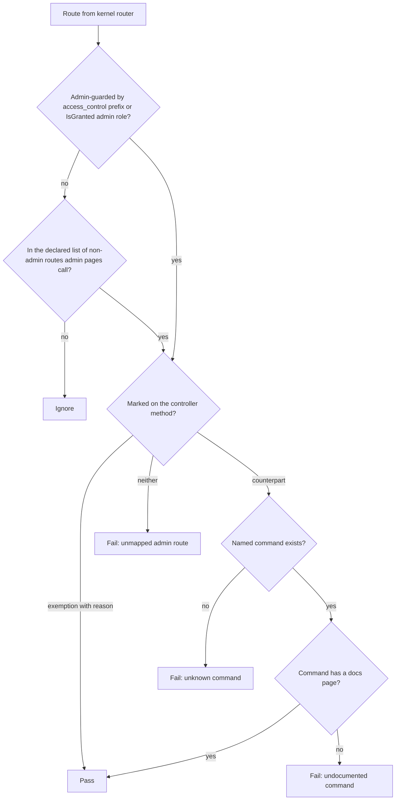
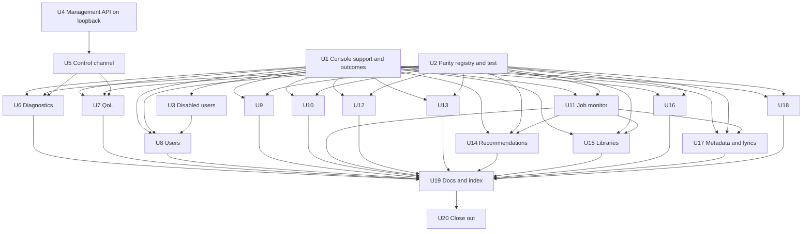

# Admin/CLI Parity - Plan

## Goal Capsule

- **Objective:** An operator with shell access to the web container can do everything the admin pages offer, with the same rules and the same results as the panel, and a new admin action cannot ship without a command or a recorded exemption.
- **Means:** both entry points reach one Application use case per action (KTD2), in-server state is reached through a control channel to the running web server (KTD7), and a parity test enforces the mapping (KTD6).
- **Authority:** the Product Contract's requirements win on behavior; KTDs win on mechanism within them; units carry local detail only. `AGENTS.md`, `.agents/rules/architecture-rules.md`, `.agents/rules/frontend.md` and the `ddd-*.md` references apply throughout.
- **Stop conditions:** stop and ask the user if evidence shows a session-settled decision cannot work, if the unix-socket listener cannot run under the pinned Swoole 6.2 build (KTD7 names the fallback, but switching needs the user), or if a fix would need a schema change beyond the library scan claim (U15).
- **Execution profile:** Deep and cross-cutting. U1 and U2 come first and fix the shared shape. U3 to U7 are runtime and security work. U9 to U13, U16 and U18 run in parallel once U1 and U2 land; U8 also waits for U3, and U14, U15 and U17 wait for U11's inline-run recording. U19 and U20 close out.
- **Finishing:** `ce-work` implements on branch `plan/admin-cli-parity`; the user reviews and decides when to push.

---

## Product Contract

### Summary

Every action on the admin pages gets a console command that reaches the same Application use case as its controller. Controller-resident rules move into Application first, so the two paths cannot drift. Server diagnostics and the QoL stream governor, whose state lives inside the running web server, are reached through a local control channel that covers every Swoole worker. A parity test fails when an admin route has no command and no recorded exemption. Defects found in the touched code are fixed in the same work.

### Problem Frame

The user set the rule on 2026-10-06: every admin-panel action must also be a CLI command, and CLI access is full authority. The rule exists because two entry points that each carry their own logic drift, and drift has already caused real bugs: admin-created users skipped default notification preferences and the `UserCreatedByOperator` event.

A rebuilt inventory of the admin pages found 110 admin operations. 23 have a command reaching the same use case, 11 have a command that drifts from the controller, 2 are partly covered, and 74 have none. The four QoL routes, which no page calls, also have none. Several actions have no Application use case at all; their controllers mutate aggregates or call repositories directly, so a command could only copy the rules. The inventory also surfaced defects: disabled users keep working tokens, the Swoole management API listens on every interface without authentication, the span diagnostics never return data, the QoL profile change only reaches one worker, the web album merge always fails, and several smaller bugs listed under R14.

### Requirements

**Coverage**

- R1. Every operation the admin pages perform, and every admin-guarded route in the admin pages' areas, has a console command or a named exemption with a reason.
- R2. A command and its controller reach the same Application command, query or port, and neither path holds business rules the other lacks.
- R3. Commands act with full authority: they make no role or admin-setting checks, library-scoped reads use the unrestricted scope, and audit fields record the actor `cli`.
- R4. Read-only commands print a table by default and, with `--json`, print exactly the API response's `data` payload.

**Consistent outcomes**

- R5. Both paths report the same outcome for the same situation: repeating an idempotent action succeeds, a conflict such as a scan already running is a 409 or a failing exit, invalid input is a 422 or an invalid-input exit, and an unknown target is a 404 or a failing exit.
- R6. Destructive commands ask for confirmation on a terminal and refuse to run without `--force` when none is attached; where the web offers a preview, `--dry-run` prints it.
- R7. Long-running actions run inline from the CLI by default, report each stage truthfully, and leave the same job and job-monitor records as the web path.

**In-server state**

- R8. Diagnostics and QoL commands act on the running web server, cover every Swoole worker, name any worker that did not answer, and exit with a clear error when no server is running in the container.
- R9. The web endpoints for the same state go through the same channel, so a QoL profile change or learning reset applies to every worker and survives a server reload.

**Enforcement**

- R10. A test fails when an admin-guarded route has neither a command nor a recorded exemption, when a mapping names a command that does not exist, when an exemption names a route that no longer exists, or when a console command has no operator docs page.

**Library rights**

- R11. Renaming, deleting and scanning a library require an admin.

**Defects fixed in scope**

- R12. A disabled user loses access at once: disabling revokes their access and refresh tokens, and bearer authentication and token refresh reject disabled accounts.
- R13. The Swoole management API listens only on its configured loopback host, and no compose file publishes it.
- R14. These touched-code defects are fixed:
  - the web album merge sends public IDs instead of UUIDs;
  - lyrics bulk fetch accepts an empty request body;
  - "sync all" metadata syncs every source it names and reports the real number of queued jobs;
  - a requeued recommendation job runs;
  - `app:radio:sync` syncs the subscribed countries;
  - a library scan claim is atomic, and an interrupted CLI scan releases it;
  - the span diagnostics buffer is shared by all workers and receives spans.

### Key Decisions

- **CLI access is full authority.** Commands skip role and admin-setting checks. (session-settled: user-directed — chosen over mirroring the API's role rules: shell access to the web container already implies full control.) Governs R3.
- **Server-local state gets parity through a control channel.** (session-settled: user-directed — chosen over exempting diagnostics and QoL, and over moving their state out of the server: the operator gets the real server's numbers and controls.) Governs R8, R9.
- **Library rename, delete and scan become admin-only.** (session-settled: user-directed — chosen over letting members scan, and over keeping member access: a member could otherwise delete a shared library.) Governs R11.
- **Scope is the admin pages.** Admin-only actions in the catalog and player UI become named exemptions for a follow-up plan. (session-settled: user-directed — chosen over covering every admin-only action now.) Governs R1.
- **Read-only views count as actions, and a parity test enforces the rule.** (session-settled: user-approved — proposed at scoping with the alternative of exempting views and checking by review; the user confirmed.) Governs R1, R4, R10.

### Scope Boundaries

- Named exemptions, each recorded in the parity registry with its reason:
  - catalog and player admin actions: metadata editing, per-song lyrics fetch and apply, cover upload and delete, artist create and credits, album and song delete, movie writes (deferred, see below);
  - webhook administration and server discovery registration, which no admin page offers (deferred);
  - the admin notification bell, which reads the admin's own inbox and is not an admin action.
- Not built, considered:
  - A last-super-admin guard. A full-authority CLI can create a super admin (U8), so a lockout is recoverable from the shell. Revisit if CLI access stops being guaranteed.
  - Cross-worker QoL budgeting. Each worker still admits streams against its own active streams; the channel aggregates readings but does not change admission. Revisit if operators see over-admission.
  - Changing the admin transcode tab, which lists only the viewing admin's sessions. The command lists every active session (KTD14); the web tab stays as it is.

#### Deferred to Follow-Up Work

- CLI parity for the catalog and player admin actions listed above.
- Webhook administration: move its `EntityManager` use into Application commands, then add commands.
- Library access management: no action exists to grant or revoke a member's access to a library.

---

## Planning Contract

### Key Technical Decisions

- KTD1. **One shared console support layer in Shared Interface.** A small set of helpers under `src/Shared/Interface/Console/` dispatches to the bus and unwraps `HandlerFailedException` to its cause, renders tables, emits `--json` by serialising the same `*Resource` the controller returns, applies the `--force`/terminal guard (R6), and maps outcomes to exit codes (KTD3). The actor constant `cli` moves to Shared Application so every context can use it; `AdminUserSettings::CLI_ACTOR` points at it. `OAuthClientMessageDispatcher` already does most of this for one context and is the model. Every Interface layer may depend on Shared Interface, so no Deptrac change is needed.
- KTD2. **Extract before wrapping.** Where a controller holds business rules, the unit first moves them into an Application command, query or port that the controller then uses, and only then adds the command. A command that copies controller logic is not parity. The inventory's list of controller-resident logic is the work list: user rename, delete, roles, disable and enable; login blocks; job retry, cancel and monitor reads; transport status; library create, update, delete, scan and scan-all; genre create, update and delete; recommendation cancel and requeue.
- KTD3. **Typed outcomes with one mapping each way.** Shared Application gains a small exception vocabulary: not found, conflict and invalid input. `ExceptionSubscriber` unwraps `HandlerFailedException` to its cause, because handler exceptions reach controllers wrapped, and maps them to 404, 409 and 422; the console helper maps them to `FAILURE`, `FAILURE` and `INVALID`. Per-controller try/catch blocks for these cases go away. Handlers throw these instead of bare `RuntimeException`. Setting-style actions are idempotent: disabling a disabled user, pausing a paused job and similar repeats succeed without change.
- KTD4. **Inline by default, with honest stages and the same records.** The web path queues long work on `swoole_task`, which the CLI cannot reach; a CLI enqueue falls back to Redis, and the worker containers may lack the media mounts. Commands therefore run the handler inline by default, print each stage as it finishes, and record a job-monitor entry for the run like the web path. `--queue` is offered only on actions whose message is consumed by a process that can perform it; each unit verifies that before adding the option.
- KTD5. **Command naming.** Commands follow `app:<noun>[:<sub>]:<verb>` with a singular noun. Four outliers are renamed without aliases, as the pre-release policy allows: `app:albums:extract-covers` to `app:album:extract-covers`, `app:images:prune-missing` to `app:image:prune-missing`, `app:recommendations:generate` to `app:recommendation:generate`, and `baander:lyrics:fetch` to `app:lyrics:fetch`.
- KTD6. **The pairing lives on the controller method.** Two attributes in Shared Interface mark each admin route: one names its command (or a framework command such as `messenger:failed:retry`), the other records an exemption and its reason. The parity test boots the kernel, reads the route collection, and treats a route as admin-guarded when an `access_control` admin prefix matches or `#[IsGranted]` on the class or method names an admin role or admin attribute. Inline admin-only role checks are converted to attributes first, so reflection sees every admin route. Owner-or-admin checks, such as `TranscodeSessionController::assertSessionOwner`, are not admin gates and stay inline. Admin pages also call a few non-admin routes, such as the library list and radio stations; the test keeps an explicit list of those and requires the same marking. An attribute was chosen over a map inside the test because it travels with the route through renames and is visible when someone edits the controller. Model: `tests/Integration/OpenApiSpecTest.php` for enumeration and `tests/Functional/Auth/ApiRateLimitTest.php` for keeping a list from going stale.
- KTD7. **Control channel: a unix-socket listener in the web server, with pipe-message fan-out.** It instantiates the control-channel Key Decision (R8, R9).
  - **Listener:** a server configurator tagged `swoole_bundle.server_configurator` adds a listener on a unix socket before start. The socket file is mode 0600 in a 0700 directory owned by the app user, at a configurable path outside the bind-mounted project directory (default `/tmp/baander-control/control.sock`); a stale socket file is removed first. File permissions are the authentication: operators already run commands through `make exec`, as the same user in the same container.
  - **Protocol:** newline-delimited JSON requests that name an operation from a fixed registry, with a correlation ID.
  - **Fan-out:** the worker that accepts a connection applies the operation locally, sends it to every other HTTP worker with `Server::sendMessage`, collects the replies with a bounded timeout, and answers with one result per worker plus the IDs of workers that did not reply. A write with a missing worker is reported as a partial failure, never as success. Operations whose answer is already server-wide, such as `Server::stats()`, skip fan-out.
  - **Ports:** commands use a Shared Application port backed by a socket client. Controllers use the same port, whose in-server implementation calls the coordinator directly. If no server is listening, the client fails with "no web server is running in this container" and a non-zero exit.
  - **Fallback:** the bundle's API listener on loopback with an `X-Baander-Control-Token` header, used only if the unix listener cannot run under the pinned Swoole build. Switching is a stop condition.
  - **Rejected:** Redis pub/sub, because the worker containers hold the Redis credentials and would gain control of the web server.
- KTD8. **QoL changes are persisted and loaded by every worker.**
  - The profile is held in a `Swoole\Table` created before fork, as `CpuGpuSampler` does, and saved to its own file by the admin change. Learning persistence on stream release never writes the profile, so a worker that missed a change cannot overwrite it.
  - A learning reset is saved immediately after it is applied.
  - Every HTTP worker imports the saved profile and learning model at start (today only worker 0 does). Saved state no longer carries active streams, because a release only reaches the worker that served the stream.
  - Combined with fan-out, a change reaches every worker and survives a reload.
- KTD9. **The span buffer becomes server-wide and gets a source.** No tracer provider and no span source exist today, so the buffer has always been empty.
  - `SpanBridge` creates its `Swoole\Table` in a bootable service before the workers fork, so every worker reads the same buffer and the span operations need no fan-out.
  - An SDK tracer provider service always registers `InMemorySpanProcessor`; `app.otel.enabled` (`OTEL_ENABLED`) gates only export to an OTLP endpoint, so the diagnostics buffer works without an external collector.
  - A kernel request and terminate subscriber opens and ends one server span per HTTP request, with the context kept per coroutine. It records only the method, route name, status and duration, never the URL or query string, so tokens and signed-URL signatures cannot reach the buffer.
- KTD10. **The management API binds to loopback.** `ServerExecutionCommand` stops replacing the API socket's host with `0.0.0.0`, the bundle's `Configuration` defaults the API host to `127.0.0.1` (both the `defaultValue` and the `api: true` shorthand), and `docker-compose.yml` stops publishing port 9200. The API stays enabled on loopback, because the bundle's `swoole:server:status` and `swoole:server:reload` commands use it.
- KTD11. **Disabling a user ends their sessions.** The disable handler revokes the user's access and refresh tokens in the same transaction, using the `revokeForUser` calls `PasswordChanger` already makes. `OAuth2Authenticator`, `WsQueryTokenAuthenticator` (the WebSocket handshake) and the refresh grant reject a disabled account.
- KTD12. **Library rights by attribute.** `LibraryController::update`, `destroy`, `scan` and `scanAll` carry `#[IsGranted('ROLE_ADMIN')]`, and `denyUnlessLibraryOwnerOrAdmin` is removed. The creating admin's access grant moves from the controller into `CreateLibraryHandler`, so both paths grant it; scan-completed notifications choose recipients from those grants (`CreateNotificationHandler`).
- KTD13. **Atomic scan claim.** Starting a scan claims the library with a conditional update that succeeds only when no scan is running, and the scan path uses that claim instead of reading the status and then saving. An inline CLI scan releases its claim when it fails or is interrupted. `app:library:scan --release` clears a claim left by a killed process.
- KTD14. **Commands that back per-user admin views act system-wide.** The transcode session list shows every active session, with `--user` to filter. The radio station and country lists need no user. Full authority makes system-wide the natural meaning.
- KTD15. **Failed-message parity over the port.** `app:failed-message:list` and `app:failed-message:flush` use `FailedMessageAdministrationInterface`, as the web does, including messages waiting out a retry delay. The framework commands `messenger:failed:show`, `retry` and `remove` stay as the mapped counterparts for single messages, because the web path already wraps them or uses the same receiver.

### High-Level Technical Design

The control channel, for a QoL profile change made from the shell:

```mermaid
sequenceDiagram
  participant CLI as app:qol:profile
  participant Sock as Control socket (0600)
  participant W0 as Accepting worker
  participant Wn as Other HTTP workers
  participant Store as QoL state file
  CLI->>Sock: {op: qol.profile.set, value, id}
  Sock->>W0: connection
  W0->>W0: apply locally
  W0->>Wn: sendMessage(op, id)
  Wn->>Wn: apply locally
  Wn-->>W0: pipeMessage(result, id)
  W0->>Store: save profile
  W0-->>Sock: {workers: {...}, missing: [...]}
  Sock-->>CLI: result
  CLI-->>CLI: table; FAILURE if any worker missing
```

How the parity test classifies a route:



Unit dependencies:



### Assumptions

- The worker containers' mounts are not verified in this plan; KTD4 makes inline the default so no command depends on them.
- The admin operation counts in the Problem Frame come from static reading of the code at `734c5d38`; a unit that finds a route the inventory missed adds it to the registry.

### Sources

- Inventories and research: the admin action inventory, split into users, security, settings, scheduler, monitor, diagnostics and activity, and into library, catalog, media, metadata, lyrics, genres, radio, recommendations and transcode; console and controller patterns; the control-channel study; and the flow analysis.
- `docs/solutions/architecture-patterns/health-checks-run-in-a-messenger-consumer-cannot-see-outages-that-stop-it.md`: an admin health view's command must be a read-only report and must not trigger alerting.
- Templates: `tests/Functional/Auth/AdminOAuthClientTest.php` (one test drives the HTTP route and the command and compares the database state), `src/Auth/Interface/Console/OAuthClientMessageDispatcher.php`, `src/Auth/Interface/Console/ResetUserPasswordCommand.php`, `tests/Unit/Shared/Infrastructure/Http/SwooleBinaryFileResponseTransportTest.php` (real Swoole server in a subprocess).

---

## Implementation Units

| U-ID | Title | Key files | Depends on |
|---|---|---|---|
| U1 | Console support and outcome vocabulary | `src/Shared/Interface/Console/`, `src/Shared/Application/Exception/`, `ExceptionSubscriber.php` | none |
| U2 | Parity registry and test | `src/Shared/Interface/Attribute/`, `tests/Integration/AdminCliParityTest.php` | none |
| U3 | Disabled users lose access | `DisableUserHandler.php`, `OAuth2Authenticator.php`, refresh grant | U1 |
| U4 | Management API on loopback | `ServerExecutionCommand.php`, `docker-compose.yml` | none |
| U5 | Server control channel | `src/Shared/Infrastructure/Swoole/Control/`, Shared Application port | U4 |
| U6 | Diagnostics through the channel | debug controllers, `SpanBridge.php`, `app:server:*` | U1, U2, U5 |
| U7 | QoL through the channel | `QoLAdminService.php`, QoL Swoole subscribers, `app:qol:*` | U1, U2, U5 |
| U8 | User administration | `AdminUserController.php`, Auth commands and handlers | U1, U2, U3 |
| U9 | Login blocks | `AdminLoginBlockController.php`, new port, `app:login-block:*` | U1, U2 |
| U10 | Scheduler and settings definitions | `AdminScheduledJobController.php`, `app:scheduler:*`, `app:settings:definitions` | U1, U2 |
| U11 | Job monitor and analytics | `JobMonitorController.php`, `JobAnalyticsController.php`, `app:monitor:*` | U1, U2 |
| U12 | Transport and failed messages | `TransportController.php`, `app:monitor:transport`, `app:failed-message:*` | U1, U2 |
| U13 | Activity analytics | `ActivityAdminController.php`, `app:activity:*` | U1, U2 |
| U14 | Recommendations | `RecommendationAdminController.php`, `app:recommendation:*` | U1, U2, U11 |
| U15 | Libraries | `LibraryController.php`, Library handlers, `app:library:*` | U1, U2, U11 |
| U16 | Genres | `GenreController.php`, Catalog genre commands, `app:genre:*` | U1, U2 |
| U17 | Metadata and lyrics | `MetadataAdminService.php`, `LyricsAdminController.php`, `app:metadata:*`, `app:lyrics:*` | U1, U2, U11 |
| U18 | Media, albums, transcode and radio | Media, Catalog, Transcode and Radio controllers and commands | U1, U2 |
| U19 | Operator docs, index and docs test | `docs-book/part-1-operator-guide/commands/`, docs coverage test | U6 to U18 |
| U20 | Close out | parity test pending list, `ROADMAP.md` | U19 |

Each per-area unit (U8 to U18) also marks every route it covers with the KTD6 attribute, writes an operator docs page per new or renamed command from `.agents/skills/documentation-maintainer/assets/command.md`, and removes its routes from the parity test's pending list (U2).

### U1. Console support and outcome vocabulary

- **Goal:** One way to build an admin command and one shared failure vocabulary, so every later unit follows the same template.
- **Requirements:** R3, R4, R5, R6
- **Dependencies:** none
- **Files:**
  - create the console helpers under `src/Shared/Interface/Console/` (dispatch and unwrap, table and JSON output, the force guard, outcome-to-exit mapping)
  - create not-found, conflict and invalid-input exceptions under `src/Shared/Application/Exception/`, and the `cli` actor constant in Shared Application
  - modify `src/Shared/Infrastructure/EventListener/ExceptionSubscriber.php`, `src/Auth/Application/Service/AdminUserSettings.php`, `src/Auth/Interface/Console/OAuthClientMessageDispatcher.php`
  - create `tests/Unit/Shared/Interface/Console/AdminCommandSupportTest.php`, `tests/Unit/Shared/Infrastructure/EventListener/UseCaseOutcomeMappingTest.php`
- **Approach:** implements KTD1 and KTD3. `OAuthClientMessageDispatcher` moves onto the shared helpers as the first consumer and proves the shape. `--json` writes only the `data` payload to stdout; messages and errors go to stderr.
- **Patterns to follow:** `src/Auth/Interface/Console/OAuthClientMessageDispatcher.php`, `src/Auth/Interface/Console/OAuthClientListCommand.php`.
- **Test scenarios:**
  - A handler throwing the conflict exception inside `HandlerFailedException` gives exit `FAILURE` and its message on stderr.
  - An invalid-input exception gives exit `INVALID`; a not-found exception gives `FAILURE` naming the target.
  - The same three exceptions thrown from a controller give 409, 422 and 404 with the shared error envelope.
  - A controller that dispatches through the bus, whose handler throws the conflict exception, returns 409 with the shared error envelope, not 500.
  - `--json` on a list prints exactly the `data` array the matching resource collection produces; table mode prints one row per item.
  - A destructive command run with no terminal and no `--force` exits `INVALID` without dispatching; with `--force` it dispatches once.
  - The `cli` actor constant is the value `AdminUserSettings` logs.
- **Verification:** the OAuth client commands keep passing their existing tests while running on the shared helpers.

### U2. Parity registry and test

- **Goal:** Make missing parity a test failure from the start, with a pending list that the area units shrink to empty.
- **Requirements:** R1, R10
- **Dependencies:** none
- **Files:**
  - create the counterpart and exemption attributes under `src/Shared/Interface/Attribute/`
  - create `tests/Integration/AdminCliParityTest.php`
  - modify `src/Transcode/Interface/Controller/TranscodeJobController.php` (the inline admin check on `cleanup` becomes `#[IsGranted('ROLE_ADMIN')]`); `TranscodeSessionController`'s owner-or-admin check stays inline (KTD6)
  - mark the already-covered routes: the OAuth client, system settings, user settings, rate limiter, scheduler trigger and config check controllers
  - create `docs-book/part-1-operator-guide/commands/app-rate-limiter-list.md` and `app-rate-limiter-clear.md`
  - mark the deferred exemptions: the catalog and player admin routes, `WebhookController` and `DiscoveryController::register`, each with its reason (Scope Boundaries)
- **Approach:** implements KTD6. Every admin-guarded route not yet marked starts on the test's pending list; the test fails if the list contains a route that is now marked, so it shrinks as units land. Library inline checks are converted in U15, with the rights change. The declared list of non-admin routes the admin pages call starts with the library list, show and stats, the genre list, the radio station and country lists, and the transcode session index (`GET /api/transcode/sessions`). This unit also owns the docs-page lookup: it maps a command name to its page under `docs-book/part-1-operator-guide/commands/` or an index anchor, and U19 reuses it for every command. Symfony framework commands named as counterparts (`messenger:failed:*`) are outside the docs check. The already-covered `app:rate-limiter:list` and `app:rate-limiter:clear` have no pages yet; this unit writes them.
- **Patterns to follow:** `tests/Integration/OpenApiSpecTest.php`, `tests/Functional/Auth/ApiRateLimitTest.php`.
- **Test scenarios:**
  - A fixture controller with an admin route and no marking fails with the route name in the message.
  - A route marked with a counterpart naming a non-existent command fails.
  - An exemption on a route that no longer exists fails.
  - A route guarded only by `access_control` (`^/api/monitor`) is treated as admin-guarded.
  - A route whose method has `#[IsGranted('ROLE_SUPER_ADMIN')]` under a non-admin prefix is treated as admin-guarded.
  - A declared non-admin route the admin pages call, such as `GET /api/libraries`, must be marked.
  - A pending entry for a route that is now marked fails, so stale pending entries cannot linger.
  - A route mapped to an existing command that has no docs page fails, naming the command.
- **Verification:** the test passes with the covered routes marked, the deferred routes exempted, and everything else pending.

### U3. Disabled users lose access

- **Goal:** Disabling an account takes effect immediately on every session.
- **Requirements:** R12, R5
- **Dependencies:** U1
- **Files:**
  - modify `src/Auth/Application/CommandHandler/User/DisableUserHandler.php`, `src/Auth/Application/CommandHandler/User/EnableUserHandler.php`
  - modify `src/Auth/Infrastructure/Security/OAuth/OAuth2Authenticator.php`, `src/Shared/Infrastructure/Security/WsQueryTokenAuthenticator.php` and the refresh grant (`src/Auth/Application/CommandHandler/OAuth/RefreshTokenHandler.php` or `TokenPairIssuer.php`, wherever the user is resolved)
  - tests in `tests/Unit/Auth/Application/CommandHandler/User/`, and a functional test `tests/Functional/Auth/DisabledUserAccessTest.php`
- **Approach:** implements KTD11. Disable and enable become idempotent per KTD3. The revocation runs in the same transaction as the save, through `TransactionPortInterface`, as `PasswordChanger` does.
- **Patterns to follow:** `src/Auth/Application/Service/PasswordChanger.php`.
- **Test scenarios:**
  - Disabling a user revokes all of their access and refresh tokens.
  - A request with an access token issued before the disable gets 401.
  - A refresh with a refresh token issued before the disable is rejected.
  - A WebSocket handshake with a token issued before the disable is refused.
  - Disabling an already disabled user succeeds and changes nothing.
  - Enabling a user does not restore revoked tokens; the user signs in again.
  - A failure while revoking rolls back the disable.
- **Verification:** the functional test shows the same token losing access within one request after the disable.

### U4. Management API on loopback

- **Goal:** The unauthenticated Swoole management API is reachable only from inside the container.
- **Requirements:** R13
- **Dependencies:** none
- **Files:**
  - modify `packages/swoole-bundle/src/Bridge/Symfony/Bundle/Command/ServerExecutionCommand.php`, `packages/swoole-bundle/src/Bridge/Symfony/Bundle/DependencyInjection/Configuration.php`, `docker-compose.yml`, `docs-book/part-1-operator-guide/security.md`
  - extend `tests/Functional/Console/ServeCommandTest.php` or the bundle's own command test
- **Approach:** implements KTD10.
- **Test scenarios:**
  - With `api.host: 127.0.0.1` configured, the server command keeps that host for the API socket.
  - With `--api` and no configured host, or with the `api: true` shorthand, the API socket binds `127.0.0.1`.
  - `docker-compose.yml` publishes no port for the management API (a file-content assertion in the Docker test folder, `tests/Integration/Docker/`).
- **Verification:** `swoole:server:status` still works from inside the container.

### U5. Server control channel

- **Goal:** A command in the web container can query and change state held by every worker of the running server.
- **Requirements:** R8, R9
- **Dependencies:** U4
- **Files:**
  - create `src/Shared/Infrastructure/Swoole/Control/` (configurator, coordinator, pipe-message handler, operation registry, socket client)
  - create the Shared Application port for server control
  - modify `config/services.yaml`, `config/packages/swoole.yaml` (socket path parameter)
  - create `tests/Unit/Shared/Infrastructure/Swoole/Control/` (codec, coordinator aggregation, client errors) and a subprocess probe `tests/Unit/Shared/Infrastructure/Swoole/Control/control-channel-probe.php` with its test
- **Approach:** implements KTD7. The operation registry starts empty; U6 and U7 register their operations. The coordinator's timeout and the per-worker result shape are owned here.
- **Execution note:** prove the listener and fan-out against a real Swoole server in the probe before building operations on it; a failure here is the KTD7 stop condition.
- **Patterns to follow:** `tests/Unit/Shared/Infrastructure/Http/SwooleBinaryFileResponseTransportTest.php` and its probe script; the `swoole_bundle.server_configurator` tag use in `config/services.yaml`.
- **Test scenarios:**
  - In a real three-worker server, an operation sent to the socket returns one result per worker.
  - A worker that does not reply in time is listed as missing, and the response is a partial failure.
  - The socket file is mode 0600 in a 0700 directory, and a stale socket file from an earlier run does not stop the server from starting.
  - The client reports "no web server is running in this container" and exits non-zero when nothing listens.
  - A request naming an unknown operation gets an error and does not reach other workers.
  - A malformed line is rejected without closing the listener for later requests.
- **Verification:** the probe passes in `scripts/test-unit-container.sh`.

### U6. Diagnostics through the channel

- **Goal:** Server diagnostics read the same numbers from the shell as from the admin page, for every worker.
- **Requirements:** R1, R2, R4, R8, R9, R14 (span buffer)
- **Dependencies:** U1, U2, U5
- **Files:**
  - modify `src/Shared/Interface/Controller/ServerStatsControllerWithCoroutines.php`, `CoroutineStatsController.php`, `WorkerStatsController.php`, `SpanDebugController.php` (also read `limit` from the request, not `$_GET`)
  - modify `src/Shared/Infrastructure/OpenTelemetry/SpanBridge.php`, `config/packages/opentelemetry.yaml`, `config/services.yaml`
  - create the tracer provider service and the per-request span subscriber under `src/Shared/Infrastructure/OpenTelemetry/` (KTD9)
  - create `app:server:stats`, `app:server:coroutines`, `app:server:workers`, `app:server:spans` (with `--clear`) under `src/Shared/Interface/Console/`
  - tests under `tests/Unit/Shared/Interface/Console/` and `tests/Unit/Shared/Infrastructure/OpenTelemetry/`
- **Approach:** implements KTD9 and registers the `debug.*` operations with U5. Keep the per-request span cheap: one span, the attributes KTD9 names, nothing else on the hot path. Per-worker reads (stats, coroutines) return one row per worker; Redis and SSE figures are computed once; the worker stats read is server-wide. The web endpoints' JSON shape gains per-worker rows; the admin page is updated to show them, following `.agents/rules/frontend.md`.
- **Test scenarios:**
  - `app:server:stats` lists one row per worker plus the shared Redis and SSE figures.
  - `app:server:spans` returns spans recorded by a request handled in a different worker.
  - `app:server:spans --clear` empties the buffer for every worker; without a terminal it needs `--force`.
  - With no server running, each command exits non-zero with the shared message.
  - The span endpoint honors `?limit=` from the request object.
  - A handled request produces exactly one span with method, route name, status and duration, and no URL, query string or token.
  - With `OTEL_ENABLED` unset, spans still reach the diagnostics buffer and nothing is exported.
- **Verification:** the diagnostics page and the commands show the same worker IDs and counts against one running server.

### U7. QoL through the channel

- **Goal:** A QoL profile change or learning reset applies to every worker, from the web or the shell, and survives a reload.
- **Requirements:** R1, R2, R4, R8, R9
- **Dependencies:** U1, U2, U5
- **Files:**
  - modify `src/QoL/Infrastructure/QoLAdminService.php` (or a fan-out decorator of `QoLAdminPortInterface`), `src/QoL/Interface/Controller/QoLAdminController.php`
  - modify `src/QoL/Infrastructure/Swoole/QoLWorkerStartupSubscriber.php`, `src/QoL/Infrastructure/Swoole/LearningDataPersister.php`
  - create `app:qol:status`, `app:qol:streams`, `app:qol:profile`, `app:qol:reset` under `src/QoL/Interface/Console/`
  - tests in `tests/Unit/QoL/` and a probe case in the U5 probe
- **Approach:** implements KTD8 and registers the `qol.*` operations. The profile table is a bootable service like `CpuGpuSampler`. Status and streams show per-worker rows and a total; the Scope Boundaries note on per-worker budgeting stands.
- **Test scenarios:**
  - Setting the profile to `aggressive` makes every worker report `aggressive`.
  - After a server reload, every worker still reports `aggressive`.
  - A worker that missed the profile change completes a stream, and the saved profile stays `aggressive`.
  - After a reload taken while streams were active, every worker reports zero active streams.
  - A reset returns every worker to the learning state and is saved.
  - An unknown profile name exits `INVALID` and changes no worker.
  - `app:qol:reset` without a terminal requires `--force`.
  - The PATCH profile endpoint gives the same result as the command, checked against all workers.
- **Verification:** the probe shows the profile on all workers before and after a reload.

### U8. User administration

- **Goal:** Every user action on the admin page has a command, and both paths use the same handlers.
- **Requirements:** R1, R2, R3, R5, R6
- **Dependencies:** U1, U2, U3
- **Files:**
  - create Application commands and handlers under `src/Auth/Application/Command/User/` and `CommandHandler/User/` for rename, delete and set-roles, and a list query; add a domain method on `User` for role changes
  - modify `src/Auth/Interface/Controller/AdminUserController.php` (dispatch the handlers for update name, delete, roles, disable and enable)
  - modify `src/Auth/Interface/Console/CreateUserCommand.php` (repeatable `--role`, accepting `super-admin`)
  - create `app:user:list`, `app:user:rename`, `app:user:delete`, `app:user:roles` under `src/Auth/Interface/Console/`
  - tests in `tests/Unit/Auth/` and `tests/Functional/Auth/AdminUserCliParityTest.php`
- **Approach:** KTD2 and KTD3. The controller's role checks and `admin.can_*` settings stay HTTP-only (R3).
- **Patterns to follow:** `tests/Functional/Auth/AdminOAuthClientTest.php::testConsoleCommandsManageClientsThroughTheSameUseCases`.
- **Test scenarios:**
  - Disabling a user through the API and then the CLI leaves the same state, and both succeed on the second call.
  - `app:user:create --role=super-admin` creates a super admin with default notification preferences and emits `UserCreatedByOperator`.
  - `app:user:roles` replaces the roles; the API's role assignment produces the same stored roles.
  - `app:user:delete` without a terminal and without `--force` deletes nothing.
  - `app:user:rename` and PATCH name give the same stored name and the same validation errors.
  - `app:user:list --role=ROLE_ADMIN --disabled` matches the API's filtered list, and `--json` matches its `data`.
  - An unknown email exits `FAILURE` on the CLI and returns 404 from the API.
- **Verification:** the functional test drives each action through both paths and compares the database state.

### U9. Login blocks

- **Goal:** Login blocks can be listed and removed from the shell, which is the recovery path when an admin is locked out of the web panel.
- **Requirements:** R1, R2, R4, R6
- **Dependencies:** U1, U2
- **Files:**
  - create an Application port or query and commands for login-block list and delete under `src/Auth/Application/`
  - modify `src/Auth/Interface/Controller/AdminLoginBlockController.php`; remove its baseline entry from `deptrac.baseline.yaml`
  - create `app:login-block:list` and `app:login-block:delete` (`<id>` or `--all`) under `src/Auth/Interface/Console/`
  - tests in `tests/Unit/Auth/` and `tests/Functional/Auth/`
- **Test scenarios:**
  - `app:login-block:list` shows the same blocks, in the same order, as the API.
  - `app:login-block:delete --all --force` removes every block, and a blocked address can then sign in.
  - Deleting an unknown ID exits `FAILURE`; the API returns 404.
- **Verification:** Deptrac reports no violation and one fewer baseline entry.

### U10. Scheduler and settings definitions

- **Goal:** Scheduled jobs can be managed from the shell exactly as on the scheduler page.
- **Requirements:** R1, R2, R4, R5, R6
- **Dependencies:** U1, U2
- **Files:**
  - modify `src/Scheduler/Interface/Console/SchedulerListCommand.php` (use `ScheduledJobAdministrationInterface`)
  - create `app:scheduler:show`, `create`, `update`, `delete`, `pause`, `resume`, `enable`, `disable` and `commands` under `src/Scheduler/Interface/Console/`
  - create `app:settings:definitions` (`--scope=system|user`) under `src/Shared/Interface/Console/`
  - tests in `tests/Unit/Scheduler/Interface/Console/` and `tests/Functional/Scheduler/`
- **Approach:** the controller already uses the Application port, so this unit wraps it. Create and update take the same fields as the request DTOs, with parameters as a JSON option validated by the same schema check.
- **Test scenarios:**
  - `app:scheduler:create` with an invalid cron expression exits `INVALID` with the same message the API returns in its 422.
  - Pausing a paused job succeeds on both paths.
  - `app:scheduler:update` on a job changed concurrently reports the same conflict the API maps to 409.
  - `app:scheduler:commands` lists the same schedulable commands the create dialog offers.
  - `app:settings:definitions --scope=user` lists only user-scope definitions.
- **Verification:** each scheduler route carries a counterpart marking.

### U11. Job monitor and analytics

- **Goal:** The job monitor and its analytics are readable, and jobs can be retried and cancelled, from the shell with the same checks and audit.
- **Requirements:** R1, R2, R3, R4, R5
- **Dependencies:** U1, U2
- **Files:**
  - create a Shared Application port for monitor reads, retry and cancel, implemented over `src/Shared/Infrastructure/Messenger/JobMonitorService.php`; move the retry and cancel rules out of `src/Shared/Interface/Controller/JobMonitorController.php`
  - modify `JobMonitorController.php`, `JobAnalyticsController.php`, `src/Shared/Interface/Console/PruneJobMonitorsCommand.php`
  - create `app:monitor:status`, `app:monitor:jobs`, `app:monitor:job:show`, `app:monitor:job:retry`, `app:monitor:job:cancel`, `app:monitor:analytics` (`--section=summary|timing|failures`)
  - tests in `tests/Unit/Shared/` and `tests/Functional/Controller/`
- **Approach:** KTD2. Retry records the actor `cli` from the shell and the admin's identifier from the web (R3). This unit also records inline command runs in the monitor for KTD4, through the same port, so later units can use it.
- **Test scenarios:**
  - Retrying a failed job from the CLI dispatches it once with a new job ID and writes an audit entry with actor `cli`.
  - Retrying a job that is still running is a conflict on both paths.
  - Cancelling a job sets the cancel flag the worker reads; cancelling a finished job is a conflict.
  - `app:monitor:jobs --status=failed --limit=5` returns the same jobs as the API with the same filters, and its cursor continues the listing.
  - `app:monitor:analytics --section=failures --from=... --to=...` matches the API's failures payload.
  - An inline command run recorded through the port appears in `app:monitor:jobs`.
- **Verification:** the controller no longer depends on `JobMonitorService` directly.

### U12. Transport and failed messages

- **Goal:** Transport health and failed-message cleanup work the same from the shell as from the dashboard.
- **Requirements:** R1, R2, R4, R6
- **Dependencies:** U1, U2
- **Files:**
  - create a Shared Application port for transport status, implemented in Shared Infrastructure; move the Redis probe out of `src/Shared/Interface/Controller/TransportController.php`
  - create `app:monitor:transport`, `app:failed-message:list`, `app:failed-message:flush`
  - mark the single-message routes with the framework commands as counterparts (KTD15)
  - update `docs-book/part-1-operator-guide/monitoring.md`
  - tests in `tests/Unit/Shared/` and `tests/Functional/Console/`
- **Approach:** KTD15.
- **Test scenarios:**
  - `app:failed-message:flush --force` removes a message that is waiting out a retry delay, as the web flush does.
  - `app:failed-message:list` includes delayed messages and matches the API's page.
  - `app:monitor:transport` reports the stream length, consumer state and failed count the dashboard shows.
  - Flush without a terminal and without `--force` removes nothing.
- **Verification:** `monitoring.md` names the new commands and no longer describes the flush difference.

### U13. Activity analytics

- **Goal:** The activity page's numbers are available from the shell.
- **Requirements:** R1, R2, R4
- **Dependencies:** U1, U2
- **Files:**
  - create `app:activity:summary`, `app:activity:top-tracks`, `app:activity:top-artists`, `app:activity:engagement` under `src/Activity/Interface/Console/`
  - tests in `tests/Unit/Activity/Interface/Console/`
- **Approach:** the controller already uses `ActivityAnalyticsPortInterface`; the commands take the same `--from`, `--to` and `--limit` options with the same defaults.
- **Test scenarios:**
  - Each command with a date range returns the payload the matching endpoint returns for the same range.
  - An invalid date exits `INVALID`.
  - With no activity in the range, the commands print an empty result and succeed.
- **Verification:** each activity route carries a counterpart marking.

### U14. Recommendations

- **Goal:** Recommendation insights and jobs can be managed from the shell, and CLI runs appear in the job list like web runs.
- **Requirements:** R1, R2, R4, R5, R7, R14 (requeue)
- **Dependencies:** U1, U2, U11 (inline-run recording)
- **Files:**
  - create Application commands for cancel and requeue under `src/Recommendation/Application/`; move the rules out of `src/Recommendation/Interface/Controller/RecommendationAdminController.php`
  - modify `src/Recommendation/Application/CommandHandler/GenerateRecommendationsHandler.php` (create the job record on the inline path too) and rename `GenerateRecommendationsConsoleCommand` to `app:recommendation:generate` (KTD5)
  - create `app:recommendation:stats`, `app:recommendation:job:list`, `app:recommendation:job:show`, `app:recommendation:job:cancel`, `app:recommendation:job:requeue`
  - tests in `tests/Unit/Recommendation/` and `tests/Functional/Recommendation/`
- **Approach:** requeue creates the job and dispatches it, which fixes the job that never ran.
- **Test scenarios:**
  - `app:recommendation:generate --mode=incremental` creates a job record that `app:recommendation:job:list` shows.
  - A requeued job is dispatched and reaches a terminal status.
  - Cancelling a pending job marks it cancelled; cancelling a completed job is a conflict on both paths.
  - `app:recommendation:stats --json` contains the coverage, source-quality and freshness payloads.
- **Verification:** a job requeued through the API runs.

### U15. Libraries

- **Goal:** Libraries can be managed from the shell with the same rules as the web, and only admins can change them.
- **Requirements:** R1, R2, R3, R4, R5, R6, R7, R11, R14 (scan claim)
- **Dependencies:** U1, U2, U11 (inline-run recording)
- **Files:**
  - modify `src/Library/Interface/Controller/LibraryController.php` (KTD12 attributes; store, update, destroy, scan and scanAll dispatch Application commands)
  - modify `src/Library/Application/CommandHandler/CreateLibraryHandler.php` (it grants the creator access, KTD12) and add update, delete and scan-all commands under `src/Library/Application/`
  - add the atomic claim to the library repository (`src/Library/Infrastructure/`) and use it from the scan path (KTD13)
  - modify `src/Library/Interface/Console/CreateLibraryCommand.php`, `ScanLibraryCommand.php` (`--rescan`, `--all`, `--release`, claim release on failure and interruption)
  - create `app:library:list`, `app:library:show`, `app:library:stats`, `app:library:update`, `app:library:delete`, `app:library:validate-path`
  - tests in `tests/Unit/Library/`, `tests/Functional/Library/`, and `tests/Integration/LibraryScanClaimTest.php`
- **Approach:** KTD2, KTD12, KTD13; reads pass the unrestricted scope (R3). A command identifies a library by UUID or slug. Library validation now runs only in the handlers.
- **Test scenarios:**
  - A non-admin with a library grant gets 403 on rename, delete and scan.
  - Creating a library from the API and from the CLI gives the same stored library and the same conflict for a duplicate slug.
  - A library created through either path notifies its creator when a scan completes.
  - Two concurrent scan starts on one library: exactly one claims it, and the other gets the conflict on both paths.
  - An inline CLI scan that fails releases its claim, so a web scan can start.
  - `app:library:scan --release` clears a claim left by a killed process.
  - `app:library:scan --all` skips libraries already scanning and reports which ones it started.
  - `app:library:list` lists every library from the shell, not an empty list.
  - `app:library:delete` without a terminal and without `--force` deletes nothing.
- **Verification:** the scan claim test runs against the disposable PostgreSQL.

### U16. Genres

- **Goal:** Genres can be managed from the shell with the same parent-cycle rule as the web.
- **Requirements:** R1, R2, R3, R4, R6
- **Dependencies:** U1, U2
- **Files:**
  - create Application commands and handlers for genre create, update and delete under `src/Catalog/Application/`, carrying the parent-cycle rule from `src/Catalog/Interface/Controller/GenreController.php`
  - modify `GenreController.php`
  - create `app:genre:list` (`--tree`), `app:genre:create`, `app:genre:update`, `app:genre:delete`, `app:genre:album:add`, `app:genre:album:remove`, `app:genre:song:add`, `app:genre:song:remove`
  - tests in `tests/Unit/Catalog/` and `tests/Functional/Catalog/`
- **Test scenarios:**
  - Making a genre its own descendant's child is rejected on both paths with the same error.
  - Creating a genre with an unknown parent is rejected on both paths.
  - `app:genre:list --tree` shows every genre from the shell, using the unrestricted scope.
  - Adding an album to a genre twice succeeds once and leaves one link.
- **Verification:** the cycle rule exists only in the Application handler.

### U17. Metadata and lyrics

- **Goal:** Metadata and lyrics administration works from the shell, and the web's "sync all" and bulk fetch work.
- **Requirements:** R1, R2, R4, R5, R7, R14 (sync all, bulk fetch)
- **Dependencies:** U1, U2, U11 (inline-run recording)
- **Files:**
  - modify `src/Metadata/Infrastructure/Admin/MetadataAdminService.php` (dispatch per named source; return the real count)
  - modify `src/Lyrics/Interface/Controller/LyricsAdminController.php` (accept an empty body), `src/Lyrics/Infrastructure/` admin port implementation (real count)
  - rename `src/Lyrics/Interface/Console/FetchLyricsCommand.php` to `app:lyrics:fetch` (KTD5) and route it through the same port as the web, with the same default limit on both paths
  - create `app:metadata:status`, `app:metadata:providers`, `app:metadata:sync` (`--source`), `app:lyrics:coverage`, `app:lyrics:status`
  - tests in `tests/Unit/Metadata/`, `tests/Unit/Lyrics/`, `tests/Functional/Lyrics/LyricsAdminControllerTest.php`
- **Approach:** the default limit both paths share is decided in implementation from the UI's intent; it is the same value on both, and the web no longer runs an unbounded fetch inside one request.
- **Test scenarios:**
  - POST bulk fetch with no body returns success, not 500.
  - "Sync all" dispatches a sync for every source and reports their count.
  - `app:metadata:sync --source=genres` dispatches only the genre sync.
  - `app:lyrics:fetch --limit=10` and the web bulk fetch with the same limit queue the same number of songs.
  - `app:lyrics:coverage --json` matches the coverage endpoint.
- **Verification:** the lyrics admin page's bulk fetch button works against a running server.

### U18. Media, albums, transcode and radio

- **Goal:** The remaining admin page actions get commands, and the web album merge works.
- **Requirements:** R1, R2, R3, R4, R6, R14 (merge, radio sync)
- **Dependencies:** U1, U2
- **Files:**
  - modify `ui/web/src/features/admin/components/media/DuplicateGroupCard.tsx` and `ui/web/src/features/catalog/` `DuplicateWarningBanner.tsx` (send public IDs)
  - rename `src/Media/Interface/Console/PruneMissingImagesCommand.php` to `app:image:prune-missing` and add `--dry-run` (the missing-image check); create `app:image:stats`
  - rename `src/Catalog/Interface/Console/ExtractAlbumCoversCommand.php` to `app:album:extract-covers` and dispatch `BatchExtractCoversCommand` instead of its own loop
  - create `app:album:duplicates`, `app:album:merge`
  - create `app:transcode:session:list` (`--user`), `app:transcode:session:show`, `app:transcode:job:cleanup`
  - create `app:radio:station:list`, `app:radio:country:list`, `app:radio:source:create`; fix the user lookup in `app:radio:sync`
  - tests in `tests/Unit/` per context and `ui/web` component tests for the merge
- **Approach:** KTD14 for the transcode list. The album merge fix follows `.agents/rules/frontend.md`.
- **Test scenarios:**
  - The duplicate card's merge request carries both albums' 21-character public IDs and succeeds.
  - `app:album:merge <target> <source>` merges the same way as the API.
  - `app:image:prune-missing --dry-run` lists missing images and deletes nothing.
  - `app:album:extract-covers` dispatches one batch message; its outcome matches the API route.
  - `app:transcode:session:list` shows sessions of every user; `--user` filters to one.
  - `app:radio:sync` syncs only subscribed countries.
  - `app:radio:source:create` with an invalid URL exits `INVALID` with the API's validation message.
- **Verification:** web typecheck, lint and tests pass, and the merge works in the duplicates page.

### U19. Operator docs, index and docs test

- **Goal:** Every command has a page, the index lists all of them, and a test keeps it so.
- **Requirements:** R10
- **Dependencies:** U6 to U18
- **Files:**
  - modify `docs-book/part-1-operator-guide/commands/README.md` (all new and renamed commands, plus the six existing commands it misses), `docs-book/README.md` (command count)
  - delete the pages of renamed commands and add their replacements
  - create `tests/Unit/Docs/CommandDocsCoverageTest.php`
- **Approach:** the test reflects `#[AsCommand]` names under `src/` and asserts a page or index anchor for each, using U2's docs-page lookup. Run `/prose-fix` on the changed pages.
- **Patterns to follow:** `.agents/skills/documentation-maintainer/references/commands.md`.
- **Test scenarios:**
  - A command without a page fails the test with its name.
  - A page for a command that no longer exists fails the test.
- **Verification:** the index's command count matches the number of `#[AsCommand]` names.

### U20. Close out

- **Goal:** The parity test runs with no pending list, and the roadmap records the result.
- **Requirements:** R1, R10
- **Dependencies:** U19
- **Files:**
  - modify `tests/Integration/AdminCliParityTest.php` (remove the pending list)
  - modify `ROADMAP.md` (item 2 delivered, with the recorded exemptions and deferred work)
- **Test expectation:** none -- this unit removes scaffolding; the parity test itself is the proof.
- **Verification:** the parity test passes with every admin route marked.

---

## Verification Contract

| Check | Command | Applies to |
|---|---|---|
| Unit and static-rule suites | `bash scripts/test-unit-container.sh` | every unit; includes the Swoole probes in U5 to U7 |
| Functional and integration tests | `bash scripts/test-functional-container.sh <paths>`, then the whole `tests/Functional` and `tests/Integration` once at the end | U2, U3, U8 to U18 |
| PHPStan | `make phpstan` | every PHP unit |
| Deptrac | `make exec cmd="vendor/bin/deptrac analyse --no-cache --no-progress"` (0 violations, no baseline growth) | every PHP unit |
| Container wiring | `make exec cmd="php bin/console lint:container"` | U1, U5 to U18 |
| OpenAPI drift | `make exec cmd="php bin/console app:export-openapi-spec --check"`, regenerating the client when it changes | U6, U7 and any unit that changes a response |
| Web | `corepack yarn typecheck`, `corepack yarn lint`, `corepack yarn test` in `ui/web` | U6, U18 |
| Startup | `bash scripts/test-container-startup.sh` | U4, U5 |

Run the container scripts from this checkout so its own `vendor/` is used.

---

## Definition of Done

- Every requirement R1 to R14 is covered by at least one unit and its tests.
- The parity test passes with no pending list, and every exemption names its reason.
- Each drifting pair from the inventory has a test that drives both paths and compares the results.
- All checks in the Verification Contract pass, with no new Deptrac baseline entries and no new PHPStan suppressions.
- Every new or renamed command has an operator docs page, and the index is complete.
- No code from abandoned approaches remains in the diff.
