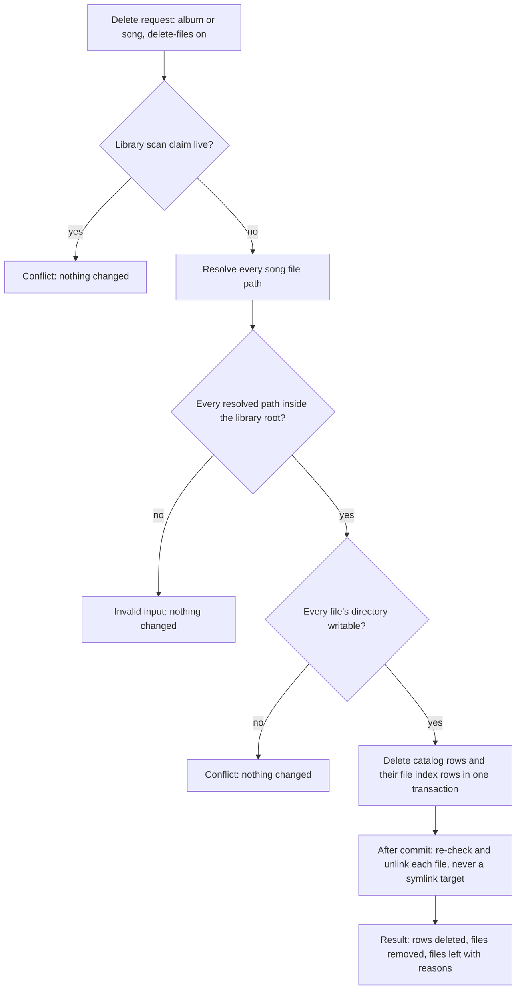

# Deferred Admin/CLI Parity - Plan

## Goal Capsule

- **Objective:** An operator with shell access to the web container can edit and delete catalog content, manage artist credits, covers and per-song lyrics, administer webhooks and register the server, with the same rules and results as the API, and no admin route is left without a command.
- **Means:** every deferred route gets an Application use case shared by its controller and a new console command (KTD1), following `.agents/rules/admin-cli-parity.md`; a Library-owned guard deletes media files (KTD4).
- **Authority:** the Product Contract's requirements win on behavior; KTDs win on mechanism within them; units carry local detail only. `AGENTS.md`, `.agents/rules/admin-cli-parity.md`, `.agents/rules/architecture-rules.md` and the `ddd-*.md` references apply throughout.
- **Stop conditions:** stop and ask the user if a settled decision proves unworkable, if file deletion cannot be confined to library roots as R5 states, or if a fix needs a schema change.
- **Execution profile:** Deep. U1 lands first; U2, U3 and U5 to U9 can then run in parallel; U4 follows U3 and U6; U10 closes out.
- **Finishing:** `ce-work` implements on branch `plan/deferred-cli-parity`; the user reviews and decides when to merge and push.

---

## Product Contract

### Summary

Each of the 31 routes still marked with a deferred `#[CliParityExemption]` gets a console command that runs the same Application use case as its controller, and the deferred exemption constants are then removed. Most of these controllers still hold their rules, so the rules move into Application first. Deleting a song or album with the delete-files option really removes its audio files from the library folder. Defects found in the touched code are fixed in the same work.

### Problem Frame

The first parity round (`docs/plans/2026-10-08-1627-feat-admin-cli-parity-plan.md`) covered the admin pages and deferred the catalog and player admin actions, webhook administration and server discovery registration. Those 31 routes are reachable only over HTTP, so a shell operator cannot edit a song's metadata, fix an artist credit, replace a cover or rotate a webhook secret. Research found that 30 of them keep their rules in the controller, which is the drift the parity rule exists to stop. It also found defects that a command reusing the same code would inherit:

- replacing a cover with one of the same file type deletes the new file;
- the delete-files option never deletes anything, and album deletion stops at 1000 songs;
- artist credit routes answer 204 for targets that do not exist, and a role change can hit an arbitrary link or fail with a 500;
- only the title, type and name locks are enforced, an unknown locked field answers 500, and one request cannot unlock and edit a field;
- an LRCLIB outage looks like "no lyrics found", and applying lyrics to a song that has some answers success while changing nothing;
- webhook secret rotation reports a fixed signing version, and server registration generates its key in the controller.

### Requirements

**Coverage**

- R1. Every route in the inventory below has a console command that runs the same Application command, query or port as its controller.
- R2. After this work no route carries a deferred `#[CliParityExemption]`, the two deferred constants no longer exist, and the parity test fails on any new deferred exemption.
- R3. The new commands follow `.agents/rules/admin-cli-parity.md`: full authority, the shared outcome codes, `--json` printing the API's `data` payload, and confirmation or `--force` for destructive changes.
- R4. A lyrics search command lets an operator find the result to apply, though search is not an admin route.

**File deletion**

- R5. Deleting a song or album with delete-files removes each song's audio file when the file lies inside its library's root; a path outside the root, or a symlink resolving outside it, is refused before anything is deleted.
- R6. Delete-files stays off by default on every path, and the CLI requires `--force` for it even on a terminal.
- R7. A delete reports which files it removed and which it left, and a file it could not remove is re-imported by the next scan.
- R8. A delete-files request on a library that is being scanned is refused as a conflict.
- R9. Album deletion and its preview cover every song of the album, however many.

**Correctness of the reused code**

- R10. Replacing a cover keeps the new image, whatever the old cover's file type, and a failed replacement leaves the old cover in place.
- R11. Artist credit changes answer not found for a missing artist, song, album or link, and a role change names which link it changes.
- R12. Every lockable field's lock is enforced; an unknown locked field is invalid input; a request may unlock a field and change it.
- R13. A lyrics fetch, search or apply distinguishes "the provider is unavailable" from "nothing found"; applying to a song that already has lyrics reports a conflict.
- R14. Deleting an artist also removes its cover image.
- R15. Rotating a webhook secret keeps and reports the webhook's own signing version.
- R16. Server registration creates its API key inside the use case.

**Contract consistency**

- R17. Invalid identifiers and values on these routes answer 422, not 400, and every success response carries its payload under `data`.

#### Route inventory

| Area | Routes (controller method) |
|---|---|
| Album | `AlbumController::update`, `destroy`; `AdminAlbumController::delete`, `deletePreview`; `AlbumCoverController::upload`, `delete` |
| Song | `SongController::update`, `destroy`; `AdminSongController::delete`, `deletePreview` |
| Movie | `MovieController::update`, `destroy` |
| Artist | `ArtistController::store`, `update`, `destroy`, `addSong`, `removeSong`, `updateSongRole`, `addAlbum`, `removeAlbum`, `updateAlbumRole`; `ArtistCoverController::upload`, `delete` |
| Lyrics | `LyricsController::fetch`, `apply` |
| Webhook | `WebhookController::index`, `create`, `update`, `delete`, `rotateSecret` |
| Discovery | `DiscoveryController::register` |

### Key Decisions

- **Delete-files really deletes audio files.** (session-settled: user-directed — chosen over removing the option and over refusing it until designed: the option exists on the API and an operator expects it to work.) Governs R5, R6, R7.
- **CLI access is full authority; controller and command share one use case and its outcomes.** (session-settled: user-directed — chosen over mirroring API role rules and over separate CLI logic, in the first parity round.) Governs R1, R3.
- **These routes were deferred out of the first round into this plan.** (session-settled: user-directed — chosen over covering every admin action in the first round.) Governs R1, R2.
- **Cover upload from the shell reads an image file inside the web container; album and song delete previews are `--dry-run` on the delete commands; webhooks and discovery get commands but no admin page; a search command accompanies lyrics apply.** (session-settled: user-approved — proposed at scoping, confirmed.) Governs R4, R10.

### Scope Boundaries

- No new admin pages, including for webhooks and discovery.
- No library access management (granting or revoking a member's access to a library).
- The web keeps its current actions; its responses change only where R17 and the defect fixes require.
- Considered and not built:
  - A cover-extraction rule that keeps a deleted album cover deleted: re-extraction after a delete is the existing behavior and nobody asked to change it; revisit if operators report covers reappearing.
  - Refusing delete-files on a terminal without `--force` is required by R6; an extra typed confirmation of the file count is not built, because `--force` already makes the destructive intent explicit.
  - Making `LrclibClient` throw on outages for every caller: the bulk fetch relies on today's null result for retries, so only these routes get the distinct outcome (KTD9).

#### Deferred to Follow-Up Work

- Library access management.
- An admin page for webhooks.

---

## Planning Contract

### Key Technical Decisions

- KTD1. **Extract a use case per action before adding its command.** Each route's controller logic moves into an Application command, query or port in its own context, the controller dispatches it, and the command dispatches the same message, per `.agents/rules/admin-cli-parity.md`. The Genre commands (`src/Catalog/Application/Command/Genre/*`, `src/Catalog/Interface/Console/Genre*Command.php`) are the Catalog precedent. Instantiates the use-case Key Decision; governs R1, R3.
- KTD2. **Named contract layers instead of baseline debt.** Catalog Application gains Deptrac access to three named contracts: Media image and storage ports, the Filesystem MIME detector, and the Playlist deletion preview contract, each declared like the existing `Playlist Deletion Preview Contract` layer. Discovery Interface gains Shared Application. Baseline entries for the controllers are pruned as their logic leaves. Chosen over moving cover and preview logic into Infrastructure services, which would leave controllers and commands calling Infrastructure.
- KTD3. **400 becomes 422, and 201 bodies are wrapped.** Invalid public IDs, UUIDs and roles throw `InvalidInputException` (422, exit 2). `ArtistController::store`, `WebhookController::create` and `DiscoveryController::register` return `{data: …}` as their OpenAPI annotations (or, for register, the other routes) describe. Pre-release policy allows the contract change; no web or `ui/rn` code calls these three. Governs R17.
- KTD4. **A Library-owned media file port deletes audio files.** `src/Library/Application/Port/LibraryMediaFilesInterface` (name decided at implementation) takes a library and file paths and deletes them under these rules, so the API and the CLI share one guard:
  1. Check every path before deleting any: the file's fully resolved real path, following symlinks in the file and its parent directories, must lie under the library root's real path (R5), and each existing file's directory must be writable by the server process.
  2. Refuse the whole request when any path fails: a path outside the root is invalid input, an unwritable directory is a conflict naming it. Nothing is deleted.
  3. Delete the `library_file_index` rows of every requested path in the same transaction as the catalog rows, so a file that is later left on disk, or survives a crash after commit, reads as new to the next incremental scan and is re-imported (R7).
  4. After commit, re-check each file's resolved path just before unlinking it, then unlink the path itself; a symlink inside the root is removed as a link, never its target. A file failing the re-check is reported as left.
  Catalog reaches it through a named contract (KTD2). Governs R5, R7.
- KTD5. **Delete order and result.** A delete with delete-files resolves the file list, checks it (KTD4), deletes rows in one transaction, then unlinks. Album, song, movie and artist deletes return 200 with a result payload (deleted counts, files removed, files left with a reason) instead of 204; the CLI prints it, and exits 1 when any requested file was left. A library whose scan claim is live refuses delete-files with a conflict. Governs R6, R7, R8.
- KTD6. **One cover use case for both owners.** A Catalog Application command sets or removes the cover of an album or an artist. It writes each image to a unique path, saves the image and the owner in one transaction, removes the new file if the transaction fails, and deletes the old cover only after commit. `ExtractAlbumCoverHandler` is the model. The size and MIME limits move from `UploadCoverRequest` into the use case; the HTTP upload and the CLI path both pass a file path. Governs R10.
- KTD7. **Artist credit ports report what they found.** The credit methods return whether the artist, target and link exist, as `GenrePortInterface::addAlbumToGenre` does, and the use case maps a miss to not found. A role change takes the link's current role and the new role; when the pair already holds the new role it removes the old link instead of failing on the unique constraint. Governs R11.
- KTD8. **Unlocks before the edit, locks after it.** A metadata update first applies unlocks, then the edit, then new locks (refined during U2: locking before the edit refused the web form's save of a field edited and locked in one debounce), rejects unknown fields as invalid input, and saves only when all of it is accepted. The edit is checked against every locked field in `LOCKABLE_FIELDS`, not only title, type and name. Automatic writers (`AlbumMetadataEnricher`, `ArtistMetadataEnricher`, `AlbumMergeService`) skip locked fields with `isFieldLocked` before calling `updateMetadata`, so enforcement rejects only explicit edits. Governs R12.
- KTD9. **A three-way lyrics result for these routes.** The per-song fetch, search and apply use cases distinguish found, not found and provider unavailable. `FetchLyricsHandler` returns that three-way result and never throws for an outage, so the bulk and auto-fetch async dispatches keep today's behavior. The per-song controller action and `app:song:lyrics:fetch` dispatch `FetchLyricsCommand` synchronously and map unavailable to a new shared outcome (`ServiceUnavailableException`: HTTP 503, exit 1) handled by `ExceptionSubscriber` and `AdminCommandSupport`; search and apply map it the same way. Apply on a song that has lyrics throws a conflict. Governs R13.
- KTD10. **Webhooks get a Notification Application layer.** Commands and a query in `src/Notification/Application/DTO`/`Handler` (the context's layout) with a repository port implemented in Infrastructure replace the controller's `EntityManager` use. Create and rotate return the plain secret once; rotation confirms on a terminal or needs `--force`, because the old secret stops working. Governs R15.
- KTD11. **Command names.** `app:album:{update,delete,cover:set,cover:remove}`, `app:song:{update,delete}`, `app:song:lyrics:fetch`, `app:movie:{update,delete}`, `app:artist:{create,update,delete,cover:set,cover:remove}`, `app:artist:song:{add,remove,role}`, `app:artist:album:{add,remove,role}`, `app:lyrics:{search,apply}`, `app:webhook:{list,create,update,delete,rotate-secret}`, `app:discovery:register`. `app:lyrics:fetch` stays the bulk command. Governs R1, R4.
- KTD12. **Remove the deferred constants.** `CliParityExemption::DEFERRED_CATALOG_PLAYER_ACTION` and `DEFERRED_NO_ADMIN_PAGE` are deleted; the attribute class stays for future exemptions. The parity test gains an assertion that every remaining exemption's reason names no deferral. Governs R2.

### High-Level Technical Design

Delete with delete-files, the only multi-step flow with ordering that matters (KTD4, KTD5):

### Sequencing

U1 adds the shared contracts and outcome every later unit uses. U3 provides the file port U4 needs, and U6 the cover removal U4 reuses for artist deletes. U2 and U5 to U9 touch separate controllers and can proceed in parallel after U1. U10 runs last.

---

## Implementation Units

| Unit | Title | Key files | Depends on |
|---|---|---|---|
| U1 | Shared groundwork | `deptrac.yaml`, `src/Shared/Application/Exception/`, `ExceptionSubscriber`, `AdminCommandSupport` | none |
| U2 | Metadata updates and artist create | `src/Catalog/Application/Command/{Album,Song,Movie,Artist}/`, the four catalog controllers | U1 |
| U3 | Library media file deletion | `src/Library/Application/Port/`, `src/Library/Infrastructure/` | U1 |
| U4 | Catalog deletes with previews | Catalog delete use cases, `AdminAlbumController`, `AdminSongController` | U1, U3, U6 |
| U5 | Artist credits | `ArtistPortInterface`, `ArtistRepository`, `ArtistController` | U1 |
| U6 | Covers | Catalog cover use case, both cover controllers | U1 |
| U7 | Per-song lyrics, search and apply | `src/Lyrics/Application/`, `LyricsController`, `LyricsDialog.tsx` | U1 |
| U8 | Webhook administration | `src/Notification/Application/`, `WebhookController` | U1 |
| U9 | Discovery registration | `RegisterServerHandler`, `DiscoveryController` | U1 |
| U10 | Close out | `CliParityExemption`, parity test, OpenAPI, docs, ROADMAP | U2 to U9 |

### U1. Shared groundwork

- **Goal:** the contracts and outcome the later units need exist.
- **Requirements:** R3, R13, R17.
- **Dependencies:** none.
- **Files:** `deptrac.yaml`; `src/Shared/Application/Exception/ServiceUnavailableException.php` (new); `src/Shared/Infrastructure/EventListener/ExceptionSubscriber.php`; `src/Shared/Interface/Console/AdminCommandSupport.php` (exit code only); `tests/Unit/Shared/Infrastructure/EventListener/UseCaseOutcomeMappingTest.php`; `tests/Unit/Shared/Interface/Console/AdminCommandSupportTest.php`.
- **Approach:**
  1. Declare the named contract layers of KTD2 and grant Catalog Application and Discovery Interface access.
  2. Add the unavailable outcome of KTD9 and map it to 503 and exit 1.
- **Patterns to follow:** the `Playlist Deletion Preview Contract` layer in `deptrac.yaml`; `NotFoundException` and its mapping.
- **Test scenarios:**
  - A handler throwing `ServiceUnavailableException` produces HTTP 503 with its message.
  - `AdminCommandSupport::fail` returns exit 1 for it and prints the message on stderr.
  - Deptrac passes with no new baseline entries.
- **Verification:** the outcome maps on both paths and Deptrac reports 0 violations.

### U2. Metadata updates and artist create

- **Goal:** album, song, movie and artist metadata edits and artist creation run through Application commands shared with new console commands.
- **Requirements:** R1, R3, R12, R17.
- **Dependencies:** U1.
- **Files:** Application commands and handlers under `src/Catalog/Application/Command/{Album,Song,Movie,Artist}/` and `CommandHandler/`; `src/Catalog/Domain/Model/{Album,Song,Artist}.php` (lock order and enforcement); `AlbumMetadataEnricher`, `ArtistMetadataEnricher` and `AlbumMergeService` (skip locked fields, KTD8); `src/Catalog/Interface/Controller/{AlbumController,SongController,MovieController,ArtistController}.php`; console commands `src/Catalog/Interface/Console/{AlbumUpdate,SongUpdate,MovieUpdate,ArtistCreate,ArtistUpdate}Command.php`; tests under `tests/Unit/Catalog/` and `tests/Functional/Catalog/Interface/Console/`; docs pages per KTD11.
- **Approach:**
  1. Move each update's parse, lookup, `updateMetadata`, lock sync and save into a handler that throws the shared outcomes (KTD1, KTD3).
  2. Apply unlocks before the edit and locks after it, and enforce every lockable field (KTD8).
  3. Wrap `ArtistController::store` in `data` (KTD3).
  4. Commands take the public ID and one option per field, `--lock`/`--unlock` lists, and `--json`.
- **Patterns to follow:** `UpdateGenreHandler`, `GenreUpdateCommand`; `AdminUserCliParityTest` for API-versus-CLI comparison.
- **Test scenarios:**
  - Updating an album's title through the API and the CLI stores the same values and both print the same `data`.
  - An unknown locked field answers 422 and exits 2, changing nothing.
  - A request that unlocks `title` and changes it succeeds.
  - Changing a locked `label` is rejected; before this change it was stored.
  - An invalid public ID answers 422 (was 400) and exits 2; an unknown one answers 404 and exits 1.
  - Creating an artist returns `{data: …}` with 201, and the CLI prints the same resource.
  - Movie update accepts title, year and summary and has no lock options.
  - A forced metadata enrichment of an album with a locked label leaves the label unchanged and still applies the year.
  - Merging into an album with a locked empty field succeeds and leaves that field empty.
- **Verification:** each update route marks `#[CliCounterpart]`, and the parity and functional tests pass.

### U3. Library media file deletion

- **Goal:** one guarded port deletes audio files inside a library's root.
- **Requirements:** R5, R7, R8.
- **Dependencies:** U1.
- **Files:** `src/Library/Application/Port/LibraryMediaFilesInterface.php` (name per KTD4); its Infrastructure implementation under `src/Library/Infrastructure/`; `LibraryFileIndexRepository` (delete by path, already present); `deptrac.yaml` (contract layer for Catalog); tests `tests/Unit/Library/` and `tests/Integration/Library/` with a temporary directory tree.
- **Approach:**
  1. Resolve the library root's real path and check every requested path under KTD4's rules before touching any.
  2. Delete the requested paths' index rows inside the caller's transaction, then, after commit, re-check and unlink each file and report removed, already missing and left separately (KTD4).
  3. Expose whether the library's scan claim is live, so the delete can refuse (KTD5).
- **Patterns to follow:** `LibraryScanClaims` for library lookup; `ControlSocketDirectory` for path and symlink checks.
- **Test scenarios:**
  - A file inside the root is removed and its index row deleted.
  - A path outside the root refuses the whole request and removes nothing.
  - A root that is itself a symlink still accepts files under its real path.
  - A symlinked file whose target lies outside the root refuses the whole request and removes nothing.
  - A symlinked file whose target lies inside the root: the link is removed, the target remains.
  - A file under a parent directory that is a symlink pointing outside the root is refused.
  - A path with `..` that escapes the root is refused.
  - A read-only library directory refuses delete-files with a conflict and deletes nothing.
  - A file that is already missing reports as missing.
  - A file that cannot be unlinked after commit reports as left, has no index row, and the next incremental scan re-imports it.
- **Verification:** integration tests against a real directory tree pass, including the symlink cases.

### U4. Catalog deletes with previews

- **Goal:** album, song, movie and artist deletion run through Application use cases with previews and real file deletion.
- **Requirements:** R1, R3, R5, R6, R7, R8, R9, R14, R17.
- **Dependencies:** U1, U3, U6.
- **Files:** delete commands and preview queries under `src/Catalog/Application/`; `src/Catalog/Infrastructure/{AlbumService,SongService,MovieService}.php` (remove the storage-port file delete and the 1000 limit); `src/Catalog/Interface/Controller/{AdminAlbumController,AdminSongController,AlbumController,SongController,MovieController,ArtistController}.php`; console commands `{AlbumDelete,SongDelete,MovieDelete,ArtistDelete}Command.php`; tests `tests/Functional/Catalog/`, `tests/Unit/Catalog/`; docs pages.
- **Approach:**
  1. Previews become queries; `--dry-run` on the delete command prints the preview, including per-file verdicts when `--delete-files` is given.
  2. Deletion follows KTD5's order and result shape, with every song of the album (no 1000 cap).
  3. Album and song deletes take `--delete-files` (requires `--force`, per R6) and album delete `--keep-cover`; `AlbumController::destroy` and `SongController::destroy` dispatch the same commands with the defaults.
  4. The artist delete handler removes the artist's cover image, file and derived files after the delete commits, reusing U6's cover removal through the KTD2 Media contract (R14).
- **Execution note:** start with a functional test that deletes an album with delete-files against a real library folder; today it removes nothing.
- **Patterns to follow:** `PruneMissingImagesCommand` for `--dry-run`, `LibraryDeleteCommand` for confirmation.
- **Test scenarios:**
  - Deleting an album with delete-files removes every song file under the library root and returns the result payload with counts.
  - An album with 1,200 songs is deleted completely, and its preview counts 1,200.
  - A song whose path lies outside the root refuses the album delete with 422; nothing is deleted.
  - A delete-files request while the library is scanning answers 409.
  - A file that cannot be removed leaves the catalog rows deleted, is listed under files left, and the CLI exits 1.
  - `--delete-files` without `--force` on a terminal exits 2 and changes nothing.
  - `--dry-run` prints the preview `data` the API returns and changes nothing.
  - Deleting an artist removes its cover image row and file.
  - Movie delete removes the movie and its video rows.
  - API and CLI deletes of the same fixture leave the same state.
- **Verification:** every delete and preview route marks its counterpart; no audio file is left behind for an allowed path.

### U5. Artist credits

- **Goal:** adding, removing and changing an artist's song and album credits run through use cases that report missing targets.
- **Requirements:** R1, R3, R11, R17.
- **Dependencies:** U1.
- **Files:** `src/Catalog/Application/Port/ArtistPortInterface.php` (or the port the controller uses); `src/Catalog/Infrastructure/Doctrine/Repository/ArtistRepository.php`; credit commands and handlers under `src/Catalog/Application/`; `ArtistController`; console commands for `app:artist:song:*` and `app:artist:album:*`; `tests/Integration/ArtistMutationFirewallTest.php` and new functional tests; docs pages.
- **Approach:**
  1. Return found or not found from each credit method (KTD7).
  2. The role change takes the current role and the new role; the CLI requires `--from` when the pair has several roles.
  3. Song and album are identified by internal UUID, as in the Genre link commands.
- **Patterns to follow:** `GenreAlbumAddCommand`, `GenreLinkTarget`.
- **Test scenarios:**
  - Adding a credit for a song that does not exist answers 404 (was 204) and exits 1.
  - Removing a credit that does not exist answers 404.
  - Changing `featured` to `producer` on a pair with both roles removes the `featured` link instead of failing with 500.
  - Changing a role on a pair with two roles without naming the current one is invalid input.
  - An invalid role answers 422 (was 400) and exits 2.
  - Adding the same credit twice succeeds without a duplicate.
- **Verification:** the six credit routes mark their counterparts, and the firewall test still passes.

### U6. Covers

- **Goal:** album and artist covers are set and removed through one use case, from the API and from a file path in the container.
- **Requirements:** R1, R3, R10, R17.
- **Dependencies:** U1.
- **Files:** cover command and handler under `src/Catalog/Application/`; `src/Catalog/Interface/Controller/{AlbumCoverController,ArtistCoverController}.php`; `src/Catalog/Interface/Request/UploadCoverRequest.php` (limits move out); console commands `app:album:cover:set|remove`, `app:artist:cover:set|remove`; `tests/Unit/Catalog/Interface/Controller/AlbumCoverControllerTest.php` (fix the test that hid the defect); new functional tests; docs pages.
- **Approach:**
  1. Implement KTD6; the controllers pass the uploaded file's temporary path, the command passes the given path.
  2. Keep the 10 MB limit and the JPEG, PNG and WebP MIME check in the handler.
  3. Remove deletes the cover image, its derived files and record, and clears the owner's cover.
- **Patterns to follow:** `ExtractAlbumCoverHandler` (`src/Metadata/Application/CommandHandler/ExtractAlbumCoverHandler.php`).
- **Test scenarios:**
  - Replacing a JPEG cover with another JPEG keeps the new file on disk and serves it.
  - A failed save after the file write removes the new file and keeps the old cover.
  - A file over 10 MB, a non-image, and a missing path are each invalid input (exit 2).
  - Setting an artist cover from the CLI and the API produce the same `data`.
  - Removing a cover that does not exist answers 404 and exits 1.
- **Verification:** the four cover routes mark their counterparts; a replaced cover's file exists after replacement.

### U7. Per-song lyrics, search and apply

- **Goal:** fetching lyrics for one song, searching LRCLIB and applying a result run through shared use cases with honest outcomes.
- **Requirements:** R1, R3, R4, R13, R17.
- **Dependencies:** U1.
- **Files:** `src/Lyrics/Application/` (fetch result, search query, apply command); `src/Lyrics/Infrastructure/` client adapter result type; `src/Lyrics/Interface/Controller/LyricsController.php`; console commands `app:song:lyrics:fetch`, `app:lyrics:search`, `app:lyrics:apply`; `ui/web/src/features/catalog/components/LyricsDialog.tsx` (show the conflict and unavailable messages); `tests/Functional/Lyrics/Interface/Controller/LyricsControllerTest.php`, `tests/Integration/LyricsFirewallTest.php`; docs pages.
- **Approach:**
  1. The per-song fetch dispatches `FetchLyricsCommand` synchronously; `LyricsService::fetchAndStore` stops duplicating it.
  2. `FetchLyricsHandler` returns the three-way result of KTD9 and never throws for an outage; only the per-song route and command map unavailable to the 503 outcome.
  3. Apply on a song that has lyrics throws a conflict; fetch keeps returning existing lyrics, which stays deliberate.
  4. Commands read with the unrestricted library scope (full authority).
- **Patterns to follow:** existing `FetchLyricsHandler`; the LRCLIB stub in `LyricsControllerTest`.
- **Test scenarios:**
  - Fetching lyrics for a song with none stores and prints them through the API and the CLI.
  - An LRCLIB outage answers 503 and exits 1, where it answered 200 with empty data.
  - An auto-fetch message handled during an LRCLIB outage completes with no lyrics and is not retried.
  - Search prints the LRCLIB results with their IDs; a search with no query is invalid input.
  - Applying a result to a song without lyrics stores it; applying to a song with lyrics answers 409 and leaves them unchanged.
  - The web dialog shows the conflict message instead of "Lyrics applied".
- **Verification:** fetch and apply mark their counterparts; the bulk fetch's tests still pass unchanged.

### U8. Webhook administration

- **Goal:** webhook list, create, update, delete and secret rotation run through Notification Application use cases shared with console commands.
- **Requirements:** R1, R3, R15, R17.
- **Dependencies:** U1.
- **Files:** `src/Notification/Application/DTO/*Webhook*Command.php`, `Handler/`, a webhook repository port and Infrastructure implementation; `src/Notification/Interface/Controller/WebhookController.php`; console commands `app:webhook:{list,create,update,delete,rotate-secret}`; `tests/Functional/Controller/WebhookControllerTest.php` (flat create body becomes `data`) and new console tests; `deptrac.baseline.yaml` (drop the controller entry); docs pages.
- **Approach:**
  1. Move URL resolution, category validation, secret generation and encryption into handlers (KTD10).
  2. Rotation reports the webhook's own signing version (R15) and confirms or needs `--force`.
  3. Create and rotate print the plain secret once; list never shows it.
- **Patterns to follow:** Notification's `Application/DTO` plus `Handler` layout; the DNS stub in `WebhookControllerTest`.
- **Test scenarios:**
  - Creating a webhook through the CLI stores the same row as the API, and both print the secret once.
  - A URL that resolves to a private address is invalid input on both paths.
  - Rotating a webhook whose signing version is 1 reports version 1.
  - Rotating without `--force` and without a terminal exits 2 and keeps the old secret.
  - Deleting an unknown webhook answers 404 and exits 1.
  - Updating `category_filter` to null clears it.
- **Verification:** the controller no longer uses `EntityManagerInterface`; the five routes mark their counterparts.

### U9. Discovery registration

- **Goal:** server registration creates its key in the use case and has a command.
- **Requirements:** R1, R3, R16, R17.
- **Dependencies:** U1.
- **Files:** `src/Discovery/Application/Command/RegisterServerCommand.php`, its handler; `src/Discovery/Interface/Controller/DiscoveryController.php`; console command `app:discovery:register`; `tests/Functional/Controller/DiscoveryControllerSecurityTest.php`; a console test; docs page.
- **Approach:**
  1. Generate the API key in the handler; the command and controller no longer pass one.
  2. Return `{data: …}` with 201 (KTD3); the key is never printed.
- **Test scenarios:**
  - Registering from the CLI creates the server and prints the resource without a key.
  - Registering the same URL again keeps its public ID on both paths.
  - A malformed URL is invalid input (exit 2).
- **Verification:** register marks its counterpart; no controller generates the key.

### U10. Close out

- **Goal:** no deferred exemption remains, and the contract, docs and roadmap match the code.
- **Requirements:** R2, R17.
- **Dependencies:** U2 to U9.
- **Files:** `src/Shared/Interface/Attribute/CliParityExemption.php`; `tests/Integration/AdminCliParityTest.php` and `tests/Support/AdminCliParity/AdminCliParityChecker.php`; `deptrac.baseline.yaml`; `openapi.json`; `ui/web/src/shared/api-client/gen/`; `docs-book/part-1-operator-guide/commands/README.md`; `ROADMAP.md`; `.agents/rules/admin-cli-parity.md` (drop the deferral sentence).
- **Approach:**
  1. Delete the deferred constants (KTD12) and add the parity assertion.
  2. Prune stale Deptrac baseline entries for the controllers.
  3. Regenerate `openapi.json` and the web client; run web typecheck, lint and tests.
  4. Mark ROADMAP item 2's deferred work done.
- **Test scenarios:**
  - The parity test fails when a fixture route carries an exemption whose reason names a deferral.
  - The parity test passes on the real routes with no deferred exemption left.
- **Verification:** the Verification Contract below passes in full.

---

## Verification Contract

| Check | Command | When |
|---|---|---|
| Unit | `bash scripts/test-unit-container.sh` | every unit; host `php vendor/bin/phpunit -c phpunit.xml.dist <files>` while iterating |
| Functional and integration | `BAANDER_TEST_IMAGE=baander-ci-prewarm:local bash scripts/test-functional-container.sh tests/Functional` and `tests/Integration` | per unit on touched files; full at U10 |
| Parity and docs | `tests/Integration/AdminCliParityTest.php`, `tests/Unit/Docs/CommandDocsCoverageTest.php` | every unit that adds a command |
| Static analysis | `vendor/bin/phpstan analyse`, `vendor/bin/deptrac analyse --no-progress`, `bin/console lint:container --env=test` | every unit |
| API contract | `bin/console app:export-openapi-spec --env=test --no-debug --check` | U10, and any unit changing a status or body |
| Web | in `ui/web`: `yarn generate`, `yarn typecheck`, `yarn lint`, `yarn test` | U7 and U10 |

## Definition of Done

- Every route in the inventory carries `#[CliCounterpart]`, no deferred exemption constant exists, and the parity test enforces it.
- Each new command has a docs page and an index row, and its `--json` output matches the API's `data` in a functional test.
- Every defect listed in the Problem Frame has a test that failed before its fix.
- File deletion is proven against a real directory tree, including the symlink and outside-root cases.
- The Verification Contract passes in full on the final commit.
- No code from abandoned approaches remains in the diff.
