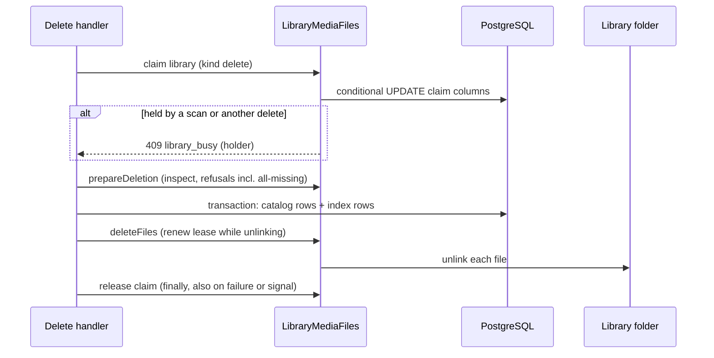

# ROADMAP Item 2 Open Items - Plan

## Goal Capsule

- **Objective:** ROADMAP item 2 has no open sub-items: deletes with files can no longer bring deleted songs back or reach another library's files, the reported defects are fixed, admins can manage who sees a library, API responses speak the user's language without leaking it to other requests, the WebSocket identity hole is gone, and the housekeeping items are done.
- **Means:** fourteen sub-items grouped into ten units (U1 to U10). A delete with files holds a library claim of its own kind (KTD1). Translated API text uses each request's locale explicitly instead of a shared translator setting (KTD6).
- **Authority:** the Product Contract's requirements win on behavior; KTDs win on mechanism within them; units carry local detail only. `AGENTS.md`, `.agents/rules/admin-cli-parity.md`, `.agents/rules/architecture-rules.md`, `.agents/rules/frontend.md` and the relevant `ddd-*.md` references apply throughout. PostgreSQL work follows `.agents/skills/postgres-remediation/SKILL.md` and goes to the postgres specialist.
- **Stop conditions:** stop and ask the user if a decision in Key Decisions proves unworkable, if the per-request locale cannot be carried without changing every translation call site in the codebase, or if removing `auth.reconnect` reveals a client that uses it.
- **Execution profile:** Deep. U1 lands before U2; the other units are independent and can run in parallel; U10 closes out.
- **Finishing:** `ce-work` implements on branch `plan/item2-open-items`; the user reviews and decides when to merge and push.

---

## Product Contract

### Summary

The fourteen open sub-items under ROADMAP item 2 are each fixed or closed by a recorded decision. Library deletes with files become safe against scans, empty mounts and overlapping roots; lyrics and enrichment stop losing or misreporting data; admins get library access management on the admin user page and in the CLI; API errors follow the user's saved language; `auth.reconnect` is removed; leaving a party ends the party room membership; `findAfterId()` goes; the `ui/rn` test setup runs again. ROADMAP's quality-gate checkpoint is refreshed.

### Problem Frame

The two Admin/CLI parity rounds left a list of open items behind them in ROADMAP item 2. Several are real defects that lose data or mislead: a scan or a queued import can re-create songs whose files a delete is removing, an unmounted library folder makes every file look missing so a delete drops their index rows and the next scan re-imports the album, two libraries with nested roots can index one file twice so deleting it for one removes it from the other, a lyrics apply racing a queued fetch answers 500, and metadata enrichment saves a snapshot taken seconds earlier, reverting what an operator set meanwhile. A lyrics fetch to a stalled LRCLIB has no timeout. Two features were never built: an admin cannot grant or revoke a member's access to a library, and no API request can get its errors in Danish or Thai even though the translations exist. `auth.reconnect` lets one user's WebSocket take another user's identity with a valid token, though every socket already authenticates when it opens and no client sends the message. A member who leaves a party over HTTP keeps receiving its events. `findAfterId()` was written for SSE replay, which was removed, and the `ui/rn` test setup has been broken since React Native work was deferred.

### Requirements

**Library deletes with files**

- R1. While a delete with files runs, the library is held: no scan starts, and a scan already holding the library refuses the delete. The library's scan status and last scan time are untouched by a delete.
- R2. A queued file import skips files that no longer exist on disk and creates no album for a directory whose files are all gone.
- R3. A delete with files refuses when every requested file reads as missing; a request with no files (an album without songs) is not refused for that reason.
- R4. A library whose root lies inside another library's root, or contains one, is refused at creation.
- R5. The missing `unlinkat()` race is documented for operators as an accepted limit.

**Lyrics and enrichment**

- R6. Applying lyrics to a song that gets lyrics concurrently answers the 409 conflict, not a 500; a fetch that loses the same race returns the stored lyrics.
- R7. A lyrics request to LRCLIB gives up after a bounded time and reports LRCLIB as unavailable.
- R8. Metadata enrichment decides and writes from the entity's current stored state, so a field edit, lock or cover set made during its provider lookups survives.

**Library access**

- R9. An admin can list, grant and revoke a user's access to each library from the admin user page and from the console, through one use case; unknown users or libraries answer not found; granting twice or revoking twice succeeds.

**Locale**

- R10. API error and outcome messages use the signed-in user's saved language choice, else the request's `Accept-Language` among the enabled locales, else English; concurrent requests never see each other's language.

**WebSocket and party**

- R11. `auth.reconnect` and reconnection tokens no longer exist; a socket's identity is fixed at its handshake.
- R12. Leaving a party, over HTTP or the WebSocket, removes every socket of that user from the party room; ending a party removes every socket from it.

**Housekeeping**

- R13. `NotificationRepositoryInterface::findAfterId()` is removed.
- R14. The `ui/rn` Jest suites and `tsc` check run without setup errors, and CI runs them.
- R15. ROADMAP item 2 lists no open sub-items, and its quality-gate checkpoint records the 2026-10-09 verified numbers.

### Key Decisions

All confirmed by the user in the scoping synthesis on 2026-10-10.

- **A delete with files holds the library; a queued import skips missing files.** (session-settled: user-approved — chosen over refusing only while a scan runs.) Governs R1, R2.
- **Refuse a delete with files when every file reads as missing.** (session-settled: user-approved — chosen over detecting mount points.) Governs R3.
- **Refuse nested library roots at creation.** (session-settled: user-approved — chosen over allowing overlaps and deduplicating files.) Governs R4.
- **Accept and document the `unlinkat()` limit.** (session-settled: user-approved — chosen over a native extension or a shell-out.) Governs R5.
- **Remove `auth.reconnect`.** (session-settled: user-approved — chosen over keeping it for the same user only.) Governs R11.
- **Library access lives on the admin user page with `app:library:member:*` commands.** (session-settled: user-approved — chosen over a per-library members page.) Governs R9.
- **API language: saved choice, then `Accept-Language`, then English.** (session-settled: user-approved — chosen over `Accept-Language` only and over saved choice only.) Governs R10.
- **Remove `findAfterId()`.** (session-settled: user-approved — chosen over keeping it for a future replay.) Governs R13.

### Scope Boundaries

- ROADMAP item 3 (timestamp convention) is not part of this plan.
- React Native feature work stays deferred; only the `ui/rn` test and type-check setup is repaired.
- A library's root cannot be changed after creation (no route or command does it), so the overlap check covers creation only.
- Considered and not built:
  - Revoking library access does not invalidate signed video segment URLs already issued (valid up to 24 hours) or remove queued party items; the next request after revocation is refused. Change it if signed URLs become long-lived for audio too.
  - Mount-point detection beyond "every file missing": a mount with some files left is not detected. Change it on a report of a partially mounted library.

#### Deferred to Follow-Up Work

- Older controllers that keep a private `dispatch()` copy next to `DispatchesMessagesTrait` (`GenreController`, `LibraryController`, Auth admin controllers).
- The three Catalog update handlers repeat one unlock/edit/lock skeleton.

---

## Planning Contract

### Key Technical Decisions

- KTD1. **A library claim has a kind.** A migration adds a claim kind (`scan` or `delete`) to the claim columns on `libraries` and rewrites `chk_libraries_scan_claim` so `scan_status = 'scanning'` goes with a `scan` claim only, while a `delete` claim leaves `scan_status` and `last_scan` alone. `claimScan`, `hasLiveScanClaim`, the scan status read and the in-memory fake account for the kind. A delete claims the library before `inspect()`, renews the lease while unlinking, and releases it in a `finally` that also covers a failed transaction. A lapsed claim left by a dead scan is first released as an abandoned scan (`scan_status` becomes `failed`, as `app:library:scan --release` does), so the takeover never violates the constraint; the console delete commands release it on SIGINT/SIGTERM as `ScanLibraryCommand` does. A refusal names the holder (`library_busy` with the holder kind) so a scan blocked by a delete, and a delete blocked by a scan, say which. Governs R1. Postgres specialist.
- KTD2. **Imports wait for a delete, then filter missing files.** While a delete claim holds the library, `FilesDiscoveredHandler` does not import: it re-queues the message with a delay until the claim ends, so a song cannot be imported from a file the delete is about to unlink (scans only drop index rows, so such a song would stay in the catalog). Once free, it drops entries whose file is gone before `resolveAlbum()`, so no empty album appears; the movie path filters the same way. The handler keeps both transport bindings. Governs R1, R2.
- KTD3. **Race-prone inserts use `ON CONFLICT DO NOTHING` through DBAL.** Lyrics gets an insert that reports whether it inserted (apply throws the existing conflict; fetch re-reads and returns the stored lyrics), and library access grant becomes the same shape. Catching a unique violation is not used: it closes the EntityManager. Governs R6, R9.
- KTD4. **Enrichers refresh the entity after their lookups.** A Catalog port method re-reads an album, artist or song from the database (bypassing the identity map) after the provider lookups and before `applyData()`; all lock and null checks and the save run against that state. Applies to the album, artist and song enrichers. Governs R8.
- KTD5. **Library access is a Library use case behind an admin route on users.** `GET/PUT/DELETE /api/admin/users/{userId}/libraries[/{libraryId}]`, owned by Library Interface, guarded like the admin user settings route, with `app:library:member:list|grant|revoke` naming users by email or UUID through `UserIdentifierResolverInterface`. Deptrac gains the needed contract edges. The dead `AdminUser.libraryAccess` web field is replaced by the new endpoint. Governs R9.
- KTD6. **Per-request locale, never a shared translator setting.** The shared translator is one instance per worker and requests interleave as coroutines, so `LocaleListener` stops calling `setLocale()`. A listener in `src/Auth/Interface/EventListener/`, after the firewall, resolves the locale in R10's order and stores it in a Baander request attribute (`_baander_locale`), never through `Request::setLocale()`: Symfony's `LocaleAwareListener` copies a request locale onto the shared translator, including for the error sub-request a 4xx creates. The same listener handles `kernel.exception` for a request the firewall refused before it ran (no resolved locale), so firewall 401/403 responses resolve the locale too. Translation sites pass the attribute's locale explicitly: `ExceptionSubscriber` (which also renders 401/403 `HttpException`s as `ApiError` with the existing `errors.unauthorized.default` and `errors.forbidden.default` keys), `ValidationExceptionSubscriber`, controller `TranslatorTrait` calls (reading the attribute through the request stack, English when absent), and the password, OAuth2 and passkey authenticators' failure responses, which resolve from `Accept-Language` because they run inside the firewall. Governs R10.
- KTD7. **Party room membership follows party membership.** The leave and end handlers dispatch a domain event. A listener in Party Infrastructure handles it and calls a new Shared Application port, beside `LiveConnectionsPortInterface`, implemented in Shared Infrastructure over the WebSocket connection registry and pusher: it removes every socket of the affected user (or all sockets on end) from the party room and broadcasts once, and does nothing without an attached Swoole server. The party room name moves from `WebSocketRoomPolicy` (Shared Interface) into Shared Infrastructure, and `WebSocketRoomPolicy` delegates to it, so Shared never depends on Party. Governs R12.

### High-Level Technical Design

A delete with files under KTD1:

Locale under KTD6: the request's locale is resolved once after authentication and passed with each translation; the shared translator's own locale stays English.

### Sequencing

U1 before U2 (both change `LibraryMediaFiles` and the delete handlers). U3 to U9 are independent of each other and of U1/U2. U10 closes out after all.

---

## Implementation Units

### U1. Library claim kinds; deletes hold the library

- **Goal:** a delete with files holds the library for its whole run without touching scan status.
- **Requirements:** R1 (KTD1).
- **Dependencies:** none.
- **Files:** a new migration under `migrations/`; `src/Library/Domain/Repository/LibraryRepositoryInterface.php`; `src/Library/Infrastructure/Doctrine/Repository/LibraryRepository.php`; `src/Library/Application/Service/LibraryScanClaims.php`; `src/Library/Application/Port/LibraryMediaFilesInterface.php` and `src/Library/Infrastructure/Filesystem/LibraryMediaFiles.php`; `src/Catalog/Application/CommandHandler/{Album/DeleteAlbumHandler,Song/DeleteSongHandler}.php`; `src/Catalog/Interface/Console/{AlbumDeleteCommand,SongDeleteCommand}.php`; the scan-in-progress exception and `translations/library+intl-icu.{en,da,th}.yaml`; `tests/Fixtures/Library/InMemoryLibraryRepository.php`; tests in `tests/Integration/LibraryScanClaimTest.php`, `tests/Integration/Library/LibraryMediaFilesTest.php`, `tests/Unit/Catalog/Application/CommandHandler/CatalogDeleteHandlersTest.php`, `tests/Functional/Catalog/Interface/Console/CatalogDeleteCommandsTest.php`; docs `app-album-delete.md`, `app-song-delete.md`, `app-library-scan.md`, `src/Library/README.md`.
- **Approach:**
  1. Migration and constraint per KTD1; update every claim method and the fake; `app:library:scan --release` reports and can release either kind.
  2. The port gains claim and release steps; the docblock call order becomes claim → prepare → transaction → delete files → release.
  3. Handlers wrap the sequence in try/finally; the commands install signal handlers that release.
- **Patterns to follow:** `LibraryScanClaims`/`LibraryScanLease` for lease and renewal; `ScanLibraryCommand` for signals.
- **Test scenarios:**
  - A delete with files on an idle library succeeds, and afterwards the library has no claim and the same `scan_status` and `last_scan` as before.
  - A scan started while a delete holds the library is refused with `library_busy` naming `delete`.
  - A delete with files while a scan holds the library is refused with `library_busy` naming `scan`.
  - A delete whose transaction fails releases the claim.
  - A delete whose claim lapsed and was taken by another holder stops unlinking and reports the remaining files as left.
  - A delete with files on a library whose scan died with its claim lapsed succeeds and leaves the library `failed` with no claim.
  - The constraint rejects `scanning` with a `delete` claim and a claim without a kind.

### U2. Import skips missing files; all-missing deletes refuse; unlinkat documented

- **Goal:** queued imports and empty mounts cannot resurrect deleted songs.
- **Requirements:** R2, R3, R5 (KTD2).
- **Dependencies:** U1.
- **Files:** `src/Catalog/Application/CommandHandler/FilesDiscoveredHandler.php`; `src/Library/Infrastructure/Filesystem/LibraryMediaFiles.php`; `src/Library/Application/Port/LibraryMediaFileInspection.php`; a new Library conflict exception beside `LibraryRootUnavailableException`; `src/Catalog/Application/Query/FileDeletionPreview.php`; tests under `tests/Unit/Catalog/Application/CommandHandler/` (FilesDiscovered tests), `tests/Unit/Library/Infrastructure/Filesystem/MediaFileGuardTest.php`, `tests/Integration/Library/LibraryMediaFilesTest.php`; docs `app-album-delete.md`, `app-song-delete.md`, `docs-book/part-2-developer-guide/contexts/library.md`.
- **Approach:** while a delete claim is live on the message's library, re-queue the import with a delay instead of importing (KTD2); then filter missing files before `resolveAlbum()` and before ffprobe on the movie path; `allowsDeletion()` and `prepareDeletion()` refuse when the request has files and all are missing (reason `all_files_missing`); the operator pages gain the `unlinkat()` note from the `MediaFileGuard` docblock.
- **Test scenarios:**
  - An import message for a library held by a delete is re-queued and imports nothing until the claim ends.
  - An import message whose files are all gone creates no album and no songs.
  - An import with one file gone imports the others.
  - A movie import with its file gone does not throw.
  - A delete with files where every file is missing is refused with `all_files_missing`, and its preview reports `allowed: false`.
  - An album with no songs deletes with files without a refusal.

### U3. Nested library roots refused at creation

- **Goal:** no file can belong to two libraries.
- **Requirements:** R4.
- **Dependencies:** none.
- **Files:** `src/Library/Application/CommandHandler/CreateLibraryHandler.php`; the Library repository (a read of existing roots); a new outcome exception with translations; `tests/Unit/Library/Application/CommandHandler/CreateLibraryHandlerTest.php`; `tests/Functional/Library/LibraryAdministrationTest.php` (distinct, non-nested fixture directories); `docs-book/part-1-operator-guide/commands/app-library-create.md`.
- **Approach:** compare on a `/` boundary using real paths when they resolve and the normalised path otherwise; the slug check runs first so the existing locale test keeps its slug 409. Do not reuse `LibraryPath::isWithin()` (bare prefix match).
- **Test scenarios:**
  - Creating `/media/music/rock` when `/media/music` exists is refused, and so is the reverse.
  - Creating `/media/music2` when `/media/music` exists succeeds.
  - Creating a library whose root does not exist yet is checked lexically.
  - A duplicate slug is still reported as the slug conflict.

### U4. Lyrics insert race and LRCLIB timeout

- **Goal:** lyrics races answer correctly and LRCLIB cannot hold a request open.
- **Requirements:** R6, R7 (KTD3).
- **Dependencies:** none.
- **Files:** `src/Lyrics/Domain/Repository/LyricsRepositoryInterface.php`; `src/Lyrics/Infrastructure/Doctrine/Repository/LyricsRepository.php`; `src/Lyrics/Application/CommandHandler/{ApplyLyricsHandler,FetchLyricsHandler}.php`; `src/Lyrics/Infrastructure/Api/LrclibClient.php`; tests `tests/Unit/Lyrics/Application/CommandHandler/{Apply,Fetch}LyricsHandlerTest.php`, `tests/Functional/Lyrics/Infrastructure/Doctrine/Repository/LyricsRepositoryTest.php`, `tests/Unit/Lyrics/Infrastructure/Api/LrclibClientTest.php`.
- **Approach:** an insert that sets the NOT NULL timestamps and reports whether it inserted; apply maps "not inserted" to the existing conflict, fetch re-reads; the client sets `timeout` and `max_duration` like `WebhookDeliveryService`.
- **Patterns to follow:** `UserSettingRepository`, `SystemSettingRepository` for `ON CONFLICT`.
- **Test scenarios:**
  - Inserting lyrics for a song that already has them reports not inserted and leaves the stored row unchanged (real PostgreSQL).
  - Apply that loses the race answers the 409 with the stored lyrics unchanged.
  - Fetch that loses the race returns the stored lyrics as found.
  - The client passes a timeout and a max duration, and a timeout maps to unavailable.

### U5. Enrichment reads current state

- **Goal:** enrichment never reverts an edit made during its lookups.
- **Requirements:** R8 (KTD4).
- **Dependencies:** none.
- **Files:** Catalog ports and repositories for album, artist and song (a refresh read); `src/Metadata/Application/{AlbumMetadataEnricher,ArtistMetadataEnricher,SongMetadataEnricher}.php`; `tests/Unit/Metadata/Application/MetadataEnricherLockedFieldsTest.php`; a new integration test with real PostgreSQL.
- **Approach:** after `searchGeneral()` and the MBID switch, refresh the target from the database and apply to that; keep the lock and null checks unchanged.
- **Test scenarios:**
  - An album whose year is set and locked in the database after the enricher loaded it keeps that year and lock after enrichment.
  - An album whose cover is set during the lookup keeps the new cover.
  - Fields the enricher may fill are still filled.

### U6. Library access administration

- **Goal:** admins manage who sees each library, from the admin user page and the console.
- **Requirements:** R9 (KTD3, KTD5).
- **Dependencies:** none.
- **Files:** Library Application commands, query and handlers; `src/Library/Infrastructure/Doctrine/Repository/LibraryAccessRepository.php` (`ON CONFLICT` grant); a new controller in `src/Library/Interface/Controller/`; console commands `src/Library/Interface/Console/LibraryMember{List,Grant,Revoke}Command.php`; `deptrac.yaml`; docs pages `app-library-member-{list,grant,revoke}.md` and README rows; web: `ui/web/src/features/admin/api/user-admin-api.ts` (remove `libraryAccess`), a library access dialog under `ui/web/src/features/admin/components/users/`, `UserRowActions.tsx`; tests: unit handlers, a functional two-path test, web dialog tests, `tests/Integration/AdminCliParityTest.php` passing.
- **Approach:**
  1. Handlers look up user and library first (`NotFoundException`); grant and revoke are idempotent; the list shows every library with granted/not-granted; regenerate OpenAPI and the client.
  2. The web dialog, opened from a "Library access" row action, follows `AssignRolesDialog`: one checkbox per library labelled with its name, and a Save button that sends a grant or revoke for each changed row only. It shows a loading state, an empty-libraries message, a disabled pending state while saving, and on a failed request an inline error naming the libraries not saved, with those rows reverted and the dialog left open; focus returns to the row action on close.
- **Test scenarios:**
  - Granting access lets the user see the library's albums; revoking hides them on the next request.
  - Granting twice succeeds once in storage; revoking access the user lacks succeeds.
  - An unknown user or library answers 404 and exits 1.
  - Two concurrent grants both succeed (real PostgreSQL).
  - API and CLI on the same fixture leave the same state and print the same `data`.
  - The web dialog lists every library with its current access and saves only the rows that changed.
  - With no libraries, the dialog shows the empty message and no Save action.
  - A failed revoke leaves that row checked, shows an inline error naming the library, and keeps the dialog open.

### U7. Per-request API language

- **Goal:** API messages follow each user's language without leaking between requests.
- **Requirements:** R10 (KTD6).
- **Dependencies:** none.
- **Files:** `src/Shared/Infrastructure/EventListener/LocaleListener.php` (stop mutating the translator); a new listener in `src/Auth/Interface/EventListener/` (request after the firewall, and exception); `src/Auth/Interface/Request/AcceptLanguageMatcher.php` (reused); `src/Shared/Infrastructure/EventListener/{ExceptionSubscriber,ValidationExceptionSubscriber}.php` and `src/Shared/Interface/Controller/TranslatorTrait.php` (explicit locale); the password, OAuth2 and passkey authenticators' failure handlers and `auth`-domain translations in en, da and th; `src/UserPreference/Application/Settings/LanguageSettingDefinitions.php` and the web labels in `UserLanguageField.tsx`, `EditUserDialog.tsx` ("Language", covering emails and the API); tests: `tests/Unit/Shared/Infrastructure/EventListener/LocaleListenerTest.php`, the locale case in `tests/Functional/Library/LibraryAdministrationTest.php`, a new two-user interleaving test.
- **Approach:** read the user's explicit choice (not the server default) through the settings contract; unauthenticated and 401/403 responses use `Accept-Language`; translation call sites pass the request's locale.
- **Execution note:** start with a failing test that runs two requests for users with different languages and shows each response in its own language.
- **Test scenarios:**
  - A user who chose Danish gets a Danish 409 message.
  - A user with no choice and `Accept-Language: th` gets Thai; with an unsupported language, English.
  - A wrong-password login with `Accept-Language: da` gets a Danish message and the unchanged `code`.
  - A request without a token to a protected route, with `Accept-Language: da`, gets a Danish 401.
  - A Danish user refused on an admin route gets a Danish 403.
  - A Danish user's request that fails validation gets the Danish validation message.
  - Two interleaved requests for a Danish and a Thai user each get their own language.
  - The shared translator's locale stays English during and after a Danish request that ends in a 4xx.

### U8. Remove auth.reconnect; party rooms follow membership

- **Goal:** a socket's identity is fixed; party rooms only hold members.
- **Requirements:** R11, R12 (KTD7).
- **Dependencies:** none.
- **Files:** `src/Shared/Interface/Controller/WebSocketController.php`; delete `src/Shared/Infrastructure/Swoole/ReconnectionTokenService.php` and its wiring in `config/services.yaml`; `src/Shared/Infrastructure/Swoole/Control/Operation/WebSocketUserDisconnectOperation.php`; `src/Shared/Application/Port/LiveConnectionsPortInterface.php`; Party leave and end handlers and a new domain event; a listener in `src/Party/Infrastructure/`; a new port in `src/Shared/Application/Port/` with its implementation in `src/Shared/Infrastructure/Swoole/`; the party room name helper moved into Shared Infrastructure, with `src/Shared/Interface/WebSocket/WebSocketRoomPolicy.php` delegating to it (and its docblock updated); tests listed in the repository research (`WebSocketControllerTest`, `ReconnectionTokenServiceTest` deleted, `WebSocketUserDisconnectOperationTest`, `SwooleLiveConnectionsTest`, `websocket-disconnect-probe.php`, `LeavePartySessionHandlerTest`); docs `real-time-patterns.md`, `security.md`, `app-user-disable.md`, `docs/solutions/runtime-errors/swoole-table-default-conflict-proportion-drops-keys.md` (table inventory).
- **Approach:** remove the message type, the token table and every reference; the leave handler dispatches a member-left event and the end handler a session-ended event; the Party listener calls the Shared port, whose implementation removes all of the user's sockets (or all sockets on end) from the room and broadcasts `party.member_event` once, and does nothing without a server (KTD7).
- **Test scenarios:**
  - A socket that sends `auth.reconnect` gets the unknown-message error and keeps its identity.
  - The connected message carries no `reconnectToken`.
  - A user with two sockets in a party who leaves over HTTP is removed from the room on both sockets and the remaining members get one leave event.
  - Ending a party empties its room.
  - Disabling a user still closes their sockets.

### U9. Housekeeping: findAfterId and ui/rn setup

- **Goal:** dead replay code is gone and the RN tests run.
- **Requirements:** R13, R14.
- **Dependencies:** none.
- **Files:** `src/Notification/Domain/Repository/NotificationRepositoryInterface.php`; `src/Notification/Infrastructure/Doctrine/Repository/NotificationRepository.php`; `tests/Integration/NotificationOwnershipPersistenceTest.php`; `ui/rn/jest.config.js`, `ui/rn/package.json`, `ui/rn/tsconfig.json`, a Jest setup file, `ui/rn/src/features/catalog/__tests__/useAlbums.test.ts`; `.forgejo/workflows/frontend.yaml`.
- **Approach:** remove the method and its assertion; for RN, transform `@react-navigation` and the other ESM packages, add `@types/jest`, mock AsyncStorage, and use `renderHook` from `@testing-library/react-native`; fix the remaining type errors that block `tsc`; add a `ui/rn` job running Jest and `tsc`.
- **Execution note:** this is configuration; run the suites and `tsc` to prove it rather than adding tests.
- **Test expectation:** none for `findAfterId` beyond the suite passing; RN is proven by every existing suite and `tsc` passing.

### U10. Close out

- **Goal:** ROADMAP matches the code.
- **Requirements:** R15.
- **Dependencies:** U1 to U9.
- **Files:** `ROADMAP.md`; `openapi.json` and the web client if U6 or U7 changed annotations.
- **Approach:** remove the closed sub-items from item 2 with a short "closed on" line; record the considered-and-not-built items from Scope Boundaries; refresh "Current quality-gate checkpoint" with the 2026-10-09 numbers (unit 5,799; functional 1,422; integration 959; web 1,836 with typecheck and lint at zero errors; PHPStan clean; Deptrac 0; container lint OK; OpenAPI check OK in the CI image and on the host with a fresh cache; master `f40085e9`) and, after this work, the new numbers.
- **Test expectation:** none -- documentation.

---

## Verification Contract

- Unit, functional and integration suites pass in the CI image; web typecheck, lint and tests pass; `ui/rn` Jest and `tsc` pass.
- PHPStan clean on changed code; Deptrac 0 violations; container lint passes; OpenAPI check passes.
- The parity and command-docs tests pass with the three new commands.
- Each unit's test scenarios exist and were observed failing first where they prove a behavior change.

## Definition of Done

- Every requirement R1 to R15 is met or, for R5, documented.
- No `auth.reconnect`, `ReconnectionTokenService` or `findAfterId` reference remains outside history.
- ROADMAP item 2 has no open sub-items; the checkpoint section is current.
- Changes are committed on `plan/item2-open-items`; nothing is pushed until the user asks.
