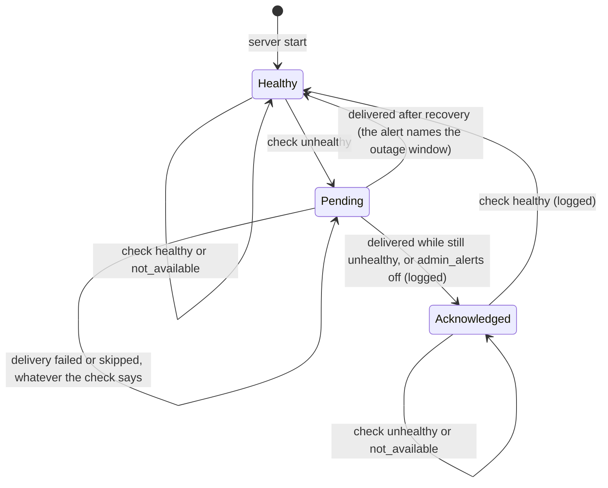

# ROADMAP Item 1 Open Items - Plan

## Goal Capsule

- **Objective:** an administrator gets one alert when PostgreSQL, Redis, the background worker or the web server's own health goes bad, including outages that stop the worker; the credential-email language and progressive audio streaming are re-checked by a script against the real Swoole server; Safari playback of a still-encoding rendition has a defined manual acceptance.
- **Means:** the web server runs the health monitor (KTD1), the worker publishes its heartbeat where the web server can read it (KTD3), and a new web-runtime container script exercises the real server (KTD7).
- **Authority:** this plan's Product Contract, then AGENTS.md and `.agents/rules/` (architecture, admin/CLI parity), then the Key Technical Decisions. The pre-release policy applies: no compatibility layers.
- **Stop conditions:** stop and ask if the shared heartbeat cannot be made readable by the web container without a channel the admin/CLI parity rules forbid, or if the web runtime script cannot reach mail or the stream route under the production environment.
- **Execution profile:** backend (Symfony 7, PHP 8.5, Swoole, PostgreSQL 18, Redis); one migration (PostgreSQL specialist); container script and CI step; docs.
- **Ships:** local commits on `plan/item1-open-items`; push only when the user asks.

---

## Product Contract

### Summary

Health alerts move from the worker's five-minute scheduled job into the web server, which checks every 60 seconds and sees a stopped worker through a shared heartbeat. A new container script starts the real Swoole server and checks the credential-email language and progressive streaming, and records the server's answers to Safari's request sequence. Safari playback itself stays a documented manual check.

### Problem Frame

`notifications.admin_alerts` promises administrators an alert when a component degrades, but the only check runs inside the worker's Messenger consumer. That process cannot report the outages that stop it: a dead worker, a sustained Redis outage that stops its scheduler trigger, or anything in the web server. It forgets its baseline on every restart, so an outage already under way at restart never alerts, and its memory check always reports healthy ([learning](../solutions/architecture-patterns/health-checks-run-in-a-messenger-consumer-cannot-see-outages-that-stop-it.md)).

Since the web and worker roles were split into separate containers, the web container cannot even read the worker's heartbeat: it is a local file in the worker container (`src/Shared/Infrastructure/Health/MessengerWorkerHealth.php`). The web server's `/health`, `/ready` and container healthcheck therefore likely report the worker as down whenever it runs elsewhere.

Two item 1 behaviours were checked by hand under Swoole and nothing repeats them: credential emails resolve the user's language at `kernel.terminate`, where a failed lookup silently falls back to English, and a transcoded rendition streams while it encodes, then serves byte ranges once complete. Functional tests cannot see either, because they run outside Swoole. Safari playback of a still-encoding rendition is unverified; Safari opens audio with a byte-range request that an in-progress rendition answers with the whole growing body.

### Requirements

**Health alerting**

- R1. The web server checks component health every 60 seconds, from one server worker only, and alerts administrators once when a component becomes unhealthy.
- R2. A component already unhealthy when the web server starts alerts once; a worker reload does not repeat an alert.
- R3. A worker that stops renewing its heartbeat reports unhealthy; a worker that has never reported in, as in a dev stack without one, reports not available and does not alert.
- R4. Only an unhealthy status alerts; a status that is not available neither alerts nor resets an alert.
- R5. An alert that cannot be delivered, for example while PostgreSQL is down, is logged and delivered by a later check once delivery works again.
- R6. With `notifications.admin_alerts` off, a degradation is logged and not delivered, also when the setting changes during an outage.
- R7. The memory check reports unhealthy when a web server worker's memory use nears its PHP memory limit.
- R8. The worker's five-minute health job no longer exists, also in databases that already ran its seed.
- R9. A worker outage does not make the web container report itself unready or unhealthy.

**Runtime checks**

- R10. A script repeatable in CI starts the real Swoole server and fails when a password-reset email for a user with a saved Danish language arrives in any other language.
- R11. The same script fails unless a transcoded rendition streams progressively while it encodes and answers byte ranges once it is complete.
- R12. The script records the server's answers to Safari's opening request sequence against an in-progress rendition, as a baseline whose change is visible in review.

**Safari**

- R13. A documented manual checklist states how to verify Safari playback of a still-encoding rendition on macOS and iOS, and what result calls for a follow-up.

**Close-out**

- R14. ROADMAP item 1 lists no open sub-items, and the docs describe where alerts come from.

### Key Decisions

- **Safari stays a manual check; the server's answer to a byte-range probe on an in-progress rendition is unchanged (200 with the whole growing body).** (session-settled: user-directed — chosen over answering 206 for already-written bytes and over finishing the encode before serving Safari: no public evidence shows what Safari accepts, and a wrong partial-range answer can put WebKit into live-broadcast mode with broken seeking.) Governs R12, R13.
- **Alerts stay notification rows; an undeliverable alert waits for PostgreSQL.** (session-settled: user-approved — chosen over adding an email or other channel.) Governs R5.
- **A server that starts during an outage alerts once.** (session-settled: user-approved — chosen over a silent baseline at start.) Governs R2.

### Scope Boundaries

- No new delivery channel (email, webhooks, outside monitoring); alerts stay notification rows.
- No recovery ("back to healthy") notification; recovery is logged only. Evidence that would change this: administrators asking when an outage ended.
- One web server per deployment is assumed; two web servers would each alert. Cross-server deduplication is not built; the deployment tool runs one web container.
- No lease across workers for the tick. The timer is cleared when worker 0 stops and each worker skips its own overlapping ticks; the remaining case, two ticks across a reload, at most repeats one alert. Evidence that would change this: a duplicate alert observed after a reload.
- No grace after Redis recovers. A worker heartbeat left stale or missing by a Redis outage can add one worker alert to the Redis alert the administrator already has. Evidence that would change this: that pair of alerts confusing an operator.
- No connect or read timeouts added to the health checks. A hung PostgreSQL connect holds up the tick until the connection attempt fails, which delays the other verdicts but loses none. Evidence that would change this: an outage where alerts arrived minutes late.
- No inspection command or admin page for the alert monitor's state. No admin route shows it, so the parity rules require none; failed deliveries are logged. Evidence that would change this: an operator unable to tell why an alert did not arrive.
- No change to how Safari is served (see Key Decisions).
- `ui/rn` is out of scope with no end date.

#### Deferred to Follow-Up Work

- Change the in-progress rendition's answer to Safari's byte-range probe, if the manual check (R13) shows Safari fails.

---

## Planning Contract

### Key Technical Decisions

- KTD1. **The monitor runs on a Swoole timer in HTTP worker 0.** A Shared `WorkerStartedEvent` subscriber starts it, skipping task workers and workers other than 0 with the guard `src/QoL/Infrastructure/Swoole/QoLWorkerStartupSubscriber.php` uses (copied, not shared across contexts), and clears it on `WorkerStoppedEvent` so an old and a new worker 0 never tick together during an asynchronous reload. The tick calls `CoWrapper::defer()` first, because it uses the database connection, the logger and the entity manager ([learning](../solutions/runtime-errors/swoole-callbacks-outside-the-bundle-leak-pooled-services.md); model: `src/Transcode/Infrastructure/Swoole/SwooleLoopLockRenewalTimer.php`). The first tick waits one interval after start, so services starting alongside the server do not alert, and a tick that finds the previous one in the same worker still running skips. The interval is a container parameter (default 60 seconds) so the runtime script can shorten it. Worker 0 is acceptable because the PostgreSQL and Redis checks yield under the server's coroutine hooks, so they do not block its requests. Rejected: the master process, which has no pooled kernel services and stalls the whole server if a check hangs; a Swoole user process (`addProcess`), which survives reloads but has no precedent here, unproven pooled services, and code that reloads never refresh.
- KTD2. **Per-component alert state lives in a boot-time `Swoole\Table`.** Created in `Bootable::boot()` before the fork, like `src/QoL/Infrastructure/Swoole/AlgorithmProfileTable.php`, it survives `$server->reload()` (worker reloads by `ErrorRateWorkerReloader` and dev HMR) and resets only with the server. Each component row holds its state (healthy, pending or acknowledged, per the state diagram), when its outage began and when it recovered, and starts healthy, which gives R2 its "alert once at start" behaviour. The table also holds whether a worker heartbeat was ever seen (KTD3). Conflict proportion 1.0 and checked `set()` results ([learning](../solutions/runtime-errors/swoole-table-default-conflict-proportion-drops-keys.md)). Outside the server (console, tests) the state falls back to process memory. The transition rule is a pure function of the previous state, the check result and the delivery outcome, tested apart from the timer.
- KTD3. **The worker heartbeat moves to a Redis key with a timestamp in its value.** `WorkerHeartbeatSubscriber` writes it where it writes the file today, and also refreshes a busy heartbeat from the consumer's keepalive while a message is handled (the consumer runs with `--keepalive=30`, `src/Shared/Infrastructure/Worker/WorkerSupervisorRunner.php`); a failed write is logged, never thrown. `MessengerWorkerHealth` reads it and judges age only: 45 seconds idle, 90 seconds busy (three keepalive intervals). Today's 3,600-second busy allowance was safe only with the PID check, so a worker killed mid-job would read healthy for an hour without the refresh. The key has no expiry. Redis is the worker's own transport, so the heartbeat shares fate with the one service the worker polls: with Redis down the worker is down too, and the honest pair is Redis unhealthy, messenger not available. Rejected: a PostgreSQL row of its own (a hot-row write every 10 seconds, and the heartbeat would then fail with PostgreSQL rather than with the worker's transport); the supervisor's `worker_deployment_leases` row (it exists only for deployed workers, not in dev, and judges the supervisor rather than the consumer); a shared volume (the worker's containment policy forbids mounts). The PID check goes, because PID namespaces differ across containers. Reading the key is data, not control, so the parity rule against channels the worker can reach does not apply. Verdicts (R3):
  - key never seen by this server: not available;
  - key seen before and now missing (a Redis flush, or a dead worker after a Redis restart): unhealthy;
  - key stale: unhealthy;
  - Redis unreachable: not available.
- KTD4. **Delivery is one step that can fail as a whole, and is at-least-once.** The `admin_alerts` read moves inside the delivery's error handling (today it sits outside it in `HealthAlertService` and aborts the remaining components during a PostgreSQL outage). A failed delivery leaves the row pending and is retried by the next tick (R5); a tick whose PostgreSQL check is unhealthy skips delivery instead of logging one failure per component. A pending alert stays owed until delivered, even after its component recovers: the first tick that can deliver sends it with the outage window (unhealthy from, recovered at), so a PostgreSQL outage, which blocks its own delivery, still alerts once PostgreSQL returns. This is the late outage alert, not a recovery notification. A setting that is off acknowledges the alert without delivering it, with a log line (R6). A worker killed between saving the notifications and updating the row delivers the alert again; that duplicate is accepted. Only `unhealthy` alerts (R4). The monitor types against `AdminAlertPortInterface` and `SystemSettingsPortInterface`, never the concrete alert service, and adds nothing to the Deptrac baseline.
- KTD5. **The memory check compares each HTTP worker's real memory against its parsed `memory_limit`.** Every HTTP worker writes `memory_get_usage(true)` into a per-worker row of a boot-time table on a light timer that touches no pooled service; the monitor reads the worst row. Unhealthy at 90 percent of the limit; a limit of `-1` makes the check not available. The limit parser handles `K`, `M` and `G` (today `(int) ini_get('memory_limit')` reads `1G` as 1).
- KTD6. **The seeded job is removed by a forward migration.** It deletes the `scheduled_jobs` row `0199bf3c-8a00-7000-8000-0a07c0de9e03`; the seeding migration `Version20261007140000` stays, so databases that ran it and fresh installs end in the same state. `CheckHealthCommand`, `CheckHealthHandler` and `HealthAlertPortInterface` go; the monitor calls the alert service directly. PostgreSQL work follows the postgres-remediation skill.
- KTD7. **The runtime script runs the server in the production environment.** The mail leg cannot use the test environment, which routes mail to `null://null` (`config/packages/mailer.yaml`). The script uses a mailpit container and signs stream requests with a DPoP-bound token from the existing helpers (`tests/Fixtures/Auth/SignedDpopProof.php`, `OAuthAccessTokenJwt.php`). It is a new `scripts/test-web-runtime-container.sh` on the skeleton of `scripts/test-outbox-runtime-container.sh`, with assertions in a PHP fixture, and runs in CI after the producer runtime step.
- KTD8. **Readiness and the container healthcheck exclude the worker.** `/ready` and `app:health:check`'s exit status leave out the messenger component, so a worker outage alerts administrators without making the web container unready; `/health` still reports it.

### High-Level Technical Design

A component's alert state, per row of the alert table (KTD2):



One tick, in HTTP worker 0:

```mermaid
sequenceDiagram
  participant T as Timer (worker 0)
  participant C as Health checks
  participant S as Alert table
  participant D as Admin alert delivery
  T->>T: CoWrapper::defer(); skip if this worker's previous tick runs
  T->>C: PostgreSQL, Redis, messenger heartbeat, swoole, memory
  C-->>T: statuses
  T->>S: update rows; mark newly unhealthy rows pending
  loop each pending row, unless PostgreSQL is unhealthy
    T->>D: read admin_alerts, save notifications
    D-->>T: ok, off, or failure
    T->>S: acknowledged, or still pending
  end
```

### Assumptions

- The deployment runs one web container (KTD1, Scope Boundaries) and one worker container; a second worker would share the heartbeat key, so one live worker would hide a dead one.

### Deferred to Implementation

- The production environment variables, secrets and OAuth keys `app:serve` needs in the runtime script, and how the existing DPoP helpers mint a token outside PHPUnit.
- Exact names: the heartbeat key, the interval parameter, the alert and memory tables.
- The memory table's update cadence and the staleness window for exited workers.

### Sources

- Research dossiers for this plan: repository patterns, learnings, Safari request behaviour (WebKit bugs 195043, 33121, 221622; Apple developer forum thread 701201), flow analysis.
- `docs/solutions/architecture-patterns/health-checks-run-in-a-messenger-consumer-cannot-see-outages-that-stop-it.md`
- `docs/solutions/runtime-errors/swoole-callbacks-outside-the-bundle-leak-pooled-services.md`
- `docs/solutions/runtime-errors/swoole-table-default-conflict-proportion-drops-keys.md`
- Plan that delivered item 1: `docs/plans/2026-10-07-1736-feat-general-settings-email-language-plan.md` (KTD5, KTD14). Its note tying `kernel.terminate` to `reset_handler` is inaccurate: `reset_handler` applies to task workers only.

---

## Implementation Units

### U1. Shared worker heartbeat

- **Goal:** the web container can tell a running worker from a stopped one and from one never started.
- **Requirements:** R3, R9; KTD3, KTD8.
- **Dependencies:** none.
- **Files:**
  - `src/Shared/Infrastructure/Messenger/WorkerHeartbeatSubscriber.php`
  - `src/Shared/Infrastructure/Health/MessengerWorkerHealth.php`
  - `src/Shared/Infrastructure/Health/HealthCheckService.php` (readiness composition)
  - `src/Shared/Interface/Console/HealthCheckCommand.php` (exit status)
  - `src/Shared/Interface/Controller/HealthCheckController.php` (`/ready`)
  - `scripts/test-worker-runtime-container.sh`, `tests/Fixtures/messaging-runtime.php` (it finds the consumer through the PID in the heartbeat file; it finds it by process instead and asserts unhealthy within the busy window after the kill)
  - `tests/Unit/Shared/Infrastructure/Messenger/WorkerHeartbeatSubscriberTest.php`, `tests/Unit/Shared/Infrastructure/Health/MessengerWorkerHealthTest.php`, `tests/Unit/Shared/Infrastructure/Health/HealthCheckServiceTest.php`
- **Approach:**
  1. Confirm the suspected defect first: in a split deployment, does the web container's `/ready` and `app:health:check` fail because the heartbeat file is absent? Record the answer in the unit's commit.
  2. Write the heartbeat as one Redis key per consumed transport set, value `{phase, at}`, through the existing Redis client factory; keep the write cadence (at most every 10 seconds, plus on start, receive and stop).
  3. Read it per KTD3's verdicts. Whether the key was ever seen is held in process memory here; U3 moves it into the alert table (KTD2).
  4. Leave messenger out of readiness and out of the console command's exit status (KTD8).
- **Patterns to follow:** `RedisClientFactory::borrow()` as `HealthCheckService::checkRedis()` uses it.
- **Test scenarios:**
  - A heartbeat written 10 seconds ago with phase idle reads healthy.
  - An idle heartbeat 60 seconds old reads unhealthy; a busy one 60 seconds old reads healthy; a busy one 120 seconds old reads unhealthy.
  - A handler running longer than the busy window keeps its heartbeat fresh through the keepalive refresh and reads healthy throughout.
  - No key reads not available.
  - Redis throwing on read reads not available.
  - A heartbeat whose timestamp lies in the future (clock skew) reads healthy, not unhealthy.
  - The subscriber writes `stopped` on worker stop, which reads unhealthy at once.
  - A Redis write failure in the subscriber is logged and the consumer keeps running.
  - A key seen on an earlier check and now missing reads unhealthy.
  - `/ready` answers 200 when only messenger is unhealthy; `/health` still lists messenger as unhealthy.
  - `app:health:check` exits 0 when only messenger is unhealthy.
- **Verification:** the worker runtime container script passes reading the Redis heartbeat; unit tests pass.

### U2. Meaningful memory check

- **Goal:** the memory component reports the web server's real memory pressure.
- **Requirements:** R7; KTD5.
- **Dependencies:** none.
- **Files:**
  - `src/Shared/Infrastructure/Health/HealthCheckService.php` (`checkMemory()`)
  - new per-worker memory table under `src/Shared/Infrastructure/Swoole/` and its worker-start registration
  - `tests/Unit/Shared/Infrastructure/Health/HealthCheckServiceTest.php` and a test for the new table
- **Approach:**
  1. A boot-time table with one row per HTTP worker id; each HTTP worker updates its row every few seconds from a timer that uses no pooled service.
  2. `checkMemory()` reads the worst row against the parsed limit; outside the server it measures the calling process.
  3. Replace the integer cast with a limit parser for `K`, `M`, `G` and `-1`.
- **Patterns to follow:** `src/QoL/Infrastructure/Swoole/CpuGpuSampler.php` (boot table, worker-0 timer, no pooled services).
- **Test scenarios:**
  - `128M`, `1G`, `524288K` and a plain byte count parse to the right byte counts; `-1` means no limit.
  - Usage at 50 percent of the limit reads healthy; at 92 percent reads unhealthy.
  - No limit reads not available.
  - With two worker rows at 30 and 95 percent, the check reads unhealthy and names the worker in its details.
  - A stale row from a worker that exited is ignored (row older than three update intervals).
- **Verification:** unit tests pass; the check returns a non-constant status.

### U3. Health monitor in the web server

- **Goal:** administrators get one alert per degradation from a process that stays up when the worker, Redis or PostgreSQL does not.
- **Requirements:** R1, R2, R4, R5, R6; KTD1, KTD2, KTD4; Key Decisions on R2 and R5.
- **Dependencies:** U1, U2.
- **Files:**
  - `src/Shared/Infrastructure/Health/HealthAlertService.php` (reworked around the table)
  - new alert-state table and monitor subscriber under `src/Shared/Infrastructure/Health/` or `src/Shared/Infrastructure/Swoole/`
  - `config/services.yaml` (wiring, interval parameter)
  - `tests/Unit/Shared/Infrastructure/Health/HealthAlertServiceTest.php`, a monitor subscriber test, and a real-timer probe test
  - `tests/Functional/Notification/AdminAlertsToggleTest.php`
- **Approach:**
  1. The alert service evaluates a result set against the table per the state diagram, through the pure transition function (KTD2); it no longer keeps state in a property.
  2. The subscriber starts the timer in HTTP worker 0 only, first tick after one interval, overlapping ticks skipped.
  3. Delivery reads `admin_alerts`, then calls the admin alert port, inside one error boundary (KTD4).
- **Execution note:** prove the pooled-service release with a real-timer probe in a child process before wiring the monitor, as `tests/Unit/Transcode/Infrastructure/Swoole/SwooleLoopLockRenewalTimerTest.php` does.
- **Patterns to follow:** `QoLWorkerStartupSubscriber` (worker selection), `SwooleLoopLockRenewalTimer` (defer first), `CpuProcessPool::startHealthCheck()` (owner guard).
- **Test scenarios:**
  - Server start with PostgreSQL unhealthy: no delivery while it stays down; the first tick after it recovers delivers one alert naming the outage window (R2, R5).
  - Two consecutive unhealthy evaluations deliver one alert, not two.
  - Unhealthy, healthy, unhealthy delivers two alerts.
  - A not-available result after healthy delivers nothing and keeps the row healthy; after an alert it keeps the row alerted.
  - Delivery throwing leaves the row pending; the next evaluation retries and delivers once.
  - The setting read throwing leaves the row pending and still evaluates the other components.
  - `admin_alerts` off while pending clears the pending alert with a log line; turned on again later, the same outage does not alert.
  - Unhealthy, then healthy before the failed delivery could be retried: the next tick that can deliver sends one alert naming the outage window, then the row is healthy.
  - Redis unhealthy at start, PostgreSQL healthy: the first tick delivers one Redis alert.
  - A worker reload (table kept) during an outage delivers nothing new.
  - The subscriber starts no timer in a task worker or in HTTP worker 1.
  - Each tick releases the pooled services its coroutine took (probe test).
  - A tick that starts while the same worker's previous tick still runs returns without checking.
  - A tick whose PostgreSQL check is unhealthy leaves pending rows pending without calling delivery.
  - The timer is cleared when worker 0 stops.
- **Verification:** unit, probe and functional tests pass; U5's alert leg delivers exactly one notification across a reload.

### U4. Remove the worker's health job

- **Goal:** no scheduled job runs a health check in the worker, in new or existing databases.
- **Requirements:** R8; KTD6.
- **Dependencies:** U3.
- **Files:**
  - delete `src/Shared/Application/Command/CheckHealthCommand.php`, `src/Shared/Application/CommandHandler/CheckHealthHandler.php`, `src/Shared/Application/Port/HealthAlertPortInterface.php` and its alias in `config/services.yaml`
  - delete `tests/Unit/Shared/Application/CommandHandler/CheckHealthHandlerTest.php`, `tests/Integration/HealthCheckScheduleTest.php`
  - new migration under `migrations/` deleting the seeded row; `tests/Unit/Shared/Infrastructure/Doctrine/MigrationVersionComparatorTest.php` if it lists versions
- **Approach:** the migration's `up()` deletes the row by id; `down()` restores nothing, because the command it would schedule no longer exists. Delegate to the PostgreSQL specialist.
- **Test scenarios:**
  - After all migrations on an empty database, `scheduled_jobs` has no row with the health job id.
  - On a database that ran `Version20261007140000`, the new migration removes the row and a scheduler run reports no unknown-message failure.
  - The scheduler's allowlist no longer contains the health command.
- **Verification:** integration tests pass in the CI image; Deptrac and PHPStan clean.

### U5. Web runtime container script

- **Goal:** CI repeats the Swoole runtime checks that were done by hand, records Safari's request answers, and proves alerting end to end.
- **Requirements:** R10, R11, R12; KTD7; Key Decision on R12.
- **Dependencies:** U3 (alert leg).
- **Files:**
  - new `scripts/test-web-runtime-container.sh`
  - new `tests/Fixtures/web-runtime.php` (setup, requests, assertions)
  - new Safari baseline, for example `tests/Fixtures/web-runtime/safari-in-progress.txt`
  - `.forgejo/workflows/ci.yaml` (step after the producer runtime step; mailpit image)
  - `docs-book/part-2-developer-guide/testing.md`
- **Approach:**
  1. Containers: PostgreSQL, Redis, mailpit, the app image running `app:serve` in `prod` with a short monitor interval.
  2. Mail leg: create a user, set language `da`, request a password reset, read mailpit; assert the Danish subject and `lang="da"`.
  3. Stream leg: the fixture makes the in-progress state deterministic. Inside the app container it holds the rendition's lock and writes and appends its partial file itself, as the encoder does, so the first request answers 200 with `Accept-Ranges: none` and a body that grows as the fixture appends. A real encode of a short generated source (ffmpeg lavfi, as `tests/Functional/Media/AudioStreamTestCase.php` generates audio) then proves the encoder path: once complete, `Range: bytes=100-199` answers 206.
  4. Safari leg: replay Safari's sequence against a fixture-held in-progress rendition, so encode speed cannot change the answers (`Range: bytes=0-1`, then `bytes=0-65535`, with Safari's `User-Agent`, `Accept: */*` and `X-Playback-Session-Id`); write status line and response headers, normalised for dates and ids, and compare with the committed baseline.
  5. Alert leg: stop PostgreSQL, wait two intervals, reload the server, start PostgreSQL; assert exactly one PostgreSQL alert notification per administrator.
- **Execution note:** smoke-first: get the server answering `/live` inside the script before adding legs.
- **Test scenarios:**
  - Mail in English (language lookup broken) fails the script.
  - A first stream response with `Accept-Ranges: bytes`, or a body that does not grow, fails the script.
  - A changed Safari answer fails with a diff against the baseline.
  - Zero or two alert notifications fail the script.
- **Verification:** the script passes locally and in CI; it fails when each assertion's condition is broken by hand once.

### U6. Docs, Safari checklist and close-out

- **Goal:** operators and developers read where alerts come from and how to check Safari; ROADMAP item 1 is closed.
- **Requirements:** R13, R14.
- **Dependencies:** U1 to U5.
- **Files:**
  - `docs-book/part-1-operator-guide/notifications.md` (Health alerts), `docs-book/part-1-operator-guide/monitoring.md` (five components, healthcheck runs `app:health:check`), `docs-book/part-1-operator-guide/commands/app-health-check.md`
  - `docs-book/part-2-developer-guide/contexts/notification.md`
  - `docs-book/part-2-developer-guide/testing.md` (Safari manual checklist: macOS and iOS Safari versions, opus, aac and mp3, play from start while encoding, let the encode finish while playing, then seek; follow-up criterion: playback does not start, stops, or cannot seek after completion)
  - `docs/solutions/architecture-patterns/health-checks-run-in-a-messenger-consumer-cannot-see-outages-that-stop-it.md` (resolution), `docs/solutions/runtime-errors/swoole-callbacks-outside-the-bundle-leak-pooled-services.md` (new timer rows)
  - `ROADMAP.md`
- **Test expectation:** none -- documentation; prose-fix pass and `git diff --check`.
- **Verification:** each doc names the web server as the alert source; ROADMAP item 1 lists no open sub-item.

---

## Verification Contract

| Gate | Command or check |
|---|---|
| Unit | `php vendor/bin/phpunit -c phpunit.xml.dist --fail-on-phpunit-notice` (host) and `bash scripts/test-unit-container.sh` (CI image) |
| Functional and integration | `BAANDER_TEST_IMAGE=baander-ci-prewarm:local bash scripts/test-functional-container.sh tests/Functional` and `tests/Integration` |
| Runtime scripts | `scripts/test-worker-runtime-container.sh`, new `scripts/test-web-runtime-container.sh` |
| Static | PHPStan full scan, Deptrac 0 violations, `bin/console lint:container`, OpenAPI check in the CI image and on the host with a fresh cache |
| Web | unchanged UI; no web gate unless a shared type changes |

## Definition of Done

- R1 to R14 are met; R13 is a documented checklist, run by a person.
- No reference to `CheckHealthCommand`, `CheckHealthHandler`, `HealthAlertPortInterface` or the heartbeat file path remains outside git history and migrations.
- The new script runs in CI and fails on each broken condition.
- Code from abandoned approaches is removed.
- Changes are committed on `plan/item1-open-items`; nothing is pushed until the user asks.
